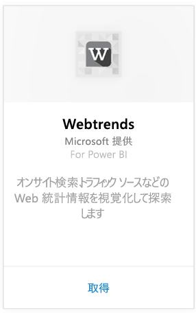
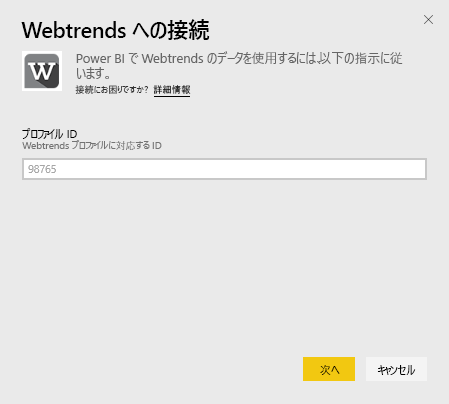
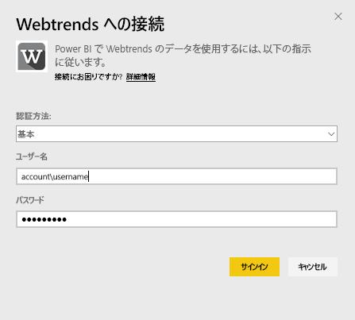
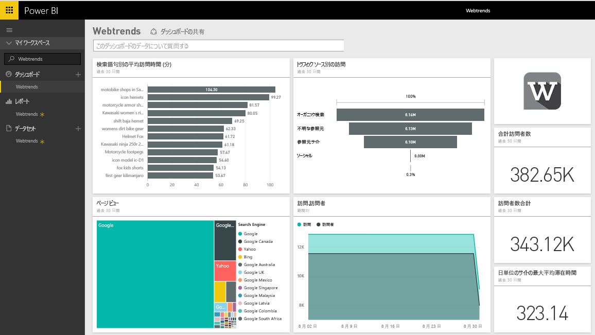
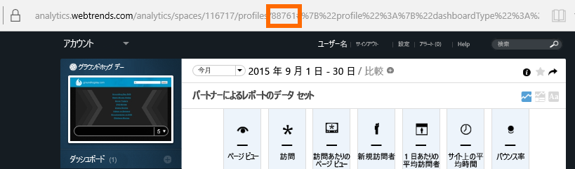
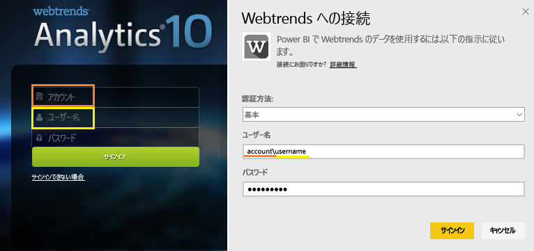

# Power BI で Webtrends に接続する
Power BI 用 Webtrends コンテンツ パックには、[合計ページ] ビューやトラフィック ソースごとのアクセス数などのすぐに使用できるさまざまなメトリックスが含まれています。 Power BI 内の Webtrends データの視覚化は、Webtrends アカウントに接続することで開始します。 提供されるダッシュボードとレポートをそのまま使用することもできますし、最も関心のある情報を強調表示するためにカスタマイズすることができます。  データは、1 日 1 回自動的に更新されることになります。

[Power BI 用 Webtrends コンテンツ パック](https://app.powerbi.com/getdata/services/webtrends)に接続します。

## 接続する方法
1. 左側のナビゲーション ウィンドウの下部にある **[データの取得]** を選択します。
   
   
2. **[サービス]** ボックスで、 **[取得]**を選択します。
   
   
3. **[Webtrends]** \> **[取得]** の順に選びます。
   
   
4. コンテンツ パックは、特定の Webtrends プロファイル ID に接続します。 [このパラメーターの見つけ方](#FindingParams)について詳しくは、後述します。
   
   
5. 接続する Webtrends の資格情報を提供します。 [ユーザー名] フィールドには、アカウントとユーザー名が必要となることに注意してください。 以下で[詳細](#FindingParams)を確認してください。
   
   
6. 承諾後、インポート処理が自動的に開始されます。 完了すると、ナビゲーション ウィンドウに、新しいダッシュ ボード、レポート、モデルが表示されます。 インポートされたデータを表示するダッシュボードを選択します。
   
   

**実行できる操作**

* ダッシュボード上部にある [Q&A ボックスで質問](power-bi-q-and-a.md)してみてください。
* ダッシュボードで[タイルを変更](service-dashboard-edit-tile.md)できます。
* [タイルを選択](service-dashboard-tiles.md)して基になるレポートを開くことができます。
* データセットは毎日更新されるようにスケジュール設定されますが、更新のスケジュールは変更でき、また **[今すぐ更新]** を使えばいつでも必要なときに更新できます。

## 含まれるもの

Webtrends コンテンツ パックは、次のレポートのデータを取得します。  

| レポート名 | レポート ID |
| --- | --- |
| 主要メトリック | |
| オンサイト検索 |34awBVEP0P6 |
| 終了ページ |7FshY8eP0P6 |
| 次のページ |CTd5rpeP0P6 |
| 前のページ |aSdOeaUgnP6 |
| サイト ページ |oOEWQj3sUo6 |
| オンサイトの広告クリックスルー |41df19b6d9f |
| 市区町村 |aUuHskcP0P6 |
| Countries |JHWXJNcP0P6 |
| 訪問者 |xPcmTDDP0P6 |
| 訪問期間 |U5KAyqdP0P6 |
| 検索語句 |IKYEDxIP0P6 |
| トラフィック ソース |JmttAoIP0P6 |
| 検索エンジン |yGz3gAGP0P6 |
| エントリ ページ |i6LrkNVRUo6 |

>[!NOTE]
>SharePoint プロファイルの場合、メトリック名は Webtrends の UI に表示される名前と多少異なる場合があります。 SharePoint と Web プロファイルとの間の整合性を保つために、次のようなマッピングが行われます。   

    - セッション = アクセス  
    - 新しいユーザー = 新しい訪問者  
    - セッションあたりのビュー = アクセスあたりのページ ビュー  
    - ユーザーの日ごとの平均滞在時間 = 訪問者の平均サイト滞在時間  

## システム要件
このコンテンツ パックを使用するには、[適切なレポートのセット](#Included)が有効になっている Webtrends プロファイルにアクセスする必要があります。

## パラメーターの見つけ方
プロファイルを選択すると、URL に Webtrends プロファイルの ID が見つかります。

資格情報は、Webtrends へのサインイン時に入力したものと同じですが、アカウントとユーザー名は同じ行で、バックスラッシュ (\) で区切ることが期待されます。

## トラブルシューティング
資格情報を入力した後、コンテンツ パックの読み込み中に問題が発生することがあります。 読み込み中に「問題発生」メッセージが表示される場合は、次のトラブルシューティング方法を参照してください。 これらの手順で問題が解決しない場合は、https://support.powerbi.com にサポート チケットを提出してください。

1. 適切なプロファイル ID が使用されている。詳しくは、「[パラメーターの見つけ方](#FindingParams)」をご覧ください。
2. 「[含まれるもの](#Included)」に示されているレポートへのアクセス許可がユーザーに与えられている。

## 次の手順
[Power BI の概要](service-get-started.md)

[Power BI - 基本的な概念](service-basic-concepts.md)

