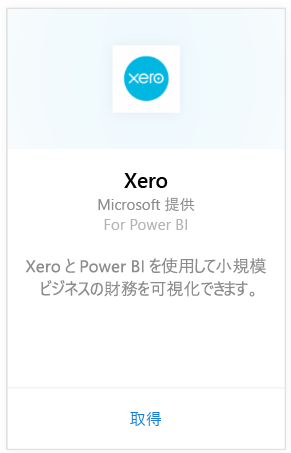
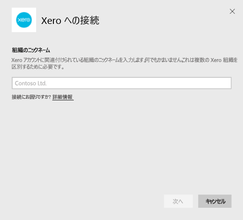
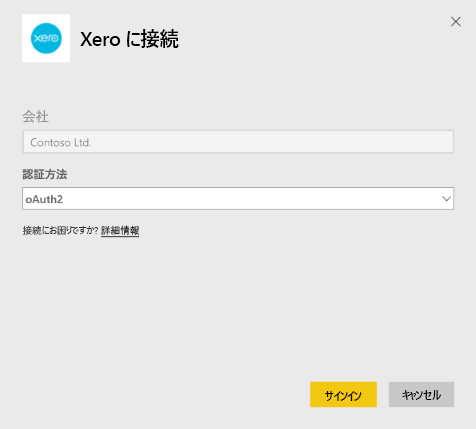
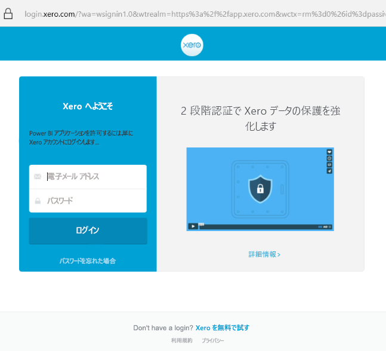
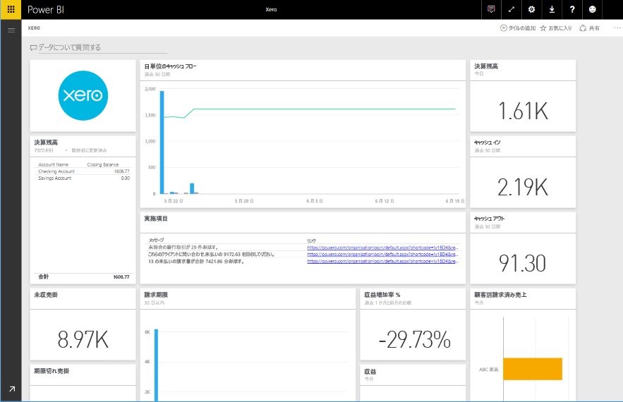

# Power BI で Xero に接続する
Xero は、小規模企業向けに設計されている使いやすいオンライン会計ソフトウェアです。 この Power BI コンテンツ パックは、Xero financials に基づいて説得力のある視覚エフェクトを作成します。 既定のダッシュ ボードには、キャッシュの位置、売上とコスト、損益トレンド、借方日数、投資収益率のような多くの小規模ビジネス メトリックが含まれています。

Power BI 用 [Xero コンテンツ パック](https://app.powerbi.com/getdata/services/xero)に接続するか、[Xero と Power BI](https://help.xero.com/Power-BI) の統合について詳しく学習します。

## 接続する方法
1. 左側のナビゲーション ウィンドウの下部にある **[データの取得]** を選択します。
   
   
2. **[サービス]** ボックスで、 **[取得]** を選択します。
   
   
3. **[Xero]** \> **[取得]** を選択します。
   
   
4. Xero アカウントに関連付けられている組織のニックネームを入力します。 何でもかまいません。これは複数の Xero 組織を区別するためのものです。 [後述する](#FindingParams)詳細を参照してください。
   
   
5. **[認証方法]** として **[OAuth]** を選択し、Xero へのサインインを求められたら接続する組織を選択します。 ログインが完了したら、**[サインイン]** を選択して読み込みプロセスを開始します。
   
    
   
    
6. 承諾後、インポート処理が自動的に開始されます。 完了すると、ナビゲーション ウィンドウに、新しいダッシュ ボード、レポート、モデルが表示されます。 インポートされたデータを表示するダッシュボードを選択します。
   
     

**実行できる操作**

* ダッシュボード上部にある [Q&A ボックスで質問](power-bi-q-and-a.md)してみてください。
* ダッシュボードで[タイルを変更](service-dashboard-edit-tile.md)できます。
* [タイルを選択](service-dashboard-tiles.md)して基になるレポートを開くことができます。
* データセットは毎日更新されるようにスケジュール設定されますが、更新のスケジュールは変更でき、また **[今すぐ更新]** を使えばいつでも必要なときに更新できます。

## 含まれるもの
コンテンツ パックのダッシュ ボードには、さまざまな領域をカバーするタイルとメトリックおよび対応する詳細なレポートが含まれています。  

| 領域 | ダッシュボードのタイル | レポート |
| --- | --- | --- |
| Cash (キャッシュ) |Daily cash flow (日単位のキャッシュ フロー)  Cash in (キャッシュ イン)  Cash out (キャッシュ アウト)  Closing balance by account (アカウント別決算残高)  Closing balance today (当日決算残高) |Bank Accounts (銀行口座) |
| Customer (顧客) |Invoiced sales (請求済み売上)  Invoiced sales by customer (顧客別請求済み売上)  Invoiced sales growth trend (請求済み売上増加傾向)  Invoices due (請求期限)  Outstanding receivables (未収売掛)  Overdue receivables (期限切れ売掛) |Customer (顧客)  Inventory (在庫) |
| Supplier (仕入先) |Billed purchases (請求済み購入)  Billed purchases by supplier (仕入先別請求済み購入)  Billed purchases growth trend (請求済み購入増加傾向)   Bills due (支払期限)  Outstanding payables (未払債務)  Overdue payables (期限切れ債務) |Suppliers (仕入先)  Inventory (在庫) |
| Inventory (在庫) |Monthly sales amount by product (製品別月別売上高) |Inventory (在庫) |
| Profit and loss (損益) |Monthly profit and loss (月別損益)  Net profit this fiscal year (当会計年度純利益)  Net profit this month (当月純利益)  Top expense accounts (経費上位) |Profit and loss (損益) |
| Balance sheet (貸借対照表) |Total assets (総資産)  Total liabilities (総負債)  Equity (株主資本) |Balance sheet (貸借対照表) |
| 健康 |Current ratio (現在比率)  Gross profit percentage (総利益率)   Return on total assets (総資産利益率)  Total liabilities to equity ratio (負債資本比率) |健康  Glossary and Technical Notes (用語集とテクニカル ノート) |

データセットには、レポートとダッシュボードをカスタマイズするための次の表も含まれます。  

* Addresses (住所)  
* Alerts (アラート)  
* Bank Statement Daily Balance (銀行取引明細書日別残高)  
* Bank Statements (銀行取引明細書)  
* 連絡先  
* Expense Claims (経費)  
* Invoice Line Items (請求書明細品目)  
* Invoices (請求書)  
* Items (品目)  
* Month End (月末)  
* Organisation (組織)  
* Trial Balance (評価版残高)  
* Xero Accounts (Xero アカウント)

## システム要件
Xero コンテンツ パックにアクセスするには、"Standard + Reports" または "Advisor" の役割が必要です。

## パラメーターの見つけ方
Power BI で追跡する組織の名前を指定します。 これにより、複数の異なる組織に接続することができます。 同じ組織に複数回接続することはできないことに注意してください。スケジュールされた更新に影響します。   

## トラブルシューティング
* Power BI 用 Xero コンテンツ パックにアクセスするには、"Standard + Reports" または "Advisor" の役割が必要です。 このコンテンツ パックは、ユーザー ベースのアクセス許可に依存して、Power BI でのレポートのデータにアクセスします。  
* しばらく読み込みが進んだ後にエラーが表示される場合は、そのエラー メッセージが表示されるまでの経過時間を確認します。 Xero によって提供されるアクセス トークンは 30 分間だけ有効であり、その時間枠内に読み込み可能な量よりも多くのデータがアカウントにある場合は、エラーが発生します。 この件については、改善に積極的に取り組んでいます。
* 読み込み中、ダッシュボードのタイルは全般読み込み状態になります。 読み込みが完全に完了するまで、この状態は変わりません。 読み込み完了の通知を受け取ったにもかかわらず、タイルがまだ読み込み中の場合は、ダッシュボードの右上にある [...] を使用して、ダッシュボードのタイルを更新してみてください。
* コンテンツ パックの更新が失敗する場合は、Power BI で同じ組織に複数回にわたって接続していないか確認してください。 Xero では 1 つの組織には 1 つのアクティブ接続しか許可されず、複数回接続すると資格情報無効を示すエラーが表示されることがあります。  
* エラー メッセージや非常に遅い読み込み速度など、Power BI 用 Xero コンテンツ パックへの接続に問題がある場合は、最初にキャッシュ/cookie をクリアしてブラウザーを再起動した後、Power BI に再接続します。  

他の問題が解決しない場合は、 http://support.powerbi.com でチケットを提出してください。

## 次の手順
[Power BI の概要](service-get-started.md)

[Power BI でデータを取得する](service-get-data.md)

