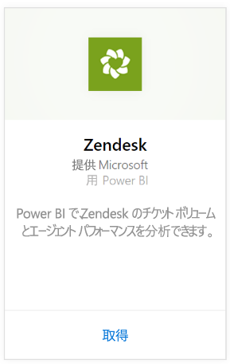
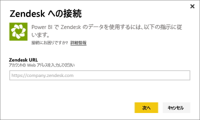
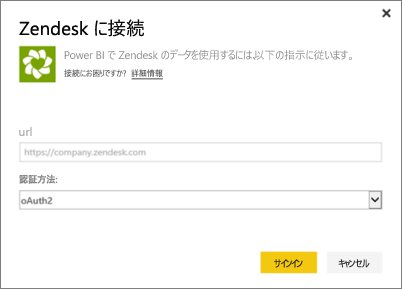
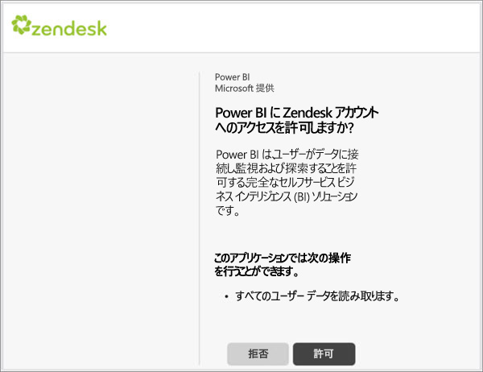

# Power BI で Zendesk に接続する
Zendesk コンテンツ パックは、Power BI ダッシュボードと一連の Power BI レポートを提供し、お客様のチケット ボリュームとエージェント パフォーマンスに関する詳細情報を示します。 提供されるダッシュボードとレポートをそのまま使用することもできますし、最も関心のある情報を強調表示するためにカスタマイズすることができます。  データは、1 日 1 回自動的に更新されます。 

[Zendesk コンテンツ パック](https://app.powerbi.com/getdata/services/zendesk)に接続するか、Power BI と [Zendesk との統合](https://powerbi.microsoft.com/integrations/zendesk)について詳細をお読みください。

>[!NOTE]
>接続するときに、Zendesk 管理者アカウントが必要です。 [要件](#Requirements)の詳細については、このあと説明します。

## 接続する方法
1. 左側のナビゲーション ウィンドウの下部にある **[データの取得]** を選択します。
   
   
2. **[サービス]** ボックスで、 **[取得]**を選択します。
   
    
3. **[Zendesk]** \> **[接続]** の順に選びます。
   
   
4. アカウントと関連付けられている URL を指定します。 **https://company.zendesk.com** という形式になります。[これらのパラメーターの見つけ方](#FindingParams)について詳しくは、後述します。
   
   
5. ダイアログが表示されたら、Zendesk の資格情報を入力します。  認証方法として **[oAuth 2]** を選択し、**[サインイン]** をクリックします。 Zendesk 認証フローに従います。 (ブラウザーで既に Zendesk にサインインした場合には、資格情報を求めるダイアログが表示されないことがあります。)
   
   > [!NOTE]
   > このコンテンツ パックを使用するには、Zendesk 管理者アカウントを使用して接続する必要があります。 
   > 
   > 
   
   
6. [ **許可]** をクリックして、Power BI が Zendesk データにアクセスできるようにします。
   
   
7. **[接続]** をクリックしてインポート プロセスを開始します。 Power BI にデータがインポートされると、新しいダッシュボード、レポート、データセットが左側のナビゲーション ウィンドウに表示されます。 新しい項目には黄色のアスタリスク \* でマークが付けられます。
   
   

**実行できる操作**

* ダッシュボード上部にある [Q&A ボックスで質問](power-bi-q-and-a.md)してみてください。
* ダッシュボードで[タイルを変更](service-dashboard-edit-tile.md)できます。
* [タイルを選択](service-dashboard-tiles.md)して基になるレポートを開くことができます。
* データセットは毎日更新されるようにスケジュール設定されますが、更新のスケジュールは変更でき、また **[今すぐ更新]** を使えばいつでも必要なときに更新できます。

## 含まれるもの
Power BI コンテンツ パックには、次の項目に関するデータが含まれています。  

* ユーザー (エンド ユーザーとエージェント)  
* 組織  
* グループ  
* チケット  

また、平均待機時間や、過去 7 日間に解決されたチケット数など、計算された一連の測定値もあります。 完全な一覧がコンテンツ パックに含まれています。

## システム要件
Zendesk コンテンツ パックにアクセスするには、Zendesk 管理者アカウントが必要です。 エージェントまたはエンド ユーザーが Zendesk データを表示する場合は、[Power BI Desktop](desktop-connect-to-data.md) で候補を追加し、Zendesk コネクタを確認します。

## パラメーターの見つけ方
Zendesk URL は、Zendesk アカウントにサインインするときに使用した URL と同じになります。 Zendesk URL がよくわからない場合には、Zendesk [ログイン ヘルプ](https://www.zendesk.com/login/)を使用できます。

## トラブルシューティング
接続の問題が発生した場合は、Zendesk URL を確認し、Zendesk 管理者アカウントを使用していることを確かめます。

## 次の手順
* [Power BI の概要](service-get-started.md)
* [データの取得](service-get-data.md)

