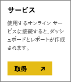
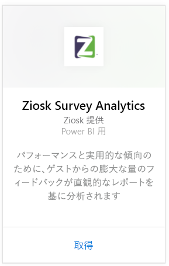
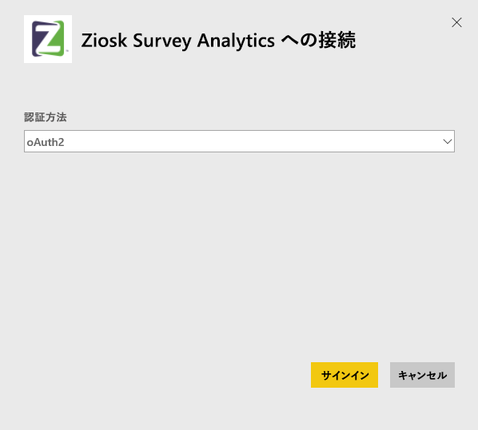
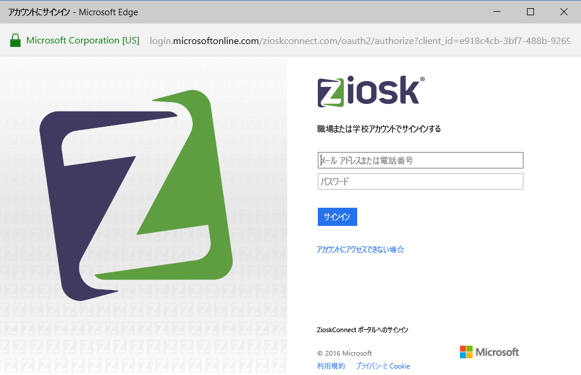
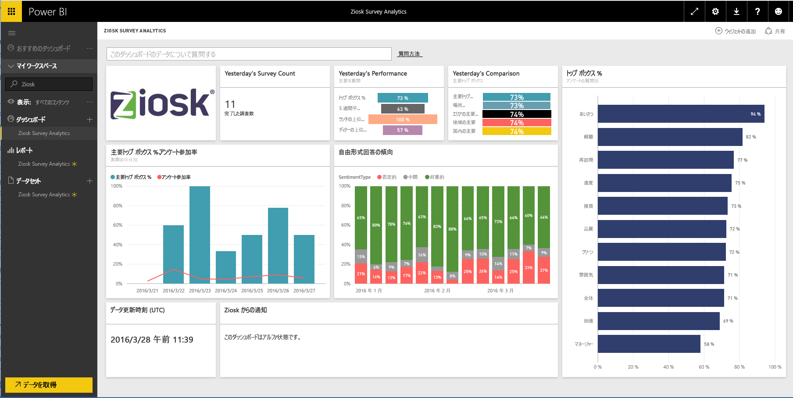

# Power BI で Ziosk Survey Analytics に接続する
BI 用 Ziosk Survey Analytics コンテンツ パックは、Ziosk タブレットを使用しているレストランに対し、Ziosk 調査データによって提供される、日、場所、従業員などに基づくセグメント化を含む詳細データへのアクセスを提供します。

Power BI 用 [Ziosk Survey Analytics コンテンツ パック](https://app.powerbi.com/getdata/services/ziosk-survey-analytics)に接続します。

## 接続する方法
1. 左側のナビゲーション ウィンドウの下部にある **[データの取得]** を選択します。  
   
    
2. **[サービス]** ボックスで、 **[取得]** を選択します。  
   
    
3. **[Ziosk Survey Analytics]**、**[接続]** の順に選びます。  
   
    
4. **[OAuth 2]** を選択し、**[サインイン]** をクリックします。 要求されたら、Ziosk 資格情報を入力します。
   
    
   
    
5. 接続されると、ダッシュボード、レポート、およびデータセットが自動的に読み込まれます。 完了すると、タイルが Ziosk アカウントからのデータで更新されます。
   
    

**実行できる操作**

* ダッシュボード上部にある [Q&A ボックスで質問](power-bi-q-and-a.md)してみてください。
* ダッシュボードで[タイルを変更](service-dashboard-edit-tile.md)できます。
* [タイルを選択](service-dashboard-tiles.md)して基になるレポートを開くことができます。
* データセットは毎日更新されるようにスケジュール設定されますが、更新のスケジュールは変更でき、また **[今すぐ更新]** を使えばいつでも必要なときに更新できます。

## 含まれるもの
コンテンツ パックには、次のテーブルのデータが含まれています。  

    - アルコール カテゴリ  
    - 前菜カテゴリ  
    - コメント キーワード  
    - 日付  
    - 放送時間区分  
    - デザート カテゴリ  
    - フリー フォーム  
    - 子供カテゴリ  
    - メッセージ  
    - プレミアム コンテンツ カテゴリ  
    - 質問  
    - ストア  
    - 調査  
    - 平日  

## システム要件
このコンテンツ パックをインスタンス化するには、上記のテーブルへのアクセス許可を持つ Ziosk アカウントが必要です。

## 次の手順
[Power BI とは?](power-bi-overview.md)

[Power BI - 基本的な概念](service-basic-concepts.md)

