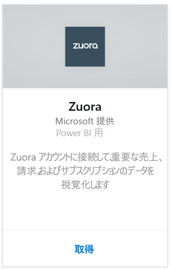
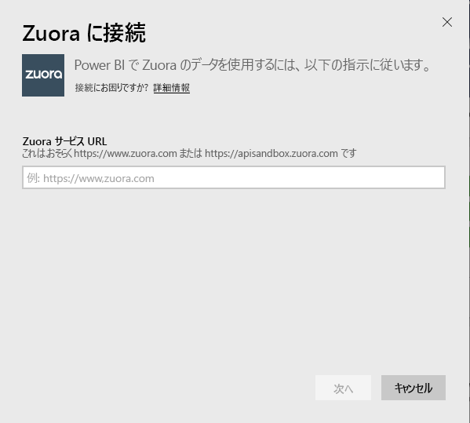
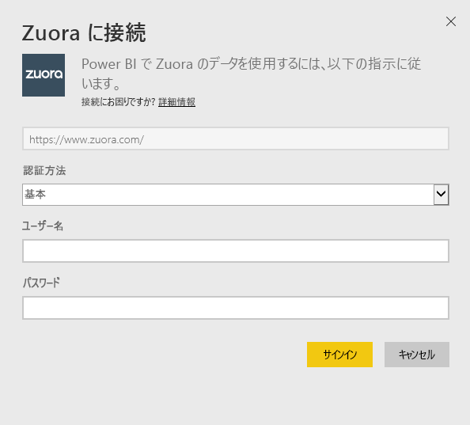
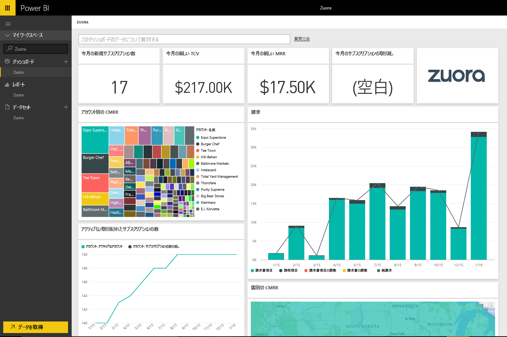

# Power BI で Zuora に接続する
Power BI 用 Zuora を使用すると、重要な売上、請求、およびサブスクリプションのデータを視覚化できます。 既定のダッシュボードとレポートを使用して、使用傾向の分析、請求と支払の追跡、経常収益の監視を行えます。さらに、ダッシュボードとレポートの独自のニーズに応じるためのカスタマイズも可能です。

Power BI 用 [Zuora](https://app.powerbi.com/getdata/services/Zuora) に接続します。

## 接続する方法
1. 左側のナビゲーション ウィンドウの下部にある **[データの取得]** を選択します。

   
2. **[サービス]** ボックスで、 **[取得]**を選択します。

   
3. **[Zuora]** \> **[取得]** の順に選択します。

   
4. Zuora URL を指定します。 通常は、"https://www.zuora.com" です。[これらのパラメーターの見つけ方](#FindingParams)について詳しくは、後述します。

   
5. **[認証方式]**で、 **[基本]** を選択し、ユーザー名とパスワード (大文字小文字を区別) を入力し、 **[サインイン]**を選択します。

    
6. 承諾後、インポート処理が自動的に開始されます。 完了すると、ナビゲーション ウィンドウに、新しいダッシュ ボード、レポート、モデルが表示されます。 インポートされたデータを表示するダッシュボードを選択します。

     

**実行できる操作**

* ダッシュボード上部にある [Q&A ボックスで質問](power-bi-q-and-a.md)してみてください。
* ダッシュボードで[タイルを変更](service-dashboard-edit-tile.md)できます。
* [タイルを選択](service-dashboard-tiles.md)して基になるレポートを開くことができます。
* データセットは毎日更新されるようにスケジュール設定されますが、更新のスケジュールは変更でき、また **[今すぐ更新]** を使えばいつでも必要なときに更新できます。

## 含まれるもの
このコンテンツ パックは、Zuora AQUA API を使用して次のテーブルを取得します。

| テーブル |  |  |
| --- | --- | --- |
| Account |InvoiceItemAdjustment |Refund |
| AccountingCode |Payment |RevenueSchedule |
| AccountingPeriod |PaymentMethod |RevenueScheduleItem |
| BillTo |Product |Subscription |
| DateDim |ProductRatePlan |TaxationItem |
| Invoice |ProductRatePlanCharge |Usage |
| InvoiceAdjustment |RatePlan | |
| InvoiceItem |RatePlanCharge | |

また、次の計算メジャーも含まれます。

| メジャー | 説明 | 擬似計算 |
| --- | --- | --- |
| アカウント: 支払 |支払有効日に基づく、期間内の合計支払金額。 |SUM (Payment.Amount)  WHERE Payment.EffectiveDate =< TimePeriod.EndDate AND    Payment.EffectiveDate >= TimePeriod.StartDate |
| アカウント: 返金 |返金日に基づく、期間内の合計返金額。 金額は負の数として報告されます。 |-1*SUM(Refund.Amount) WHERE Refund.RefundDate =< TimePeriod.EndDate AND    Refund.RefundDate >= TimePeriod.StartDate |
| アカウント: 純支払 |期間内のアカウント支払とアカウント返金の合計。 |Account.Payments + Account.Refunds |
| アカウント: アクティブなアカウント |期間内にアクティブであったアカウントの数。 サブスクリプションは、期間の開始日の前 (または当日) に起動されている必要があります。 |COUNT (Account.AccountNumber) WHERE     Subscription.Status != "Expired" AND    Subscription.Status != "Draft" AND    Subscription.SubscriptionStartDate <= TimePeriod.StartDate AND    (Subscription.SubscriptionEndDate > TimePeriod.StartDate OR Subscription.SubscriptionEndDate = null) –evergreen subscription |
| アカウント: 平均経常収益 |期間内のアクティブなアカウントあたりの総 MRR。 |Gross MRR / Account.ActiveAccounts |
| アカウント: サブスクリプションの取り消し |期間内にサブスクリプションを取り消したアカウントの数。 |COUNT (Account.AccountNumber) WHERE Subscription.Status = "Cancelled" AND    Subscription.SubscriptionStartDate <= TimePeriod.StartDate AND    Subscription.CancelledDate >= TimePeriod.StartDate |
| アカウント: 支払エラー |支払エラーの合計値。 |SUM (Payment.Amount) WHERE Payment.Status = "Error" |
| 収益スケジュール項目: 認識されている収益 |会計期間内で識別された売上の合計。 |SUM (RevenueScheduleItem.Amount) WHERE AccountingPeriod.StartDate = TimePeriod.StartDate |
| サブスクリプション: 新しいサブスクリプション |期間内の新しいサブスクリプションの数。 |COUNT (Subscription.ID) WHERE Subscription.Version = "1" AND    Subscription.CreatedDate <= TimePeriod.EndDate AND    Subscription.CreatedDate >= TimePeriod.StartDate |
| 請求書: 請求書項目 |期間内の請求書項目の合計請求金額。 |SUM (InvoiceItem.ChargeAmount) WHERE     Invoice.Status = "Posted" AND    Invoice.InvoiceDate <= TimePeriod.EndDate AND    Invoice.InvoiceDate >= TimePeriod.StartDate |
| 請求書: 課税項目 |期間内の課税項目の合計課税額。 |SUM (TaxationItem.TaxAmount) WHERE Invoice.Status = "Posted" AND    Invoice.InvoiceDate <= TimePeriod.EndDate AND    Invoice.InvoiceDate >= TimePeriod.StartDate |
| 請求書: 請求書項目の調整 |期間内の請求書項目の調整金額の合計。 |SUM (InvoiceItemAdjustment.Amount)  WHERE     Invoice.Status = "Posted" AND    InvoiceItemAdjustment.AdjustmentDate <= TimePeriod.EndDate AND    InvoiceItemAdjustment.AdjustmentDate >= TimePeriod.StartDate |
| 請求書: 請求書の調整 |期間内の請求書調整金額の合計。 |SUM (InvoiceAdjustment.Amount)  WHERE     Invoice.Status = "Posted" AND    InvoiceAdjustment.AdjustmentDate <= TimePeriod.EndDate AND    InvoiceAdjustment.AdjustmentDate >= TimePeriod.StartDate |
| 請求書: 純請求 |期間内の請求項目、課税項目、請求書項目調整、および請求書調整の合計。 |Invoice.InvoiceItems + Invoice.TaxationItems + Invoice.InvoiceItemAdjustments + Invoice.InvoiceAdjustments |
| 請求書: 請求書エージング残高 |転記済み請求書残高の合計。 |SUM (Invoice.Balance)  WHERE     Invoice.Status = "Posted" |
| 請求書: 総請求 |期間内の転記済み請求書の請求項目請求金額の合計。 |SUM (InvoiceItem.ChargeAmount)  WHERE     Invoice.Status = "Posted" AND    Invoice.InvoiceDate <= TimePeriod.EndDate AND    Invoice.InvoiceDate >= TimePeriod.StartDate |
| 請求書: 調整の合計 |転記済みの請求書に関連付けられている処理済みの請求書調整と請求書項目調整の合計。 |SUM (InvoiceAdjustment.Amount)  WHERE     Invoice.Status = "Posted" AND    InvoiceAdjustment.Status = "Processed" + SUM (InvoiceItemAdjustment.Amount)  WHERE     Invoice.Status = "Posted" AND    invoiceItemAdjustment.Status = "Processed" |
| レート プラン料金: 総 MRR |期間内のサブスクリプションからの毎月の経常収益の合計。 |SUM (RatePlanCharge.MRR)  WHERE     Subscription.Status != "Expired" AND    Subscription.Status != "Draft" AND    RatePlanCharge.EffectiveStartDate <= TimePeriod.StartDate AND        RatePlanCharge.EffectiveEndDate > TimePeriod.StartDate     OR    RatePlanCharge.EffectiveEndDate = null --evergreen subscription |

## システム要件
Zuora API へのアクセスが必要です。

## パラメーターの見つけ方
Zuora データにアクセスするために通常サインインする URL を指定します。 有効なオプションは次のとおりです。  

* https://www.zuora.com  
* https://www.apisandbox.zuora.com  
* サービス インスタンスに対応する URL  

## トラブルシューティング
Zuora コンテンツ パックは、ご使用の Zuora アカウントの多数の多様な情報をプルします。 特定の機能を使用しない場合は、対応するタイル/レポートが空になる場合があります。 読み込みに関して問題がある場合は、Power BI サポートに問い合わせてください。

## 次の手順
[Power BI の概要](service-get-started.md)

[Power BI でデータを取得する](service-get-data.md)
