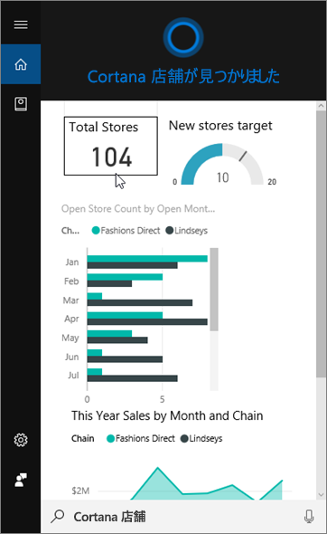
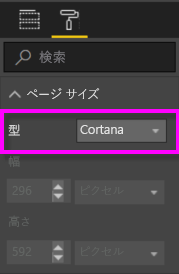
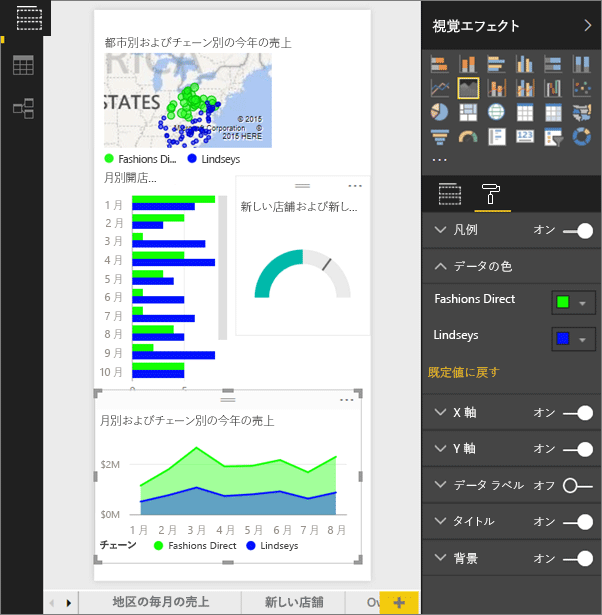
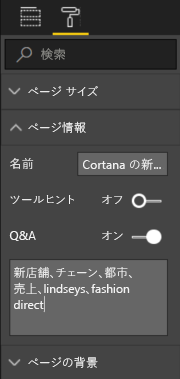
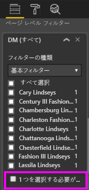

# Power BI サービスまたは Power BI Desktop を使用して Cortana のカスタム回答ページを作成する
Power BI のすべての機能を使って、Cortana の質問に回答するために特別に設計された *Cortana 回答ページ* (*Cortana 回答カード*と呼ばれることもあります) と呼ばれる特別なレポート ページを作成できます。

> [!IMPORTANT]
> Cortana と Power BI **ダッシュボード**のプレビューをお試しになる場合、この記事の残りの部分はスキップして構いません。 Cortana が Power BI ダッシュボードを検索できるようにするためのセットアップ要件はありません。
> 
> 

## 始める前に
Cortana for Power BI を設定し、利用するための 4 つのガイドがあります。 まだご覧になっていない場合、記事 1 からお読みください。 記事 2 は Cortana 回答ページの利用を開始するための手順を説明しており、特に重要です。

**記事 1**: [Cortana と Power BI を連携させる方法を理解します](service-cortana-intro.md)

**記事 2**: [Power BI レポートの検索: Cortana、Power BI、Windows の統合を有効にします](service-cortana-enable.md)

**記事 3**: この記事

**記事 4**: [問題をトラブルシューティングします](service-cortana-troubleshoot.md)

## Cortana 専用に設計された Cortana 回答ページを作成する
レポート内の *Cortana 回答ページ*は Cortana 専用のサイズになっているので、Cortana は質問への回答としてカードを画面に表示できます。 Cortana の回答ページを作成するには:

1. [空のレポート ページ](power-bi-report-add-page.md)から開始することをお勧めします。
2. **[視覚化]** ウィンドウで、ペイント ローラー アイコンを選び、**[ページ サイズ]** > **[種類]** > **[Cortana]** を選びます。
   
    
3. 特定の 1 つの質問 (または一連の複数の質問) への回答として Cortana で表示する 1 つのビジュアルまたは一連の複数のビジュアルを作成します。
4. すべてのビジュアルがページの境界内に収まることを確認します。 必要に応じて、ディスプレイの設定、データのラベル、色、背景などを変更します。  
   
    
5. ページの名前を指定し、代替名を追加します。 Cortana は、結果を検索するときにこれらの名前を使用します。 **[視覚化]** ウィンドウで、ペイントブラシ アイコンを選び、**[ページ情報]** を選びます。 スライダーを **[オン]** に動かして、Q & A をこのビジュアルに対して有効にします。
   
    
   
   > [!TIP]
   > 結果を改善するには、列名でもある言葉を使用しないようにします。
   > 
   > 
6. レポートにページ レベルのフィルターがある場合は、必要に応じて、**[1 つを選択する必要があります]** を設定できます。 Cortana は、フィルター項目のうち 1 つだけが質問に指定されている場合にのみ、このレポートを回答として表示します。 **[1 つを選択する必要があります]** は、**[フィルター]** ウィンドウの一番下にあります。
   
   > [!NOTE]
   > Cortana に質問してページ レベル フィルターを含むレポートを表示するのに、**[1 つを選択する必要があります]** を設定する必要はありません。 たとえば、"show sales for Charlotte Lindseys" (Charlotte Lindseys の売上を表示) の回答ページは、[1 つを選択する必要があります] の設定に関係なく表示されます。
   > 
   > 
   
     
   
      たとえば、Cortana に次のように質問すると、以下のようになります。
   
   * "show sales by store name" (売上を店舗名ごとに表示) と質問した場合、この回答ページは表示されません。必要なページ レベル フィルターの項目が 1 つも含まれていないためです。
   * "show sales for Cary Lindseys and Charlotte Lindseys" (Cary Lindseys と Charlotte Lindseys の売上を表示) と質問した場合、この応答ページは表示されません。必要なページ レベル フィルターから複数の項目が指定されているためです。
   * "show sales for Charlotte Lindseys" (Charlotte Lindseys の売上を表示) と質問すると、この回答ページが表示されます。
     
     = "show sales" (売上を表示) と質問した場合、この回答ページは表示されません。必要なページ レベル フィルターの項目が 1 つも含まれていないためです。

> [!IMPORTANT]
> Cortana が Cortana 回答ページにアクセスできるように、[Cortana 用にデータセットを有効にする](service-cortana-enable.md)必要があります。
> 
> 

## Cortana が結果を並べる順序
スコアの高い回答を含む結果 (指定されたページ名と完全に一致する回答など) が、Cortana で *ベスト マッチ* として先頭に表示されます。 Power BI に複数の Cortana 回答ページがある場合は、複数のベスト マッチが表示されます。 スコアが中程度または低い回答は、Cortana でベスト マッチより下にリンクとして一覧表示されます。たとえば、回答ページの名前に基づかない回答や、Power BI が理解できない語句の含まれる質問の場合などです。

> [!NOTE]
> 新しいデータセットまたはカスタムの Cortana 回答ページを Power BI に追加し、Cortana を有効にした場合、Cortana で結果が表示されるようになるまで最大で 30 分かかることがあります。 Windows 10 にログインしてログアウトした場合や、それ以外の方法で Windows 10 で Cortana プロセスを再起動した場合は、新しいコンテンツがすぐに表示されます。
> 
> 

## 次の手順
[Cortana を Power BI で使用する](service-cortana-intro.md)

まだ Power BI で Cortana を使うことができない場合は、  「[Cortana troubleshooter](service-cortana-troubleshoot.md)」 (Power BI 用 Cortana のトラブルシューティング) を試してください。

他にわからないことがある場合は、 [Power BI コミュニティを利用してください](http://community.powerbi.com/)。

