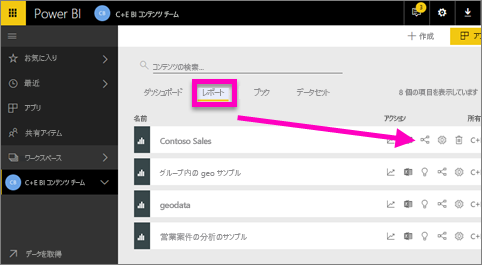
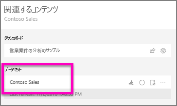
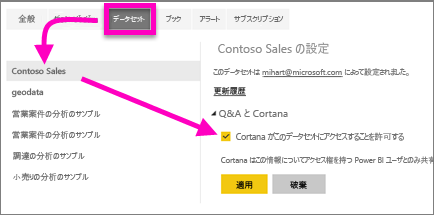
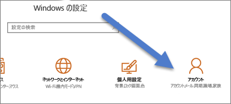
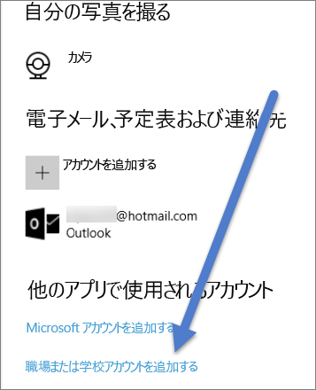

# Cortana を有効にし、Power BI レポート (とその基礎データセット) にアクセスできるようにする
「[Power BI 用の Cortana の概要](service-cortana-intro.md)」を読み (まだの場合は先に読んでおいてください)、 自分で試してみたい場合、  Cortana で自然言語を使って質問し、Power BI ***レポート***に格納されたデータから回答を検索できるようにするには、前提条件がいくつかあります。 具体的には、次を行う必要があります。

> [!NOTE]
> Cortana と Power BI ***ダッシュボード***のプレビューをお試しになる場合、この記事の残りの部分はスキップして構いません。 Cortana が Power BI ダッシュボードを検索できるようにするためのセットアップ要件はありません。
> 
> 

Power BI サービスで

* Cortana に対して 1 つまたは複数のデータセットを有効にします (レポートはデータセットの上に構築されるので、Cortana はそのようなデータセットにアクセスする必要があります)

Microsoft Windows で

* Windows 10 バージョン 1511 以降を実行していることの確認
* Power BI と Windows が相互に "通信" できることを確認します。 これは、アカウントを Windows に接続することを意味します。

## Power BI サービスを使って Cortana が Power BI のレポート ページにアクセスできるようにする
Cortana がアクセスする Power BI のレポートは、簡単なプロセスで有効にできます。  実際、必要な操作は、“このデータセットにアクセスするために Cortana を有効にする” を選択し、レポートの基礎データセットを有効にすることだけです。 それが済めば、Power BI のデータセットにアクセスできるすべてのユーザーが、通常の Power BI 共有、アプリ、およびコンテンツ パック機能を使って、Windows 10 の Cortana でレポートから回答を得ることができます。

Power BI サービス (Power BI Desktop ではありません) にサインインし、Cortana からアクセスできるようにする各データセットについてこの手順を繰り返す必要があります。

1. 有効にするデータセットを決定します。 レポート コンテンツの一覧から、Cortana でアクセスするレポートを選択し、**表示関連**アイコン  を選択します。
   
    
2. このレポートに関連付けられているデータセットは **Contoso Sales** です。
   
    
3. データセット名の右側にある**省略記号 [...] > [設定]** を選びます。  
   
    
4. **[Q&A と Cortana]** > **[Cortana がこのデータセットにアクセスすることを許可する]** > **[適用]** の順に選択します。
   
   
   
   この例では、Contoso Sales データセットで Cortana を有効にしています。
   
   > [!NOTE]
   > 新しいデータセットや Cortana 回答カードを Power BI に追加し、Cortana で有効にした場合、結果が表示されるまでに最大で 30 分かかることがあります。 Windows 10 にログインしてログアウトした場合や、それ以外の方法で Windows 10 で Cortana プロセスを再起動した場合は、新しいコンテンツがすぐに表示されます。
   > 
   > Cortana でデータセットを有効にしたときに、そのデータセットが所有するコンテンツ パックまたはアプリの一部である場合、仕事仲間も Cortana でそのデータセットを使えるようにするためには、そのデータセットを再発行する必要があります。
   > 
   > 

## Power BI の資格情報を Windows に追加する
Windows 10 バージョン 1511 以降が必要です。

1. 実行している Windows 10 バージョンを確認します。 **[設定]** を開きます。
    

    **[システム] > [バージョン情報]** を選びます。 画面の下部に、**[Windows の仕様] > [バージョン]** が表示されます。

   * Windows 10 バージョン 1511 (Windows 10 の 2015 年 11 月更新) から 1607 を所有している場合、職場または学校のアカウントと Microsoft アカウントを追加します (下の手順 2 と 3 を完了します)。
   * Windows 10 バージョン 1607 (Windows 10 の 2016 年 7 月更新プログラム) 以降を所有している場合、職場または学校のアカウントを追加します (下の手順 2 のみを完了します)。
1. Cortana 用の職場または学校のアカウントを追加します。
   
   * **[設定]**、**[アカウント]** の順に開きます。
     
       
   * 下にスクロールし、**[職場または学校アカウントを追加]** を選択します。 または、**[アカウント]** ページで、**[職場または学校にアクセスする] > [接続]** を選びます。
     
     

Cortana は、ユーザーの質問に対して可能性のある回答を Power BI に確認するために、この職場または学校アカウントを使用します。

## 次の手順
[Cortana の *回答カード* を Power BI で作成する](service-cortana-answer-cards.md)

[Cortana と Power BI の統合に関する問題のトラブルシューティング](service-cortana-troubleshoot.md)

他にわからないことがある場合は、 [Power BI コミュニティを利用してください](http://community.powerbi.com/)。

