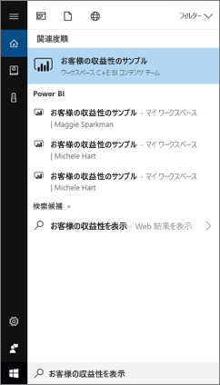
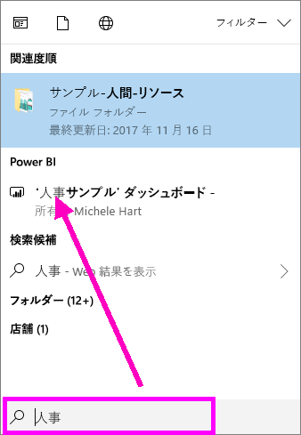
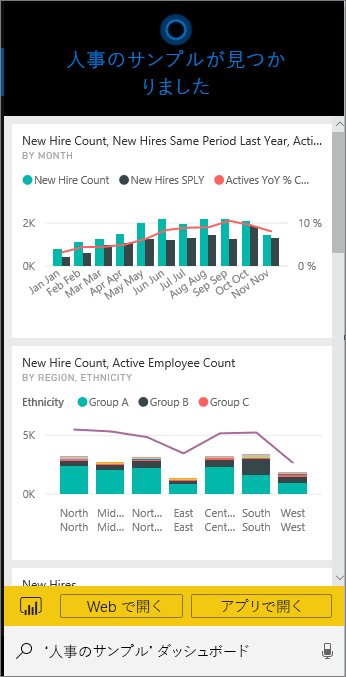
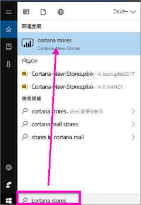
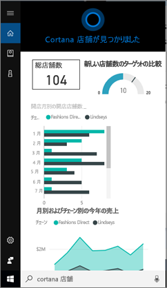
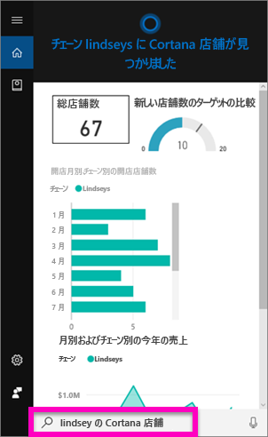
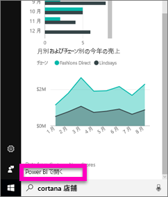
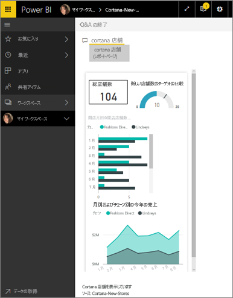

# Cortana for Power BI を利用し、Power BI データをすばやく見つけ、表示する
Windows 10 デバイスで Cortana を使って、ビジネスの重要な質問に対する回答を瞬時に取得できます。 Power BI と統合することにより、Cortana は Power BI のダッシュボードとレポートから重要な情報を直接取得できます。 必要なものは、Windows 10 の 2015 年 11 月以降のバージョン、Cortana、Power BI です。また、少なくとも 1 つのデータセットにアクセスできる必要があります。

## Windows 10 の新しい Cortana *ダッシュボード*検索をプレビューで体験する
[Cortana を利用し、特定の種類のレポート ページを取得する](service-cortana-answer-cards.md)機能をお試しいただいておりましたが、 それに**新しいエクスペリエンス**が追加されました。ダッシュボードも取得できるようになりました。 お試しいただけましたら、[フィードバックをお送りください](mailto:pbicortanasg@microsoft.com)。 この*新しいエクスペリエンス*はさらに拡張され、レポートの Cortana 検索も追加される予定です。  新しいエクスペリエンスの利点の 1 つは、特別な設定が要らないことです。Cortana を有効にしたり、Windows 10 を構成したりしなくても機能します。

> [!NOTE]
> 機能しない場合、[トラブルシューティング記事](service-cortana-troubleshoot.md)をご覧ください。
> 
> 

基礎になっている技術は、[Microsoft の Azure Search サービス]()です。 この検索サービスは、スマート ランキング、エラー修正、オート コンプリートなど、追加機能を提供します。

いずれの Cortana エクスペリエンスも共存できます。

## Cortana for Power BI ドキュメント
Cortana for Power BI を設定し、利用するためのガイドを 4 つ用意しています。 この一連の記事では、以下の手順を説明します。

**記事 1** (この記事): Cortana と Power BI を連携させる方法を理解します

**記事 2**: [Power BI レポートの検索: Cortana、Power BI、Windows の統合を有効にします](service-cortana-enable.md)

**記事 3**: [Power BI レポートの検索: 特別な *Cortana 回答カード*を作成する](service-cortana-answer-cards.md)

**記事 4**: [問題をトラブルシューティングします](service-cortana-troubleshoot.md)

## Cortana と Power BI が連携するしくみ
Cortana を使って質問するとき、Cortana が回答を探す場所の 1 つとして Power BI を使うことができます。 Power BI と連携することで、Cortana は、*Cortana 回答カード* と呼ばれる特殊な種類のレポート ページを含む Power BI レポートから、また、Power BI ダッシュボードから豊富なデータに基づく回答を見つけることができます。

Cortana が一致を見つけると、Cortana 画面にダッシュボードまたはレポート ページの名前が表示されます。 ダッシュボードまたはレポート ページは Power BI で開くことができます。 レポート ページはインタラクティブであり、Cortana で探索することもできます。

### Cortana とダッシュボード (*新しいエクスペリエンス*)
Cortana は、自分が所有しているか、共有しているダッシュボードで回答を検索できます。 タイトル、キーワード、所有者名、ワークスペース名、アプリ名などを利用して Cortana に質問します。

Cortana に回答を見つけてもらうには、少なくとも 2 つの単語が質問に含まれている必要があります。 名前が 1 文字のダッシュボード (Marketing) で検索する場合、"show"、"Power BI"、"<owner name>" などの単語を質問に追加します。"show Marketing" や "michele hart sample" のようにします。 

ダッシュボードのタイトルが複数の単語からなる場合、Cortana は、少なくとも 2 つの単語に一致するか、単語の 1 つと所有者名に一致した場合にのみ、ダッシュボードを返します。 ダッシュボードの名前が "Customer Profitability Sample" の場合: 

* "show me customer" と質問しても、Power BI ダッシュボード結果は*返されません*。   
* "show me customer profitability"、"customer p"、"customer s"、"profitability sample"、"michele hart sample"、"show customer profitability sample"、"show me customer p" のような発話は Power BI 結果を*返します*。
* "powerbi" という単語を追加すると、必要な 2 つの単語の 1 つとして数えられます。そのため、"powerbi sample" は Power BI 結果を*返します*。 
  
    

### Cortana とレポート
 Cortana は、[Cortana で表示するために特別に設計されたページ](service-cortana-answer-cards.md)を含むレポートで回答を検索できます。 このような特別なレポート ページからは、単純にタイトルやキーワードで質問します。  

レポートの基礎となっている技術は、[Microsoft の Power BI Q&A](power-bi-q-and-a.md) の利用です。

Cortana で質問すると、Power BI は、Cortana のために特別に設計されたページから回答します。 可能性のある回答は、Power BI で既に作成されている Cortana *回答カード* から、Cortana によってその場で直接決定されます。  Power BI で結果を開くだけで、回答をさらに調査できます。

> [!NOTE]
> Cortana が Power BI レポートで回答を見つけられるためには、その前に [Power BI サービスを使ってこの機能を有効にし、Power BI と通信するように Windows を設定する](service-cortana-enable.md)必要があります。  
> 
> 

## Cortana を利用して Power BI から回答を取得する
1. Cortana を起動します。 Cortana はさまざまな方法で*起動*できます。(下の画像のように) タスク バーの Cortana アイコンを選択する、Windows モバイル デバイスで検索アイコンをタップする、などです。
   
     
2. Cortana の準備ができたら、Cortana 検索バーに質問を入力するか、話しかけます。 Cortana が得られた結果を表示します。 質問に一致する Power BI ダッシュボードがある場合は、**[ベスト マッチ]** または **[Power BI]** の下に表示されます。
   
     
   
   > [!NOTE]
   > 現在のところ、英語のみに対応しています。
   > 
   > 
3. Cortana で開くダッシュボードを選びます。

    

    [ダッシュボードの "*Phone ビュー*" を編集する](service-create-dashboard-mobile-phone-view.md)ことによって、レイアウトを変更できます。 

1. Cortana からは、Power BI サービスまたは Power BI モバイルでダッシュボードを開くこともできます。 **[Web で開く]** を選ぶと、Power BI サービスでダッシュボードが開きます。 
   
      
4. それでは Cortana を利用し、レポートを検索しましょう。 [Cortana 回答カードのページを含むレポート](service-cortana-answer-cards.md)について知っている必要があります。 この例では、"Cortana-New-Stores" という名前のレポートに "cortana stores" という名前の Cortana 回答カードがあります。  
   
     Cortana 検索バーに質問を入力するか、話しかけます。 Cortana が得られた結果を表示します。 質問に一致する Power BI レポート ページがある場合は、**[ベスト マッチ]** または **[Power BI]** の下に表示されます。 この例では、回答カードの作成に使った .pbix ファイル (およびバックアップ) も、**[ドキュメント]** の下に表示されています。
   
      
5. **[Cortana ストア]** レポート ページを選択し、Cortana ウィンドウに表示します。
   
       
   
    *回答カード* はデータセットの所有者によって作成された特殊な種類の Power BI レポート ページです。  詳しくは、[Cortana 回答カードの作成](service-cortana-answer-cards.md)に関するページをご覧ください。
6. 表示するだけではなく、 Power BI の場合と同様に回答カードの視覚化を操作することもできます。
   
   * たとえば、視覚化の要素を選んでクロス フィルター処理を行い、回答カードの他の視覚化を強調表示することができます。
     
     
   * または、代わりに自然言語を使って結果をフィルター処理できます。  たとえば、"Cortana stores for Lindseys" と質問すると、Lindseys チェーンのデータのみを表示するようにフィルター処理されたカードが表示されます。
     
     
7. 調査を続けます。 Cortana ウィンドウの下部までスクロールし、**[Power BI で開く]** を選びます。
   
     
8. レポート ページが Power BI で開きます。    
     

## 考慮事項とトラブルシューティング
* Cortana は、[Power BI 対応](service-cortana-enable.md)になっていない Cortana カードにはアクセスできません。
* まだ Power BI で Cortana を使うことができない場合は、  「[Cortana troubleshooter](service-cortana-troubleshoot.md)」 (Power BI 用 Cortana のトラブルシューティング) を試してください。
* 現時点では、Power BI 用の Cortana は英語のみで利用できます。
* Cortana for Power BI は Windows モバイル デバイスのみでご利用いただけます。

他にわからないことがある場合は、 [Power BI コミュニティを利用してください](http://community.powerbi.com/)。

## 次の手順
[レポートの Cortana、Power BI、Windows の統合を有効にします](service-cortana-enable.md)

