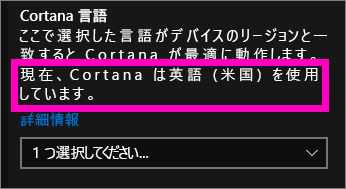
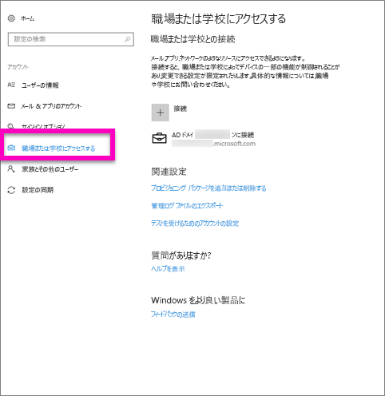
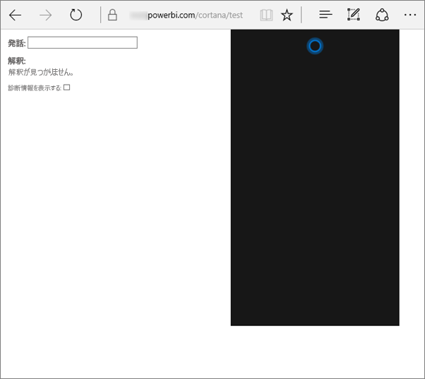
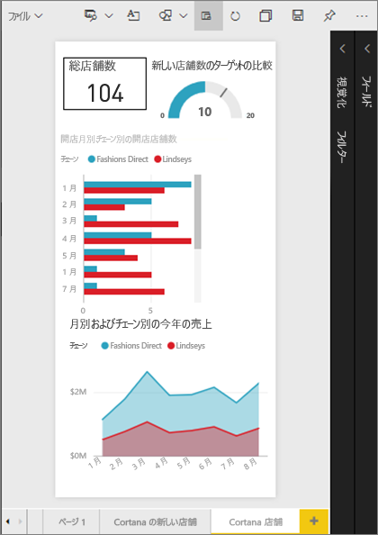
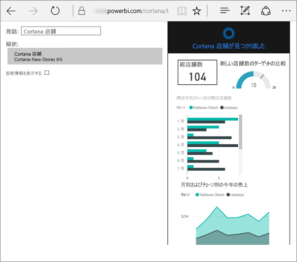
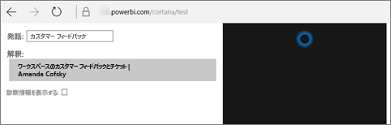

# Power BI 用 Cortana のトラブルシューティング
この記事はシリーズの一部です。 次の 3 つの記事をまだ読んでいない場合は、読むことをお勧めします。

**記事 1**: [Cortana と Power BI が連動し、Power BI のダッシュボードとレポートを検索するしくみを理解する](service-cortana-intro.md)

**記事 2**: [レポートの検索: Cortana、Power BI、Windows の統合を有効にします](service-cortana-enable.md)

**記事 3**: [レポートの検索: 特別な *Cortana 回答カード*を作成する](service-cortana-answer-cards.md)

Cortana と Power BI の統合にまだ問題がある場合は、ここでその解決方法を説明します。 以下の手順に従って問題を診断し、解決してください。

## Cortana が Power BI のレポートまたはダッシュボードから回答を発見できない理由
1. Power BI アカウントがありますか。  ない場合は、[無料でサインアップ](service-self-service-signup-for-power-bi.md)できます。
2. Cortana は動いていますか。  タスク バーに Cortana アイコンが表示されていますか。
   
    
   
    選択したとき、Cortana のフィールドには何を入力できますか。
3. 検索に少なくとも 2 つの単語を使用しましたか? Power BI で回答を検索するには、少なくとも 2 つの単語を Cortana は必要とします。 質問の冒頭に "show" を追加してみてください。 
4. ダッシュボードのタイトルが複数の単語からなる場合、少なくとも 2 つの単語に一致した場合にのみ、Cortana はそのダッシュボードを返します。 "Sales FY16" という名前のダッシュボードの場合: 
   
   * "show sales" は Power BI 結果を*返しません*。   
   * "show me sales fy16"、"sales fy16"、"show sales fy16"、"show me sales f" は Power BI 結果を*返します*。    
   * "powerbi" という単語を追加すると、必要な 2 つの単語の 1 つとして数えられます。そのため、"powerbi sales" は Power BI 結果を*返します*。
5. レポートまたはダッシュボードにアクセスできますか? または編集アクセス許可を与えられていますか? レポートの場合、検索しようとしているコンテンツに[回答カード](service-cortana-answer-cards.md)があることを確認してください。  ダッシュボードの場合、検索しようとしているコンテンツが**共有アイテム**、アプリ ワークスペース、または**マイ ワークスペース**にあることを確認してください。 問題の特定には[トラブルシューティング ツールを利用してください](#try-the-cortana-troubleshooting-tool)。
6. モバイル デバイスを使っていますか。  現在のところ、Power BI と Cortana の統合は Windows モバイル デバイスでのみ対応しています。
7. Cortana は英語用に構成されていますか。  現在の Cortana と Power BI の統合は、英語でのみサポートされています。 Cortana を開き、歯車アイコンを選んで [設定] を表示します。 **[Cortana 言語]** まで下にスクロールし、英語オプションのいずれかに設定されていることを確認します。
   
   
8. 100 を超えるレポートを Cortana で有効にしていますか。  Cortana は、合計 100 までしか検索しません。  レポートを確実に含めるには、**[マイ ワークスペース]** に移動またはコピーします。Cortana はここを最初に検索します。
9. 少し時間が必要なだけかもしれません。 初めてクエリを入力するときは、モデルが*コールド状態*になっている可能性があります。 データがメモリに読み込まれるまで数秒待ってから、もう一度やってみてください。 
10. ダッシュボードの場合、Cortana にアクセス可能になるまで最大 24 時間かかります。    
11. レポートの場合、新しいデータセットまたはカスタム回答カードを Power BI に追加し、Cortana を有効にした場合、Cortana で結果が表示されるようになるまで最大で 30 分かかることがあります。 Windows 10 にログインしてログアウトした場合や、それ以外の方法で Windows 10 で Cortana プロセスを再起動した場合は、新しいレポート コンテンツがすぐに表示されます。  
12. Power BI 管理者は "オプト アウト" できます。 それについては、管理者にお問い合わせください。

## レポートのみ: Cortana が Power BI のレポートから回答を発見できない理由
1. レポートで回答を探している場合、Cortana **回答カード**を含むレポートがありますか? 回答カードは、Cortana が Power BI レポートで回答を見つけられる唯一の方法です。  回答カードの作成方法については、[Power BI サービスと Power BI Desktop での Cortana 回答カードの作成](service-cortana-answer-cards.md)に関するページをご覧ください。
2. Windows バージョン 1511 以降を実行していますか。  Windows の設定を開き、**[システム] > [バージョン情報]** を選んで確認してください。 上記のバージョンでない場合は、Windows のバージョンを更新します。
3. Windows と Power BI アカウントは接続されていますか。 これはややこしい場合があります。 「[Power BI 用に Cortana を有効にする](service-cortana-enable.md#add-your-power-bi-credentials-to-windows)」の説明に従ってください。
4. 基礎となるデータセットを Cortana に対して有効にしていますか? Cortana が有効になっているデータセットが他のユーザーによって既に共有されているかもしれません。 そうでない場合は、[自分で Cortana 用にデータセットを有効にする方法を学習](service-cortana-enable.md)してください。 すぐに簡単にできます。

## ダッシュボードのみ: Cortana が Power BI のダッシュボードから回答を発見できない理由
1. 職場のアカウントに接続していることを確認します。 Power BI は、データに対するアクセス許可を認証するためにこの接続を必要とします。 職場のアカウントに接続されているかどうかを確認するには、Windows 検索ボックスを利用し、“職場または学校への接続” に移動します。  
   
    
2. Cortana にアクセスできますか? Windows 検索ボックスを選択し、自分の情報に対するアクセス許可を Cortana に与えます。

## Cortana トラブルシューティング ツールを試す
問題が解決していませんか。  それではこの機会に Cortana トラブルシューティング ツールを実行し、考えられる問題を絞り込んでください。 

### レポートから回答を取得できませんか?
1. レポートの場合、トラブルシューティング ツールを実行する前に、Cortana 回答カードの **[ページ レベル フィルター]** を **[1 つを選択する必要があります]** に設定します。 詳しくは、[Cortana 回答カードの作成](service-cortana-answer-cards.md)に関するページをご覧ください。
2. Power BI サービスの URL の最後に "/cortana/test" を追加して、トラブルシューティング ツールを開きます。 URL は次にようになります。
   
   app.powerbi.com/cortana/test
   
   
3. レポートの問題を解決するには、**[Utterance]** (発話) フィールドに、Cortana 回答カードの名前を、***Power BI タブに表示されるとおり正確に***入力します。
   
   
   
    
   
   ![Power BI の [回答カード] タブ](media/service-cortana-troubleshoot/power-bi-answer-card2.png)
4. 初めて **[Utterance]** (発話) フィールドに何か入力したとき、何も起こらないことがあります。 その場合はシステムが準備中と考え、トラブルシューティング ツールが起動するまで待ってください。 **[Utterance]** (発話) フィールドの内容を切り取って貼り付けるか、再入力してください、 この例では、回答カードの名前は "**Cortana stores**" です。 **Cortana stores** をツールに貼り付けるか入力すると、**[Interpretations]** (解釈) フィールドに 1 つの結果が表示されます。 クリックすると、Cortana ウィンドウに回答カードが表示されます。この場合、**Cortana stores** です。
   
   
   
   結果が得られたので、Cortana が Power BI で有効になって**いる**ことがわかります。 これにより、問題は Windows 側、Cortana 言語の設定、または Cortana に対して 100 を超えるデータセットの有効化に絞り込まれます。

### ダッシュボードから回答を取得できませんか。
共有しているダッシュボードをお探しですか?  Power BI を開き、**[共有アイテム]** に進み、ダッシュボードの名前を見つけます。  *[Utterance]** /(発話/) フィールドにその名前を入力します。

    

#### トラブルシューティング ツールの既知の問題
* ツールを初めて利用し、結果が取得されない場合、代わりに [Utterance] (発話) テキスト ボックスにクエリを貼り付けてください。
* 仕様により、クエリは 2 語以上にする必要があります。  クエリが短すぎる場合は、単語 "show" を追加します。
* 前置詞を含むクエリ文字列は動作しない可能性があります (例: "sales by item")。 前置詞を含まず、意味があって一意の別のクエリ用語を使ってみてください。

他にわからないことがある場合は、 [Power BI コミュニティを利用してください](http://community.powerbi.com/)。

