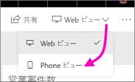
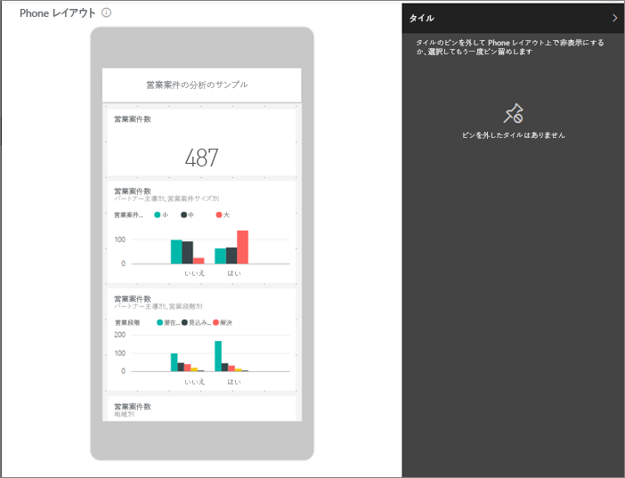
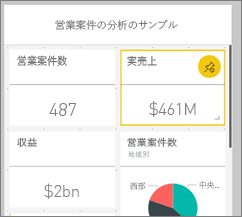
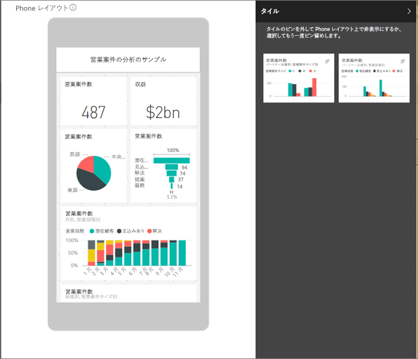
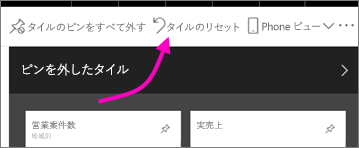

# 携帯電話用に最適化された Power BI ダッシュボードのビューを作成する
スマートフォンで Power BI モバイル アプリのダッシュボードを開くと、ダッシュボードのタイルがすべて同じサイズで並んで表示されることに気付くでしょう。 Power BI サービスでは、スマートフォンでの表示専用に、所有しているダッシュボードのカスタマイズしたビューを作成できます。

スマートフォンを横向きにすると、ダッシュボードはサービスでのレイアウトと同じように表示され、スマートフォン用にデザインしたレイアウトでは表示されません。

> [!NOTE]
> Phone ビューを編集すると、スマートフォンでダッシュボードを見ているユーザーに対して、ビューの変更がリアルタイムで表示される場合があります。 たとえば、ダッシュボードの Phone ビューですべてのタイルの固定を解除すると、突然スマートフォン上のダッシュボードにタイルが 1 つもなくなります。 
> 
> 

## ダッシュボードの Phone ビューを作成する
1. Power BI サービスでダッシュボードを開きます。
2. 右上隅の **[Web ビュー]** の横にある矢印を選んでから、**[Phone ビュー]** を選びます。

    

    ダッシュボードの所有者でない場合、このオプションは表示されません。

    

    スマートフォン用ダッシュボードの編集ビューが開きます。 ここで、スマートフォンでの表示に合わせてタイルの固定解除、サイズ変更、並べ替えができます。 ダッシュボードの Web バージョンは変更されません。

1. タイルを選択してドラッグ、サイズ変更、または固定解除します。 タイルをドラッグすると、他のタイルが移動します。
   
    
   
    固定解除されたタイルは [ピンを外したタイル] ウィンドウに移動し、再度追加しない限り、そのままです。
   
    
2. 操作を取り消す場合は、**[タイルのリセット]** を選ぶと、前のサイズと順序に戻ります。
   
    
   
    Power BI サービスでスマートフォン用編集ビューを開くだけで、スマートフォン上のタイルのサイズと形状がわずかに変更されます。 ダッシュボードをスマートフォン用編集ビューで開く前の正確な状態に戻すには、**[タイルのリセット]** を選択します。
3. スマートフォン用ダッシュボードのレイアウト編集が完了したら、右上隅の **[Phone ビュー]** の横にある矢印を選んだ後、**[Web ビュー]** を選びます。
   
    スマートフォン用レイアウトが自動的に保存されます。

## 次の手順
* [Power BI 電話アプリ用に最適化したレポートを作成する](desktop-create-phone-report.md)
* [任意のサイズに最適化されるレスポンシブ ビジュアルを作成する](desktop-create-responsive-visuals.md)
* 他にわからないことがある場合は、 [Power BI コミュニティで質問してみてください](http://community.powerbi.com/)。

