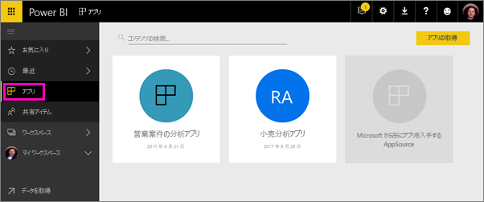
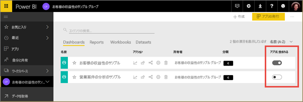
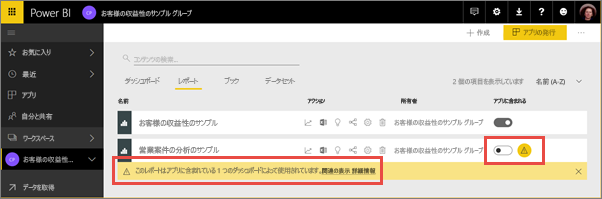
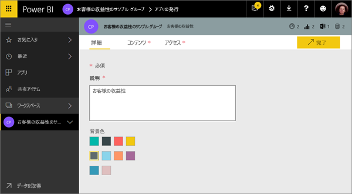
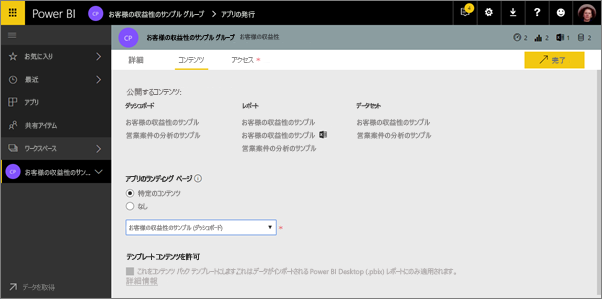
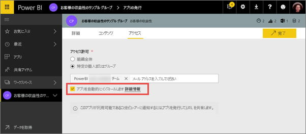
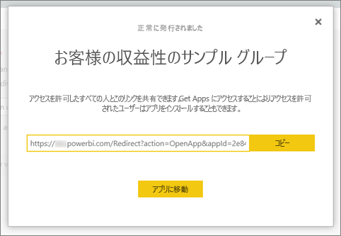
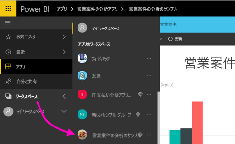
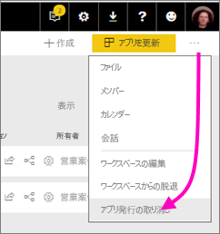

# Power BI でダッシュボードとレポートを含むアプリを発行する

Power BI では、関連するダッシュボードとレポートのコレクションを含む*アプリ*を発行できます。 アプリは、*アプリ ワークスペース*で作成します。アプリ ワークスペースでは、Power BI コンテンツを同僚と共同作業することができます。 そして、完成したアプリを組織内の多数のユーザーに発行することができます。 詳細については、[アプリ ワークスペースの作成](service-create-workspaces.md)に関するページを参照してください。

ビジネス ユーザーは、業務のために Power BI の複数のダッシュボードとレポートを必要とすることがよくあります。 Power BI アプリを使用すると、ダッシュボードとレポートのコレクションを作成し、こうしたアプリを、組織全体または特定のユーザーやグループに発行できます。 レポートの作成者または管理者は、アプリを使用すると、このようなコレクションに対するアクセス許可を管理しやすくなります。

ビジネス ユーザーは、いくつかの方法でアプリを取得します。 Power BI 管理者からアクセス許可が与えられている場合は、同僚の Power BI アカウントにアプリを自動的にインストールすることができます。 その他、ビジネス ユーザーはアプリを Microsoft AppSource からインストールすることも、送信された直接リンクを使用することもできます。 すべてが 1 か所にあるため、ビジネス ユーザーは簡単に検索してコンテンツに戻ることができます。 このようなユーザーはアプリのコンテンツを変更できませんが、Power BI サービスまたはモバイル アプリのいずれかを使用してコンテンツと対話し、データ自体のフィルター、強調表示、ソートを行うことができます。 更新プログラムは自動的に取得されます。データの更新頻度は制御することができます。 詳細については、[ビジネス ユーザーのアプリ機能](consumer/end-user-apps.md)に関するページを参照してください。

**ご存知でしたか?** Power BI では、新しいワークスペース エクスペリエンスをプレビューしています。 今後、ワークスペースがどのように変更されるかについては、「[新しいワークスペース (プレビュー) を作成する](service-create-the-new-workspaces.md)」を参照してください。 

## アプリと組織のコンテンツ パック
アプリは、組織のコンテンツ パックが進化したものです。 新しいプレビュー版のワークスペース エクスペリエンスでは、コンテンツ パックを使用できません。 新しいワークスペース エクスペリエンスが一般公開された後に新しく作成されたワークスペースでは、コンテンツ パックを使用できなくなります。 まだインストールしていない場合は、コンテンツ パックのアプリへの移行を開始してください。

## ビデオ:アプリとアプリ ワークスペース
<iframe width="640" height="360" src="https://www.youtube.com/embed/Ey5pyrr7Lk8?showinfo=0" frameborder="0" allowfullscreen></iframe>

## アプリのライセンス
アプリ ワークスペースのメンバーには Power BI Pro ライセンスが必要です。 アプリ ユーザーの場合は 2 つのオプションがあります。

* オプション 1:すべてのビジネス ユーザーに、アプリを表示するための **Power BI Pro** ライセンスが必要です。 
* オプション 2:Power BI Premium 容量内にあるアプリの場合、組織内の無料のユーザーはアプリのコンテンツを表示できます。 詳しくは、[Power BI Premium](service-premium.md) に関するページをご覧ください。

## アプリの発行
ワークスペース内のダッシュボードとレポートの準備ができたら、発行するダッシュボードとレポートを選択し、アプリとして発行します。 その対象ユーザーに直接リンクを送信することも、対象ユーザー自身が **[ストアからアプリを取得するにはクリックします]** を選択して、[アプリ] タブからアプリを検索することもできます。 

1. ワークスペースの一覧表示で、アプリに含めるダッシュボードとレポートを決定します。

     

     レポートを発行しないように選択すると、レポートと、それに関連するダッシュボードの横に警告が表示されます。 アプリは引き続き発行できますが、関連するダッシュボードでは、該当するレポートのタイルが削除されます。

     

2. 右上の **[アプリの発行]** ボタンを選択して、ワークスペースのすべてのコンテンツを共有するプロセスを開始します。
   
     

3. **[詳細]** で、ユーザーがアプリを検索する際に役立つ説明を入力します。 背景色を設定してカスタマイズすることができます。
   
     

4. **[コンテンツ]** で、アプリの一部として発行されるコンテンツが表示されます。これは、そのワークスペースで選択したものすべてです。 ユーザーがアプリに移動したときに最初に表示されるダッシュボードまたはレポートをアプリのランディング ページとして設定することもできます。 **[なし]** を選択することができます。 この場合、アプリのすべてのコンテンツの一覧が表示されます。 
   
     

5. **[アクセス権]** で、アプリにアクセスできるユーザー (組織内のすべてのユーザー、または特定のユーザーあるいは Active Directory セキュリティ グループ) を決定します。 アクセス許可を持っている場合は、受信者に対してアプリを自動的にインストールする決定を行うことができます。 Power BI 管理者は、Power BI 管理ポータルでこの設定を有効にすることができます。 詳細については、[アプリの自動インストール](#how-to-install-an-app-automatically-for-end-users)に関するセクションをご覧ください。

    

6. **[完了]** を選択すると、発行する準備ができたことを確認するメッセージが表示されます。 成功を示すダイアログ ボックスで、このアプリへの直接リンクである URL をコピーして、共有するユーザーに送信することができます。
   
     

詳細については、[ビジネス ユーザーのアプリ機能](consumer/end-user-apps.md)に関するページを参照してください。

## 発行されたアプリを変更する
アプリを発行した後に、アプリを変更したり更新したりできます。 アプリ ワークスペースの管理者またはメンバーの場合、または新しいアプリ ワークスペースの共同作成者の場合は、簡単に更新できます。 

1. アプリに対応するアプリ ワークスペースを開きます。 
   
     
2. ダッシュボードまたはレポートを開きます。 これで、必要な変更を実行できるはずです。
   
     アプリ ワークスペースはステージング領域なので、再度アプリが発行されるまで、変更内容はアプリに反映されません。 これにより、発行されたアプリに影響を与えずに変更を加えることができます。  
 
3. コンテンツのアプリ ワークスペースの一覧に戻り、**[アプリを更新]** を選択します。
   
     ![[アプリを更新] ボタン](media/service-create-distribute-apps/power-bi-app-update-button.png)

4. 必要に応じて **[詳細]**、**[コンテンツ]**、および **[アクセス権]** を更新して、**[アプリを更新]** を選択します。
   
     ![[アプリを更新] ボタン](media/service-create-distribute-apps/power-bi-app-update-complete.png)

アプリを発行したユーザーには、更新されたバージョンのアプリが自動的に表示されます。 

## エンド ユーザーにアプリを自動的にインストールする
アプリは、エンド ユーザーが自分の仕事を行うために必要なデータを提供します。 管理者からアクセス許可が付与されている場合は、エンド ユーザーにアプリを自動的にインストールでき、適切なユーザーまたはグループに適切なアプリを簡単に配布できます。 アプリは、エンド ユーザーのアプリ コンテンツ一覧に自動的に表示されます。Microsoft AppSource から探したり、インストール リンクに従ったりする必要はありません。 これにより、標準の Power BI コンテンツをユーザーにロールアウトすることが簡単になります。

### エンド ユーザーにアプリを自動的にインストールする方法
管理者からアクセス許可が付与されると、**自動的にアプリをインストールできる**新しいオプションが表示されます。 チェックボックスをオンにして **[完了]** (既存のアプリの場合は **[アプリを更新]**) を選択すると、**[アクセス]** タブのアプリの **[アクセス許可]** セクションに定義されているすべてのユーザーまたはグループにアプリがプッシュされます。

### ユーザーが自分に対してプッシュされたアプリを入手する方法
プッシュしたアプリは、アプリ リストに自動的に表示されます。 組織の特定のユーザーやジョブ ロールが手元に置く必要のあるアプリを選別できます。

### アプリの自動インストールに関する考慮事項
エンド ユーザーにアプリをプッシュするときの注意事項を次に示します。

* ユーザーにアプリを自動的にインストールすると、時間がかかることがあります。 ほとんどのアプリはユーザーにすぐにインストールされますが、アプリのプッシュには時間がかかる場合があります。  かかる時間は、アプリ内のアイテムの数とアクセスを付与するユーザーの数によって異なります。 ユーザーがアプリを必要とするまでに十分な時間をおいて、勤務時間外にアプリをプッシュすることをお勧めします。 アプリが使えるようになったことを広く知らせる前に、複数のユーザーで確認します。

* ブラウザーを更新します。 ユーザーがブラウザーの表示を更新したり、ブラウザーをいったん閉じて開き直したりしてからでないと、プッシュされたアプリがアプリ リストに表示されないことがあります。

* アプリがアプリ リストにすぐに表示されない場合、ユーザーはブラウザーの表示を更新するか、ブラウザーを閉じて再び開く必要があります。

* ユーザーに負担をかけすぎないようにします。 事前インストールされているアプリが役に立つことをユーザーが認識できるよう、プッシュするアプリが多くなりすぎないように注意します。 タイミングを調整するにはエンド ユーザーにアプリをプッシュできるユーザーを制御するのが最善です。 組織内のアプリをエンド ユーザーにプッシュするための連絡先を確立できます。

* 招待を受け入れなかったゲスト ユーザーに、アプリが自動的にインストールされることはありません。  

## アプリケーションを非公開にする
アプリ ワークスペースのすべてのメンバーは、アプリケーションを非公開にすることができます。

>[!NOTE]
>アプリケーションを非公開にすると、アプリケーションのユーザーが行ったカスタマイズ情報が失われます。 つまり、アプリケーションのコンテンツに関連付けられている個人用ブックマーク、コメント、サブスクリプションがすべて失われます。 これらの情報を削除する必要がある場合は、アプリケーションを非公開にしてください。
> 
> 

* アプリ ワークスペースで、右上隅にある省略記号 (**...**) を選択し、**[アプリケーションを非公開にする]** を選択します。
  
     

このアクションは、発行したすべてのユーザーのアプリをアンインストールし、ユーザーはアクセスできなくなります。 アプリ ワークスペースまたはその内容は削除されません。

## 次の手順
* [アプリ ワークスペースを作成する](service-create-workspaces.md)
* [Power BI にアプリをインストールし、使用する](consumer/end-user-apps.md)
* [外部サービス用の Power BI アプリ](service-connect-to-services.md)
* [Power BI 管理ポータル](https://docs.microsoft.com/power-bi/service-admin-portal)
* わからないことがある場合は、 [Power BI コミュニティで質問してみてください](http://community.powerbi.com/)。
