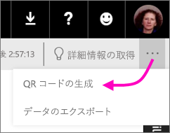
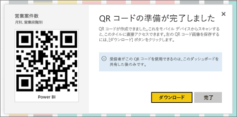

# モバイル アプリで使用する Power BI のタイルの QR コードを作成する
Power BI で QR コードを使用すると、実世界の任意のものを、関連する BI 情報に直接接続することができます。ナビゲーションや検索の必要がなくなります。

Power BI サービスでは、自分では編集できないダッシュボードも含めて、すべてのダッシュボードのタイルの QR コードを作成できます。 その後、必要な場所にその QR コードを配置します。 たとえば、メールに貼り付けたり、印刷して特定の場所に貼り付けたりできます。 

ダッシュボードを共有している仕事仲間は、[タイルにアクセスするため QR コードをモバイル デバイスから直接スキャン](mobile-apps-qr-code.md)できます。 Power BI アプリに付属の QR コード スキャナーを使用しても、それらのデバイスにインストールされているその他の QR スキャナーを使用しても構いません。 .

## タイルの QR コードを作成する
1. Power BI サービスで、ダッシュボードを開きます。
2. タイルの右上隅にある省略記号 (...) を選び、**[フォーカス モード]**  を選びます。
3. 右上隅にある省略記号 (...) を選び、 **[QR コードの生成]**を選びます。 
   
    
4. QR コードを含むダイアログ ボックスが表示されます。 
   
    
5. この画面から QR コードをスキャンするか、ダウンロードして保存すると、次のことを行えます。 
   
   * メールやその他のドキュメントに QR コードを追加する。 
   * QR コードを印刷して、特定の場所に配置する。 

## QR コードを印刷する
Power BI は QR コードを JPG ファイルとして生成するので、印刷に対応できます。 

1. **[ダウンロード]** を選択し、プリンターに接続されているコンピューターで JPG ファイルを開きます。  
   
   > [!TIP]
   > JPG ファイルの名前はタイルと同じです。 例: 営業案件数 - 月、売上ステージ別.jpg。
   > 
   > 
2. ファイルを 100% または「実際のサイズ (原寸大)」で印刷します。  
3. QR コードを切り取り、そのタイルに関連する場所に貼り付けます。 

## 次の手順
* [モバイル アプリで現実世界から Power BI データに接続する](mobile-apps-data-in-real-world-context.md)
* [モバイル デバイスから Power BI QR コードをスキャンする](mobile-apps-qr-code.md)
* [レポートの QR コードを作成する](service-create-qr-code-for-report.md)
* わからないことがある場合は、 [Power BI コミュニティで質問してみてください](http://community.powerbi.com/)。

