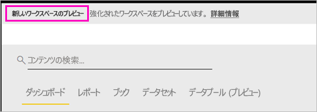
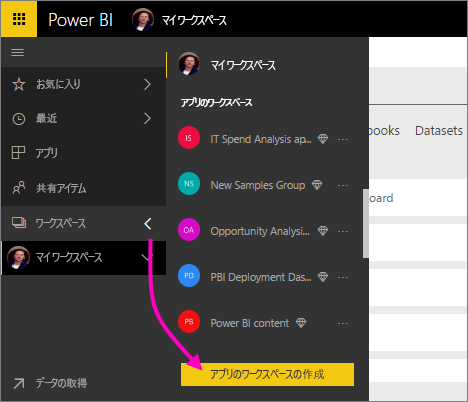
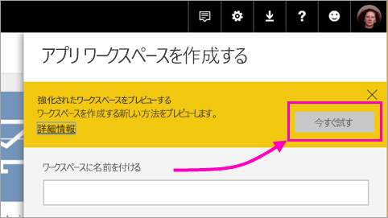
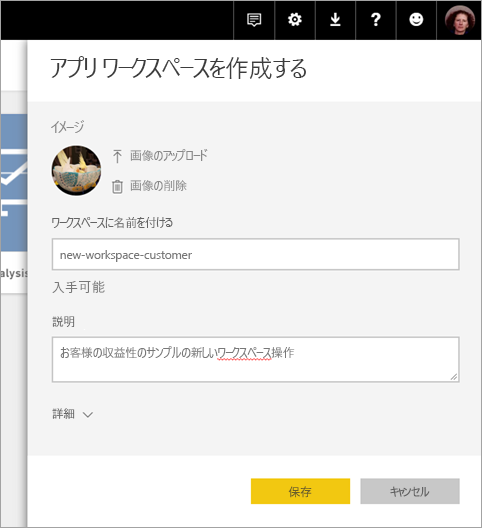
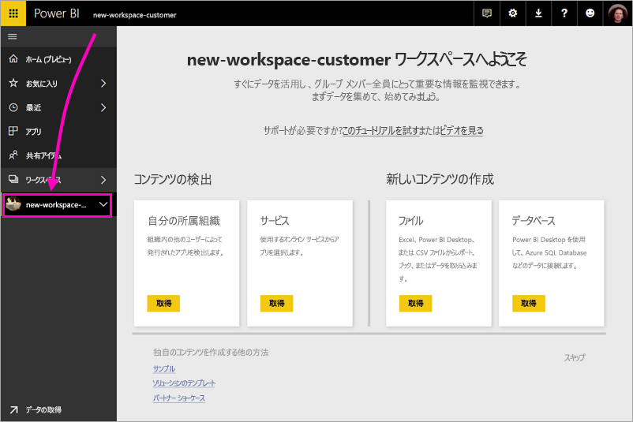
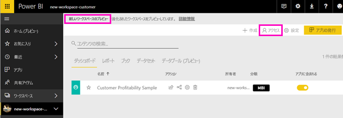
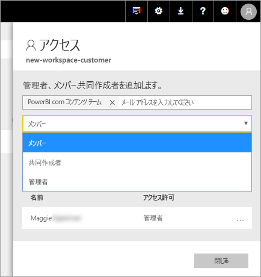
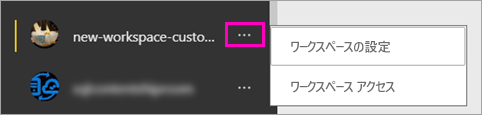

# Power BI で新しいワークスペース (プレビュー) を作成する

Power BI では、新しいワークスペース エクスペリエンスがプレビューとして導入されています。 ワークスペースは引き続き同僚と共同でダッシュボードとレポートのコレクションを作成するための場所であり、*アプリ* にバンドルし、所属する組織全体や特定のユーザーまたはグループに配布することができます。 

新しいワークスペース プレビューでは、次の作業を行うことができます。

- ワークスペース ロールをユーザー グループのセキュリティ グループ、配布リスト、Office 365 グループ、個人に割り当てる。
- Office 365 グループを作成せずに、Power BI でワークスペースを作成する。
- ワークスペースでより柔軟なアクセス許可の管理を行うために、より細分化されたワークスペース ロールを使用する。
 
新しいワークスペースのいずれかを作成するときに、基になる、関連する Office 365 グループは作成しません。 ワークスペースの管理はすべて Office 365 ではなく、Power BI で行われます。 引き続き Office 365 グループをワークスペースに追加し、Office 365 グループを介したコンテンツへのユーザー アクセスの管理を続行できます。 しかし、さらにセキュリティ グループや配布リストを使用することで、Power BI 内で直接個人を追加して、ワークスペースへのアクセスを柔軟に管理できます。 Power BI 内でワークスペースを管理するようになったため、組織内のだれがワークスペースを作成できるかは Power BI 管理者が決定します。 詳細については、[「Power BI 管理ポータル」のワークスペースに関するセクション](service-admin-portal.md#workspace-settings)をご覧ください。 

新しいワークスペースには、ユーザー グループや個人をメンバー、共同作成者、または管理者として追加します。 ユーザー グループのすべてのユーザーには、定義されたロールが与えられます。 個人が複数のユーザー グループ内に存在する場合は、ロールによって提供される最高レベルのアクセス許可が与えられます。  さまざまなロールの説明については、この記事の後述の「[新しいワークスペースのロール](#roles-in-the-new-workspaces)」を参照してください。

アプリ ワークスペースに追加するすべてのユーザーに、Power BI Pro のライセンスが必要となります。 ワークスペースでは、より広範な対象ユーザーや、場合によっては組織全体に発行する予定のダッシュボードやレポートで、これらすべてのユーザーが共同作業を行うことができます。 組織内部の他のユーザーにコンテンツを配布する場合は、Power BI Pro ライセンスをそのユーザーに割り当てるか、Power BI Premium 容量にワークスペースを配置することができます。

新しいワークスペースでは、一部の機能が再設計されています。 プレビューと永続的な変更の予定について詳しくは、この記事で後述する「[動作が異なるアプリ ワークスペースの機能](#app-workspace-features-that-work-differently)」をご覧ください。 これはプレビュー機能であるため、注意する必要がある制限がいくつかあります。 現在の制限事項の説明については、この記事で後述する「[既知の問題](#known-issues)」をご覧ください。 

## 新しいアプリ ワークスペースをロールアウトする

プレビュー期間中は、古いワークスペースと新しいワークスペースを並行して共存させることができ、いずれも作成可能です。 新しいワークスペースのプレビューが終了し、一般公開されるようになっても、古いワークスペースは当面は存在できます。 古いワークスペースは作成できなくなり、ご利用のワークスペースを新しいワークスペースのインフラストラクチャに移行する準備が必要になります。 移行が完了するまでは数か月かかるため、ご安心ください。

## 新しいアプリ ワークスペースのいずれかを作成する

1. まず、アプリ ワークスペースを作成します。 **[ワークスペース]**  > **[アプリのワークスペースの作成]** の順に選択します。
   
     

2. **[強化されたワークスペースをプレビューする]** で、**[今すぐ試す]** を選択します。
   
     

2. ワークスペースの名前を付けます。 名前が使用できない場合は、一意の ID になるように編集します。
   
     アプリの名前はワークスペース名と同じになります。
   
1. 必要に応じて、イメージを追加します。 ファイル サイズは 45 KB 未満にする必要があります。
 
    

1. **[保存]** を選択します。

    以下の新しいワークスペースの**ようこそ**画面で、データを追加することができます。 

    

1. たとえば、**[サンプル]** > **[お客様の収益性のサンプル]** の順に選択します。

    この時点で、ワークスペースのコンテンツ リストに、**[新しいワークスペースのプレビュー]** が表示されます。 管理者であるため、新しいアクションである **[アクセス]** も表示されます。

    

1. **[アクセス]** を選択します。

1. セキュリティ グループ、配布リスト、Office 365 グループ、または個人をメンバー、共同作成者、または管理者として、これらのワークスペースに追加します。 さまざまなロールの説明については、この記事の後述の「[新しいワークスペースのロール](#roles-in-the-new-workspaces)」を参照してください。

    

9. **[追加]** > **[閉じる]** の順に選択します。

1. Power BI でワークスペースが作成され、開きます。 メンバーであるワークスペースの一覧が表示されます。 管理者であるため、省略記号 (...) を選択して前の画面に戻り、新しいメンバーの追加やアクセス許可の変更など、ワークスペースの設定に変更を加えることができます。

     

## アプリ ワークスペースにコンテンツを追加する

新しい形式のアプリ ワークスペースを作成したら、次はコンテンツを追加します。 新しいスタイルのワークスペースと古いスタイルのワークスペースでのコンテンツの追加は似ていますが、1 つ例外があります。 いずれのアプリ ワークスペースでも、マイ ワークスペースの場合と同様に、ファイルのアップロードや接続が可能です。 新しいワークスペースでは、組織のコンテンツ パックや、Microsoft Dynamics CRM、Salesforce、Google Analytics などのサード パーティのコンテンツ パックに接続することはできません。 現在のワークスペースでは、コンテンツ パックに接続することができます。

アプリ ワークスペースのコンテンツ リストでコンテンツを表示すると、アプリ ワークスペースの名前が所有者としてリストされます。

### 新しいワークスペース (プレビュー) でのサード パーティ サービスへの接続

新しいワークスペース エクスペリエンスでは、アプリを重点的に変更が加えられています。 サード パーティ サービス用のアプリでは、ユーザーは Microsoft Dynamics CRM、Salesforce、Google Analytics など、使用するサービスからデータを簡単に取得することができます。
組織のアプリでは、ユーザーが必要とする内部データがそのユーザーに提供されます。 ユーザーがアプリ内で見つけたコンテンツをカスタマイズできるように、組織のアプリに機能を追加する予定です。 これにより、コンテンツ パックの必要性がなくなります。 

新しいワークスペース プレビューでは、組織のコンテンツ パックを作成したり、利用したりすることはできません。 代わりに、提供されるアプリを使用してサード パーティ サービスに接続するか、現在使用しているコンテンツ パック用のアプリを提供するように社内チームに依頼することができます。 

## 新しいワークスペースのロール

ロールを使用すれば、ワークスペースで誰が何を行うことができるかを管理できるため、チームでの共同作業が可能になります。 新しいワークスペースでは、ロールを個人、およびユーザー グループのセキュリティ グループ、Office 365 グループ、配布リストに割り当てることができます。 

ユーザー グループにロールを割り当てると、グループ内の個人がコンテンツにアクセスできるようになります。 ユーザー グループを入れ子にすると、含まれているすべてのユーザーにアクセス許可が付与されます。 さまざまなロールを持ついくつかのユーザー グループ内のユーザーには、最高レベルのアクセス許可が付与されます。 

新しいワークスペースでは、管理者、メンバー、共同作成者という 3 つのロールが提供されます。

**管理者は次のことを行うことができます。**

- ワークスペースの更新と削除。 
- 他の管理者を含む、ユーザーの追加と削除。
- メンバーが行うことができるすべての作業の実行。

**メンバーは次のことを行うことができます。** 

- メンバーやその他の下位のアクセス許可を持つユーザーの追加。
- アプリの発行と更新。
- アイテムの共有やアプリの共有。
- 他のユーザーに対するアイテムの再共有の許可。
- 共同作成者が行うことができるすべての作業の実行。

**共同作成者は次のことを行うことができます。** 

- ワークスペースでのコンテンツの作成、編集、削除。 
- ワークスペースへのレポートの公開と、コンテンツの削除。
- 新しいユーザーにコンテンツへのアクセスを許可することはできません。つまり、新しいコンテンツを共有することはできませんが、ワークスペース、アイテム、またはアプリを既に共有しているユーザーとは共有が可能です。 
- グループのメンバーを変更することはできません。
 
アクセス権のないユーザーが要求できるように、サービス全体のアクセス権の要求ワークフローを作成中です。 現在、ダッシュボード、レポート、アプリ用のアクセス権の要求ワークフローが存在します。

## アプリを配布する

コンテンツが用意できたら、公開するダッシュボードやレポートを選択し、それを*アプリ* として公開します。 各ワークスペースから 1 つのアプリを作成できます。 同僚はいくつかの異なる方法でアプリを取得することができます。 Power BI 管理者からアクセス許可が与えられている場合は、同僚の Power BI アカウントにアプリを自動的にインストールすることができます。 また、同僚はアプリを Microsoft AppSource で検索してインストールすることも、送信された直接リンクを使用することもできます。 更新プログラムは自動的に取得されます。データの更新頻度は制御することができます。 詳細については、「[Power BI でダッシュボードとレポートを含むアプリを発行する](service-create-distribute-apps.md)」を参照してください。

## 古いアプリ ワークスペースを新しいアプリ ワークスペースに変換する

プレビュー期間中は、古いアプリワークスペースを新しいものに自動的に変換することはできません。 しかし、新しいアプリ ワークスペースを作成して、ご自分のコンテンツを新しい場所に発行することはできます。 

新しいワークスペースが一般公開 (GA) された場合は、古いものを自動的に移行するよう選択できます。 GA 後のある時点で、移行する必要があります。

## Power BI アプリに関する FAQ

### 新しいアプリ ワークスペースと現在のアプリ ワークスペースの違いは何ですか?
* アプリ ワークスペースを作成しても、現在のアプリ ワークスペースのように Office 365 で対応するエンティティは作成されません  (ロールを割り当てることで、引き続き、ご利用のワークスペースに Office 365 グループを追加することはできます)。 
* 現在のアプリ ワークスペースでは、メンバーおよび管理者リストに追加できるのは個人のみです。 新しいアプリ ワークスペースでは、ユーザーが管理しやすいように、複数の AD セキュリティ グループ、配布リスト、Office 365 グループをこれらのリストに追加することができます。 
- 現在のアプリ ワークスペースから組織のコンテンツ パックを作成することができます。 新しいアプリ ワークスペースからは作成できません。
- 現在のアプリ ワークスペースから組織のコンテンツ パックを利用することができます。 新しいアプリ ワークスペースからは利用できません。
- プレビュー期間中は、新しいアプリ ワークスペース用の一部の機能がまだ有効になっていません。 詳細については、[その他の、予定されている新しいアプリ ワークスペース プレビューの機能](service-create-the-new-workspaces.md#other-planned-new-app-workspace-preview-features)に関する次のセクションを参照してください。

## 予定されている新しいアプリ ワークスペース プレビューの機能

他のいくつかの新しいアプリ ワークスペース プレビューの機能も開発中ですが、プレビューであるため、まだ利用できません。

- **[ワークスペースからの脱退]** ボタンはありません。
- 利用状況の指標はまだサポートされていません。
- Premium のしくみ: Premium 容量でのワークスペースの割り当てや作成は可能ですが、容量間でワークスペースを移動する場合は、ワークスペースの設定に移動します。
- SharePoint Web パーツの埋め込みはまだサポートされていません。
- [データを取得] や [ファイルの取得] に Office 365 グループに対応する **[OneDrive]** ボタンはありません。

## 動作が異なるアプリ ワークスペースの機能

新しいアプリ ワークスペースの一部の機能の動作は、現在のアプリ ワークスペースとは異なります。 このような違いは、お客様からのフィードバックに基づく意図的なものであり、ワークスペースでの共同作業をより柔軟にするためのものです。

- メンバーが再共有できる、またはできない: 共同作成者ロールに置き換えられます。
- 読み取り専用ワークスペース: ユーザーにワークスペースへの読み取り専用アクセスを許可する代わりに、近日公開予定のビューアー ロールにユーザーを割り当てます。これにより、ワークスペースのコンテンツに対する同様の読み取り専用アクセス権が許可されます。

## 既知の問題

次のような既知の問題があり、修正プログラムが開発中です。

- メールにサブスクリプションの受信者として追加された無料ユーザーやユーザー グループが、受信できるはずのメールを受信できない場合があります。 新しいワークスペース エクスペリエンスが Premium 容量にあるものの、サブスクリプションを作成するユーザーのマイ ワークスペースが Premium 容量にない場合に、この問題が発生します。 マイ ワークスペースが Premium 容量にある場合、無料ユーザーおよびユーザー グループはメールを受信します。
- ワークスペースが Premium 容量から共有容量に移動された後、場合によっては、無料ユーザーおよびユーザー グループが受信できないはずのメールを引き続き受信します。 サブスクリプションを作成するユーザーのマイ ワークスペースが Premium 容量にある場合に、この問題が発生します。

## 次の手順

- [現在のワークスペースを作成する](service-create-workspaces.md)
* [Power BI にアプリをインストールし、使用する](service-install-use-apps.md)
* わからないことがある場合は、 [Power BI コミュニティで質問してみてください](http://community.powerbi.com/)。
