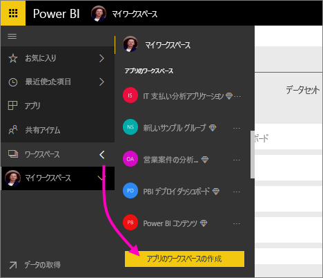
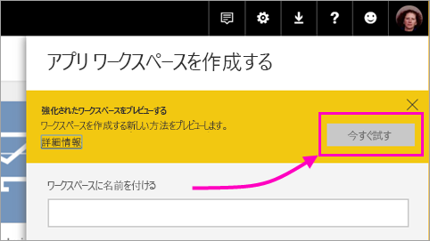
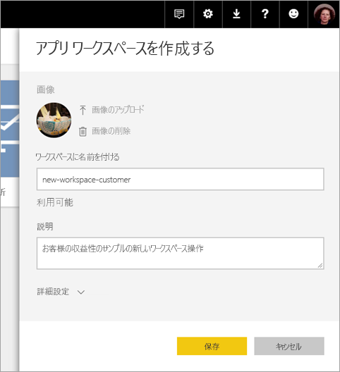
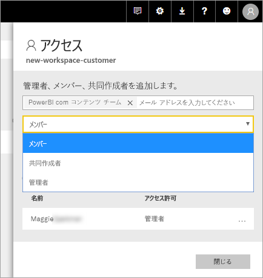
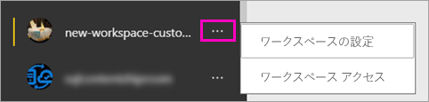

# Power BI で新しいワークスペース (プレビュー) を作成する

Power BI では、新しいワークスペース エクスペリエンスがプレビューとして導入されています。 ワークスペースは引き続き同僚と共同でダッシュボードとレポートのコレクションを作成するための場所であり、*アプリ* にバンドルし、所属する組織全体や特定のユーザーまたはグループに配布することができます。 

新しいワークスペース プレビューでは、次の作業を行うことができます。

- ワークスペース ロールをユーザー グループのセキュリティ グループ、配布リスト、Office 365 グループ、個人に割り当てる。
- Office 365 グループを作成せずに、Power BI でワークスペースを作成する。
- ワークスペースでより柔軟なアクセス許可の管理を行うために、より細分化されたワークスペース ロールを使用する。

詳細については、[新しいワークスペース (プレビュー)](service-new-workspaces.md) に関する記事を参照してください。

## 新しいアプリ ワークスペースのいずれかを作成する

1. まず、アプリ ワークスペースを作成します。 **[ワークスペース]**  > **[アプリのワークスペースの作成]** の順に選択します。
   
     

2. **[強化されたワークスペースをプレビューする]** で、**[今すぐ試す]** を選択します。
   
     

2. ワークスペースの名前を付けます。 名前が使用できない場合は、一意の ID になるように編集します。
   
     アプリの名前はワークスペース名と同じになります。
   
1. 必要に応じて、イメージを追加します。 ファイル サイズは 45 KB 未満にする必要があります。
 
    

1. **[保存]** を選択します。

    以下の新しいワークスペースの**ようこそ**画面で、データを追加することができます。 

    

1. たとえば、**[サンプル]** > **[お客様の収益性のサンプル]** の順に選択します。

    この時点で、ワークスペースのコンテンツ リストに、**[新しいワークスペースのプレビュー]** が表示されます。 管理者であるため、新しいアクションである **[アクセス]** も表示されます。

    

1. **[アクセス]** を選択します。

1. セキュリティ グループ、配布リスト、Office 365 グループ、または個人をメンバー、共同作成者、または管理者として、これらのワークスペースに追加します。 さまざまなロールの説明については、「[新しいワークスペースのロール](service-new-workspaces.md#roles-in-the-new-workspaces)」を参照してください。

    

9. **[追加]** > **[閉じる]** の順に選択します。

1. Power BI でワークスペースが作成され、開きます。 自分が所属するワークスペースの一覧が表示されます。 管理者であるため、省略記号 (...) を選択して前の画面に戻り、新しいメンバーの追加やアクセス許可の変更など、ワークスペースの設定に変更を加えることができます。

     

## アプリ ワークスペースにコンテンツを追加する

新しい形式のアプリ ワークスペースを作成したら、次はコンテンツを追加します。 新しいスタイルのワークスペースと古いスタイルのワークスペースでのコンテンツの追加は似ていますが、1 つ例外があります。 いずれのアプリ ワークスペースでも、マイ ワークスペースの場合と同様に、ファイルのアップロードや接続が可能です。 新しいワークスペースでは、組織のコンテンツ パックや、Microsoft Dynamics CRM、Salesforce、Google Analytics などのサード パーティのコンテンツ パックに接続することはできません。 現在のワークスペースでは、コンテンツ パックに接続することができます。

アプリ ワークスペースのコンテンツ リストでコンテンツを表示すると、アプリ ワークスペースの名前が所有者としてリストされます。

### 新しいワークスペース (プレビュー) でのサード パーティ サービスへの接続

新しいワークスペース エクスペリエンスでは、*アプリ*を重点的に変更が加えられています。 サード パーティ サービス用のアプリでは、ユーザーは Microsoft Dynamics CRM、Salesforce、Google Analytics など、使用するサービスからデータを簡単に取得することができます。
組織のアプリでは、ユーザーが必要とする内部データがそのユーザーに提供されます。 ユーザーがアプリ内で見つけたコンテンツをカスタマイズできるように、組織のアプリに機能を追加する予定です。 この機能により、コンテンツ パックの必要性がなくなります。 

新しいワークスペース プレビューでは、組織のコンテンツ パックを作成したり、利用したりすることはできません。 代わりに、提供されるアプリを使用してサード パーティ サービスに接続するか、現在使用しているコンテンツ パック用のアプリを提供するように社内チームに依頼することができます。 

## アプリを配布する

コンテンツが用意できたら、公開するダッシュボードやレポートを選択し、それを*アプリ* として公開します。 各ワークスペースから 1 つのアプリを作成できます。 同僚はいくつかの異なる方法でアプリを取得することができます。 Power BI 管理者からアクセス許可が与えられている場合は、同僚の Power BI アカウントにアプリを自動的にインストールすることができます。 また、同僚はアプリを Microsoft AppSource で検索してインストールすることも、送信された直接リンクを使用することもできます。 更新プログラムは自動的に取得されます。データの更新頻度は制御することができます。 詳細については、「[Power BI でダッシュボードとレポートを含むアプリを発行する](service-create-distribute-apps.md)」を参照してください。

## 古いアプリ ワークスペースを新しいアプリ ワークスペースに変換する

プレビュー期間中は、古いアプリワークスペースを新しいものに自動的に変換することはできません。 しかし、新しいアプリ ワークスペースを作成して、ご自分のコンテンツを新しい場所に発行することはできます。 

新しいワークスペースが一般公開 (GA) された場合は、古いものを自動的に移行するよう選択できます。 GA 後のある時点で、移行する必要があります。

## 次の手順
* 「[Power BI で、新しいワークスペースで作業を整理する (プレビュー)](service-new-workspaces.md)」を参照してください
* [現在のワークスペースを作成する](service-create-workspaces.md)
* [Power BI にアプリをインストールし、使用する](service-create-distribute-apps.md)
* わからないことがある場合は、 [Power BI コミュニティで質問してみてください](http://community.powerbi.com/)。
