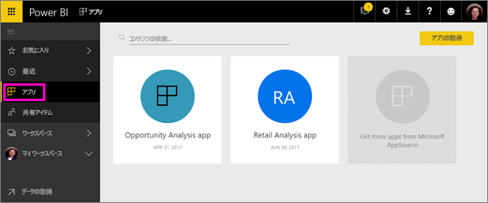

# Power BI で同僚と一緒にワークスペースを作成する

Power BI では、*ワークスペース*を作成することができます。このワークスペースは、同僚と共同でダッシュボードとレポートのコレクションを作成して調整するための場所です。 その後、それらをまとめて*アプリ* にバンドルできます。これにより、所属の組織全体や特定のユーザーまたはグループに配布することができます。 

ワークスペースを作成するときに、基になる、関連する Office 365 グループを作成します。 ワークスペースの管理はすべて Office 365 で行われます。 こうしたワークスペースには、メンバーまたは管理者として、同僚を追加することができます。 ワークスペースでは、より広範な対象ユーザーに発行する予定のダッシュボード、レポート、およびその他の記事で、全員が共同作業を行うことできます。 アプリ ワークスペースに追加するすべてのユーザーに、Power BI Pro のライセンスが必要となります。 

**ご存知でしたか?**  Power BI では、新しいワークスペース エクスペリエンスをプレビューしています。 今後、ワークスペースがどのように変更されるかについては、「[新しいワークスペース (プレビュー) を作成する](service-create-the-new-workspaces.md)」を参照してください。 

## ビデオ: アプリとアプリ ワークスペース
<iframe width="640" height="360" src="https://www.youtube.com/embed/Ey5pyrr7Lk8?showinfo=0" frameborder="0" allowfullscreen></iframe>

## Office 365 グループに基づいてアプリ ワークスペースを作成する

アプリ ワークスペースは Office 365 グループを基に作成します。

[!INCLUDE [powerbi-service-create-app-workspace](./includes/powerbi-service-create-app-workspace.md)]

最初に作成するとき、場合によっては、ワークスペースが Office 365 に反映されるまで 1 時間程度待つ必要があります。 

### Office 365 アプリ ワークスペースにイメージを追加する (省略可能)
既定では、Power BI は、アプリの頭文字を使用した色付きの小さな丸をアプリに作成します。 しかし、画像でカスタマイズする必要があるかもしれません。 画像を追加するには、Exchange Online ライセンスが必要です。

1. **[ワークスペース]** を選択し、ワークスペースの名前の横にある省略記号 (...) を選択して、**[メンバー]** を選択します。 
   
     
   
    ワークスペースの Office 365 Outlook アカウントが、新しいブラウザー ウィンドウで開きます。
2. 左上の色付きの丸にマウスを置くと、鉛筆のアイコンに変わります。 その質問を選択します。
   
     
3. 鉛筆のアイコンを再度選択し、使用する画像を検索します。
   
     

4. **[保存]** を選択します。
   
     ![[保存] を選択する](media/service-create-distribute-apps/power-bi-apps-workspace-save-image.png)
   
    Office 365 Outlook のウィンドウで、色付きの丸がその画像に置き換えられます。 
   
     
   
    数分後に、Power BI のアプリでも画像が表示されます。
   
     

## アプリ ワークスペースにコンテンツを追加する

アプリ ワークスペースを作成したら、次はコンテンツを追加します。 これはマイ ワークスペースにコンテンツを追加する場合と似ていますが、ワークスペース内の他のユーザーが表示だけでなく編集もできる点が異なります。 大きな違いは、作業が完了したら、アプリとしてコンテンツを発行できることです。 アプリ ワークスペースのコンテンツ リストでコンテンツを表示すると、アプリ ワークスペースの名前が所有者としてリストされます。

### アプリ ワークスペースでサード パーティ サービスに接続する

Power BI でサポートされるすべてのサード パーティ サービスに対してアプリが提供されます。これにより、Microsoft Dynamics CRM、Salesforce、Google Analytics などの使用するサービスからデータを簡単に取得することができます。 組織のアプリを発行して、ユーザーが必要とするデータをそのユーザーに提供することができます。

現在のワークスペースでは、組織のコンテンツ パックと、Microsoft Dynamics CRM、Salesforce、Google Analytics などのサード パーティのコンテンツ パックを使用して接続することもできます。 組織のコンテンツ パックをアプリに移行することを検討してください。

## アプリを配布する

コンテンツが用意できたら、公開するダッシュボードやレポートを選択し、それを*アプリ* として公開します。 同僚はいくつかの異なる方法でアプリを取得することができます。 Power BI 管理者からアクセス許可が与えられている場合は、同僚の Power BI アカウントにアプリを自動的にインストールすることができます。 また、同僚はアプリを Microsoft AppSource で検索してインストールすることも、送信された直接リンクを使用することもできます。 更新プログラムは自動的に取得されます。データの更新頻度は制御することができます。 詳細については、「[Power BI でダッシュボードとレポートを含むアプリを発行する](consumer/end-user-create-apps.md)」を参照してください。

## Power BI アプリに関する FAQ

### アプリと組織のコンテンツ パックとの違いは何ですか?
アプリは、組織のコンテンツ パックが進化したものです。 組織のコンテンツ パックが既にある場合は、アプリと並行して使用することになります。 アプリとコンテンツ パックには、大きな違いがいくつかあります。 

* ビジネス ユーザーがコンテンツ パックをインストールすると、グループ化された ID が失われ、他のダッシュボードやレポートと混在した単なるダッシュボードとレポートの一覧になります。 一方、アプリではインストール後もグループ化および ID が維持されます。 このため、ビジネス ユーザーは時間が経っても簡単にアクセスすることができます。
* 任意のワークスペースから複数のコンテンツ パックを作成できますが、アプリとそのワークスペースの間には 1 対 1 の関係があります。 
* 将来的には、組織のコンテンツ パックは廃止される予定のため、今後はアプリを作成することをお勧めします。  
* 新しいワークスペース エクスペリエンス プレビューの提供は、組織のコンテンツ パックの廃止への第一歩となります。 組織のコンテンツ パックをプレビュー ワークスペースで利用したり、作成したりすることはできません。

「[How are the new app workspaces different from existing app workspaces?](service-create-the-new-workspaces.md#how-are-the-new-app-workspaces-different-from-current-app-workspaces)」(新しいアプリ ワークスペースと現在のアプリ ワークスペースの違いは何ですか?) を参照して、現在のアプリ ワークスペースと新しいアプリ ワークスペースを比較してください。 

## 次の手順
* [Power BI にアプリをインストールし、使用する](consumer/end-user-apps.md)
* [外部サービス用の Power BI アプリ](consumer/end-user-connect-to-services.md)
- [新しいワークスペース (プレビュー) を作成する](service-create-the-new-workspaces.md)
* わからないことがある場合は、 [Power BI コミュニティで質問してみてください](http://community.powerbi.com/)。
