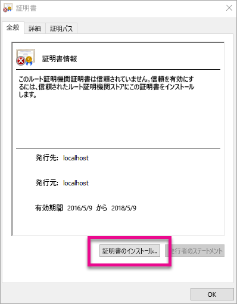
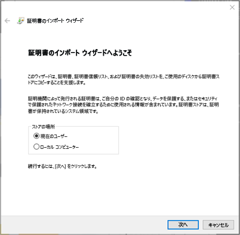
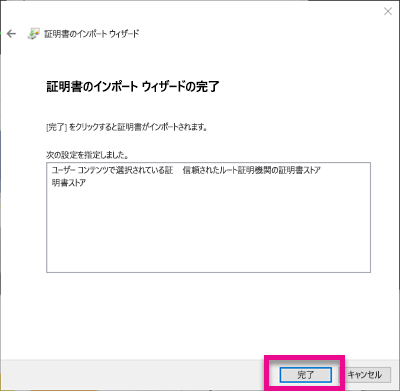
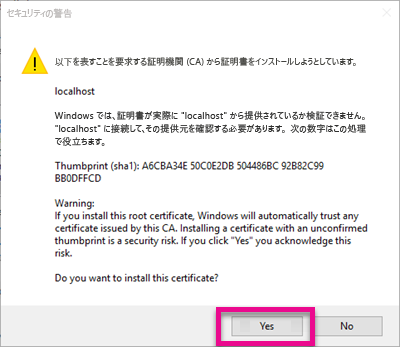
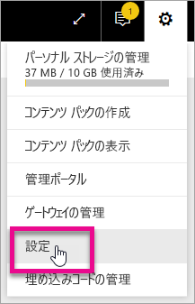
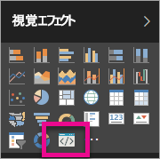

# <a name="use-developer-tools-to-create-custom-visuals"></a>開発者ツールを使ってカスタム ビジュアルを作成する
カスタム ビジュアルの作成では、ユーザーのニーズを満たすと共に、アプリのデザインに合わせることができます。 ここでは、開発者ツールを使用して、Power BI 用のカスタム ビジュアルを作成する方法について説明します。

> [!NOTE]
> このドキュメントを使用すると、起動して実行できるようになります。 詳細については、「[Power BI Visuals git repo](https://github.com/Microsoft/PowerBI-visuals)」 (Power BI ビジュアル Git リポジトリ) にあるリファレンス情報を参照してください。
> 
> 

## <a name="requirements"></a>要件
* NodeJS 4.0 が必要です (5.0 以降を推奨します)。[NodeJS のダウンロード](https://nodejs.org)

## <a name="install-nodejs-and-the-power-bi-tools"></a>NodeJS および Power BI ツールをインストールする
カスタム ビジュアルを作成するには、NodeJS をインストールする必要があります。 コマンド ライン ツールを実行するために NodeJS が必須となります。

1. [NodeJS](https://nodejs.org) をダウンロードしてインストールします。 要件はバージョン 4.0 以降ですが、バージョン 5.0 以降の使用をお勧めします。
2. コマンド ライン ツールをインストールします。 コマンド プロンプトから次のコマンドを実行します。
   
        npm install -g powerbi-visuals-tools
3. このツールがインストールされていることを確認するには、パラメーターを指定せずに次のコマンドを実行します。
   
        pbiviz
   
    ヘルプの出力が表示されます。
   
    <pre><code>
         +syyso+/
    oms/+osyhdhyso/
    ym/       /+oshddhys+/
    ym/              /+oyhddhyo+/
    ym/                     /osyhdho
    ym/                           sm+
    ym/               yddy        om+
    ym/         shho /mmmm/       om+
     /    oys/ +mmmm /mmmm/       om+
    oso  ommmh +mmmm /mmmm/       om+
   ymmmy smmmh +mmmm /mmmm/       om+
   ymmmy smmmh +mmmm /mmmm/       om+
   ymmmy smmmh +mmmm /mmmm/       om+
   +dmd+ smmmh +mmmm /mmmm/       om+
         /hmdo +mmmm /mmmm/ /so+//ym/
               /dmmh /mmmm/ /osyhhy/
                 //   dmmd
                       ++
   
       PowerBI Custom Visual Tool
   
    Usage: pbiviz [options] [command]
   
    Commands:
   
    new [name]        Create a new visual
    info              Display info about the current visual
    start             Start the current visual
    package           Package the current visual into a pbiviz file
    update [version]  Updates the api definitions and schemas in the current visual. Changes the version if specified
    help [cmd]        display help for [cmd]
   
    Options:
   
    -h, --help      output usage information
    -V, --version   output the version number
    --install-cert  Install localhost certificate
    </code></pre>

<a name"ssl-setup"></a>

### <a name="server-certificate-setup"></a>サーバー証明書のセットアップ
ビジュアルのライブ プレビューを有効にするには、信頼されている https サーバーが必要です。 開始の前に SSL 証明書をインストールする必要があります。これにより、ビジュアル アセットを Web ブラウザーに読み込むことができるようになります。 

> [!NOTE]
> これは、開発者のワークステーションでの 1 回限りのセットアップです。
> 
> 

証明書を*追加*するには、次のコマンドを実行します。

    pbiviz --install-cert

**Windows OS**

1. **[証明書のインストール]** を選択します。
   
    
2. **[現在のユーザー]** を選択し、**[次へ]** をクリックします。
   
    
3. **[証明書をすべて次のストアに配置する]** を選択し、**[参照]** を選択します。
4. **[信頼されたルート証明機関]** を選択し、**[OK]** を選択します。 **[次へ]**を選びます。
   
    
5. **[完了]**を選びます。
   
    
6. セキュリティの警告ダイアログ ボックスで、**[はい]** を選択します。
   
    
7. 開いているブラウザーをすべて閉じます。

> [!NOTE]
> 証明書が認識されない場合は、コンピューターの再起動が必要である可能性があります。
> 
> 

**OSX**

1. 左上の鍵がロックされている場合は、鍵を選択してロックを解除します。 *localhost* を検索し、証明書をダブルクリックします。
   
    
2. **[Always Trust]** \(常に信頼する) を選択して、ウィンドウを閉じます。
   
    
3. ユーザー名とパスワードを入力します。 **[Update Settings]** \(設定の更新) を選択します。
   
    
4. 開いているブラウザーをすべて閉じます。

> [!NOTE]
> 証明書が認識されない場合は、コンピューターの再起動が必要である可能性があります。
> 
> 

## <a name="enable-live-preview-of-developer-visual"></a>開発者向けビジュアルのライブ プレビューを有効にする
カスタム ビジュアルのライブ プレビューを有効にするには、以下の手順を実行します。 有効にすると、レポートの編集時に Powerur BI サービス内でビジュアルを使用できます。

1. [app.powerbi.com](https://app.powerbi.com) を参照し、サインインします。
2. **歯車アイコン** を選択し、**[設定]** を選択します。
   
    
3. **[開発者]** を選択し、**[テスト用の開発者向けビジュアルを有効にする]** を選択します。
   
    
4. **[視覚化]** ウィンドウで **[開発者向けビジュアル]** を選択します。
   
    
   
   > [!NOTE]
   > この操作を行うには、開発用コンピューター上のビジュアル フォルダーから `pbiviz start` を実行しておく必要があります。 ビジュアルの作成方法の詳細については、この記事の「[新しいビジュアルを作成する](#create-a-new-visual)」をご覧ください。
   > 
   > 
5. レポート キャンバスで、ビジュアルを選択します。 他のビジュアルの場合と同じ方法でデータをバインドすることができます。

これでビジュアルの開発を始めることができます。

## <a name="create-a-new-visual"></a>新しいビジュアルを作成する
新しいビジュアル プロジェクトを作成するには、次のコマンドを実行します。

```
pbiviz new My Visual name
```

*My Visual Name* を、ビジュアルに付けたい名前に置き換えることができます。 この名前は後で変更することができます。その場合は、生成された `pbiviz.json``name` フィールドと `displayName` フィールドを変更します。

このコマンドにより、コマンドが実行されたディレクトリ内に新しいフォルダーが作成されます。 ビジュアル用の基本的なスターター テンプレートも生成されます。 コマンドが完了したら、ディレクトリを開き、使い慣れたエディターを使用して、新しいビジュアルでの作業を開始することができます。

## <a name="testing-your-visual-in-power-bi"></a>Power BI でビジュアルをテストする
Power BI サービスではレポートおよびダッシュ ボード内で、ビジュアルをテストすることができます。

<a name="running-your-visual"></a>

### <a name="running-your-visual"></a>ビジュアルを実行する
ビジュアルを実行するには、次の手順に従います。

1. プロンプトを開きます。
2. ディレクトリを目的のビジュアル フォルダーに切り替えます。 このフォルダーは、`pbiviz.json` ファイルを含むフォルダーです。
3. 次のコマンドを実行します。
   
    ```
    pbiviz start
    ```
   
    

間違った場所から実行すると、次のようなエラーが表示されます。

```
    error  LOAD ERROR Error: pbiviz.json not found. You must be in the root of a visual project to run this command.
        at e (C:\Users\[user]\AppData\Roaming\npm\node_modules\powerbi-visuals-tools\lib\VisualPackage.js:67:35)
        at Function.loadVisualPackage (C:\Users\[user]\AppData\Roaming\npm\node_modules\powerbi-visuals-tools\lib\VisualPackage.js:62:16)
        at Object.<anonymous> (C:\Users\[user]\AppData\Roaming\npm\node_modules\powerbi-visuals-tools\bin\pbiviz-start.js:43:15)
        at Module._compile (module.js:556:32)
        at Object.Module._extensions..js (module.js:565:10)
        at Module.load (module.js:473:32)
        at tryModuleLoad (module.js:432:12)
        at Function.Module._load (module.js:424:3)
        at Module.runMain (module.js:590:10)
        at run (bootstrap_node.js:394:7)
```

### <a name="viewing-your-visual-in-power-bi"></a>Power BI でビジュアルを表示する
レポート内にビジュアルを表示するには、該当するレポートに移動し、**[視覚化]** ウィンドウでビジュアルを選択します。

> [!NOTE]
> この操作を行うには、「[ビジュアルを実行する](#running-your-visual)」セクションの手順に従って `pbiviz start` コマンドを事前に実行しておく必要があります。
> 
> 


ビジュアル用のスターター テンプレートが表示されます。


| ツールバーの項目 | 説明 |
| --- | --- |
| Refresh visual (ビジュアルの更新) |自動再読み込みが無効になっている場合は、ビジュアルを手動で更新します。 |
| 自動再読み込みの切り替え |オンにすると、ビジュアル ファイルを保存するたびに、ビジュアルが自動的に更新されます。 |
| Dataview の表示 |デバッグ用にビジュアルの基になるデータ ビューを示します。 |
| ヘルプを取得 |GitHub 内のドキュメントです。 |
| フィードバックの送信 |パフォーマンス向上のためにご意見がありましたらお寄せください。 (GitHub アカウントが必要) |

## <a name="package-your-visual-for-use-in-power-bi-desktop-and-distribution"></a>Power BI Desktop での使用および配布に備えてビジュアルをパッケージ化する
ビジュアルを [Power BI Desktop](https://powerbi.microsoft.com/desktop/) に読み込む場合、またはビジュアルを [Power BI ビジュアル ギャラリー](https://visuals.powerbi.com)でコミュニティと共有する場合は、あらかじめ `pbiviz` ファイルを生成しておく必要があります。

ビジュアルをパッケージ化するには、次の手順に従います。

1. プロンプトを開きます。
2. ディレクトリを目的のビジュアル フォルダーに切り替えます。 このフォルダーは、`pbiviz.json` ファイルを含むフォルダーです。
3. 次のコマンドを実行します。
   
    ```
    pbiviz package
    ```

このコマンドは、ビジュアル プロジェクトの `dist/` ディレクトリに `pbiviz` を作成します。 `pbiviz` ファイルが既に存在している場合、そのファイルは上書きされます。

## <a name="updating-the-visuals-api-version"></a>ビジュアル API バージョンを更新する
`pbiviz new` を使用してビジュアルを作成すると、適切な API の種類の定義と json スキーマのコピーがビジュアルのディレクトリにコピーされます。 `pbiviz update` コマンドを使用すれば、これらのファイルを必要に応じて更新することができます。 この機能は、Microsoft が過去の API バージョンの修正プログラムをリリースする場合、またはユーザーが最新の API バージョンに更新する場合に便利です。

### <a name="updating-your-existing-api-version"></a>既存の API バージョンを更新する
Microsoft が既存の API に対して更新プログラムをリリースした場合、ユーザーが最新バージョンを取得するには次の手順を実行します。

```
#Update your version of pbiviz
npm install -g powerbi-visuals-tools

#Run update from the root of your visual project, where pbiviz.json is located
pbiviz update
```

これにより、更新された種類の定義とスキーマを含む npm から最新のツールがダウンロードされます。 `pbiviz update` を使用すると、 *pbiviz.json* ファイル内の `apiVersion` プロパティが最新のバージョンで上書きされます。

### <a name="upgrading-to-a-different-api-version"></a>別の API バージョンにアップグレードする
上記の場合と同じ手順を使用して、別の API バージョンに更新することができます。 使用する API バージョンを明示的に指定することができます。

```
#Update your version of pbiviz
npm install -g powerbi-visuals-tools

#Run update from the root of your visual project, where pbiviz.json is located
pbiviz update 1.2.0
```

この場合、ビジュアルは API バージョン 1.2.0 に更新されます。 `1.2.0` は、希望するどのバージョンとも置き換えることができます。

> [!WARNING]
> ツールでは常に、安定した API バージョンが既定の API バージョンとして使用されます。 既定の API バージョンより前のバージョンは安定性がなく、変更される可能性があります。 また、予期しない動作をしたり、Power BI サービスと Power BI Desktop とで動作が異なる場合があります。 現在の安定した API バージョンについては、[変更ログ](https://github.com/Microsoft/PowerBI-visuals/blob/master/ChangeLog.md)を参照してください。 プレリリース バージョンの詳細については、[ロードマップ](https://github.com/Microsoft/PowerBI-visuals/blob/master/Roadmap/README.md)を参照してください。
> 
> 

## <a name="inside-the-visual-project"></a>ビジュアル プロジェクトの内部
ビジュアル プロジェクトは、`pbiviz new` コマンドを実行したときに作成されるフォルダーです。 

### <a name="file-structure"></a>ファイルの構造
| 項目 | 説明 |
| --- | --- |
| assets/ |ビジュアル資産 (アイコンやスクリーン ショットなど) を格納するために使用します。 |
| dist/ |`pbiviz package` を実行すると、この場所に pbiviz ファイルが生成されます。 |
| src/ |ビジュアルの TypeScript コードです。 |
| style/ |ビジュアルの Less スタイルです。 |
| .gitignore |リポジトリ内の追跡する必要がないファイルを無視するように Git に指示します。 |
| capabilities.json |ビジュアルの[機能](https://github.com/Microsoft/PowerBI-visuals/blob/master/Capabilities/Capabilities.md)を定義するために使用されます。 |
| package.json |モジュールを管理するために [npm](https://www.npmjs.com/) によって使用されます。 |
| pbiviz.json |主要な構成ファイルです。 |
| tsconfig.json |TypeScript コンパイラの設定です。 tsconfig.json の詳細については、[こちら](https://www.typescriptlang.org/docs/handbook/tsconfig-json.html)を参照してください。 |

### <a name="pbivizjson"></a>pbiviz.json
このファイルは、ビジュアルの主要な構成ファイルです。 ビジュアルを構築するのに必要な情報として、メタデータとファイルに関する情報が含まれています。

```
{
    "visual": {
        "name": "myVisual", // internal visual name (should not contain spaces)
        "displayName": "My Visual!", // visual name displayed to user (used in gallery)
        "guid": "PBI_CV_xxxxxxx", // a unique id for this visual MUST BE UNIQUE
        "visualClassName": "Visual" // the entry class for your visual
        "version": "1.0.0", // visual version. Should be semantic version (increment if you update the visual)
        "description": "", // description used in gallery
        "supportUrl": "", // url to where users can get support for this visual
        "gitHubUrl": "" // url to the source in github (if applicable)
    },
    "apiVersion": "1.0.0", //API version this visual was created with
    "author": {
        "name": "", // your name
        "email": "" // your e-mail
    },
    "assets": {
        "icon": "assets/icon.png" // relative path to your icon file (20x20 png)
    },
    "style": "style/visual.less", // relative path to your less file
    "capabilities": "capabilities.json" // relative path to your capabilities definition 
}
```

### <a name="visual-source-typescript"></a>ビジュアルのソース (TypeScript)
ビジュアル コードは TypeScript で記述する必要があります。TypeScript は JavaScript のスーパー セットであり、高度な機能をサポートすると共に ES6/ES7 機能への早期アクセスに対応します。

すべての TypeScript ファイルを `src/` ディレクトリに格納し、`tsconfig.json` の `files` 配列に追加する必要があります。 これにより、TypeScript コンパイラはそれらを任意の順序で読み込むことができます。

ビジュアルがビルドされると、すべての TypeScript ファイルが 1 つの JavaScript ファイルにコンパイルされます。 これにより、他のファイルからエクスポートされた要素は、両方のファイルが tsconfig 内にリストされていれば、手動でそれらを `require` しなくても、参照することができます。

ビジュアルを作成するのに必要な数だけファイルとクラスを作成することができます。

TypeScript の詳細については、[こちら](http://www.typescriptlang.org/)を参照してください。

### <a name="visual-style-less"></a>ビジュアル スタイル (Less)
ビジュアルのスタイル設定は、カスケード スタイル シート (CSS) を使用して処理されます。 わかりやすくするために、入れ子、変数、mixin、条件、ループなどの高度な機能をサポートする Less プリコンパイラを使用します。これらの機能を使用しない場合は、Less ファイル内にプレーンな CSS だけを記述します。

Less ファイルはすべて `style/` ディレクトリに保存します。 `pbiviz.json`ファイル内の `style` フィールドに指定されているファイルが読み込まれます。 追加のファイルを読み込むには、`@import` を使用します。

Less の詳細については、[こちら](http://lesscss.org/)を参照してください。

## <a name="debugging"></a>デバッグ
カスタム ビジュアルのデバッグに関するヒントについては、[デバッグ ガイド](https://github.com/Microsoft/PowerBI-visuals/blob/master/tools/debugging.md)を参照してください。

## <a name="submit-your-visual-to-the-office-store"></a>ビジュアルを Office ストアに送信する
ビジュアルを Office ストアに置くことができます。 このプロセスについて詳しくは、「[カスタム ビジュアルを Office ストアに発行する](developer/office-store.md)」をご覧ください。

## <a name="troubleshooting"></a>トラブルシューティング
**Pbiviz コマンドが見つかりません (または類似のエラー)**

ターミナル/コマンド ラインで `pbiviz` を実行する場合は、ヘルプ画面を表示する必要があります。 ヘルプ画面が表示されない場合、コマンドは正しくインストールされていません。 バージョン 4.0 以降の NodeJS がインストールされていることを確認します。

詳細については、「[NodeJS および Power BI ツールをインストールする](#install-nodejs-and-the-power-bi-tools)」を参照してください。

**[視覚化] タブで "ビジュアルのデバッグ" が見つかりません**

"ビジュアルのデバッグ" は、**[視覚化]** タブ内でプロンプト アイコンのように表示されます。


表示されない場合は、Power BI の設定内で有効にされていることを確認してください。 

> [!NOTE]
> ビジュアルのデバッグ機能は、現時点では、Power BI サービスでのみ使用可能で、Power BI Desktop とモバイル アプリでは使用できません。 パッケージ化したビジュアルはあらゆる場所で機能します。
> 
> 

詳細については、「[開発者向けビジュアルのライブ プレビューを有効にする](#enable-live-preview-of-developer-visual)」を参照してください。

**ビジュアル サーバーに接続できません**

ビジュアル プロジェクトのルートから、ターミナル/コマンド ラインで `pbiviz start`コマンドを使用してビジュアル サーバーを実行します。 サーバーが動作する場合、SSL 証明書が正しくインストールされていない可能性があります。

詳細については、「[ビジュアルを実行する](#running-your-visual)」または「[サーバー証明書のセットアップ](#ssl-setup)」を参照してください。

## <a name="next-steps"></a>次の手順
[Power BI での視覚化](power-bi-report-visualizations.md)  
[Power BI でのカスタム ビジュアル](power-bi-custom-visuals.md)  
[カスタム ビジュアルを Office ストアに発行する](developer/office-store.md)  
[TypeScript](http://www.typescriptlang.org/)  
[Less CSS](http://lesscss.org/)  

他にわからないことがある場合は、 [Power BI コミュニティで質問してみてください](http://community.powerbi.com/)。

