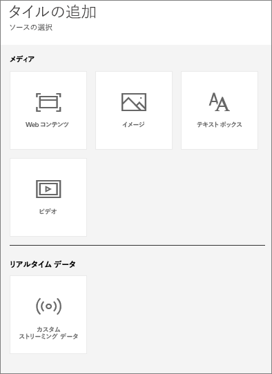
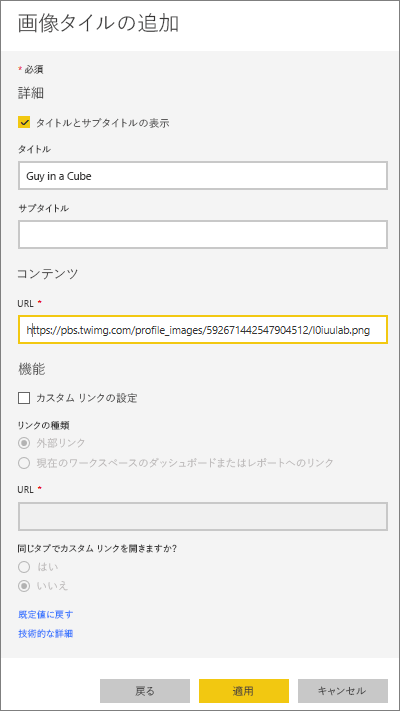
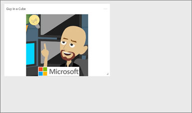
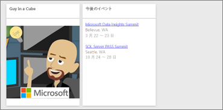
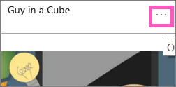
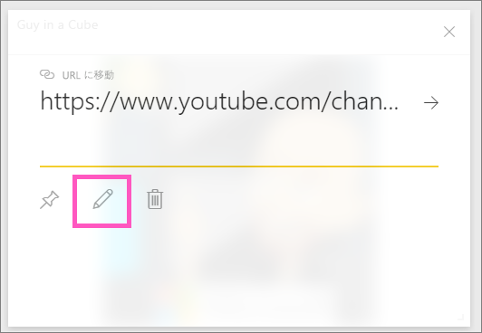

# <a name="add-image-text-video-and-more-to-your-dashboard"></a>画像、テキスト、ビデオ、その他をダッシュボードに追加する
<iframe width="560" height="315" src="https://www.youtube.com/embed/e2PD8m1Q0vU" frameborder="0" allowfullscreen></iframe>


## <a name="add-tile"></a>タイルの追加
**[タイルの追加]** コントロールを使用して、イメージ、テキスト ボックス、ビデオ、ストリーミング データ、Web コードをダッシュボードに直接追加できます。

1. 上部のメニュー バーから **[タイルの追加]** を選択します。 領域の制限によって、プラス  記号のみが表示される場合があります。
   
    
2. 次の中から追加するタイルを選択します。**[イメージ]**、**[テキスト ボックス]**、**[ビデオ]**、**[Web コンテンツ]**、または **[カスタム ストリーミング データ]**。
   
    

## <a name="add-an-image"></a>イメージの追加
ダッシュボードまたはその他のイメージに会社のロゴが必要だとしましょう。 イメージ ファイルをオンラインの場所に保存して、それにリンクする必要があります。 イメージ ファイルにアクセスするために特別な資格情報が必要ないことを確認します。 たとえば、OneDrive や SharePoint は認証が必要なので、そこに保存したイメージはこの方法でダッシュボードに追加できません。  

1. **[イメージ]** > **[次へ]** を選択します。
2. イメージ情報を **[画像タイルの追加]** ウィンドウに追加します。
   
    
   
   * イメージの上のタイトルを表示するには、 *[タイトルとサブタイトルの表示]* を選び、タイトルやサブタイトルを入力します。
   * イメージ URL の入力
   * タイルにハイパーリンクを設定するには、 **[カスタム リンクの設定]** を選び、URL を入力します。  同僚がこのイメージやタイトルをクリックすると、この URL に移動します。
   * **[適用]**を選びます。  ダッシュボードで、必要に応じてイメージのサイズを変更したり、移動したりします。
     
     

## <a name="add-a-text-box-or-dashboard-heading"></a>テキスト ボックスまたはダッシュボードの見出しを追加する
1. **[テキスト ボックス] > [次へ]** を選択します。
   
   > **注**: ダッシュボードの見出しを追加するには、テキスト ボックスに見出しを入力して、フォントを大きくします。
   > 
2. テキスト ボックスの書式を設定します。
   
   * テキスト ボックスの上のタイトルを表示するには、 **[タイトルとサブタイトルの表示]** を選び、タイトルやサブタイトルを入力します。
   * テキスト ボックスの内容を入力し、書式を設定します。  
   * 必要に応じて、タイトルのカスタム リンクを設定します。 カスタム リンクは、外部のサイトでも、ワークスペース内のダッシュボードやレポートでもかまいません。 ただし、この例では、テキスト ボックス自体にハイパーリンクを追加しました。そのため、**[カスタム リンクの設定]** はオフのままにします。

     ![[テキストボックス タイルの追加] ウィンドウ](media/service-dashboard-add-widget/power-bi-add-textbox.png)
   
3. **[適用]**を選びます。  ダッシュボードで、必要に応じてテキスト ボックスのサイズを変更したり、移動したりします。
   
   

## <a name="add-a-video"></a>ビデオの追加
ダッシュボードに YouTube または Vimeo ビデオ タイルを追加すると、ダッシュボードでビデオが再生されます。

1. **[ビデオ] > [次へ]** を選択します。
2. ビデオ情報を **[ビデオ タイルの追加]** ウィンドウに追加します。
   
    ![[ビデオ タイルの追加] ウィンドウ](media/service-dashboard-add-widget/power-bi-add-video-new.png)
   
   * ビデオ タイトルの上のタイトルとサブタイトルを表示するには、 *[タイトルとサブタイトルの表示]* を選び、タイトルやサブタイトルを入力します。 この例では、サブタイトルを追加し、それを YouTube の全体の再生リストへのハイパーリンクに変換します。
   * ビデオの URL の入力
   * タイトルとサブタイトルのハイパーリンクを追加します。  おそらく、埋め込まれたビデオを同僚に見てもらった後、YouTube の再生リスト全体を見てもらいたいと考えるでしょう。再生リストへのリンクを追加してください。
   * **[適用]**を選びます。  ダッシュボードで、必要に応じてビデオのサイズを変更したり、移動したりします。
     
      
3. ビデオを再生するビデオ タイルを選びます。
4. サブタイトルを選び、YouTube の再生リストにアクセスします。

## <a name="add-streaming-data"></a>ストリーミング データの追加
<iframe width="560" height="315" src="https://www.youtube.com/embed/kOuINwgkEkQ" frameborder="0" allowfullscreen></iframe>

## <a name="add-web-content"></a>Web コンテンツの追加
HTML コンテンツを貼り付けるか、入力します。  Power BI により、そのコンテンツがタイルとしてダッシュボードに追加されます。 埋め込みコードを手動で入力するか、Twitter、YouTube、embed.ly などのサイトからコピーして貼り付けます。

1. **[Web コンテンツ] > [次へ]** を選択します。
2. **[Web コンテンツ タイルの追加]** ウィンドウに情報を追加します。
   
    ![[Web コンテンツ タイルの追加] ウィンドウ](media/service-dashboard-add-widget/power-bi-add-web-content.png)
   
   * タイルの上にタイトルを表示するには、 *[タイトルとサブタイトルの表示]* をオンにし、タイトルやサブタイトルを入力します。
   * 埋め込みコードを入力します。 この例では、Twitter フィードをコピーして貼り付けています。
3. **[適用]**を選びます。  ダッシュボードで、必要に応じて Web コンテンツのサイズを変更したり、移動したりします。
     
      

## <a name="tips-for-embedding-web-content"></a>Web コンテンツを埋め込むためのヒント
* iframe には、セキュリティで保護されたソースを使います。 iframe の埋め込みコードを入力したときにタイルが空白になった場合は、iframe のソースに **http** を使っているかどうか確認してください。  その場合は、 **https**に変更してください。
  
  ```
  <iframe src="https://xyz.com">
  ```
* 幅と高さの情報を編集します。 この埋め込みコードでは、ビデオを埋め込み、ビデオ プレーヤーを 560 x 315 ピクセルに設定します。  タイルのサイズを変更しても、このサイズは変更されません。
  
  ```
  <iframe width="560" height="315"
  src="https://www.youtube.com/embed/Cle_rKBpZ28" frameborder="0"
   allowfullscreen></iframe>
  ```
  
  タイルのサイズに合わせてプレイヤーのサイズを変更するには、幅と高さを 100% に設定します。
  
  ```
  <iframe width="100%" height="100%"
  src="https://www.youtube.com/embed/Cle_rKBpZ28" frameborder="0"
   allowfullscreen></iframe>
  ```
* このコードでは、ツイートを埋め込み、**AFK** ポッドキャスト、**@GuyInACube の Twitter ページ**、**フォロー**、**#analytics**、**返信**、**リツイート**、**いいね**についてダッシュボードに別個のリンクを保持しています。  タイルそのものを選択すると、Twitter のポッドキャストに移動します。
  
  ```
  <blockquote class="twitter-tweet" data-partner="tweetdeck">
  <p lang="en" dir="ltr">Listen to
  <a href="https://twitter.com/GuyInACube">@GuyInACube</a> talk to
  us about making videos about Microsoft Business Intelligence
  platform
  <a href="https://t.co/TmRgalz7tv">https://t.co/TmRgalz7tv </a>
  <a href="https://twitter.com/hashtag/analytics?src=hash">
  #analytics</a></p>&mdash; AFTK Podcast (@aftkpodcast) <a
  href="https://twitter.com/aftkpodcast/status/693465456531771392">
  January 30, 2016</a></blockquote> <script async src="//platform.twitter.com/widgets.js" charset="utf-8"></script>
  ```

## <a name="edit-a-tile"></a>タイルを編集します。
タイルを変更するには...

1. タイルの右上隅にマウス カーソルを移動し、省略記号を選びます。
   
    
2. 編集アイコンを選び、 **[タイルの詳細]** ウィンドウをもう一度開いて変更を加えます。
   
    

## <a name="considerations-and-troubleshooting"></a>考慮事項とトラブルシューティング
* ダッシュボードのタイルを移動しやすくするには、タイトルまたはサブタイトル (あるいはその両方) を追加します。
* Web サイトからコンテンツを埋め込みたいが、コピーして貼り付けるための埋め込みコードを Web サイトが提供していない場合は、埋め込みコードの生成について embed.ly で確認してください。

## <a name="next-steps"></a>次の手順
[ダッシュボードのタイル](service-dashboard-tiles.md)

他にわからないことがある場合は、 [Power BI コミュニティを利用してください](http://community.powerbi.com/)。

