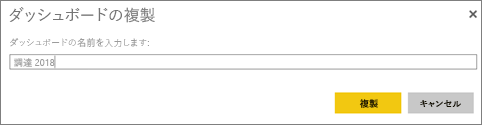
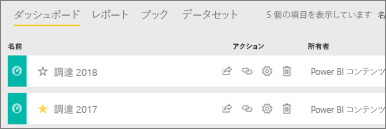

# Power BI ダッシュボードのコピーを作成する

所有しているダッシュボードをコピーするにはさまざまな理由があります。 コピーは、アクティブな (同じ) ワークスペースに保存されます。 ダッシュボードを変更し、元のダッシュボードとパフォーマンスを比較する場合や、少しずつ異なるバージョンを作成して同僚、リージョン、チームに配布する場合などです。 ダッシュボードのデザインを気に入った同僚は、マネージャーへのレポートにそれを使いたいと思うかもしれません。 または、データ構造とデータ型が同じ新しいデータベースがあり、既に作成してあるダッシュボードを再利用したい場合もコピーしますが、Power BI Desktop で何らかの作業が必要になる場合があります。 

アプリとして他のユーザーから共有を受けているダッシュボードは複製できません。

1. ダッシュボードを開きます。
2. 右上隅の省略記号 [...] を選び、**[ダッシュボードの複製]** を選びます。
   
   
3. ダッシュボードの名前を指定し、**[複製]** を選びます。 
   
   
4. 新しいダッシュボードがオリジナルと同じワークスペースに保存されます。 
   
   

## 次の手順
* [タイルを編集、サイズ変更、移動する](service-dashboard-edit-tile.md) 
* [優れたダッシュボードのデザインに関するヒント](service-dashboards-design-tips.md) 

他にわからないことがある場合は、 [Power BI コミュニティを利用してください](http://community.powerbi.com/)。

