# レポートから Power BI ダッシュボードを作成する
[Power BI のダッシュボード](service-dashboards.md)を読んで、次は自分のダッシュボードを作成しようと思われるでしょう。 ダッシュボードを作成するには、レポートから、何もない状態から、データセットから、既存のダッシュボードを複製して、それ以外の方法など、さまざまな方法があります。  

初めて取り掛かるときは難しそうに見えるかもしれません。そこで、まずはレポートから視覚エフェクトをピン留めして、手早く簡単にダッシュボードを作成します。レポートはあらかじめ用意されているものを使用します。 このクイック スタートを終えれば、ダッシュボードとレポートとの関係やレポート エディターでの編集ビューの開き方、タイルのピン留め、ダッシュボードとレポートの間の移動について理解が深まっているでしょう。 その次は左側の目次のリンク、または下部の**次のステップ**から、より高度なトピックに進みます。

## ダッシュボードを作成できるユーザー
ダッシュボードの作成は**作成者**の機能であり、レポートに対する編集のアクセス許可が必要です。 編集のアクセス許可はレポート作成者と、作成者からアクセス許可を付与された同僚が使用できます。 たとえば、David が WorkspaceABC でレポートを作成し、そのワークスペースのメンバーとしてユーザーを追加した場合、David とそのユーザーの両方に編集のアクセス許可があることになります。 これに対して、直接または [Power BI アプリ](service-install-use-apps.md)の一部としてレポートが共有されている場合 (ユーザーはレポートを**使用**します)、ダッシュボードにタイルをピン留めすることはできません。

> **注**: ダッシュボードは、Power BI Desktop ではなく、Power BI サービスの機能です。 Power BI モバイルでは、ダッシュボードを作成することはできませんが、[表示して共有する](mobile-apps-view-dashboard.md)ことはできます。
>
> 

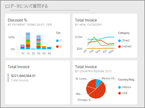

## ビデオ: レポートからビジュアルとイメージをピン留めすることでダッシュボードを作成する
レポートからの視覚化をピン留めして、新しいダッシュボードを作成する手順をご覧ください。 その後は、ビデオで説明されている手順に従い、調達の分析のサンプルを使ってご自身でお試しください。

<iframe width="560" height="315" src="https://www.youtube.com/embed/lJKgWnvl6bQ" frameborder="0" allowfullscreen></iframe>

### 前提条件
作業を進めるには、"調達の分析" のサンプル Excel ブックをダウンロードして Power BI サービス (app.powerbi.com) で開く必要があります。

## レポートでデータセットをインポートする
Power BI サンプル データセットの 1 つをインポートし、それを使って新しいダッシュボードを作成します。 ここで使うサンプルは、2 つの PowerView を含む Excel ブックです。 Power BI は、ブックをインポートすると、データセットとレポートをワークスペースに追加します。  レポートは、PowerView シートから自動的に作成されます。

1. [このリンクを選択](http://go.microsoft.com/fwlink/?LinkId=529784)して、調達の分析のサンプルの Excel ファイルをダウンロードし、保存してください。 OneDrive for Business に保存することをお勧めします。
2. ブラウザーで Power BI サービスを開きます (app.powerbi.com)。
3. **[マイ ワークスペース]** を選択します。
4. 左のナビゲーションから **[データの取得]** を選択します。

    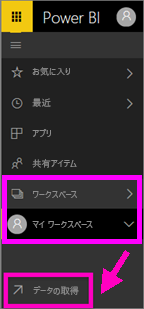
5. **[ファイル]** を選択します。

   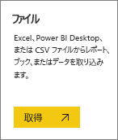
6. 調達の分析のサンプルの Excel ファイルを保存した場所に移動します。 ファイルを選び、**[接続]** を選択します。

   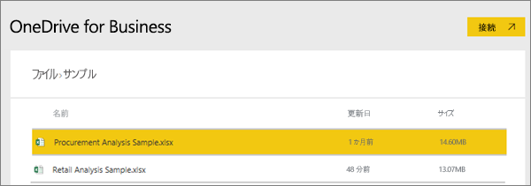
7. この演習では、**[インポート]** を選択します。

    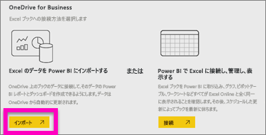
8. 成功メッセージが表示されたら、**[x]** を選択して閉じます。

   

### レポートを開いてダッシュボードにタイルをピン留めする
1. 同じワークスペースにとどまった状態で、**[レポート]** タブを選択します。新しくインポートしたレポートが、黄色のアスタリスク付きで表示されます。 レポート名を選択してレポートを開きます。

    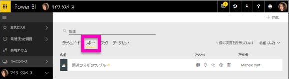
2. [読み取りビュー](service-reading-view-and-editing-view.md)でレポートが開きます。 下部に 2 つのタブがあります。割引分析と支出概要です。 各タブはレポートのページを表します。
    **[レポートの編集]** を選んで、編集ビューでレポートを開きます。

    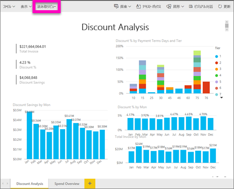
3. 視覚化をポイントして、使用可能なオプションを表示します。 ダッシュボードに視覚化を追加するには、ピン  アイコンを選択します。

    
4. ここでは新しいダッシュボードを作成しているので、**[新しいダッシュボード]** オプションを選択して名前を指定します。

   
5. **[ピン留め]** を選択すると、現在のワークスペースに新しいダッシュボードが作成されます。 **[ダッシュボードにピン留めしました]** というメッセージが表示されたら、**[ダッシュボードへ移動]** を選択します。 レポートの保存を求めるメッセージが表示されたら、**[保存]** を選択します。

     
6. 新しいダッシュボードが開き、1 つのタイル (ピン留めしたばかりの視覚エフェクト) が表示されます。

   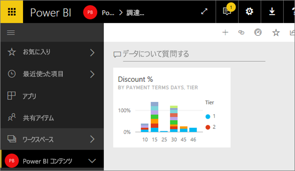
7. レポートに戻るには、タイルを選びます。 新しいダッシュボードにさらにいくつかタイルをピン留めします。 今度は、**[ダッシュボードにピン留めする]** ウィンドウが表示されたら、**[既存のダッシュボード]** を選択します。  

   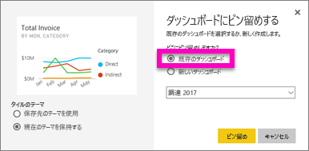

## レポート ページ全体をダッシュボードにピン留めする
1 度に 1 つのビジュアルをピン留めするのではなく、[レポート ページ全体を*ライブ タイル*としてピン留め](service-dashboard-pin-live-tile-from-report.md)できます。 やってみましょう。

1. レポート エディターで、**[Spend Overview]\(支出の概要\)** タブを選択して、レポートの 2 ページ目を開きます。

   

2. そのすべてのビジュアルをダッシュボードに表示したいと考えます。  メニューバーの右上隅で、**[ライブ ページをピン留めする]** を選択します。 ダッシュボードではページが更新されるたびに、ライブ ページのタイルが更新されます。

   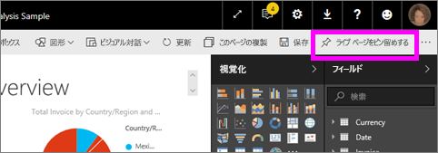

3. **[ダッシュボードにピン留めする]** ウィンドウが表示されたら、**[既存のダッシュボード]** を選択します。

   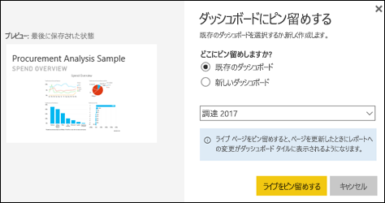

4. 成功メッセージが表示されたら、**[ダッシュボードに移動]** を選択します。 そこに、レポートからピン留めされたタイルが表示されています。 次の例では、レポートの 1 ページ目から 2 つのタイルを、レポートの 2 ページ目から 1 つのライブ タイルをピン留めしています。

   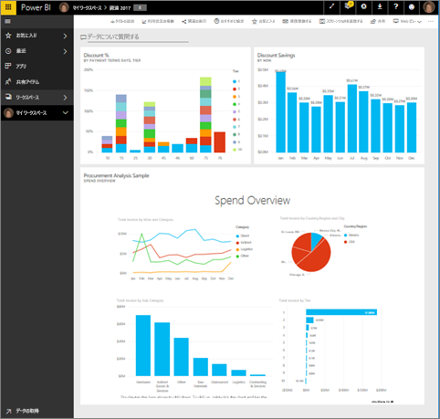

これで初めてのダッシュボードを作成できました。 作成したダッシュボードでは、さらに多くの処理を行うことができます。  下に示した**次のステップ**のいずれかを試すか、自由に遊んだり調べたりしてみてください。   

## 次の手順
* [タイルのサイズを変更したり、移動したりする](service-dashboard-edit-tile.md)
* [ダッシュボードのタイルの概要](service-dashboard-tiles.md)
* [アプリを作成することによってダッシュボードを共有する](service-create-distribute-apps.md)
* [Power BI - 基本的な概念](service-basic-concepts.md)
* [優れたダッシュボードのデザインに関するヒント](service-dashboards-design-tips.md)

他にわからないことがある場合は、 [Power BI コミュニティを利用してください](http://community.powerbi.com/)。
