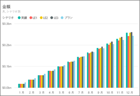
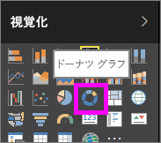
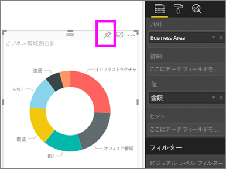
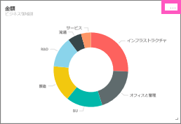
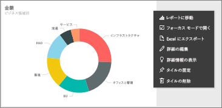
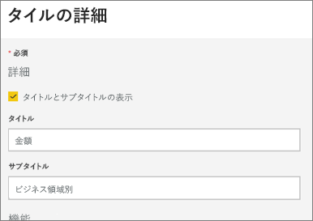
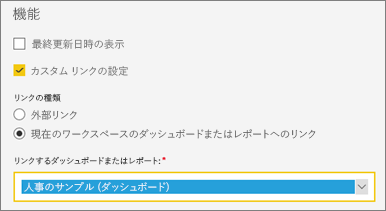
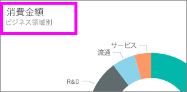
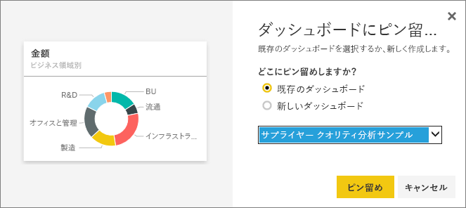

# ダッシュボードのタイルを編集または削除する

## ダッシュボードの "*所有者*" とダッシュボードの "*コンシューマー*"
ダッシュボードを作成または所有する場合は、ダッシュボード上のタイルの外観や既定の動作を変更するためのオプションが多数用意されています。 以下に説明する設定および手法を用いることにより、仕事仲間にとって " *使いやすい*" ダッシュボードを設計することができます。  タイルを開いたときに開かれるのは、基になるレポート、カスタム URL、別のダッシュボードのどれでしょうか? [ビデオまたはストリーミング データを表示するタイルを追加](service-dashboard-add-widget.md)する場合もあるのではないでしょうか? さらに、[対話型のスライサーを持つタイルを作成](service-dashboard-pin-live-tile-from-report.md)することも必要になるかもしれません。 *作成者*には多くのオプションがあります。 

<iframe width="560" height="315" src="https://www.youtube.com/embed/lJKgWnvl6bQ" frameborder="0" allowfullscreen></iframe>

この記事では以下について説明します。

* [視覚化を作成して、ダッシュボードにピン留め](#create)
* [タイルの移動](#move)
* [タイル サイズの変更](#resize)
* [タイル名の変更](#rename)
* [タイルへのハイパーリンクの追加](#hyperlink)
* [別のダッシュボードにタイルをピン留め](#different)
* [タイルの削除](#delete)
  
  > [!TIP]
  > タイル自体に表示される視覚エフェクトを変更するには、タイルを削除し、新しい[ダッシュボード タイル](consumer/end-user-tiles.md)を追加します。

  
## 前提条件
作業を進めるために、Power BI サービス (Power BI Desktop ではない) を開き、[IT 支出分析のサンプルをダウンロードします](sample-it-spend.md)。 "成功" メッセージが表示されたら、 **[ダッシュボードに移動]** を選択します。

- - -

## 新しい視覚化を作成して、ダッシュボードにピン留め
1. IT 支出分析のダッシュボードから "金額" タイルを選択してレポートを開きます。

    

2. 上部のメニュー バーから **[レポートの編集]** を選択して、レポートを編集ビューで開きます。

3. 新しいレポート ページを追加するため、レポートの下部にある正符号 (+) を選択します。

    

4. [フィールド] ウィンドウから、 **[ファクト]、[Amount** and **Business Area]\(金額およびビジネス エリア\)、[Business Area]\(ビジネス エリア\)** の順に選択します。
 
5. [視覚化] ウィンドウから [ドーナツ グラフ] アイコンを選択して、視覚化をドーナツ グラフ アイコンに変換します。

    

5. ピン アイコンを選択し、ドーナツ グラフを IT 支出分析サンプルのダッシュボードにピン留めします。

   

6. "成功" メッセージが表示されたら、 **[ダッシュボードに移動]** を選択します。 変更内容を保存するように求められます。 **[保存]** を選択します。

- - -

## タイルの移動
ダッシュボードで、新しいタイルを特定します。 タイルを選択したまま、ダッシュボード キャンバス上の新しい場所までドラッグします。

- - -

## タイルのサイズ変更
タイルは、1x1 から 5x5 まで、さまざまなサイズに変更できます。 ハンドル (右下隅) を選択してドラッグし、タイトルのサイズを変更します。

- - -
## 省略記号 (...) のメニュー

1. タイルの右上隅にある省略記号 (...) を選択します。 
   
   

2. "アカウント" タイルの上にマウスを移動し、省略記号を選択してオプションを表示します。 使用可能なオプションはタイルの種類によって異なります。  たとえば、ライブ タイルで使用できるオプションと、標準的な視覚化タイルで使用できるオプションは異なります。 また、自分がダッシュボードの共有相手である (自分は所有者ではない) 場合、使用できるオプションは少なくなります。

   

3. **[詳細の編集]** を選択して、[タイルの詳細] ウィンドウを開きます。 

    タイルと、タイルの既定の動作を変更します。  たとえば、"*コンシューマー*" がタイルを選択したときに、そのタイルを作成するのに使用したレポートが開くのでなく、新しいダッシュボードが表示されるようにすることに決めたとします。  
   

### タイル名の変更
[タイルの詳細] ウィンドウの上部で、 **[タイトル]** を **[支出金額]** に変更します。

### 既定のハイパーリンクの変更
既定では、タイルを選ぶと、通常はタイルが作成されたレポート、または Q&A (タイルが Q&A で作成された場合) に移動します。 Web ページ、別のダッシュボードまたはレポート (同じワークスペース内)、SSRS レポート、またはその他のオンライン コンテンツにリンクするには、カスタム リンクを追加します。

1. [機能] 見出しの下で、 **[カスタム リンクの設定]** を選択します。

2. **[現在のワークスペースのダッシュボードまたはレポートへのリンク]** を選択し、ドロップダウンから選択します。  この例では、人事のサンプル ダッシュボードを選択しました。 このサンプルがワークスペース内にまだ存在していない場合は、追加してから、この手順に戻ることも、別のダッシュボードを選択することもできます。 

    

3. **[適用]** を選びます。

4. 新しいタイトルがタイルに表示されます。  また、そのタイルを選択すると、Power BI によって人事ダッシュボードが開かれます。 

    

### 別のダッシュボードにタイルをピン留め
1. 省略記号のドロップダウン メニューから、 **[タイルの固定]**  を選択します。
2. このタイルの複製を既存のダッシュボードにピン留めするか、または新しいダッシュボードにピン留めするかを決定します。 
   
   
3. **[Pin]** (ピン留め) を選択します。

### タイルの削除
1. ダッシュボードからタイルを完全に削除するには、省略記号のドロップダウン メニューから、 **[タイルの削除]**  を選択します。 

2. タイルを削除しても、基になっている視覚化は削除されません。 基になっているレポートを開くには、"金額" タイルを選択します。 レポートの最後のページを開き、元の視覚化がレポートから削除されていないことを確認します。 

- - -
## 次の手順
[Power BI のダッシュボードのタイル](consumer/end-user-tiles.md)

[Power BI のダッシュボード](consumer/end-user-dashboards.md)

[Power BI - 基本的な概念](consumer/end-user-basic-concepts.md)

他にわからないことがある場合は、 [Power BI コミュニティを利用してください](http://community.powerbi.com/)。

