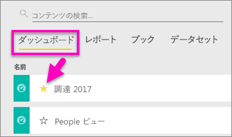
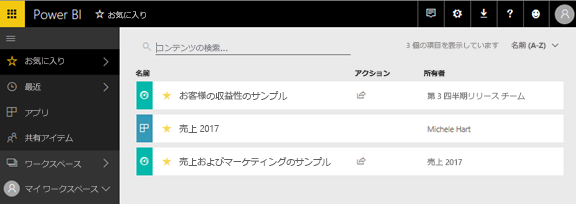
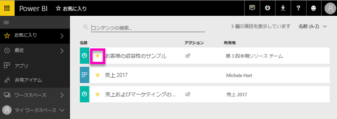

# Power BI のお気に入りのダッシュボード
ダッシュボードを *お気に入り* に登録すると、すべてのワークスペースからアクセスすることができます。  お気に入りは、通常、最も頻繁に利用するダッシュボードです。

> [!NOTE]
> このトピックは Power BI サービスに適用され、Power BI Desktop には適用されません。
> 
> 

1 つのダッシュボードを選択して、Power BI の[おすすめのダッシュボード](service-dashboard-featured.md)にすることもできます。

## *お気に入り*としてダッシュボードを追加する
Amanda がワークスペースにお気に入りを追加する様子を見てから、ビデオで説明されている手順に従って、ご自分でやってみてください。

<iframe width="560" height="315" src="https://www.youtube.com/embed/G26dr2PsEpk" frameborder="0" allowfullscreen></iframe>

1. よく使用するダッシュボードを開きます。 他のユーザーによって共有を設定されたダッシュボードを*お気に入り*にすることもできます。
2. Power BI サービスの右上にある **[お気に入り]** または星  アイコンを選択します。
   
   
   
   また、ワークスペースの **[ダッシュボード]** タブからダッシュボードをお気に入りすることもできます。
   
   

## *お気に入り*の操作
1. 任意のワークスペースから、最近使用したお気に入りを 5 つ表示するには、**[お気に入り]** の右にある矢印を選択します。  ここからは、お気に入りのダッシュボードを選んで開くことができます。 最近使用した 5 つのお気に入りのみが (アルファベット順に) 表示されます。 お気に入りが 6 つ以上ある場合は、**[すべて表示]** を選択すると、[お気に入り] 画面が開きます (以下の #2 を参照してください)。 
   
   
2. お気に入りとして追加した**すべて**のダッシュボードを表示するには、左側のナビゲーション ウィンドウで **[お気に入り]** またはお気に入りアイコン  を選択します。  
   
    
   
   ここからダッシュボードを選択して開いたり、仕事仲間とダッシュボードを共有したりできます。

## ダッシュボードをお気に入りから外す
あまり使用しなくなったダッシュボードは、  お気に入りから外すことができます。 ダッシュボードをお気に入りから外すと、お気に入りからは削除されますが、Power BI からは削除されません。

1. 左側のナビゲーション ウィンドウで **[お気に入り]** を選択し、**[お気に入り]** 画面を開きます。
   
   
2. お気に入りから外すダッシュボードの横にある黄色の星を選択します。

> **注**: 対象のダッシュボードから、ダッシュボードをお気に入りから外すこともできます。 ダッシュボードの右上に黄色の星と **[お気に入りから外す]** が表示されます。 いずれかを選択すると、お気に入りの一覧からそのダッシュボードが削除されます。 
> 
> 

## 次の手順
[Power BI の概要](service-get-started.md)

[Power BI - 基本的な概念](service-basic-concepts.md)

他にわからないことがある場合は、 [Power BI コミュニティを利用してください](http://community.powerbi.com/)。

