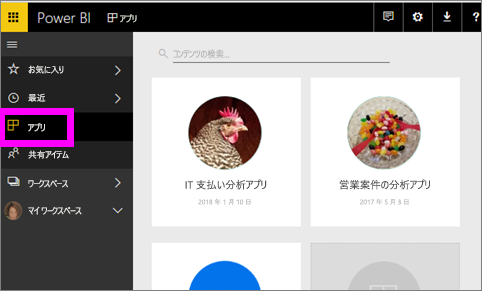
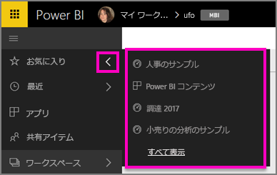

# Power BI サービスのお気に入りのダッシュボード、レポート、アプリ
コンテンツを "*お気に入り*" に登録すると、すべてのワークスペースからアクセスすることができます。  お気に入りは、通常、最も頻繁に利用するコンテンツです。

> [!NOTE]
> このトピックは Power BI サービスに適用され、Power BI Desktop には適用されません。
> 
> 

Power BI サービスの[おすすめのダッシュボード](service-dashboard-featured.md)として、1 つのダッシュボードを選ぶこともできます。

## "*お気に入り*" としてダッシュボードまたはレポートを追加する
Amanda がワークスペースにお気に入りを追加する様子を見てから、ビデオで説明されている手順に従って、ご自分でやってみてください。

<iframe width="560" height="315" src="https://www.youtube.com/embed/G26dr2PsEpk" frameborder="0" allowfullscreen></iframe>

1. よく使用するダッシュボードまたはレポートを開きます。 他のユーザーによって共有を設定されたコンテンツを "*お気に入り*" にすることもできます。
2. Power BI サービスの右上にある **[お気に入り]** または星  アイコンを選びます。
   
   
   
   ワークスペース コンテンツ ビュー タブの **[ダッシュボード]** と **[レポート]** から、ダッシュボードまたはレポートをお気に入りに設定することもできます。
   
   ![黄色の星が表示された [ダッシュボード] タブ](media/service-dashboard-favorite/power-bi-dashboard-favorite.png)

## アプリを "*お気に入り*" として追加する

1. 左側のナビゲーション ウィンドウから、**[アプリ]** を選びます。

   

2. アプリの上にカーソルを合わせると、詳細が表示されます。  星   アイコンを選んでお気に入りとして設定します。
   
   

## *お気に入り*の操作
1. お気に入りにアクセスするには、任意のワークスペースで、**[お気に入り]** の右にあるポップアップ矢印を選びます。  ここからお気に入りを選んで開くことができます。 一覧に表示されるお気に入りは (アルファベット順に) 5 つだけです。 6 つ以上ある場合は、**[すべて表示]** を選んで [お気に入り] 画面を開きます (下記の 2 を参照してください)。 
   
   
2. お気に入りとして追加した**すべて**のコンテンツを表示するには、左側のナビゲーション ウィンドウで **[お気に入り]** またはお気に入りアイコン  を選びます。  
   
    ![[お気に入り] ウィンドウ](media/service-dashboard-favorite/power-bi-favorites-screen.png)
   
   ここからコンテンツを開いたり、所有者を確認したり、同僚と共有したりすることができます。

## コンテンツをお気に入りから外す
あまり使用しなくなったレポートは、  お気に入りから外すことができます。 コンテンツをお気に入りから外すと、お気に入りの一覧から削除されますが、Power BI からは削除されません。

1. 左側のナビゲーション ウィンドウで **[お気に入り]** を選択し、**[お気に入り]** 画面を開きます。
   
   ![[お気に入り] 画面](media/service-dashboard-favorite/power-bi-unfavorites-screen.png)
2. お気に入りから外すコンテンツの横にある黄色の星を選びます。

> **注**: ダッシュボード、レポート、アプリ自体をお気に入りから外すこともできます。 コンテンツを開き、黄色のアイコンの選択を解除します。   
> 
> 

## 次の手順
[Power BI の概要](service-get-started.md)

[Power BI - 基本的な概念](service-basic-concepts.md)

他にわからないことがある場合は、 [Power BI コミュニティを利用してください](http://community.powerbi.com/)。

