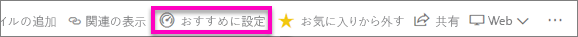
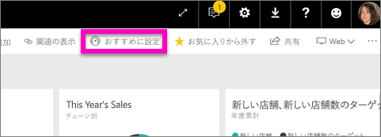
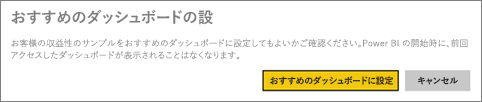
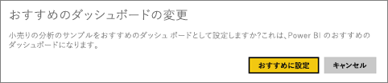
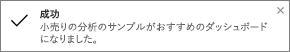
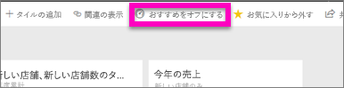

# Power BI サービスのおすすめのダッシュボード
## おすすめのダッシュボードを作成する
多くのユーザーには、他のダッシュボードより頻繁にアクセスする 1 つのダッシュボードがあります。  それはビジネスの運営に使用するダッシュボードかもしれません。また、多くの異なるダッシュボードとレポートから取られたタイルの集合体が含まれるダッシュボードであることもあります。

ダッシュボードを*おすすめ*に選択すると、Power BI サービスを開くたびに、そのダッシュボードが表示され開きます。  

複数のダッシュボードを選んで、"*お気に入り*" に設定することもできます。 「[お気に入りのダッシュボード](service-dashboard-favorite.md)」を参照してください。

> [!NOTE] 
>このトピックは Power BI サービスに適用され、Power BI Desktop には適用されません。

おすすめのダッシュボードをまだ設定していない場合、Power BI では、最後に使用したダッシュボードが開きます。  

### ダッシュボードを**おすすめ**として設定するには
Amanda がおすすめのダッシュボードを作成するビデオを参照してください。その後、ビデオ下部にある指示に従って、自分で試してください。

<iframe width="560" height="315" src="https://www.youtube.com/embed/G26dr2PsEpk" frameborder="0" allowfullscreen></iframe>

1. *おすすめ*に設定するダッシュボードを開きます。 
2. 上部のナビゲーション バーに、**[おすすめに設定]** またはおすすめ ![[おすすめに設定] アイコン](media/service-dashboard-featured/power-bi-featured-icon.png) アイコンが表示されます。 いずれかを選択します。
   
    
3. 選択内容を確認します。
   
    

## おすすめのダッシュボードを変更する
もちろん、後で考えが変わった場合、新しいダッシュボードをおすすめのダッシュボードとして設定できます。

1. 前述の手順 1 と 2 を実行します。
   
    
2. **[おすすめに設定]** を選択します。 ダッシュボードをおすすめにしない場合、ダッシュボードはワークスペースから削除されません。  
   
    

## おすすめのダッシュボードを削除する
おすすめのダッシュボードを 1 つも設定しない場合に、ダッシュボードのおすすめを解除する方法を次に示します。

1. 現在おすすめに設定しているダッシュボードを開きます。
2. 上部のメニュー バーで **[おすすめをオフにする]** を選択します。
   
    

最後に使ったダッシュボードが Power BI により開かれるようになります。  

## 次の手順
[ダッシュボードをお気に入りにする](service-dashboard-favorite.md)

他にわからないことがある場合は、 [Power BI コミュニティを利用してください](http://community.powerbi.com/)。

