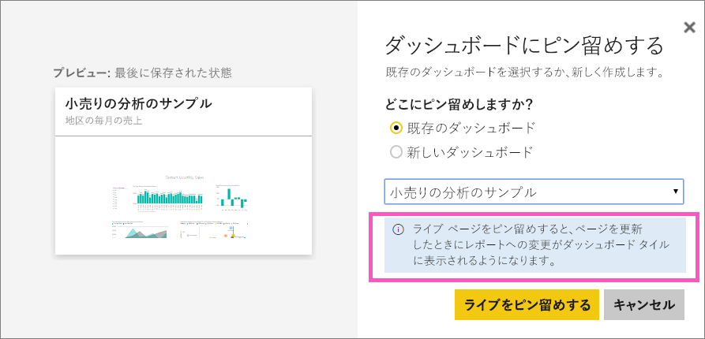
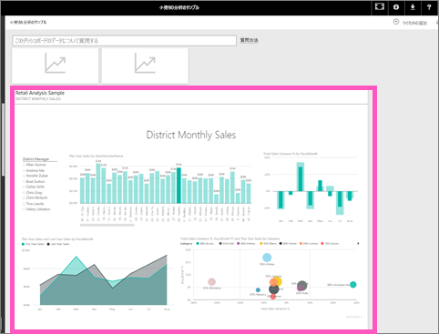

# Power BI ダッシュボードにレポート ページ全体をライブ タイルとしてピン留めする
新しい[ダッシュボード タイル](service-dashboard-tiles.md)を追加する別の方法は、レポート ページ全体をピン留めする方法です。 これは、複数の視覚化を一度にピン留めする簡単な方法です。  さらに、ページ全体をピン留めする場合、タイルは *ライブ* であり、ダッシュボードで直接それらのタイルと対話できます。 レポート エディターで視覚化に加えるすべての変更 (フィルターの追加、またはチャートで使用されるフィールドの変更など) は、ダッシュボード タイルにも反映されます。  

レポートからダッシュボードへのライブ タイルのピン留めは、Power BI サービス (app.powerbi.com) でのみ利用できます。

> [!NOTE]
> 共有してもらっているレポートのタイルをピン留めすることはできません。
> 
> 

## レポート ページのピン留め
次のビデオで、Amanda が下の手順に従ってライブ レポート ページをダッシュボードにピン留めしている様子をご覧ください。

<iframe width="560" height="315" src="https://www.youtube.com/embed/EzhfBpPboPA" frameborder="0" allowfullscreen></iframe>

1. レポートを[編集ビュー](service-interact-with-a-report-in-editing-view.md)で開きます。
2. 視覚化が選択されていない状態で、メニューバーから **[ライブ ページをピン留めする]** を選択します。
   
   ![[ライブ ページをピン留めする] アイコン](media/service-dashboard-pin-live-tile-from-report/pbi-pin-live-page.png) 
3. タイルを既存のダッシュボードまたは新しいダッシュボードにピン留めします。 強調表示されているテキストにご注目ください。*ライブ ページをピン留めすると、ページを更新したときにレポートへの変更がダッシュボード タイルに表示されるようになります。*
   
   * 既存のダッシュボード: ドロップダウンから、ダッシュボードの名前を選びます。 共有してもらったダッシュボードはドロップダウンに表示されません。
   * 新しいダッシュボード: 新しいダッシュボードの名前を入力します。
     
     
4. **[ライブをピン留めする]** を選びます。 右上隅の近くに成功メッセージが表示されたら、ページがダッシュボードにタイルとして追加されたことがわかります。

## ダッシュボードを開いてピン留めされたライブ タイルを表示する
1. ナビゲーション ウィンドウから、新しいライブ タイルを持つダッシュボードを選びます。 ピン留めされたレポート ページの[名前変更、サイズ変更、リンク、移動](service-dashboard-edit-tile.md)などをそこで行うことができます。  
2. ライブ タイルと対話します。  次のスクリーン ショットでは、縦棒グラフのバーを選ぶと、他の視覚化がクロス フィルター処理およびクロス強調表示されます。
   
    

## 次の手順
[Power BI のダッシュボード](service-dashboards.md)

他にわからないことがある場合は、 [Power BI コミュニティを利用してください](http://community.powerbi.com/)。

