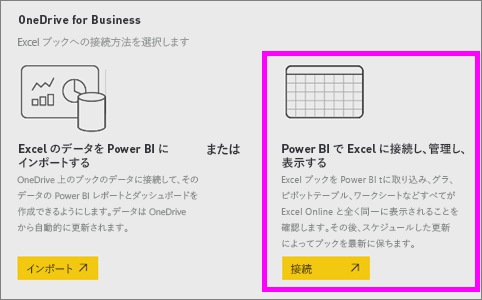
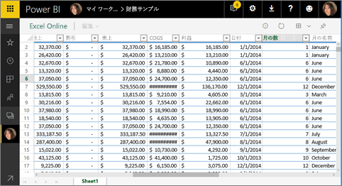
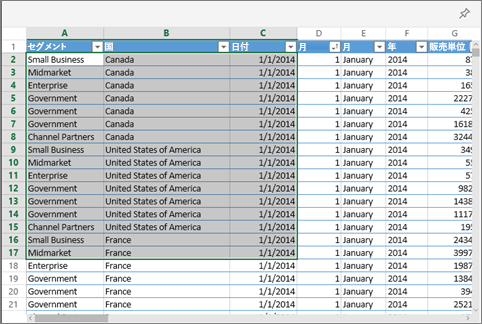
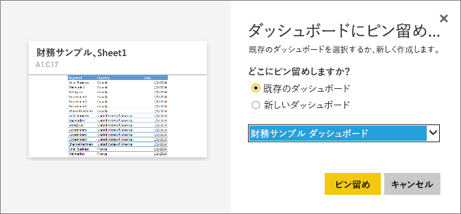

# Excel から Power BI ダッシュボードにタイルをピン留めする
Excel ブックからタイルをピン留めするには、その前にブックを Power BI サービス (app.powerbi.com) に接続する必要があります。 ブックを接続すると、基本的に、そのブックのリンクされた読み取り専用バージョンが Power BI サービスに取り込まれて、範囲をダッシュボードにピン留めできるようになります。 ワークシート全体をダッシュボードにピン留めすることもできます。  
他のユーザーから共有を受けているブックの場合は、所有者がピン留めしたタイルを表示することはできますが、ダッシュボードのタイルを自分で作成することはできません。 

Excel と Power BI の連携について詳しくは、「[Excel ブック ファイルからデータを取得する](http://go.microsoft.com/fwlink/?LinkID=521962)」をご覧ください。

Excel ブックからデータをインポートしたり、Excel ブックに接続したりするさまざまな方法に関する Will によるデモをご覧ください。

<iframe width="560" height="315" src="https://www.youtube.com/embed/l8JoB7w0zJA" frameborder="0" allowfullscreen></iframe>

## Excel ブックを OneDrive for Business から Power BI に接続する
**[接続]** を選択すると、ブックは、Excel Online を使用しているときと同じように Power BI に表示されます。 ただし、Excel Online とは異なり、ワークシートの要素をダッシュボードにピン留めするのに役立ついくつかの優れた機能を利用できます。

Power BI ではブックを編集できません。 ただし、変更を加える必要がある場合は、ワークスペースの **[ブック]** タブから鉛筆アイコンを選択して、Excel Online でブックを編集するか、自分のコンピューターの Excel で開くかを選択できます。 ブックに加えたすべての変更は、OneDrive 上のブックに保存されます。

1. ブックを OneDrive for Business にアップロードします。

2. Power BI から、**[データの取得] > [ファイル] > [OneDrive - Business]** を選択して Excel ファイルを保存した場所に移動し、[そのブックに接続](service-excel-workbook-files.md)します。 ファイルを選択して、**[接続] > [接続]** を選択します。

    

3. Power BI で、ブックはワークスペースの **[ブック]** タブに追加されます。   アイコンはこれが Excel ブックであることを示し、黄色のアスタリスクはそれが新しいものであることを示します。
    
    
4. ブック名を選んで、Power BI でブックを開きます。

    Power BI でブックに加えた変更は保存されず、OneDrive for Business にある元のブックには影響を与えません。 Power BI 内でデータの並べ替え、フィルター処理、または値の変更を行った場合、これらの変更を保存またはピン留めすることはできません。 変更を保存する場合、右上隅から **[編集]** を選択して Excel Online または Excel で編集できるようにブックを開きます。 この方法で加えられた変更は、ダッシュボードでタイルを更新するのに数分かかる場合があります。
   
    

## セルの範囲をダッシュボードにピン留めする
新しい[ダッシュボード タイル](consumer/end-user-tiles.md)を追加する方法の 1 つは、Power BI で Excel ブックから追加することです。 OneDrive for Business または別のグループ共有ドキュメント ライブラリに保存されている Excel ブックから範囲をピン留めすることができます。 範囲には、データ、グラフ、テーブル、ピボットテーブル、ピボットグラフなどの Excel パーツを含めることができます。

1. ダッシュボードにピン留めするセルを強調表示します。
   
    
2. ピン留め  アイコンを選びます。 
3. タイルを既存のダッシュボードまたは新しいダッシュボードにピン留めします。 
   
   * 既存のダッシュボード: ドロップダウンから、ダッシュボードの名前を選びます。
   * 新しいダッシュボード: 新しいダッシュボードの名前を入力します。
   
     
4. **[Pin]**(ピン留め) を選択します。 右上隅の近くに成功メッセージが表示されたら、範囲がダッシュボードにタイルとして追加されたことがわかります。 
   
    
5. **[ダッシュボードへ移動]** を選びます。 ピン留めされた視覚化の[名前変更、サイズ変更、リンク、移動](service-dashboard-edit-tile.md)をここから行うことができます。 既定では、ピン留めされたタイルを選ぶと、Power BI でブックが開きます。

## ダッシュボードにテーブルまたはピボット テーブルの全体をピン留めする
上記と同じ手順で行いますが、セルの範囲を選ぶ代わりに、テーブルまたはピボット テーブルの全体を選びます。

テーブルをピン留めするには、ヘッダーも含めてテーブルの範囲全体を選びます。  ピボット テーブルをピン留めするには、ピボット テーブルのすべての表示パーツ (使っている場合はフィルターを含む) を含めるようにします。

 

テーブルまたはピボット テーブルから作成されたタイルはテーブル全体を表示します。  元のブックで行または列を追加/削除/フィルター処理すると、タイルでもそれらの行が追加/削除/フィルター処理されます。

## タイルにリンクされているブックを表示する
Power BI でブックのタイルを選択すると、リンク先のブックが開きます。 ブック ファイルは所有者の OneDrive for Business に配置されているため、そのブックを表示するにはブックに対する読み取りアクセス許可が必要です。 アクセス許可がない場合は、エラー メッセージが表示されます。  

 

## 考慮事項とトラブルシューティング
サポートされていない機能: Power BI では、Excel Services を使用してブックのタイルを取得します。 そのため、Excel の機能のうち Excel Services の REST API でサポートされていない一部の機能は、Power BI のタイルには表示されません。 たとえば、スパークライン、アイコン セットの条件付き書式、タイム スライサーなどの機能がそれに当たります。 サポートされていない機能の完全な一覧については、「[Excel Services REST API でサポートされない機能](http://msdn.microsoft.com/library/office/ff394477.aspx)」をご覧ください。

## 次の手順
[Excel ブックへのリンクがあるダッシュボードを共有する](service-share-dashboard-that-links-to-excel-onedrive.md)

[Excel ブックからデータを取得する](service-excel-workbook-files.md)

他にわからないことがある場合は、 [Power BI コミュニティを利用してください](http://community.powerbi.com/)。

