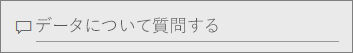
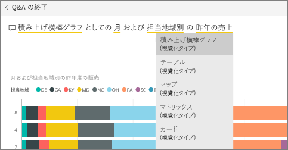
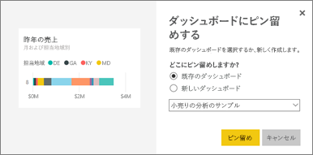
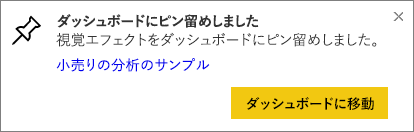
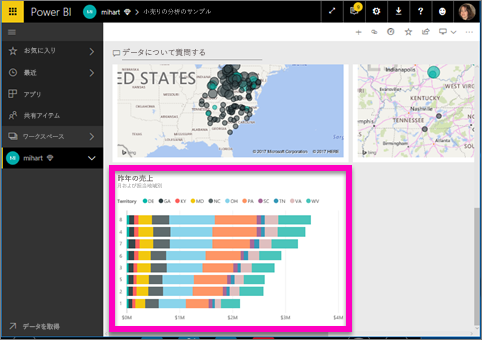
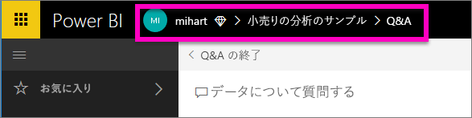

# Q&A からダッシュボードにタイルをピン留めする
## Q&A からタイルをピン留めする方法
Q&A は、Power BI のアドホック レポート作成ツールです。 特定の情報を検索する必要がありますか。 データについての質問を投稿し、視覚エフェクト形式で回答を受信します。

Q&A はダッシュボードとレポートから利用できます。 この記事では、ダッシュボードから Q&A を開きます。 ダッシュボードは、Power BI サービスでは利用できますが、Power BI Desktop では利用できません。 作業を進めるために、[小売りの分析のサンプル ダッシュボード](sample-retail-analysis.md)を開きます。
> 
> 

1. レポートから少なくとも 1 つのタイルをピン留めした[ダッシュボード](service-dashboards.md)を開きます。 質問を入力すると、Power BI はダッシュボードにタイルがピン留めされたデータセットで回答を検索します。  詳細については、[データの取得](service-get-data.md)に関するページを参照してください。
2. ダッシュボードの上部にある質問ボックスに、データに関する質問を入力します。  
   
3. たとえば、"月および担当地域別の昨年度の販売" と入力します。  
   
   
   入力と同時に [質問] ボックスに検索候補が表示されます。
4. ダッシュボードにタイルとしてグラフを追加するには、質問ボックスの右側にあるピン  を選択します。
5. タイルを既存のダッシュボードまたは新しいダッシュボードにピン留めします。 

   

   * 既存のダッシュボード: ドロップダウンから、ダッシュボードの名前を選びます。 現在のワークスペース内のダッシュボードのみを選択できます。
   * 新しいダッシュボード: 新しいダッシュボードの名前を入力すると、現在のワークスペースに追加されます。
6. **[Pin]**(ピン留め) を選択します。
   
   右上隅の近くに成功メッセージが表示され、視覚エフェクトがダッシュボードにタイルとして追加されたことがわかります。  
   
   
7. **[ダッシュボードへ移動]** を選択して新しいタイルを表示します。 ここでは、ダッシュボード上のタイルに対して、[名前の変更、サイズ変更、ハイパーリンクの追加、位置変更など](service-dashboard-edit-tile.md)を行うことができます。 
   
   

## 考慮事項とトラブルシューティング
* 質問を入力し始めると、Q&A はすぐに、現在のダッシュボードに関連付けられているすべてのデータセットから最適な回答の検索を開始します。  "現在のダッシュボード" は、上部ナビゲーション バーに表示されているダッシュボードです。 たとえば、この質問は、**[小売りの分析のサンプル]** ダッシュボードで入力しています。このダッシュボードは **mihart** アプリ ワークスペースの一部です。
  
  
* **Q&A が使用するデータセットを認識する方法**:   Q&A は、そのダッシュボードにピン留めされた視覚エフェクトのあるデータセットすべてにアクセスします。

## 次の手順
[タイルの名前の変更、サイズ変更、ハイパーリンクの追加、位置変更など](service-dashboard-edit-tile.md)    
[フォーカス モードでダッシュボード タイルを表示する](service-focus-mode.md)     
[Power BI での Q&A に戻る](service-q-and-a.md)  
他にわからないことがある場合は、 [Power BI コミュニティを利用してください](http://community.powerbi.com/)。

