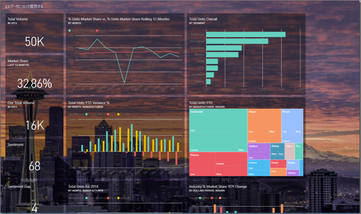
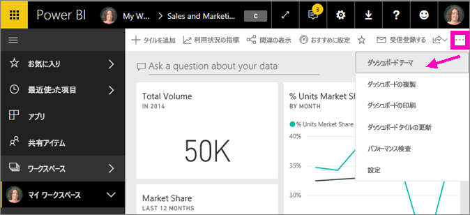
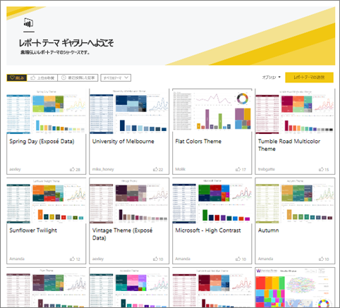
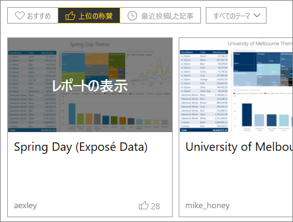
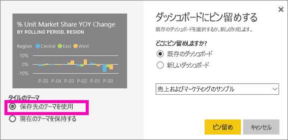

# Power BI サービスのダッシュボード テーマを使用する
**ダッシュボード テーマ**では、企業の色、季節の色、または適用する可能性がある他の色のテーマなど、色のテーマをダッシュボード全体に適用することができます。 **ダッシュボード テーマ**を適用すると、ダッシュボードのすべてのビジュアルで、選択したテーマの色が使用されます (例外がいくつか適用されます。それについては、この記事の後半で説明します)。

ダッシュボードのレポート ビジュアルの色を変更しても、レポートのビジュアルには影響しません。 また、既に[レポート テーマが適用](desktop-report-themes.md)されているレポートからタイルをピン留めする場合、現在のテーマを保持するか、ダッシュボード テーマを使用することを選択できます。

## 前提条件
* 作業を進めるために、[売上およびマーケティングのサンプル ダッシュボード](sample-datasets.md)を開きます。

## ダッシュボード テーマのしくみ
作業を始めるには、まず、作成した (または編集アクセス許可がある) カスタマイズ対象のダッシュボードを開きます。 省略記号 (...) を選択して、**[ダッシュ ボード テーマ]** を選びます。 

表示されたダッシュボード ウィンドウで、構築済みのテーマのいずれかを選択します。  次の例では、**[暗い]** を選択します。

![選択されている [明るい] オプション](media/service-dashboard-themes/power-bi-theme-menu.png)

![適用された [暗い] オプション](media/service-dashboard-themes/power-bi-theme-dark.png)

## カスタム テーマを作成する

Power BI ダッシュボードの既定のテーマは **[明るい]** です。 色をカスタマイズするか、独自のテーマを作成する場合は、ドロップダウン リストで **[カスタム]** を選択します。 

![ドロップダウン リストから [カスタム] を選択する](media/service-dashboard-themes/power-bi-theme-custom.png)

カスタム オプションを使用して、独自のダッシュボードのテーマを作成します。 背景画像を追加する場合は、画像の解像度を 1920 x 1080 以上にすることをお勧めします。 画像を背景として使用するには、画像をパブリック Web サイトにアップロードし、URL をコピーして **[画像の URL]** フィールドに貼り付けます。 

### JSON テーマの使用
カスタム テーマを作成するもう 1 つの方法は、ダッシュボードで使用するすべての色の設定を含む JSON ファイルをアップロードすることです。 Power BI Desktop では、レポート作成者は JSON ファイルを使用して、[レポートのテーマを作成](desktop-report-themes.md)します。 これらの同じ JSON ファイルをダッシュボード用にアップロードすることができます。また、Power BI コミュニティの[テーマ ギャラリー ページ](https://community.powerbi.com/t5/Themes-Gallery/bd-p/ThemesGallery)で、JSON ファイルを見つけてアップロードすることもできます。 

カスタム テーマを JSON ファイルとして保存してから、他のダッシュボード作成者と共有することもできます。 

### テーマ ギャラリーのテーマを使用する

組み込みおよびカスタム オプションの場合と同じように、テーマがアップロードされると、ダッシュボードのすべてのタイルに色が自動的に適用されます。 

1. テーマの上にマウスを置き、**[レポートの表示]** を選択します。

    

2. 下にスクロールし、JSON ファイルへのリンクを見つけます。  ダウンロード アイコンを選択し、ファイルを保存します。

    

3. Power BI サービスに戻り、カスタム ダッシュボード テーマ ウィンドウで **[JSON テーマのアップロード]** を選択します。

    

4. JSON テーマ ファイルを保存した場所に移動し、**[開く]** を選択します。

5. ダッシュボード テーマ ページで、**[保存]** を選択します。 新しいテーマがダッシュボードに適用されます。

    

## 考慮事項と制限事項

* レポートでダッシュボード テーマとは異なるテーマを使用している場合に、ビジュアルで現在のテーマを保持するか、ダッシュボード テーマを使用して、さまざまなソースから取得したビジュアル全体で一貫性を持たせるかを制御できます。 ダッシュボードにタイルをピン留めする際に、レポート テーマを保持する場合は、**[現在のテーマを保持する]** を選択します。 ダッシュボードのビジュアルでは、透明度の設定を含む、レポート テーマが保持されます。 

    **[タイルのテーマ]** オプションが表示されるのは、Power BI Desktop でレポートを作成し、[レポート テーマを追加](desktop-report-themes.md)してから Power BI サービスにレポートを発行した場合のみです。 

    ![選択されている [現在のテーマを保持する]](media/service-dashboard-themes/power-bi-keep-current.png)

    タイルを再度ピン留めし、**[保存先のテーマを使用]** を選択してみます。

    

* ピン留めされたライブ レポート ページ、iframe タイル、SSRS タイル、ブック タイル、イメージにダッシュボード テーマを適用することはできません。
* モバイル デバイスでダッシュボード テーマを表示できますが、ダッシュボード テーマを作成できるのは Power BI サービスでのみです。 
* ダッシュボードのカスタム テーマは、レポートからピン留めされたタイルでのみ機能します。 

