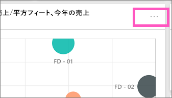
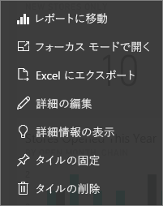

# Power BI のダッシュボードのタイル
ダッシュボードおよびダッシュボード タイルは、Power BI Desktop ではなく、Power BI サービスの機能です。 Power BI モバイルでは、ダッシュボードのタイルを作成またはピン留めすることはできませんが、[表示して共有する](mobile-tiles-in-the-mobile-apps.md)ことはできます。 また、Power BI モバイルでは、[iPhone アプリでダッシュボードに画像を追加する](mobile-iphone-app-get-started.md)ことができます。

## データのプッシュ時の

タイルは、ダッシュボードにピン留めされた、データのスナップショットです。 タイルは、レポート、データセット、ダッシュボード、Q&A ボックス、Excel、SQL Server Reporting Services (SSRS) などから作成できます。  次のスクリーンショットは、ダッシュボードにピン留めされているさまざまなタイルを示しています。

ピン留めだけでなく、[タイルの追加](service-dashboard-add-widget.md)を使ってダッシュボードに直接作成できるスタンドアロンのタイルもあります。 スタンドアロン タイルには、テキスト ボックス、画像、ビデオ、ストリーミング データ、Web コンテンツが含まれます。

Power BI を構成する要素を理解するうえで助けが必要ですか?  「[Power BI - 基本的な概念](service-basic-concepts.md)」をご覧ください。

> [!NOTE]
> タイルの作成に使った元の視覚エフェクトが変更された場合、タイルは変更されません。  たとえば、レポートからの折れ線グラフをピン留めし、折れ線グラフを横棒グラフに変更した場合でも、ダッシュボード タイルは引き続き折れ線グラフを表示します。 データは更新されますが、視覚化の種類は変更されません。
> 
> 

## ピン留めするタイルのソース
ダッシュボードにタイルを追加 (ピン留め) するには、さまざまな方法があります。 タイルは次からピン留めできます。

* [Power BI Q & A](service-dashboard-pin-tile-from-q-and-a.md)
* [レポート](service-dashboard-pin-tile-from-report.md)
* [別のダッシュボード](service-pin-tile-to-another-dashboard.md)
* [OneDrive for Business 上の Excel ブック](service-dashboard-pin-tile-from-excel.md)
* [Power BI Publisher for Excel](publisher-for-excel.md)
* [クイック分析情報](service-insights.md)
* [SSRS](https://msdn.microsoft.com/library/mt604784.aspx)

また、[[タイルの追加]](service-dashboard-add-widget.md) を使って、画像、テキスト ボックス、ビデオ、ストリーミング データ、Web コンテンツ用のスタンドアロン タイルをダッシュボードに直接作成できます。

  

## ダッシュボードのタイルと対話する
### タイルの移動とサイズ変更
タイルをつかんで、[ダッシュボード上を移動](service-dashboard-edit-tile.md)できます。 ハンドル  にマウス カーソルを置いて選ぶと、タイルのサイズを変更できます。

### タイルにカーソルを置いて動作と外観を変更する
1. タイルにマウス カーソルを置き、省略記号を表示します。
   
    
2. 省略記号を選んで、タイルの操作メニューを開きます。
   
    
   
    ここでは、次の操作を実行できます。
   
   * [このタイルの作成に使われたレポートを開く](service-reports.md)   
   
   * [このタイルの作成に使われたワークシートを開く](service-reports.md)   
     
    * [フォーカス モードで表示する](service-focus-mode.md)   
     * [タイルで使われているデータをエクスポートする](visuals/power-bi-visualization-export-data.md) 
     * [タイトルとサブタイトルの編集、ハイパーリンクの追加](service-dashboard-edit-tile.md) 
     * [インサイトを実行する](service-insights.md) 
     * [別のダッシュボードにタイルをピン留めする](service-pin-tile-to-another-dashboard.md)
       
     * [タイルの削除](service-dashboard-edit-tile.md)
     
3. 操作メニューを閉じるには、キャンバスの空白領域を選びます。

### タイルの選択 (クリック)
タイルを選択したときに次に生じる動作は、タイルの作成方法、および[カスタム リンク](service-dashboard-edit-tile.md)があるかどうかによって異なります。 カスタム リンクがある場合、タイルを選択するとそのリンクに移動します。 それ以外の場合、タイルを選択すると、そのタイルを作成するために使われたレポート、Excel Online ブック、オンプレミスの SSRS レポート、Q&A の質問に移動します。

> [!NOTE]
> 例外は、**[タイルを追加]** を使ってダッシュボードに直接作成したビデオ タイルの場合です。 (この方法で作成された) ビデオ タイルを選択すると、ダッシュボード上で直接ビデオが再生されます。   
> 
> 

## 考慮事項とトラブルシューティング
* 視覚エフェクトの作成に使われたレポートが保存されなかった場合は、タイルを選択してもアクションは発生しません。
* Excel Online のブックから作成されたタイルの場合、そのブックに対して少なくとも読み取りのアクセス許可がないと、タイルを選択したときにブックが Excel Online で開かれません。
* **[タイルの追加]** を使ってダッシュボード上に直接作成されたタイルについては、カスタム ハイパーリンクが設定されている場合は、タイトル、サブタイトル、またはタイルを選択したときにその URL が開かれます。  それ以外の場合、既定では、イメージ、Web コード、またはテキスト ボックスのためにダッシュボード上に直接作成されたこれらのタイルのいずれかを選択しても、アクションは実行されません。
* SSRS 内のレポートに対する権限がない場合、SSRS から作成されたタイルを選択すると、アクセス権がないことを示すページが生成されます (rsAccessDenied)。
* SSRS サーバーが置かれたネットワークへのアクセス権がない場合、SSRS から作成されたタイルを選択すると、サーバーが見つからないことを示すページが生成されます (HTTP 404)。 レポートを表示するには、デバイスにレポート サーバーへのネットワーク アクセスが必要です。
* タイルの作成に使った元の視覚エフェクトが変更された場合、タイルは変更されません。  たとえば、レポートからの折れ線グラフをピン留めし、折れ線グラフを横棒グラフに変更した場合でも、ダッシュボード タイルは引き続き折れ線グラフを表示します。 データは更新されますが、視覚化の種類は変更されません。

## 次の手順
[ダッシュボードのカード (大きな数字のタイル) を作成する](power-bi-visualization-card.md)

[Power BI のダッシュボード](service-dashboards.md)  

[データ更新](refresh-data.md)

[Power BI - 基本的な概念](service-basic-concepts.md)

[PowerPoint へのタイルのエクスポート](http://blogs.msdn.com/b/powerbidev/archive/2015/09/28/integrating-power-bi-tiles-into-office-documents.aspx)

[Reporting Services のアイテムを Power BI ダッシュボードにピン留めする](https://msdn.microsoft.com/library/mt604784.aspx)

他にわからないことがある場合は、 [Power BI コミュニティを利用してください](http://community.powerbi.com/)。

