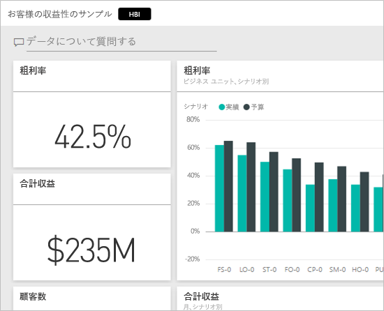
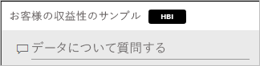
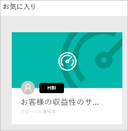
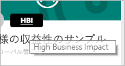
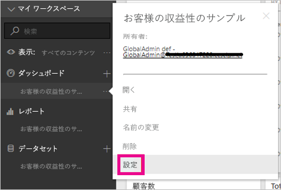
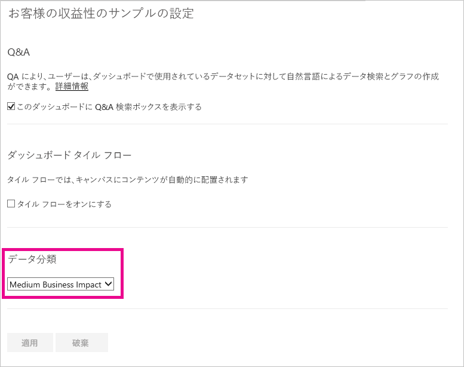
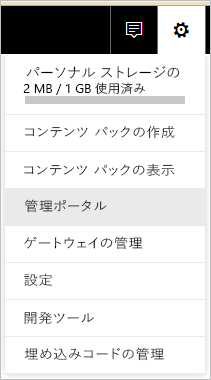
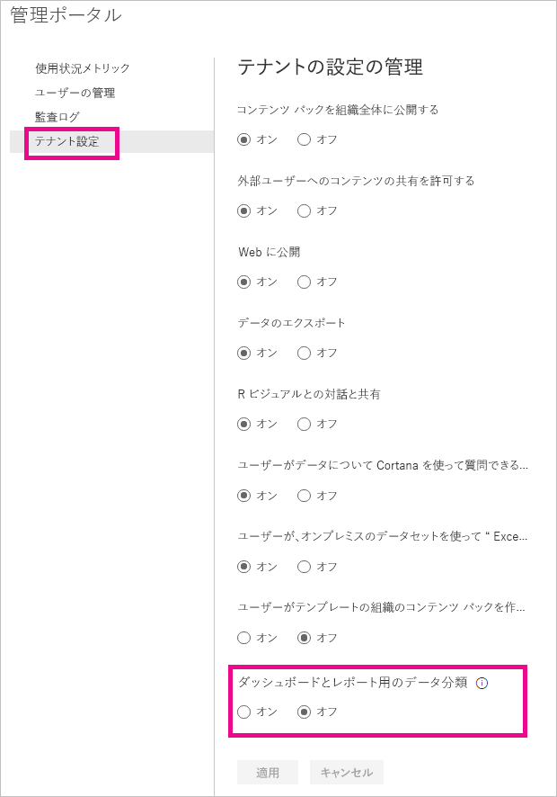
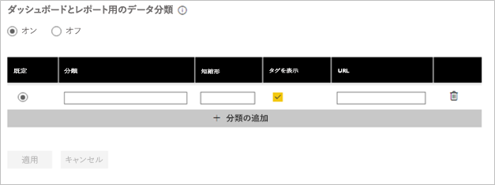
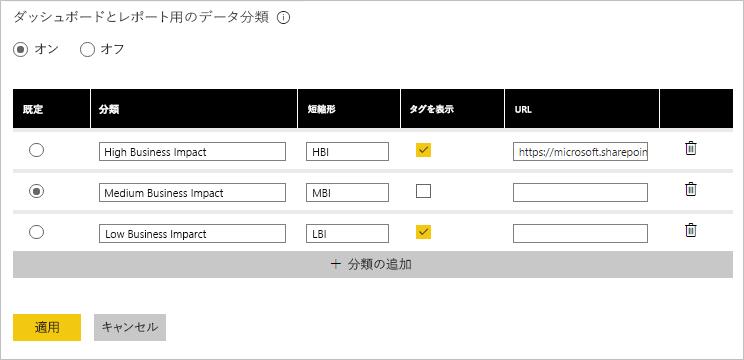

# ダッシュボードのデータの分類
すべてのダッシュボードは異なっており、接続先のデータ ソースによっては、共有を設定した人や共有する同僚がデータの機密性に応じてさまざまな予防措置を講じる必要があります。 社外の人と共有したり印刷したりしてはならないダッシュボードもあれば、自由に共有できるダッシュボードもあります。 ダッシュボードのデータの分類を使用すると、ダッシュボードを見るユーザーの、使用する必要があるセキュリティ レベルについての認識を高めることができます。 会社の IT 部門によって定義された分類でダッシュボードにタグを付けると、コンテンツを見るすべてのユーザーにデータの機密性を同じレベルで理解させることができます。

## データ分類タグ
データ分類タグはダッシュボード名の隣に表示され、誰でもそれを見ればダッシュボードとそれに含まれるデータに適用する必要のあるセキュリティのレベルを理解できます。

また、お気に入り一覧のダッシュボード タイルの横にも表示されます。

タグの上にマウス ポインターを重ねると、分類の完全な名前が表示されます。

管理者は、追加情報を提供する URL をタグに設定することもできます。

> [!NOTE]
> 管理者が設定した分類設定によっては、一部の分類の種類がダッシュボードにタグとして表示されない場合があります。 ダッシュボードの所有者は、いつでもダッシュボードの設定でダッシュボードの分類の種類を確認できます。
> 
> 

## ダッシュボードの分類の設定
会社でデータの分類が有効になっている場合、すべてのダッシュボードは最初に既定の分類の種類に設定されますが、ダッシュボードの所有者は、ダッシュボードのセキュリティ レベルと一致するように分類を変更できます。

分類の種類を変更するには、次のようにします。

1. ダッシュボード名の横にある**省略記号**を選択し、**[設定]** を選択して、ダッシュボードの設定に移動します。
   
    
2. ダッシュボードの設定では、ダッシュボードの現在の分類を確認でき、ドロップダウンを使用して分類の種類を変更できます。
   
    
3. 終了したら、**[適用]** を選択します。

変更を適用した後は、ダッシュボードを共有するすべてのユーザーに対して、次にダッシュボードの再読み込みを行った時点で、更新した内容が表示されます。

## 管理者としてのデータ分類タグの使用
データの分類は、組織のグローバル管理者によって設定されます。 データの分類を有効にするには、次のようにします。

1. [設定] の歯車を選択し、**[管理ポータル]** を選択します。
   
    
2. **[テナント設定]** タブで、**[ダッシュボードとレポート用のデータ分類]** を *[オン]* に切り替えます。
   
    

オンにすると、組織内のさまざまな分類を作成するフォームが表示されます。

各分類には、**名前**と、ダッシュボードに表示される**短縮形**があります。 各分類について、短縮形タグをダッシュボードに表示するかどうかを **[タグを表示]** で選択できます。 ダッシュボードに分類の種類を表示しない場合でも、所有者はダッシュボードの設定で種類を確認できます。 さらに、必要に応じて、組織の分類ガイドラインと使用要件の詳細が含まれる **URL** を追加できます。  

最後に決定する必要があるのは、既定値にする分類の種類です。  

フォームに分類の種類の情報を入力した後、**[適用]** を選択して変更を保存します。

この時点で、すべてのダッシュボードには既定の分類が割り当てられ、ダッシュボードの所有者は分類の種類をコンテンツに適したものに更新できるようになります。 後でこのフォームに戻り、分類の種類を追加または削除したり、既定値を変更したりできます。  

> [!NOTE]
> 後で変更するときに注意すべき重要な点がいくつかあります。
> 
> * データの分類を無効にした場合、すべてのタグは保持されません。 後で有効に戻す場合は、最初からやり直す必要があります。  
> * 分類の種類を削除すると、所有者が再び設定するまで、削除した分類の種類が割り当てられていたすべてのダッシュボードには既定の種類が割り当てられます。  
> * 既定の種類を変更すると、所有者によって分類の種類が割り当てられていないすべてのダッシュボードは、新しい既定の種類に変更されます。
> 
> 

