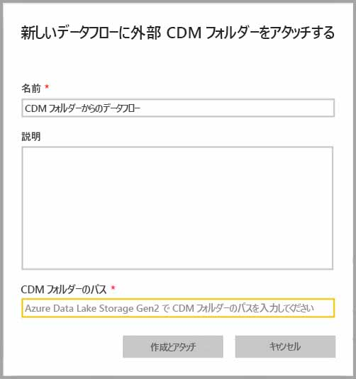
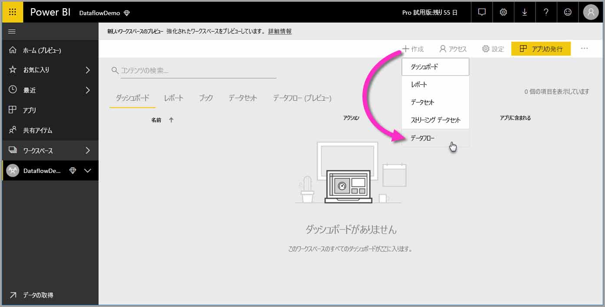
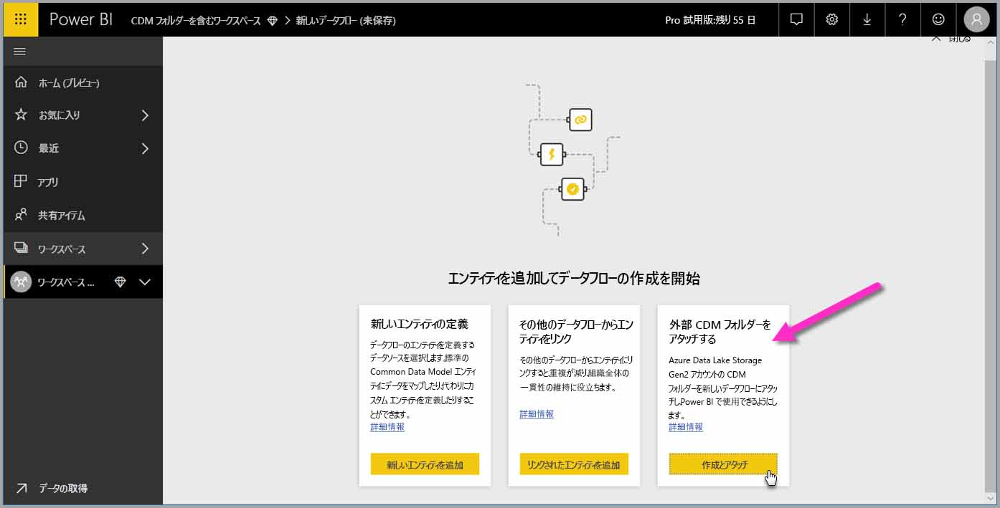

# データフローとして CDM フォルダーを Power BI へ追加する (プレビュー)

Power BI では、組織の Azure Data Lake Store Gen2 にデータフローとして格納される Common Data Model (CDM) を追加できます。 また、データフローを作成した後は、**Power BI Desktop** と **Power BI サービス**を使用して、CDM フォルダーに配置されたデータに基づいてデータセット、レポート、ダッシュボード、およびアプリを作成できます。

次の一覧に示すように、CDM フォルダーからデータフローを作成するための要件がいくつかあります。

* CDM フォルダーからのデータフローの作成は、[新しいワークスペース エクスペリエンス](service-create-the-new-workspaces.md) "*のみ*" で使用できます。 
* Power BI に CDM フォルダーを追加するには、フォルダーを追加するユーザーが、[CDM フォルダーとその中のファイルに対して承認](https://go.microsoft.com/fwlink/?linkid=2029121)されている必要があります。
* CDM フォルダー内にあるすべてのファイルとフォルダーを Power BI に追加するには、それらに対する読み取りと実行のアクセス許可が付与される必要があります。

以降のセクションでは、CDM フォルダーからデータフローを作成する方法について説明します。

> [!NOTE]
> データフローの機能はプレビュー中であり、一般公開前に変更および更新される可能性があります。

## CDM フォルダーからのデータフローの作成

CDM フォルダーからデータフローの作成を開始するには、**Power BI サービス**を起動して、左側のナビゲーション ウィンドウから**アプリのワークスペース**を選択します。 また、新しいワークスペースを作成して、そこに新しいデータフローを作成することも可能です。

次の画像に示すように、表示された画面で **[Create and attach]\(作成とアタッチ\)** を選択します。

次に表示される画面でデータフローに名前を付けて、データフローの説明を入力すると共に、組織の Azure Data Lake Gen2 アカウント内にある CDM フォルダーへのパスを入力します。 記事の中の [CDM フォルダーへのパスを取得する方法](service-dataflows-configure-workspace-storage-settings.md#get-the-uri-of-stored-dataflow-files)を説明したセクションを確認してください。 

情報を指定したら、**[Create and attach]\(作成とアタッチ\)** を選択してデータフローを作成します。

CDM フォルダーからのデータフローは、Power BI に表示されるときに、"*外部*" アイコンでマーク付けされます。 次のセクションでは、標準のデータフローと、CDM フォルダーから作成されたデータフローの間の違いについて説明します。

アクセス許可が適切に設定されたら、この記事で前述したように、**Power BI Desktop** 内のお使いのデータフローに接続できます。

## 考慮事項と制限事項

CDM フォルダーから作成されたデータフローへのアクセス許可を操作する場合、そのプロセスは Power BI の外部データソースとほぼ同じです。 アクセス許可は、Power BI 内からではなく、データ ソースで管理されます。 Power BI で的確に使用するために、アクセス許可は、CDM フォルダーから作成されたデータフローなど、データ ソース自体に対して適切に設定される必要があります。

次の一覧は、CDM フォルダーからのデータフローが Power BI でどのように使用されるかを明示しています。

Power BI Pro、Premium、および埋め込みのワークスペース:
* CDM フォルダーからのデータフローは、編集できません。
* CDM フォルダーから作成されたデータフローを読み取るためのアクセス許可は、Power BI ではなく CDM フォルダーの所有者によって管理されます。

Power BI Desktop:
* データフローが作成されたワークスペースと CDM フォルダーの両方に対して承認されているユーザーのみが、Power BI データフロー コネクターからデータにアクセスできます。

以下の一覧に示すように、追加の考慮事項もいくつかあります。

* CDM フォルダーからのデータフローの作成は、[新しいワークスペース エクスペリエンス](service-create-the-new-workspaces.md) "*のみ*" で使用できます。
* CDM フォルダーから作成されたデータフローには、リンクされたエンティティは使用できません。

**Power BI Desktop** の顧客は、データフローの所有者である場合か、データフローの CDM フォルダーに対して明示的に承認済みになっている場合を除いて、Azure Data Lake Storage Gen2 アカウント内に格納されているデータフローにはアクセスできません。 次の状況を検討します。

1.  アンナは新しいアプリのワークスペースを作成して、CDM フォルダーからのデータフローを格納するように構成しました。
2.  ベンは、アンナが作成したワークスペースのメンバーでもあり、Power BI Desktop とデータフロー コネクターを使用して、アンナが作成したデータフローからデータを取得したいと考えています。
3.  ベンは Data Lake 内のデータフローの CDM フォルダーに対して承認されたユーザーとして追加されなかったので、エラーを受信します。

    

この問題を解決するには、ベンに CDM フォルダーとその中のファイルに対する閲覧者のアクセス許可を付与する必要があります。 CDM フォルダーへのアクセス権を付与する方法については、[こちらの記事](https://go.microsoft.com/fwlink/?linkid=2029121)を参照してください。

## 次の手順

この記事では、データフロー用にワークスペース ストレージを構成する方法のガイダンスを示しました。 詳細については、以下の記事を参照してください。

データフロー、CDM、および Azure Data Lake Storage Gen2 について詳しくは、次の記事をご覧ください。

* [データフローと Azure Data Lake の統合 (プレビュー)](service-dataflows-azure-data-lake-integration.md)
* [ワークスペース データフローの設定の構成 (プレビュー)](service-dataflows-configure-workspace-storage-settings.md)
* [データフロー ストレージ用の Azure Data Lake Storage Gen2 の接続 (プレビュー)](service-dataflows-connect-azure-data-lake-storage-gen2.md)

データフロー全体について詳しくは、次の記事をご覧ください。

* [Power BI でのデータフローの作成と使用](service-dataflows-create-use.md)
* [Power BI Premium での計算されたエンティティの使用 (プレビュー)](service-dataflows-computed-entities-premium.md)
* [オンプレミス データ ソースでのデータフローの使用 (プレビュー)](service-dataflows-on-premises-gateways.md)
* [Power BI データフロー用の開発者向けリソース (プレビュー)](service-dataflows-developer-resources.md)

Azure Storage について詳しくは、次の記事をご覧ください。
* [Azure Storage セキュリティ ガイド](https://docs.microsoft.com/azure/storage/common/storage-security-guide)
* [スケジュールされた更新の構成](refresh-scheduled-refresh.md)
* [Azure Data Services から GitHub サンプルを開始する](https://aka.ms/cdmadstutorial)

Common Data Model について詳しくは、次の概要記事をご覧ください。
* [Common Data Model の概要](https://docs.microsoft.com/powerapps/common-data-model/overview)
* [CDM フォルダー](https://go.microsoft.com/fwlink/?linkid=2045304)
* [CDM モデル ファイル定義](https://go.microsoft.com/fwlink/?linkid=2045521)

また、[Power BI コミュニティへの質問の投稿](http://community.powerbi.com/)は、いつでもご利用いただけます。

