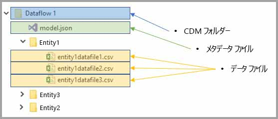
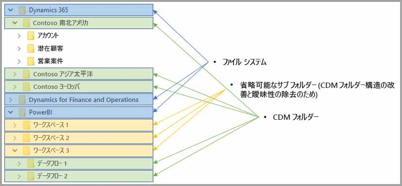

# データフローと Azure Data Lake の統合 (プレビュー)

既定では、Power BI で使用されるデータは、Power BI で利用可能な内部ストレージに保存されます。 データフローと Azure Data Lake Storage Gen2 (ADLS Gen2) を統合すると、組織の Azure Data Lake Storage Gen2 アカウントにデータフローを保存できます。 

> [!NOTE]
> データフローの機能はプレビュー中であり、一般公開前に変更および更新される可能性があります。

## CDM フォルダーとデータフローの関係

**データフロー**を使用すると、ユーザーや組織は、ばらばらのソースからデータを取りまとめてモデリング用に準備できます。 Common Data Service (CDM) により、組織は、アプリケーションおよびデプロイ全体でセマンティクスの一貫性が得られるデータ形式を使用できます。 また、Azure Data Lake Storage gen2 (ADLS Gen2) により、Azure 内の Data Lake に対して、きめ細かなアクセスと認可の制御を適用できます。 これらの要素を組み合わせると、説得力のある一元的なデータや構造化データが得られると共に、きめ細かなアクセス制御が可能になります。また、企業全体で、アプリおよび initiaties に対するセマンティクスの一貫性を実現できます。

データを CDM 形式で保存すると、組織内のアプリケーションおよびデプロイ全体でセマンティクスの一貫性が実現されます。 CDM と ADLS Gen2 を統合すると、標準 CDM 形式でスキーマ化されたデータを含む CDM フォルダーを使用して、(ADLS Gen2 に) 保存されているデータに対し、同じ構造の一貫性とセマンティクスの意味を適用できます。 Azure Data Lake 内の標準化されたメタデータと自己記述型のデータにより、メタデータの検出や、データ プロデューサーとコンシューマー (Power BI、Azure Data Factory、Azure Data Lake、Databricks、Azure Machine Learning (ML) など) 間の相互運用を簡単に行うことができます。 

データフローの定義とデータが CDM フォルダー内に保存されるときは、次の形式が使用されます。

**Model.json**
* **Model.json** メタデータ記述ファイルには、エンティティのレコード、エンティティの属性、および基礎となるデータ ファイルへのリンクに関するセマンティクス情報が含まれます。 model.json ファイルが存在するということは、CDM メタデータ形式に準拠していることを意味します。また、このファイルには、アプリケーションで利用できるすぐに使用可能な追加のリッチ セマンティクス メタデータを持つ標準エンティティを含めることができます。
* また、Power BI では、各データ ソースの情報が、Power BI サービス内のデータ フロー エディターで生成された**クエリおよび変換**と共に保存されます。 データ ソースのパスワードは、モデル ファイルには保存されません。

**データ ファイル**
* データ ファイルは、明確に定義された構造および形式で CDM フォルダー内に格納されます (後述するように、サブフォルダーはオプションです)。また、データ ファイルは、model.json ファイル内で参照されます。 現時点では、データ ファイルは、.csv 形式である必要がありますが、今後の更新で追加の形式がサポートされる可能性があります。 

次の図は、Power BI データ フローで作成されたサンプルの CDM フォルダーを示しています。このフォルダーには、3 つのエンティティが含まれています。

上図の model.json (メタデータ ファイル) は、CDM フォルダー全体を通じて、エンティティ データ ファイルへのポインターを提供します。

## Power BI による Data Lake 内での CDM フォルダーの編成

Power BI データフロー、および Power BI データフローと ADLS Gen2 の統合により、Power BI で Data Lake 内にデータを生成できます。 データ プロデューサーである Power BI では、model.json ファイルとその関連データ ファイルを含むデータ フローごとに CDM フォルダーを作成する必要があります。 Power BI では、*ファイル システム*を使用することにより、他のデータ プロデューサーとは別個にデータが保存されます。 Azure Data Lake Storage Gen2 ファイル システムと階層型名前空間の詳細については、[それらの説明記事](https://docs.microsoft.com/azure/storage/data-lake-storage/namespace)をご覧ください。

Power BI では、サブフォルダーが使用されます。これは、あいまいさを排し、**Power BI サービス**に表示されるデータをより適切に編成できるようにするためです。 フォルダーの命名および構造は、ワークスペース (フォルダー) とデータフロー (CDM フォルダー) を表します。 次の図は、Power BI とその他のデータ プロデューサーによって共有される Data Lake の構造の例を示しています。 各サービス (この場合は Dynamics 365、Dynamics for Finance and Operation、および Power BI) で、ファイルシステムが独自に作成および保守されています。 ファイル システム内の CDM フォルダーをより適切に編成できるようにするため、各サービス内のエクスペリエンスによっては、サブフォルダーが作成されます。 

## Power BI による Data Lake 内のデータの保護

Power BI では、*Active Directory OAuth ベアラー* トークンと、Azure Data Lake Storage Gen2 により提供される *POSIX ACL* 機能が使用されます。 これらの機能により、Power BI のアクセス範囲を、Data Lake 内の管理対象ファイル システムに制限できます。また、ユーザーのアクセス範囲を、自身で作成したデータフローまたは CDM フォルダーに制限できます。 

Power BI ファイル システム内で CDM フォルダーを作成および管理するには、ファイル システムに対する読み取り、書き込み、および実行権限が必要です。 Power BI 内で作成された各データフローは、専用の CDM フォルダー内に保存されます。データ フローの所有者には、CDM フォルダーとそのコンテンツに対する読み取り専用アクセス権が付与されます。 この手法により、Power BI で生成されるデータの整合性が保護され、管理者は、どのユーザーが監査ログを使用して CDM フォルダーにアクセスしたかを監視できます。 

### CDM フォルダーに対するユーザーまたはサービスの承認

Active Directory OAuth ベアラー トークンと POSIX ACL により、CDM フォルダーをデータ コンシューマー (データを読み取る必要があるユーザーやサービスなど) とより簡単に共有できるようになりました。 これにより、管理者は、どのユーザーが CDM フォルダーにアクセスしたかを監視できます。 必要なアクションは、選択した Active Directory オブジェクト (ユーザー グループやサービスなど) へのアクセス権を CDM フォルダーに付与することのみです。 データ プロデューサー以外の ID については、CDM フォルダーへのアクセス権をすべて読み取り専用として付与することをお勧めします。 これにより、プロデュ－サーで生成されるデータの整合性が保護されます。

CDM フォルダーを Power BI に追加するには、CDM フォルダーを追加するユーザーが、CDM フォルダー自体とその中のすべてのファイルやフォルダーに対して、の*読み取り*アクセス権 (ACL) を持っている必要があります。 さらには、CDM フォルダー自体とその中のすべてのフォルダーに対して、*実行*アクセス権 (ACL) も持っている必要があります。 「[Access control lists on files and directory](https://docs.microsoft.com/azure/storage/blobs/data-lake-storage-access-control#access-control-lists-on-files-and-directories)」 (ファイルとディレクトリに対するアクセス制御リスト)、および「[Best practices for using Azure Data Lake Storage Gen2](https://docs.microsoft.com/azure/storage/blobs/data-lake-storage-best-practices)」 (Azure Data Lake Storage Gen2 の使用に関するベスト プラクティス) の両方をご覧になって、詳細を確認することをお勧めします。

### 代替形式の許可

Power BI の外部のユーザーやサービスは、代替形式の許可を利用することもできます。代替形式の許可の場合、キー アクセス権を持つユーザーは、アカウント内の*すべての*リソースへのアクセスが許可されます。また、フル アクセス権を持つユーザーは、Lake 内のすべてのリソースへのアクセスが許可されます。代替形式の許可では、アクセス範囲をファイル システムや CDM フォルダーに制限することはできません。 この代替形式では、簡単にアクセス権を付与することができますが、Data Lake 内の特定のリソースを共有する機能は制限されます。また、ユーザーは、ストレージにアクセスしたユーザーを監査できません。 使用可能な許可方式の詳細については、「[Access control in Azure Data Lake Storage Gen2 article](https://docs.microsoft.com/azure/storage/blobs/data-lake-storage-access-control
)」 (Azure Data Lake Storage Gen2 でのアクセス制御に関する記事) をご覧ください。

## 次の手順

この記事では、Power BI データフロー、CDM フォルダー、および Azure Data Lake Storage Gen2 の統合の概要について説明しました。 詳細については、以下の記事をご覧ください。

データフロー、CDM、および Azure Data Lake Storage Gen2 の詳細については、次の記事をご覧ください。

* [ワークスペース データ フローの設定の構成 (プレビュー)](service-dataflows-configure-workspace-storage-settings.md)
* [データ フロー としての CDM フォルダーの Power BI への追加 (プレビュー)](service-dataflows-add-cdm-folder.md)
* [データフロー ストレージ用の Azure Data Lake Storage Gen2 の接続 (プレビュー)](service-dataflows-connect-azure-data-lake-storage-gen2.md)

データフロー全般については、次の記事をご覧ください。

* [Power BI でのデータフローの作成と使用](service-dataflows-create-use.md)
* [Power BI Premium での計算されたエンティティの使用 (プレビュー)](service-dataflows-computed-entities-premium.md)
* [オンプレミス データ ソースでのデータフローの使用 (プレビュー)](service-dataflows-on-premises-gateways.md)
* [Power BI データフロー用の開発者向けリソース (プレビュー)](service-dataflows-developer-resources.md)

Azure Storage の詳細については、次の記事をご覧ください。
* [Azure Storage セキュリティ ガイド](https://docs.microsoft.com/azure/storage/common/storage-security-guide)
* [Azure Data Services からの github サンプルの開始](https://aka.ms/cdmadstutorial)

Common Data Model について詳しくは、次の概要記事をご覧ください。
* [Common Data Model の概要](https://docs.microsoft.com/powerapps/common-data-model/overview)
* [CDM フォルダー](https://go.microsoft.com/fwlink/?linkid=2045304)
* [CDM モデル ファイル定義](https://go.microsoft.com/fwlink/?linkid=2045521)

[Power BI コミュニティへの質問](http://community.powerbi.com/)は、いつでも行うことができます。
