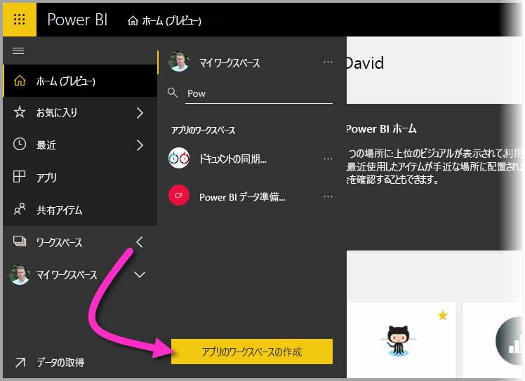
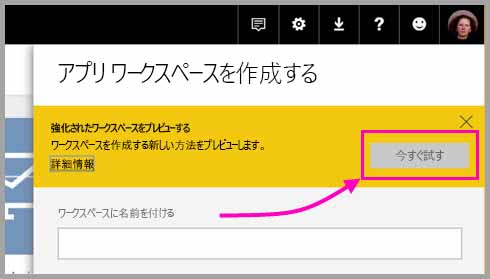
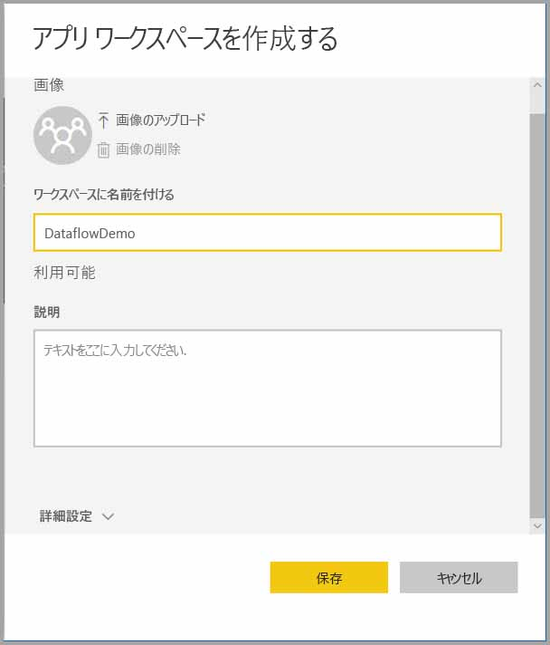
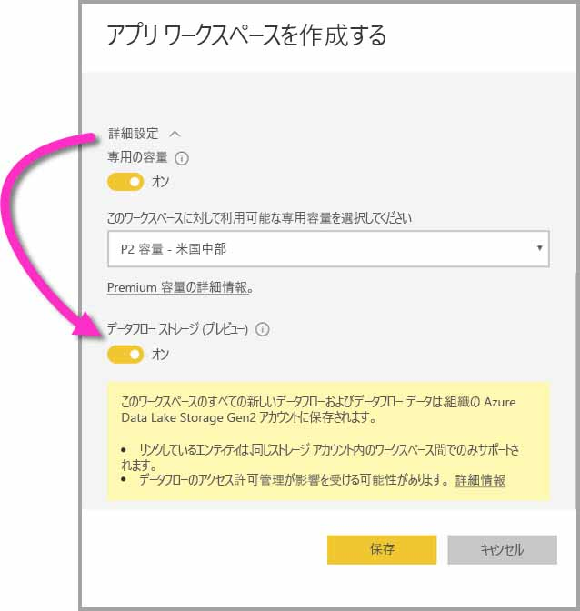
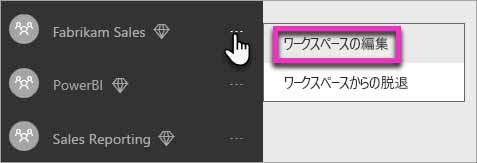
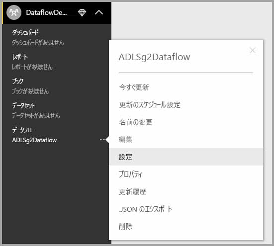

# ワークスペース データフローの設定の構成 (プレビュー)

Power BI とデータフローを使用すると、ワークスペースのデータフロー定義ファイルとデータ ファイルをお使いの Azure Data Lake Storage Gen2 アカウントに格納できます。 ワークスペース管理者はそのために、Power BI を構成できます。この記事では、これを行うために必要な手順について説明します。 

ワークスペースのデータフロー ストレージの場所を構成できるように、会社のグローバル管理者が、事前に組織のストレージ アカウントから Power BI に接続して、該当のストレージ アカウントに対するストレージ割り当てのアクセス許可を有効にしておく必要があります。 * [データフロー ストレージ用の Azure Data Lake Storage Gen2 の接続 (プレビュー)](service-dataflows-connect-azure-data-lake-storage-gen2.md) 

ワークスペースのデータフロー ストレージ設定を構成するには、次の 2 つの方法があります。 

* ワークスペースの作成時に行う
* 既存のワークスペースを編集する

以降のセクションで確認しましょう。 

> [!IMPORTANT]
> ワークスペースのデータフロー ストレージ設定は、ワークスペースにデータフローが何も含まれていない場合にのみ、変更できます。 また、この機能は、新しいワークスペース エクスペリエンスのみで利用できます。 新しいワークスペースの詳細については、「[Power BI で新しいワークスペース (プレビュー) を作成する](service-create-the-new-workspaces.md)」の記事を参照してください。

## 新しいワークスペースを作成して、そのデータフロー ストレージを構成する

Power BI サービスに新しいアプリのワークスペースを作成するには、**[ワークスペース] > [アプリのワークスペースの作成]** の順に選択します。

[アプリのワークスペースの作成] ダイアログに、**[強化されたワークスペースをプレビューする]** というタイトルの黄色いボックスが表示されます。 この領域で、**[今すぐ試す]** を選択します。

表示されたダイアログ ボックスで、新しいワークスペースに一意の名前を付けることができます。 詳細設定を行う必要があるので、まだ **[保存]** を選択しないでください。

次に、**[アプリのワークスペースの作成]** ダイアログの **[詳細]** 領域を展開します。ここで、**[データフロー ストレージ (プレビュー)]** 設定を有効にできます。

**[保存]** を選択して、新しいワークスペースを作成します。 これで、このワークスペースに作成された新しいデータフローでは、組織の Azure Data Lake Storage Gen2 アカウント内に定義ファイル (Model.json ファイル) とデータを格納できるようになりました。 

> [!NOTE]
> データフローの機能はプレビュー中であり、一般公開前に変更および更新される可能性があります。

## 既存のワークスペースのデータフロー ストレージを更新する

別の方法として、新しいワークスペースを作成するために、既存のワークスペースを更新して、組織の Azure Data Lake Storage Gen2 アカウントに定義ファイルとデータを格納できます。 ワークスペースにデータフローがまだ何も含まれていない場合しか、データフロー ストレージの設定を変更できないことに注意してください。

アプリのワークスペースを編集するには、省略記号 **(...)** を選択して、**[ワークスペースの編集]** を選択します。 

表示された **[ワークスペースの編集]** ウィンドウで、**[詳細設定]** を展開して、**[データフロー ストレージ (プレビュー)]** 設定を **[オン]** にします。 

![データフロー ストレージを [オン] にする](media/service-dataflows-configure-workspace-storage-settings/dataflow-storage-settings_06.jpg)

**[保存]** を選択すると、そのワークスペースに作成された新しいデータフローでは、組織の Azure Data Lake Storage Gen2 アカウント内に定義ファイルとデータが格納されます。

## 格納されたデータフロー ファイルの URI を取得する

組織の Azure Data Lake アカウントに割り当てられたワークスペース内にデータフローを作成すると、その定義ファイルとデータ ファイルに直接アクセスできます。 ファイルの場所は、**[データフローの設定]** ページで利用できます。 このページを表示するには、次の手順に従います。

ワークスペースの **[データフロー]** 下に一覧表示されたデータフローの横にある省略記号 **(...)** を選択します。 表示されたメニューで、**[設定]** を選択します。

次の画像に示すように、表示された情報の中の **[データフロー ストレージの場所]** の下に、データフローの CDM フォルダーの場所が表示されます。

> [!NOTE]
> Power BI では、データフロー ファイルが格納された CDM フォルダーに対して閲覧者のアクセス許可を持つデータフロー所有者を構成します。 他のユーザーやサービスにデータフロー ストレージの場所へのアクセス権を付与する場合、ストレージ アカウントの所有者が Azure でのアクセス権を付与する必要があります。

## 考慮事項と制限事項

データフロー ストレージが Azure Data Lake Storage Gen2 内にある場合、特定のデータフロー機能がサポートされません。 

Power BI Pro、Premium、および埋め込みのワークスペース:
* **リンクされたエンティティ**機能は、同じストレージ アカウント内のワークスペース間でのみサポートされます。
* Azure Data Lake Storage Gen2 に格納されたデータフローに対しては、ワークスペースのアクセス許可は適用されません。アクセスできるのは、データフローの所有者だけです。
* 上記以外の点では、データ準備機能はすべて、Power BI ストレージ内に格納されてるデータフローの場合と同じです。

以下の一覧に示すように、追加の考慮事項もいくつかあります。

* データフロー ストレージの場所は、一度構成したら変更できません。
* Azure Data Lake Storage Gen2 内に格納されているデータフローの所有者だけが、そのデータにアクセスできます。
* Power BI の共有容量にあるオンプレミス データ ソースは、組織の Azure Data Lake Storage Gen2 に格納されているデータフローではサポートされません。

**Power BI Desktop** の顧客は、データフローの所有者である場合を除いて、Azure Data Lake Storage Gen2 アカウント内に格納されているデータフローにはアクセスできません。 次の状況を検討します。

1.  アンナは新しいアプリのワークスペースを作成して、組織内の Data Lake にデータフローを格納するように構成しました。
2.  ベンは、アンナが作成したワークスペースのメンバーでもあり、Power BI Desktop とデータフロー コネクターを使用して、アンナが作成したデータフローからデータを取得することを考えています。
3.  ベンは Data Lake 内のデータフローの CDM フォルダーに対して承認されたユーザーとして追加されなかったので、エラーを受信します。

    

## 次の手順

この記事では、データフロー用にワークスペース ストレージを構成する方法のガイダンスを示しました。 詳細については、以下の記事を参照してください。

データフロー、CDM、および Azure Data Lake Storage Gen2 について詳しくは、次の記事をご覧ください。

* [データフローと Azure Data Lake の統合 (プレビュー)](service-dataflows-azure-data-lake-integration.md)
* [データフローとして CDM フォルダーを Power BI へ追加する (プレビュー)](service-dataflows-add-cdm-folder.md)
* [データフロー ストレージ用の Azure Data Lake Storage Gen2 の接続 (プレビュー)](service-dataflows-connect-azure-data-lake-storage-gen2.md)

データフロー全般については、次の記事をご覧ください。

* [Power BI でのデータフローの作成と使用](service-dataflows-create-use.md)
* [Power BI Premium での計算されたエンティティの使用 (プレビュー)](service-dataflows-computed-entities-premium.md)
* [オンプレミス データ ソースでのデータフローの使用 (プレビュー)](service-dataflows-on-premises-gateways.md)
* [Power BI データフロー用の開発者向けリソース (プレビュー)](service-dataflows-developer-resources.md)

Azure Storage の詳細については、次の記事をご覧ください。

* [Azure Storage セキュリティ ガイド](https://docs.microsoft.com/azure/storage/common/storage-security-guide)
* [Azure Data Services からの github サンプルの開始](https://aka.ms/cdmadstutorial)

Common Data Model について詳しくは、次の概要記事をご覧ください。

* [Common Data Model の概要](https://docs.microsoft.com/powerapps/common-data-model/overview)
* [CDM フォルダー](https://go.microsoft.com/fwlink/?linkid=2045304)
* [CDM モデル ファイル定義](https://go.microsoft.com/fwlink/?linkid=2045521)

[Power BI コミュニティへの質問](http://community.powerbi.com/)は、いつでも行うことができます。
