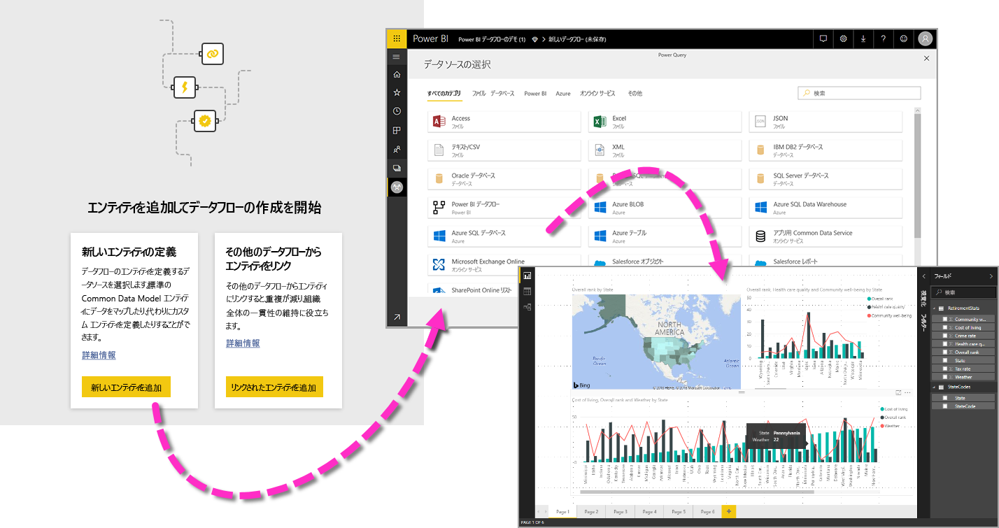
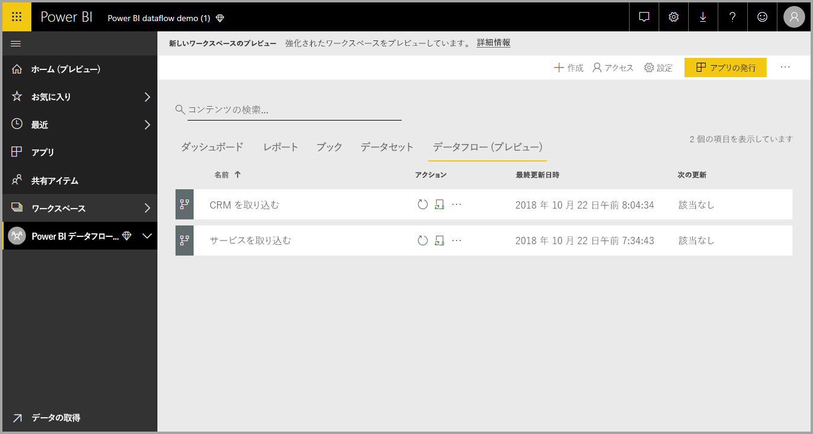
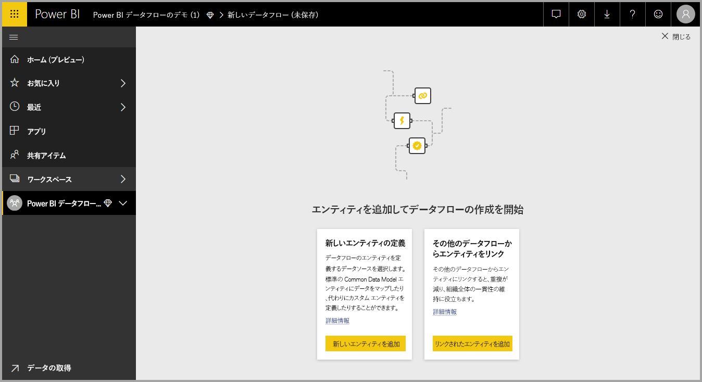
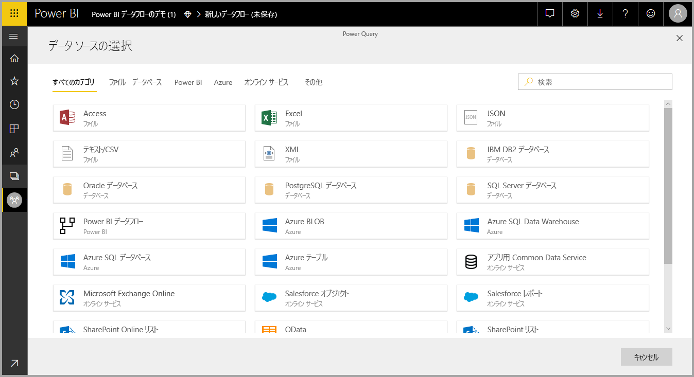
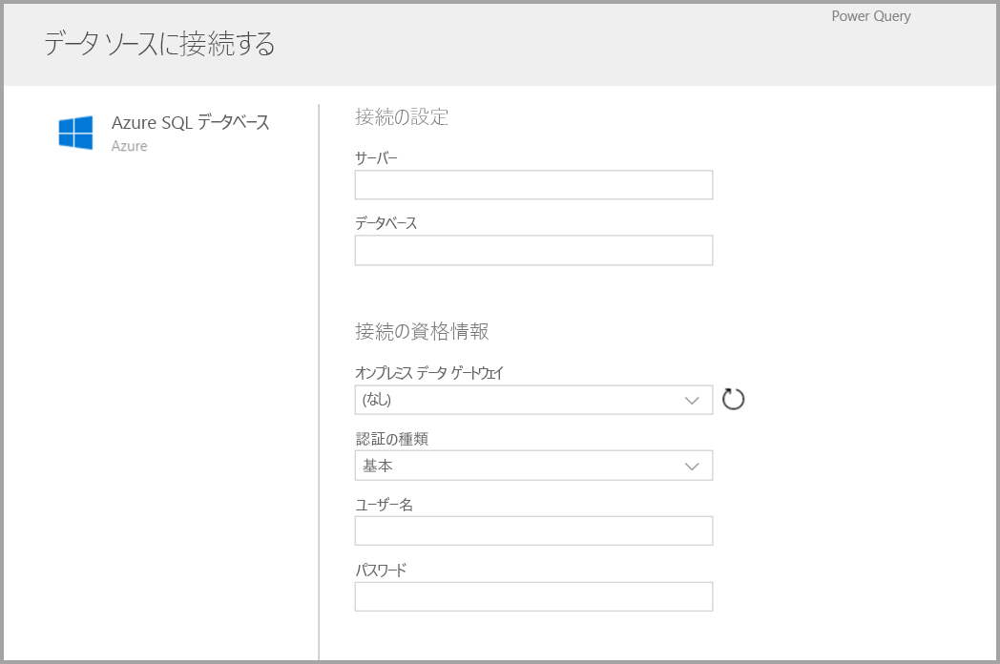
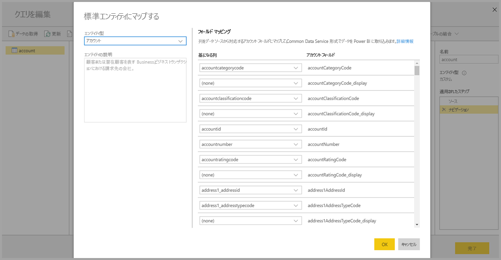
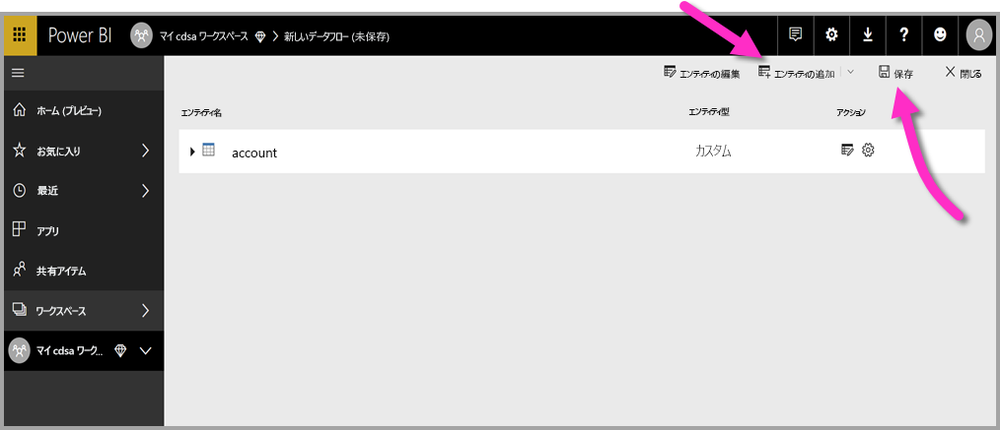
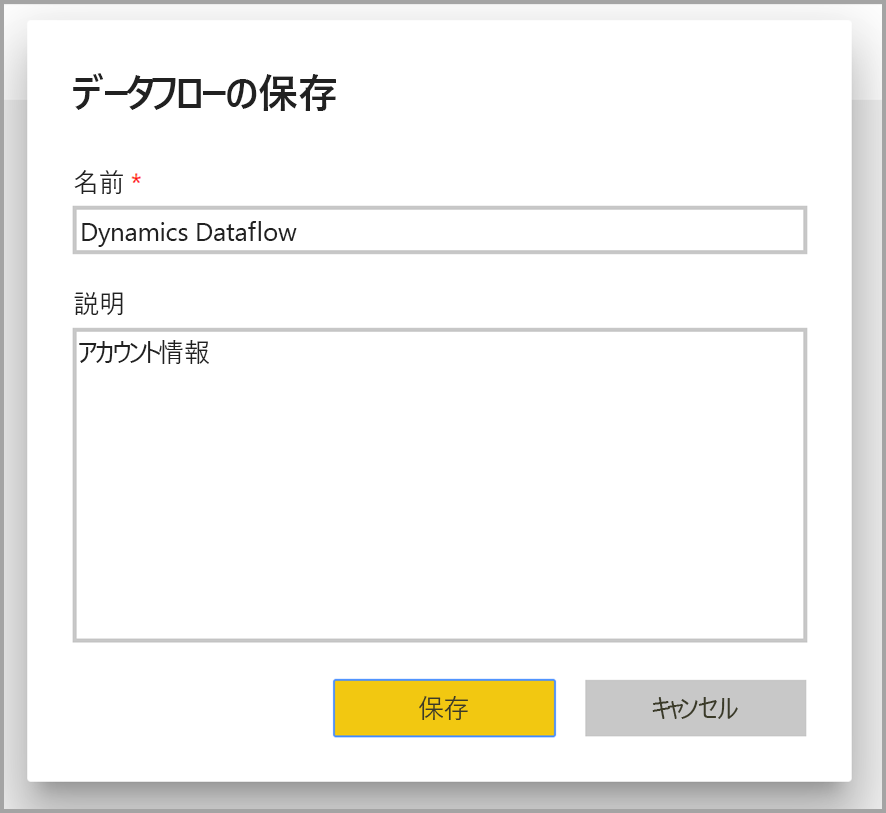
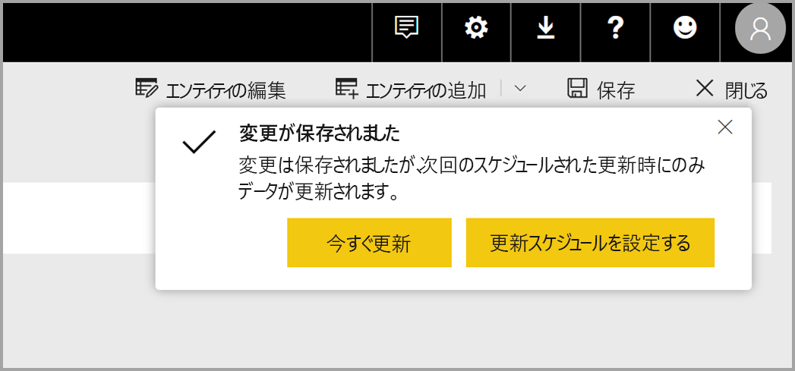
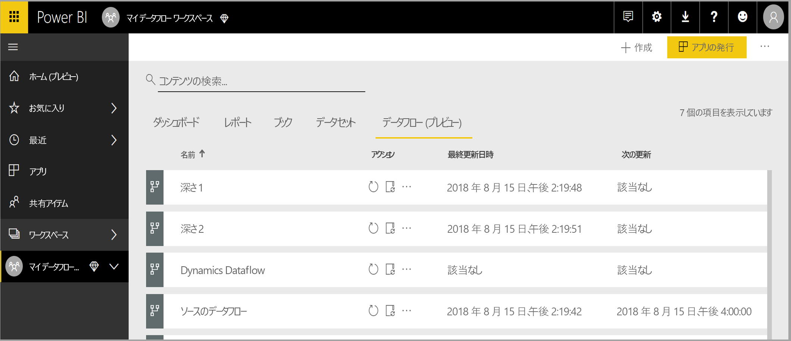

# Power BI でのデータフローの作成と使用

**Power BI** で使用できる高度なデータ準備では、データフローと呼ばれるデータのコレクションを作成することができ、それを使用して、さまざまなソースからのビジネス データに接続し、データをクリーンアップし、変換して、Power BI のストレージに読み込むことができます。

**データフロー**は、Power BI サービス内のアプリ ワークスペースで作成されて管理される "*エンティティ*" (エンティティはテーブルに似ています) のコレクションです。 データフローを作成したワークスペースから直接、データフロー内のエンティティの追加と編集や、データ更新スケジュールの管理を行うことができます。

データ フローを作成した後は、**Power BI Desktop** と **Power BI サービス**を使用して、Power BI データフローに取り込んだデータに基づくデータセット、レポート、ダッシュボード、アプリを作成し、それによってビジネス アクティビティについての分析情報を取得できます。

データフローを使用するには 3 つの主な手順があります。

1. 簡単に作業できるように設計された Microsoft のツールを使用して、データ フローを作成します
2. データフローに取り込むデータの更新頻度をスケジュールします
3. Power BI Desktop を使用して、データフローからデータセットを構築します 

以下のセクションでは、これらの各手順について説明し、各手順を完了するために提供されているツールに慣れます。 開始しましょう。

## データフローの作成
データフローを作成するには、ブラウザーで Power BI サービスを起動し、次の画面のように、左側のナビゲーション ウィンドウから**アプリ ワークスペース**を選択します (データフローは、Power BI サービスの*マイ ワークスペース*では使用できません)。 新しいデータフローを作成するワークスペースを新しく作成することもできます。 

データフローを作成できる**アプリ ワークスペース**領域に入ると、キャンバスの右上隅に **[+ 作成]** ボタンが表示されます。 **[+ 作成]** ボタンを選択した後、ドロップダウン リストから **[データフロー]** を選択します。 

データフローの "*所有者は 1 人*" だけであり、そのデータフローを作成したユーザーであることを、理解しておくことが重要です。 所有者だけがデータフローを編集できます。 後で説明するように、データフローが作成されるアプリ ワークスペースに対する読み取りまたは書き込みアクセス許可を持っている**アプリ ワークスペース**のすべてのメンバーが、**Power BI Desktop** 内からデータフローに接続できます。

![データフローを作成するための Power BI サービスの [+ 作成] ボタン](media/service-dataflows-create-use/dataflows-create-use_03a.png)

そこから、**エンティティ**を追加します (次のセクションでさらに説明します)。

### エンティティを追加する

**エンティティ**は、データベース内のテーブルと同様に、データを格納するために使用される一連のフィールドです。 次の図では、Power BI にデータを取り込むことができるデータ ソースの選択が示されています。

次の図のように、データ ソースを選択すると、データ ソースに接続するときに使用するアカウントなどの接続設定を指定するように求められます。

接続したら、エンティティに使用するデータを選択できます。 データとソースを選択すると、それ以降、Power BI は、データフロー内のデータを最新に維持するため、セットアップ プロセスの後半で選択する頻度で、データ ソースに再接続します。

エンティティで使用するデータを選択した後は、データフロー エディターを使用して、データフローで使用するために必要な形式に、データを整形または変換できます。

### データフロー エディターの使用

エンティティに使用するデータをソースから選択した後は、**Power BI Desktop** の **Power Query エディター**に似た Power Query 編集エクスペリエンスを使用して、エンティティで最適に動作する形式にデータの選択を整形できます。 Power Query (Power Query は、Power BI Desktop に Power Query エディターとして組み込まれています) について詳しくは、Power BI Desktop の[クエリの概要に関する記事](desktop-query-overview.md)をご覧ください。 

クエリ エディターが各手順で作成しているコードを表示する場合や、独自の整形コードを作成する場合は、 **詳細設定エディター**を使用できます。 

### データフローと Common Data Model (CDM)

データフローのエンティティに含まれる新しいツールを使用すると、Common Data Model (Microsoft の標準化されたスキーマ) にビジネス データを簡単にマップし、Microsoft やサード パーティのデータで補強して、機械学習に簡単にアクセスできます。 これらの新機能を活用することで、ビジネス データに関するインテリジェントでアクションにつながる分析情報を提供できます。 クエリの編集ステップでの変換が完了すると、データ ソース テーブルの列を、Common Data Model で定義されている標準エンティティのフィールドにマップできます。 標準エンティティには、Common Data Service によって定義された既知のスキーマがあります。

この方法の詳細および Common Data Model については、「[Common Data Model とは](https://docs.microsoft.com/powerapps/common-data-model/overview)」をご覧ください。

データフローで Common Data Model を利用するには、 **[クエリを編集]** ダイアログで **[標準にマップする]** 変換をクリックします。 **[エンティティのマップ]** 画面が表示されたら、マップする標準エンティティを選択できます。

標準フィールドにソース列をマップすると、以下のことが行われます。

1. ソース列が、標準フィールドの名前になります (名前が異なる場合、列の名前が変更されます)
2. ソース列が、標準フィールドのデータ型になります

Common Data Model の標準エンティティを維持するため、マップされていないすべての標準フィールドには *Null* 値が設定されます。

マッピングの結果がカスタム フィールドを含む標準エンティティになるように、マップされていないすべてのソース列はそのまま残ります。

選択が完了し、エンティティとそのデータ設定を保存する準備ができたら、メニューから **[保存]** を選択できます。 **[エンティティの追加]** ボタン選択して複数のエンティティを作成できること、およびエンティティを編集して作成したクエリとエンティティを微調整できることに注意してください。

**[保存]** を選択すると、データフローの名前を指定し、説明を入力するように求められます。

準備が完了して **[保存]** ボタンを選択するとウィンドウが表示され、**データフロー**が作成されたことを確認できます。 

これで次のステップの準備ができました。次のステップでは、データ ソースの更新頻度のスケジュールを設定します。

## 更新頻度のスケジュールを設定する

データフローを保存した後、接続されている各データ ソースの更新頻度をスケジュールします。

Power BI のデータフローでは、Power BI のデータ更新プロセスを使用して、データが最新に状態に保たれます。 次の図のように、**Power BI サービス**の**アプリ ワークスペース** セクションには、データフローなどのユーザーの情報を一覧表示できる領域のコレクションがあります。

上の図の *Dynamics Dataflow* というエントリは、前のセクションで作成したデータフローです。 更新のスケジュールを設定するには、次の図のように、 **[アクション]** セクションで **[更新のスケジュール設定]** アイコンを選択します。 

![[アクション] セクションの [更新のスケジュール設定] ボタン](media/service-dataflows-create-use/dataflows-create-use_13.png)

**[更新のスケジュール設定]** アイコンを選択すると移動する **[更新のスケジュール設定]** ウィンドウでは、データフローの更新頻度と時刻を設定することができます。

更新のスケジュール設定について詳しくは、Power BI データセットの更新動作について説明されている「[スケジュールされた更新の構成](refresh-scheduled-refresh.md)」をご覧ください。 更新の設定に関しては、データフローの動作は Power BI データセットの動作と同じです。 

## Power BI Desktop でデータフローに接続する

データフローを作成し、モデルを設定する各データ ソースの更新頻度をスケジュールした後は、3 番目の最後のステップである、**Power BI Desktop** 内からデータフローに接続する準備ができます。 

データフローに接続するには、次の図に示すように、Power BI Desktop で **[データを取得] > [Power BI] > [Power BI データフロー (ベータ)]** の順に選択します。

そこからデータフローを保存した**アプリ ワークスペース**に移動し、データフローを選択して、一覧から作成したエンティティを選択します。

ウィンドウの上部にある**検索バー**を使用して、多くのデータフロー エンティティの中から目的のデータフローまたはエンティティの名前をすばやく検索することもできます。

エンティティを選択して **[読み込み]** ボタンを選択すると、**Power BI Desktop** の **[フィールド]** ウィンドウにエンティティが表示され、他のデータ セットからの**テーブル**と同じように表示されて動作します。

## Azure Data Lake Storage Gen2 に格納されたデータ フローの使用

組織によっては、データ フローの作成と管理に独自のストレージを使用することを希望する場合があります。 要件に従い、アクセス許可を適切に管理する場合は、データ フローを Azure Data Lake Storage Gen2 と統合することができます。 概要ドキュメント「[データフローと Azure Data Lake の統合 (プレビュー)](service-dataflows-azure-data-lake-integration.md)」を始めとする、このアプローチのすべての要件に関するドキュメントが用意されています。

## データ接続のトラブルシューティング

データフローに対するデータ ソースに接続したときに問題が発生する場合があります。 このセクションでは、そのような問題が発生したときのトラブルシューティングのヒントを提供します。 

* **Salesforce コネクタ** - データフローで Salesforce の試用版アカウントを使用すると、情報が提供されずに接続エラーになります。 これを解決するには、運用環境の Salesforce アカウントまたはテスト用の開発者アカウントを使用します。

* **SharePoint コネクタ** - サブフォルダーまたはドキュメントを含めずに、SharePoint サイトのルート アドレスを指定していることを確認します。 たとえば、 https://microsoft.sharepoint.com/teams/ObjectModel/ のようなリンクを使用します。 

* **JSON ファイル コネクタ** - 現在、JSON ファイルに接続する方法は基本認証のみです。  URL (たとえば https://XXXXX.blob.core.windows.net/path/file.json?sv=2019-01-01&si=something&sr=c&sig=123456abcdefg...) 内での資格情報の入力による JSON ファイルへの接続は、現在サポートされて**いません**。  

* **Azure SQL Data Warehouse** - データフローは現在、Azure SQL Data Warehouse での Azure Active Directory (AAD) 認証をサポートしていません。 このシナリオでは、基本認証を使用します。

## 次の手順

この記事では、独自の**データフロー**を作成する方法、および **Power BI Desktop** でデータセットとレポートを作成してそれを利用する方法を説明しました。 データフローを使用する場合の詳細およびシナリオについては、以下の記事が役に立ちます。

* [データフローを使用したセルフサービスのデータ作成](service-dataflows-overview.md)
* [Power BI Premium で計算されたエンティティの使用](service-dataflows-computed-entities-premium.md)
* [オンプレミス データ ソースでのデータフローの使用](service-dataflows-on-premises-gateways.md)
* [Power BI のデータフローに関する開発者向けリソース](service-dataflows-developer-resources.md)
* [データフローと Azure Data Lake の統合 (プレビュー)](service-dataflows-azure-data-lake-integration.md)

Common Data Model について詳しくは、次の概要記事をご覧ください。
* [Common Data Model の概要](https://docs.microsoft.com/powerapps/common-data-model/overview)
* [Common Data Model のスキーマとエンティティの詳細について GitHub で学習する](https://github.com/Microsoft/CDM)

Power BI Desktop の関連記事:

* [Power BI Desktop から Power BI サービスのデータセットに接続する](desktop-report-lifecycle-datasets.md)
* [Power BI Desktop でのクエリの概要](desktop-query-overview.md)

Power BI サービスの関連記事:
* [スケジュールされた更新の構成](refresh-scheduled-refresh.md)
