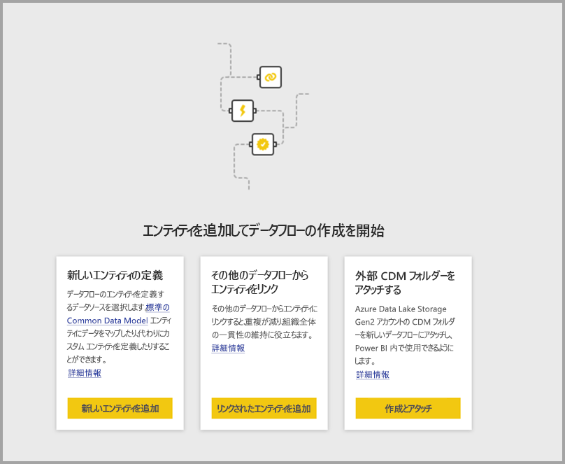
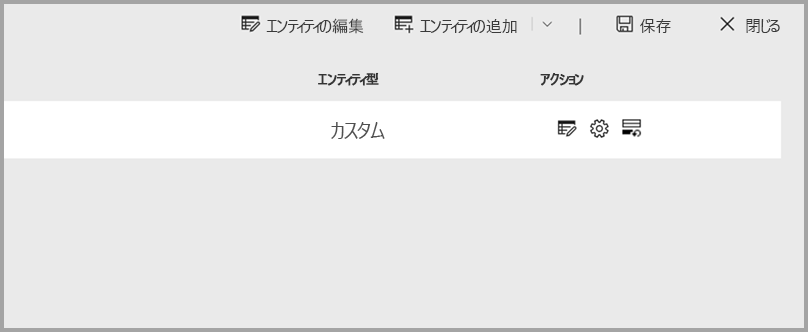
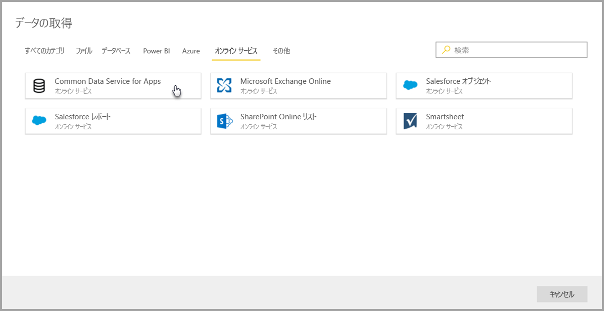
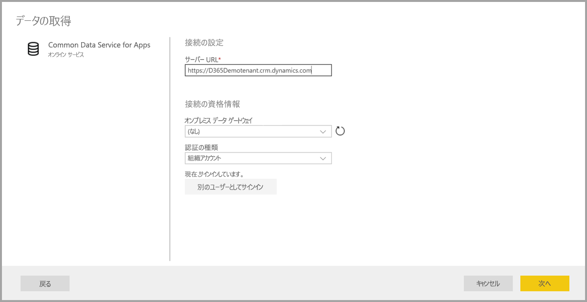
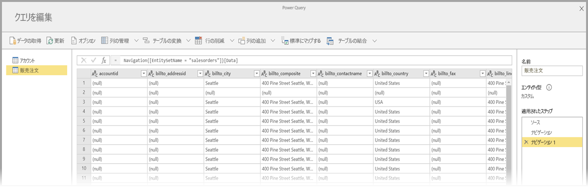
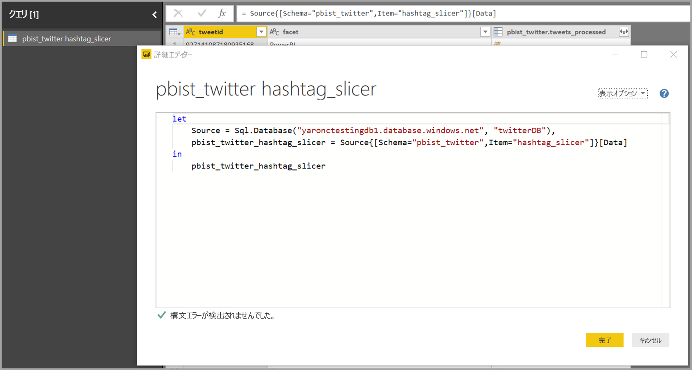
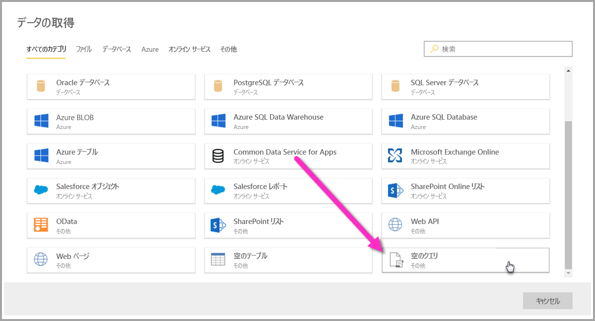
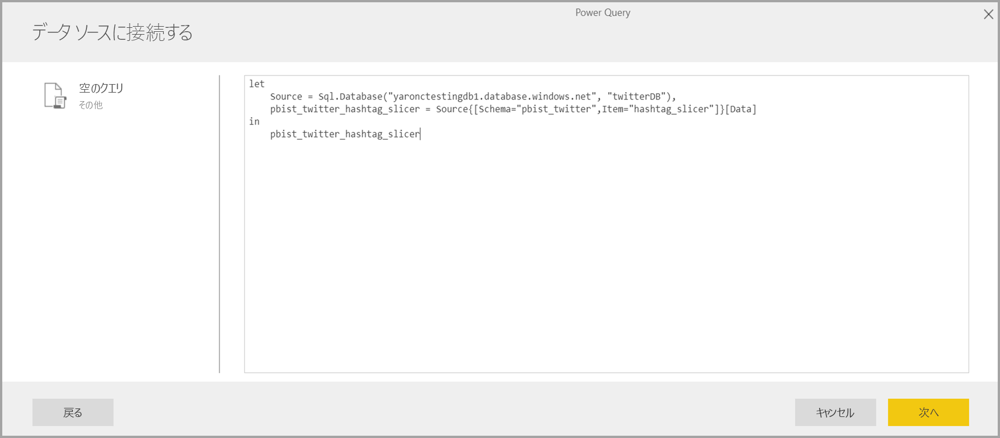

# Power BI データフロー用のデータ リソースに接続する (プレビュー)

Power BI データフローを利用すると、さまざまなデータ ソースに接続し、新しいデータフローを作成したり、新しいエンティティを既存のデータフローに追加したりできます。

この記事では、データフローを作成するためやデータフローに追加するために利用できるさまざまなデータ ソースを挙げ、そのようなデータ ソースを利用してデータフローを作成する方法について説明します。

作成して、データフローを使用する方法の概要については、次を参照してください。[を作成すると、Power BI (プレビュー) でのデータフローを使用して](service-dataflows-create-use.md)します。

## データ ソースからデータフローを作成する

データに接続するには、**Power BI サービス**からメニュー アイテムの **[+ 作成]** を選択し、表示されたメニューから **[データフロー]** を選択します。 選択すると、Power BI サービスのキャンバスに次の画像が表示されます。 

データフローが既に存在する場合、下の画像のように **[エンティティの追加]** を選択するか、データフロー作成ツールで **[データの取得]** を選択することで新しいエンティティをデータフローに追加できます。

次の画像では、データフロー作成ツールの **[データの取得]** ボタンを確認できます。 

![[データの取得] を利用してエンティティを追加する](media/service-dataflows-data-sources/dataflows-data-sources_03.png)

## データフローのデータ ソース

データフロー作成ツールから **[データの取得]** を選択することで利用可能なデータ ソースを表示できます。[データの取得] を選択すると、次の画像のように、カテゴリと各データ ソースを選択するためのダイアログが表示されます。

![データフローの [データの取得] の各種カテゴリ](media/service-dataflows-data-sources/dataflows-data-sources_04.png)

データフローのデータ ソースは次のカテゴリに整理され、**[データの取得]** ダイアログの上部に並べて表示されます。

* すべてのカテゴリ
* ファイル
* データベース
* Power BI
* Azure
* オンライン サービス
* その他

**[すべてのカテゴリ]** カテゴリには、全カテゴリの全データ ソースが含まれています。 

**[ファイル]** カテゴリには、次のデータフロー用データ接続が含まれています。

* アクセス
* Excel
* JSON
* テキスト/CSV
* XML

**[データベース]** カテゴリには、次のデータフロー用データ接続が含まれています。

* IBM DB2 データベース
* MySQL データベース
* Oracle データベース
* PostgreSQL データベース
* SQL Server データベース
* Sybase データベース
* Teradata データベース

**[Power BI]** カテゴリには、次のデータフロー用データ接続が含まれています。

* Power BI データフロー

**[Azure]** カテゴリには、次のデータフロー用データ接続が含まれています。

* Azure BLOB
* Azure Data Explorer
* Azure SQL Data Warehouse
* Azure SQL Database
* Azure テーブル

**[オンライン サービス]** には、次のデータフロー用データ接続が含まれています。

* アプリ用 Common Data Service
* Microsoft Exchange Online
* Salesforce オブジェクト
* Salesforce レポート
* SharePoint Online リスト
* Smartsheet

**[その他]** カテゴリには、次のデータフロー用データ接続が含まれています。

* Active Directory
* OData
* SharePoint リスト
* Web API
* Web ページ
* 空のテーブル
* 空のクエリ

## データ ソースに接続する

データ ソースに接続するには、データ ソースを選択します。 今回、例を 1 つ取り上げてこのプロセスのしくみを説明しますが、データフロー用データ接続ではプロセスはどれも似ています。 コネクタが異なれば、特定の資格情報やその他の情報が必要になることがありますが、フローは同じようなものです。 今回の例では、次の画像でご覧いただけるように、**[オンライン サービス]** というデータ接続カテゴリから **[Common Data Service for Apps]** が選択されています。

選択したデータ接続の接続ウィンドウが表示されます。 資格情報が必要な場合には、入力を求めるプロンプトが表示されます。 次の画像では、Common Data Service for Apps サーバーに接続する目的でサーバー URL が入力されています。

サーバー URL やリソース接続情報を指定したら、**[サインイン]** を選択し、データ アクセスに利用する資格情報を入力し、**[次へ]** を選択します。

**Power Query Online** によってデータ ソースへの接続が開始され、確立されます。その後、次の画像のように、**[ナビゲーター]** ウィンドウにそのデータ ソースで利用できるテーブルが表示されます。

![[ナビゲーター] ウィンドウにデータ ソースのテーブルが表示される](media/service-dataflows-data-sources/dataflows-data-sources_07.png)

左側のウィンドウで各テーブルの横にあるチェックボックスを選択することで、読み込むテーブルとデータを選択できます。 データを読み込むには、**[ナビゲーター]** ウィンドウの下部にある **[OK]** を選択します。 [Power Query Online] ダイアログが表示されます。このダイアログでは、クエリを編集したり、選択したデータに実行するその他のあらゆる変換を実行したりできます。

これで完了です。 他のデータ ソースの場合もフローは同じようなものです。Power Query Online を使用し、データフローに入れるデータを編集したり、変換したりします。

## 追加のデータ ソースに接続する

Power BI データフロー ユーザー インターフェイスに表示されない追加データ コネクタがありますが、数個の追加手順でサポートされます。 

ユーザー インターフェイスに表示されないコネクタへの接続は次の手順で作成できます。

1. **Power BI Desktop** を開き、**[データの取得]** を選択します。
2. Power BI Desktop で **Power Query エディター**を開き、関連クエリを右クリックし、次の画像のように、**[詳細エディター]** を開きます。 そこから、詳細エディターに表示されている M スクリプトをコピーできます。

     

3. Power BI データフローを開き、次の画像のように、空のクエリに対して **[データの取得]** を選択します。

     

4. コピーしたクエリをデータフローの空のクエリに貼り付けます。

     

指定したデータ ソースにスクリプトが接続されます。 

以下は、M クエリをコピーし、空のクエリに貼り付けることで使用できるコネクタの現時点の一覧です。

* Amazon Redshift
* SAP Business Warehouse 
* SAP HANA
* Analysis Services
* Azure analysis Services
* Google アナリティクス
* Adobe Analytics
* ODBC
* OLE DB
* フォルダー
* SharePoint Online フォルダー
* SharePoint フォルダー
* Hadoop HDFS
* Azure HDInsight (HDFS)
* Hadoop ファイル HDFS
* Informix (ベータ)
* Vertica

Power BI データフローのデータ ソースに接続する作業はこれで完了です。

## 次の手順

この記事では、データフローで接続できるデータ ソースについて説明しました。 以下の記事では、データフローの一般的な使用シナリオについてさらに詳しく説明します。 

* [Power BI でのセルフサービスのデータ準備 (プレビュー)](service-dataflows-overview.md)
* [Power BI でのデータフローの作成と使用](service-dataflows-create-use.md)
* [Power BI Premium での計算されたエンティティの使用 (プレビュー)](service-dataflows-computed-entities-premium.md)
* [オンプレミス データ ソースでのデータフローの使用 (プレビュー)](service-dataflows-on-premises-gateways.md)
* [Power BI データフロー用の開発者向けリソース (プレビュー)](service-dataflows-developer-resources.md)
* [データフローと Azure Data Lake の統合 (プレビュー)](service-dataflows-azure-data-lake-integration.md)

Power Query とスケジュールされた更新について詳しくは、次の記事をご覧ください。
* [Power BI Desktop でのクエリの概要](desktop-query-overview.md)
* [スケジュールされた更新の構成](refresh-scheduled-refresh.md)

Common Data Model について詳しくは、次の概要記事をご覧ください。
* [Common Data Model の概要](https://docs.microsoft.com/powerapps/common-data-model/overview)

