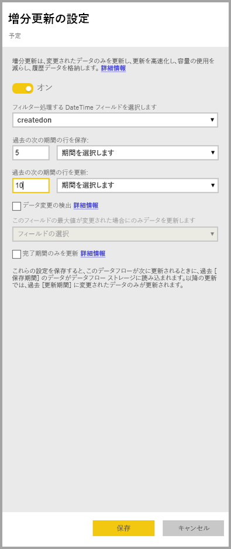
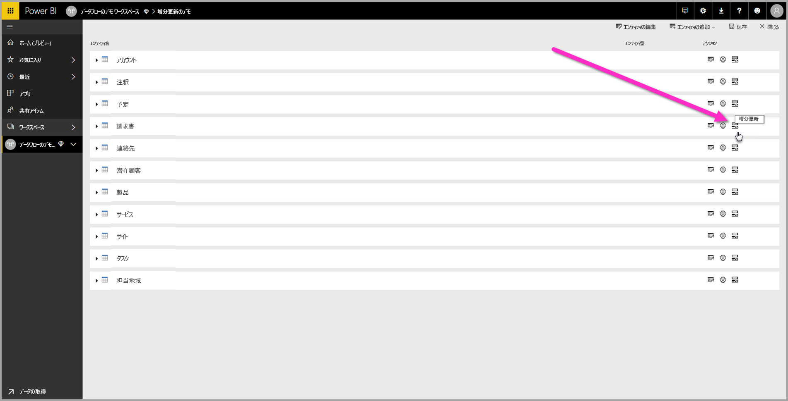
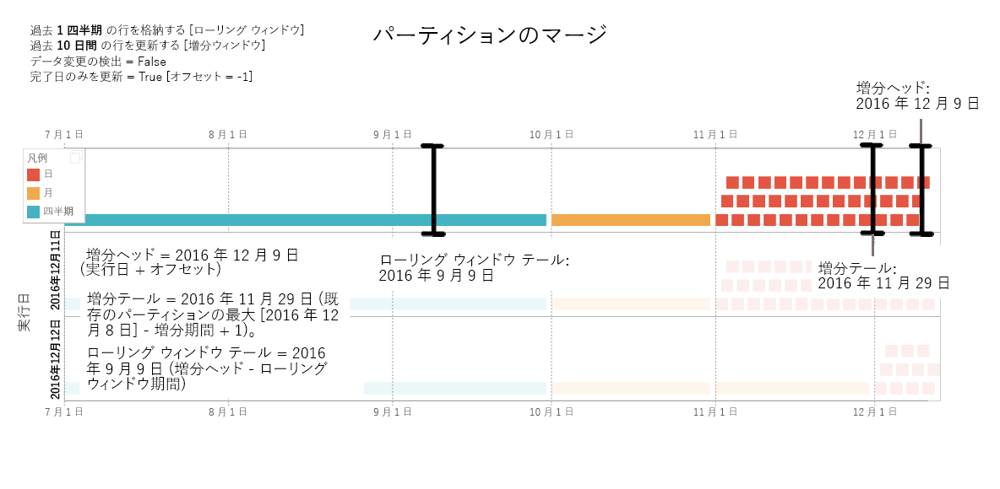
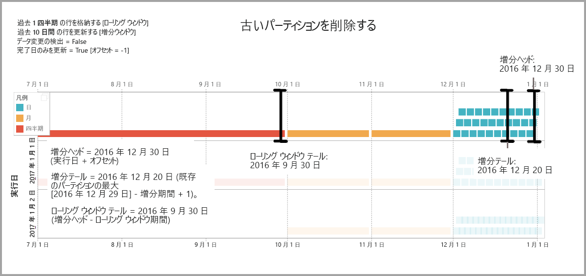
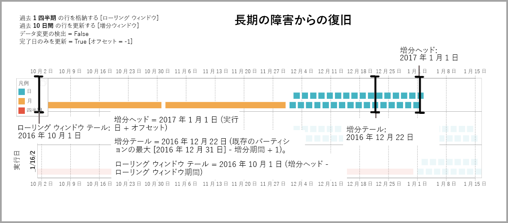

# Power BI データフローでの増分更新の使用

データフローを使用すると、Power BI に大量のデータを取り込んで、説得力のあるレポートと分析を作成できます。 ただし、場合によっては、更新のたびにソース データの完全なコピーを更新するのが実際的ではないことがあります。 そのような場合に適している別の方法は**増分更新**であり、データフローに対して次のような利点があります。

* **更新が高速化される** - 更新する必要があるのは変更されたデータのみです。 たとえば、更新なら 10 年間のデータフローのうち過去 5 日間だけで済みます。
* **更新の信頼性が高くなる** - たとえば、揮発性のソース システムに対して長時間の接続を維持する必要がありません。
* **リソースの消費量が減る** - l更新するデータが少ないと、メモリや他のリソースの全体的な消費量が減少します。

Power BI のデータフローに対して増分更新を使用するには、データフローが存在するワークスペースが [Premium 容量](service-premium-what-is.md)内で実行されている必要があり、データフローに取り込まれるデータ ソースに増分更新でフィルター処理できる *datetime* フィールドが含まれる必要があります。 

## データフローの増分更新の構成

データ フローには多数のエンティティが含まれることがあります。 増分更新はエンティティ レベルで設定されるので、1 つのデータ フローで、完全に更新されるエンティティと増分更新されるエンティティの両方を保持することができます。

増分更新されるエンティティを設定するには、最初に他のエンティティと同じようにエンティティを構成します。 データ フローの設定の詳細については、次を参照してください。[セルフ サービスのデータ準備の Power BI で](service-dataflows-overview.md)します。

データフローを作成して保存した後、次の図のように、エンティティ ビューで **[増分更新]** アイコンを選択します。

アイコンをクリックすると、 **[増分更新の設定]** ウィンドウが表示されます。 増分更新を **[オン]** 位置に切り替えるときに、増分更新を構成することができます。

次の一覧では、 **[増分更新の設定]** ウィンドウでの設定を説明します。 

1. **増分更新のオン/オフ切り替え** – このスライダーで、エンティティに対する増分更新ポリシーのオン/オフを切り替えます
2. **フィルター フィールドのドロップダウン** – エンティティで増分のフィルター処理を行う必要があるクエリ フィールドを選択します。 このフィールドには、*datetime* フィールドのみが含まれます。 エンティティに *datetime* フィールドが含まれていない場合は、増分更新を使用できません。
3. **過去の次の期間の行を保存** – 次の例は、以下のいくつかの設定を説明するのに役立ちます。

    この例では、合計で 5 年分のデータを格納し、10 日間のデータを増分更新するように更新ポリシーを定義します。 エンティティを毎日更新する場合は、更新操作ごとに次のことが行われます。

    * 新しい日のデータが追加されます。
    * 現在の日付までの 10 日分が更新されます。
    * 現在の日付より 5 年以上前のデータが削除されます。 たとえば、今日の日付が 2019 年 1 月 1 日の場合は、2013 年が削除されます。

    初めてデータフローを更新するときは 5 年すべてをインポートするのでしばらく時間がかかりますが、後続の更新は最初の更新と比べればごくわずかな時間で完了する可能性があります。

4. **データ変更の検出** - 10 日間の増分更新は、5 年間の完全更新よりはるかに効率的ですが、さらによくできる場合があります。 **[データ変更の検出]** チェック ボックスをオンにすると、識別する日付/時刻列を選択して、データが変更された日だけを更新することができます。 この場合、そのような列がソース システムに存在するものとします。一般的にこれは監査目的です。 この列の最大値が、増分範囲の各期間に対して評価されます。 そのデータが前回の更新以降変更されていない場合、その期間を更新する必要はありません。 例では、増分更新される日数がさらに 10 日から 2 日に減るはずです。

> [!TIP]
> 現在の設計では、データの変更を検出する列は永続化されてメモリにキャッシュされる必要があります。 次のいずれかの手法を使ってカーディナリティとメモリ消費量を減らすことを検討することが必要な場合があります。
>
>    * おそらく Power Query 関数を使って、更新時にこの列の最大値のみを保持します。
>    * 更新頻度の要件で許容されるレベルに有効桁数を減らします。

5. **完了期間のみを更新** - 毎朝午前 4時 00 分に実行するように、更新がスケジュールされているものとします。 その日の最初の 4 時間の間にソース システムに追加されたデータは、考慮しないようにする必要があります。 石油ガス業界での 1 日あたりのバレル数など、一部のビジネス メトリックでは、部分的な日に基づいて考慮するのは実際的ではない、または意味がない場合があります。

    完全な期間の更新のみが適切であるもう 1 つの例は、財務システムからデータの更新です。 前月のデータが 12 日に承認されるような財務システムを想像してください。 増分の範囲を 1 か月に設定し、12 日に実行するように更新をスケジュールします。 このオプションをオンにすると、1 月のデータ (最も最近の完全な月単位期間) は 2 月 12 日 に更新されます。

> [!NOTE]
> データフローの増分更新では、次のロジックに従って日付が決定されます。更新がスケジュールされている場合、データフローの増分更新では更新ポリシーで定義されているタイム ゾーンが使用されます。 更新スケジュールが存在しない場合、増分更新では、更新を実行しているコンピューターの時刻が使用されます。

## 増分更新のクエリ

増分更新を構成すると、データフローによって日付によるフィルターを含むようにクエリが自動的に変更されます。 **詳細 Power Query エディター**を使用して、自動生成されたクエリを編集し、更新を微調整またはカスタマイズすることができます。 増分更新とその動作について詳しくは、次のセクションをご覧ください。

## 増分更新と、リンクされたエンティティおよび計算されたエンティティ

"*リンクされた*" エンティティの場合、増分更新ではソース エンティティが更新されます。 リンクされたエンティティは元のエンティティへのポインターでしかないので、増分更新によるリンクされたエンティティへの影響は何もありません。 定義された更新ポリシーに従ってソース エンティティが更新されるとき、リンクされたエンティティではソース内のデータが更新されたものと想定する必要があります。

"*計算された*" エンティティはデータストアに対して実行されるクエリに基づいており、データストアは別のデータフローの場合もあります。 そのため、計算されたエンティティの動作は、リンクされたエンティティと同じです。

計算されたエンティティとリンクされたエンティティは同じように動作するので、要件と構成手順はどちらも同じです。 違いの 1 つは、計算されたエンティティの場合、特定の構成では、パーティションの構築方法のため、増分更新は最適化された方法で実行できません。 

## 増分更新と完全更新の間の変更

データフローでは、増分更新と完全更新の間での更新ポリシーの変更がサポートされています。 いずれかの方向 (完全から増分または増分から完全) で変更が発生すると、変更は次回の更新後にデータフローに反映されます。

データフローを完全更新から増分更新に移動すると、新しい更新ロジックにより、増分更新の設定で定義されている更新ウィンドウと増分に従って、データフローが更新されます。

データフローを増分更新から完全更新に移動すると、増分更新で累積されたすべてのデータは、完全更新で定義されているポリシーによって上書きされます。 このアクションを承認する必要があります。

## データフローの増分更新とデータセット

データフローの増分更新とデータセットの増分更新は、連携して動作するように設計されています。 データフローでのエンティティの増分更新、データセットへの完全読み込み、またはデータフローで完全に読み込まれるエンティティのデータセットへの増分読み込みが認められており、サポートされています。 

どちらの方法も、更新設定でユーザーが指定した定義に従います。
増分更新について詳しくは、「[Power BI Premium での増分更新](service-premium-incremental-refresh.md)」をご覧ください。

## 増分更新でのタイム ゾーンのサポート

データフローの増分更新は実行される時刻に依存します。 クエリのフィルター処理は、実行される日付に依存します。

これらの依存関係に対応してデータの整合性を保証するため、データフローの増分更新では、"*今すぐ更新*" シナリオに対する次のヒューリスティックが実装されています。

* スケジュールされた更新がシステムで定義されている場合、増分更新では、スケジュール更新からのタイム ゾーン設定が使用されます。 これにより、ユーザーがデータフローを更新するタイム ゾーンに関係なく、システムの定義と常に一致します。

* スケジュール更新が定義されていない場合、データフローでは更新しているユーザーのコンピューターのタイム ゾーンが使用されます。

増分更新は、API を使用して呼び出されることもあります。 この場合、更新で使用されるタイム ゾーンの設定が、API 呼び出しで保持されている可能性があります。 API を使用すると、テストと検証のために役立つことがあります。

## 増分更新の実装の詳細

データフローでは、増分更新に対してパーティション分割が使用されます。 Power BI Premium に対する XMLA エンドポイントが使用可能になると、パーティションが表示されるようになります。 データフローの増分更新では、更新ポリシーの要件を満たす最小限の数のパーティションが維持されます。 範囲を超える古いパーティションは削除され、ローリング ウィンドウが維持されます。 パーティションは状況に応じてマージされ、必要なパーティションの合計数が削減されます。 これにより、圧縮が向上し、場合によっては、クエリのパフォーマンスを向上できます。

このセクションの例では、次の更新ポリシーが共有されています。

* 過去 1 四半期の行を格納する
* 過去 10 日間の行を更新する
* データ変更の検出 = False
* 完了日のみを更新 = True

### パーティションのマージ

この例では、増分の範囲外になった日パーティションは、月レベルに自動的にマージされます。 増分の範囲内のパーティションは、それらの日のみを更新できるように、日単位の粒度で保持される必要があります。
"*実行日 2016 年 12 月 11 日*" の更新操作では、増分範囲外になるため、11 月の日がマージされます。

### 古いパーティションを削除する

合計の範囲外になる古いパーティションは削除されます。 "*実行日 2017 年 1 月 2 日*" の更新操作では、合計の範囲外になるため、2016年第 3 四半期のパーティションが削除されます。

### 長期の障害からの復旧

この例では、長期の障害からシステムを正常に復旧する方法をシミュレートします。 データ ソースの資格情報の期限切れにより更新を正常に実行できず、問題の解決に 13 日かかったものとします。 増分の範囲は 10 日間だけです。

"*実行日 2017 年 1 月 15 日*" の次の正常な更新操作では、不足している 13 日間を穴埋めして更新する必要があります。 また、その前の 9 日間も、通常のスケジュールで更新されなかったため、更新する必要があります。 つまり、増分の範囲は 10 日から 22 日に増加します。

"*実行日 2017 年 1 月 16 日*" の次の更新操作では、12 月の日と 2016 年第 4 四半期の月をマージする機会があります。

## 次の手順

この記事では、データフローの増分更新について説明しました。 他にも役に立つ記事がいくつかあります。

* [データフローを使用したセルフサービスのデータ作成](service-dataflows-overview.md)
* [Power BI でのデータフローの作成と使用](service-dataflows-create-use.md)
* [オンプレミス データ ソースでのデータフローの使用](service-dataflows-on-premises-gateways.md)
* [Power BI のデータフローに関する開発者向けリソース](service-dataflows-developer-resources.md)

Power Query とスケジュールされた更新について詳しくは、次の記事をご覧ください。
* [Power BI Desktop でのクエリの概要](desktop-query-overview.md)
* [スケジュールされた更新の構成](refresh-scheduled-refresh.md)

Common Data Model について詳しくは、次の概要記事をご覧ください。
* [Common Data Model の概要](https://docs.microsoft.com/powerapps/common-data-model/overview)

