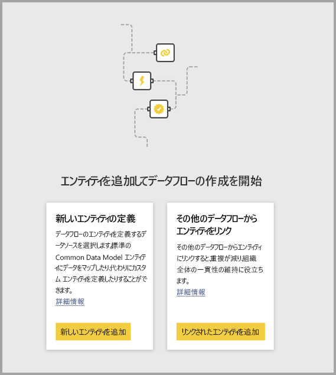
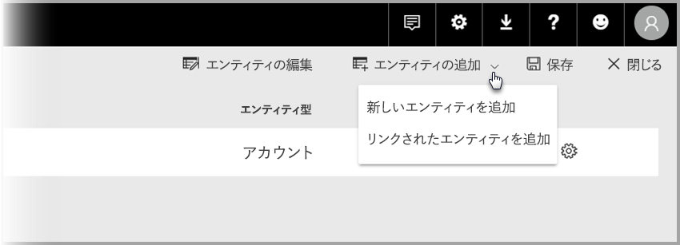

# Power BI のデータフロー間でエンティティをリンクする (データフロー)

Power BI のデータフローでは、単一のデータ ストレージ ソースを組織用に使用できます。ビジネス アナリストはそれを使用してデータを準備および管理し、組織内のさまざまな分析アプリ間で再利用できます。 

データフロー間でエンティティをリンクすると、他のユーザーが所有している他のデータフローによって既に取り込まれ、クレンジングされ、変換されているエンティティを再利用でき、そのデータを保持する必要はありません。 リンクされたエンティティは他のデータフロー内のエンティティを参照しているだけなので、データがコピーされたり重複したりすることは "*ありません*"。

リンクされたエンティティは**読み取り専用**です。 リンクされたエンティティのための変換を作成する場合は、リンクされたエンティティへの参照を含む新しい計算エンティティを作成する必要があります。

## リンクされたエンティティを使用できるかどうか

リンクされたエンティティでは、[Power BI Premium](service-premium.md) サブスクリプションを更新する必要があります。 リンクされたエンティティは、Power BI Premium 容量でホストされているワークスペース上のデータフローで使用できます。 ソース データフローに関する制限はありません。

リンクされたエンティティは、新しい Power BI ワークスペースでのみ正しく動作します。 [新しい Power BI ワークスペース](service-create-the-new-workspaces.md)についての詳細をご覧ください。 すべてのリンクされたデータフローは、正しく動作する新しいワークスペースに存在する必要があります。

> [!NOTE]
> エンティティは、それが標準エンティティか計算されたエンティティかによって異なります。 標準エンティティ (多くの場合は単にエンティティと呼ばれる) は、SQL データベースなどの外部データ ソースをクエリします。 計算されたエンティティは、Power BI 上に Premium 容量が必要であり、すでに Power BI のストレージ内にあるデータに対して変換を実行します。 
>
>ご自身のデータフローが Premium 容量ワークスペースにない場合でも、単一のクエリは引き続き参照できます。また、その変換がストレージ内変換として定義されていない限りは、2 つ以上のクエリを組み合わせることもできます。 このような参照は標準エンティティと見なされます。 これを行うには、データが具体化されず、かつストレージに取り込まれないように、参照されたクエリの **[読み込みを有効にする]** オプションをオフにします。 そこから、これらの **Enable load = false** クエリを参照できます。具体化を希望する結果のクエリに対してのみ **[読み込みを有効にする]** を **[オン]** に設定します。

## データフロー間でエンティティをリンクする方法

Power BI のデータフロー間でエンティティをリンクするには、いくつかの方法があります。 次の図のように、データフロー作成ツールで **[リンクされたエンティティを追加]** を選択できます。 

Power BI サービスの **[エンティティの追加]** メニュー項目から **[リンクされたエンティティを追加]** を選択することもできます。

エンティティをリンクするには、Power BI の資格情報でサインインする必要があります。

**[ナビゲーター]** ウィンドウが開き、接続できるエンティティのセットを選択できます。 表示されるエンティティは、Power BI テナント内のすべてのワークスペースにおいてアクセス許可のあるエンティティです。 

リンクされたエンティティを選択すると、作成ツールのデータフローに対するエンティティの一覧に、リンクされたエンティティであることを示す特別なアイコンと共に表示されます。

リンクされたエンティティのデータフローの設定から、ソース データフローを表示することもできます。

## リンクされたエンティティの更新ロジック
リンクされたエンティティの既定の更新ロジックは、ソース データフローがリンク先データフローと同じワークスペース内に存在するかどうかに基づいて変わります。 以下のセクションでは、それぞれの動作を説明します。

### ワークスペース間のリンク

異なるワークスペース内のエンティティからのリンクの更新は、外部データ ソースと同様に動作します。 データフローの更新では、エンティティの最新のデータがソース データフローから取得されます。 ソース データフローが更新された場合、リンク先データフローのデータに自動的に反映されることはありません。

### 同じワークスペース内のリンク

ソース データフローのデータの更新が発生すると、そのイベントによって、同じワークスペース内にあるすべてのリンク先データフロー内の依存エンティティに対して、更新プロセスが自動的にトリガーされます。これには、それらに基づく計算エンティティが含まれます。 リンク先データフロー内の他のすべてのエンティティは、データフローのスケジュールに従って更新されます。 複数のソースに依存するエンティティでは、いずれかのソースが正常に更新されるたびに、データが更新されます。

更新プロセス全体が一度にコミットされることに注意してください。 このため、リンク先データフローの更新が失敗した場合、ソース データフローの更新も失敗します。

## データフローからレポートを表示する場合のアクセス許可

データフローに基づくデータが含まれる Power BI レポートを作成すると、ユーザーは、ソース データフローへのアクセス権がある場合にのみ、リンクされたエンティティを見ることができます。

## 制限事項と考慮事項

リンクされたエンティティを使用する場合に留意する必要のある制限がいくつかあります。

* 参照ホップの上限は 5 個です
* リンクされたエンティティの循環依存関係は許可されていません
* データフローは、[新しい Power BI ワークスペース](service-create-the-new-workspaces.md)に存在する必要があります

## 次の手順

データフローを作成または使用するときは、次の記事も役に立ちます。 

* [Power BI でのセルフサービスのデータ準備 (プレビュー)](service-dataflows-overview.md)
* [Power BI でのデータフローの作成と使用](service-dataflows-create-use.md)
* [Power BI Premium での計算されたエンティティの使用 (プレビュー)](service-dataflows-computed-entities-premium.md)
* [オンプレミス データ ソースでのデータフローの使用 (プレビュー)](service-dataflows-on-premises-gateways.md)
* [Power BI データフロー用の開発者向けリソース (プレビュー)](service-dataflows-developer-resources.md)

Power Query とスケジュールされた更新について詳しくは、次の記事をご覧ください。
* [Power BI Desktop でのクエリの概要](desktop-query-overview.md)
* [スケジュールされた更新の構成](refresh-scheduled-refresh.md)

Common Data Model について詳しくは、次の概要記事をご覧ください。
* [Common Data Model の概要](https://docs.microsoft.com/powerapps/common-data-model/overview)

