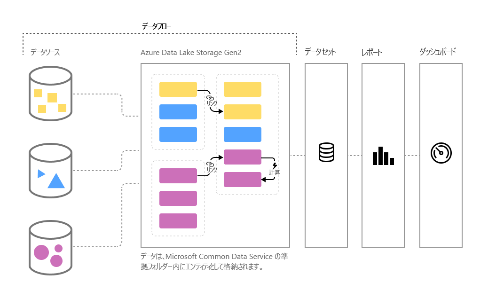

# Power BI でのセルフサービスのデータ準備 (プレビュー)

データの量は増え続けるので、データを整った形式のアクションにつながる情報に変換することが課題です。 大量のデータをアクションにつながる分析情報に迅速に変換できるよう、分析を行ったり、ビジュアル、レポート、ダッシュボードに設定したりする準備が整っているデータが必要です。 Power BI のビッグ データに対する**セルフサービスのデータ準備**を使用すると、ほんの数クリックでデータを Power BI の分析情報にできます。

Power BI では、ばらばらのソースからデータを取りまとめてモデリング用に準備するのに役立つ**データフロー**が導入されています。 アナリストは、使い慣れたセルフサービス ツールを使用して簡単にデータフローを作成できます。 データフローは、データ ソース接続、ETL ロジック、更新スケジュールなどを定義することにより、ビッグ データの取り込み、変換、統合、補強を行うために使用されます。 さらに、データフローの一部である新しいモデル駆動型計算エンジンにより、データ アナリストやレポート作成者にとっても、データの準備が管理しやすくなり、より決定論的になり、面倒でなくなります。 スプレッドシートが影響を受けたすべての数式を再計算するのと同じように、データフローはユーザーに代わってエンティティやデータ要素の変更を管理し、更新を自動化して、基本的なデータ更新であっても面倒で時間がかかっていたロジック チェックを軽減します。 データフローを使用すると、データ科学者が監視する必要のあった (そして、完了するまでに何時間または何日も要した) タスクを、アナリストやレポート作成者が数回クリックするだけで処理できるようになります。 

データは、Azure Data Lake Storage Gen2 の [**Common Data Service**](https://docs.microsoft.com/powerapps/common-data-model/overview) 内にエンティティとして保存されます。 データフローの作成と管理は、Power BI サービスのアプリ ワークスペースで行います。  

> [!NOTE]
> データフローの機能はプレビュー中であり、一般公開前に変更および更新される可能性があります。

 
**データフロー** は、**Common Data Model** を使用するように設計されています。Common Data Model は、マイクロソフトによって公開されている、データのビルド、使用、および分析を容易にする目的で作成されているデータ スキーマの標準化されたモジュール型の拡張可能なコレクションです。 このモデルでは、データ ソースから Power BI ダッシュボードを作成する手間がほとんどかかりません。

データフローを使用すると、Dynamics 365、Salesforce、Azure SQL Database、Excel、SharePoint など、サポートされている大規模で拡大するオンプレミスおよびクラウドベースのデータ ソースから、データを取り込むことができます。

その後、Common Data Model の標準エンティティにデータをマップし、既存のエンティティを変更および拡張して、カスタム エンティティを作成できます。 熟練したユーザーは、既に数百万人の Power BI Desktop および Excel のユーザーが知っている Power Query のエクスペリエンスと同様に、Power Query に組み込まれたセルフサービスでコーディングが少量または不要の作成エクスペリエンスを使用して、完全にカスタマイズされたデータフローを作成できます。  

データ フローを作成した後は、Power BI Desktop と Power BI サービスを使用して、Common Data Model の機能を活用するデータセット、レポート、ダッシュボード、アプリを作成し、ビジネス アクティビティについての詳細な分析情報を取得できます。 

データセットと同様に、データフローの更新スケジュールは、データフローを作成したワークスペースから直接管理されます。 

## データフローのしくみ

データフローのしくみの例を次に示します。

* 組織では、Common Data Model の標準エンティティにデータをマップしたり、独自のカスタム エンティティを作成したりすることができます。 その後、これらのエンティティを構成要素として使用し、すぐに動作するレポート、ダッシュボード、アプリを作成して、組織全体のユーザーに配布できます。 

* Microsoft のデータ コネクタの豊富なコレクションを使用することで、組織では、独自のデータ ソースをデータフローに接続し、Power Query を使用して提供元からデータをマップして Power BI に取り込むことができます。 データがデータフローによってインポートされると (および、指定された頻度で更新されると)、それらのデータフロー エンティティを Power BI Desktop アプリケーションで使用して、魅力的なレポートとダッシュボードを作成できます。 

## データフローを使用する方法

前のセクションでは、Power BI でデータフローを使用して強力な分析をすばやく作成するさまざまな方法について説明しました。 このセクションでは、組織でデータフローを使用して分析情報をすばやく作成する方法と、BI プロフェッショナルが独自のデータフローを作成し、自分の組織に合わせて分析情報をカスタマイズする方法を説明します。

### ビジネス ニーズに合わせて Common Data Model を拡張する
Common Data Model (CDM) を拡張したいビジネス インテリジェンス プロフェッショナルは、データフローを使用して標準エンティティをカスタマイズしたり、新しいエンティティを作成したりできます。 データ モデルのカスタマイズに対するこのセルフサービス アプローチをデータフローで使用して、組織に合わせて調整されたアプリと Power BI ダッシュボードを構築できます。

### プログラムでデータフローを定義する
データフローを作成するために独自のプログラムによるソリューションを開発したい場合もあります。 カスタム データフロー定義ファイル (model.json) をプログラムで作成するためのパブリック API と機能により、組織に固有のデータと分析のニーズに適したカスタム ソリューションを作成します。 

パブリック API により、Power BI とデータフローを操作するシンプルで簡単な方法が開発者に提供されます。

### Azure で機能を拡張する
Azure Data Lake Storage Gen2 は、すべての有料 Power BI サブスクリプションに含まれています (ユーザーあたり 10 GB、P1 ノードあたり 100 TB)。 そのため、Azure Data Lake でのセルフサービスのデータ準備を簡単に始めることができます。 

Power BI は、組織の Azure Data Lake Storage Gen2 アカウントにデータフローのデータを格納するように構成できます。 Power BI が Azure サブスクリプションに接続されると、データ開発者やデータ科学者は、Azure Machine Learning、Azure Databricks、Azure Data Factory などの強力な Azure 製品を利用できます。

また、Power BI では、組織の Azure Data Lake Storage アカウントに格納されている、Common Data Model 形式でスキーマ化されたデータを含むフォルダーにも接続できます。 これらのフォルダーは、Azure データ サービスなどのサービスで作成できます。 これらのフォルダーに接続することにより、アナリストは Power BI でこのデータをシームレスに操作できます。 

Azure Data Lake Storage Gen2 とデータフローの統合の詳細については (組織の Azure Data Lake 内に存在するデータフローの作成方法を含む)、「[dataflows and Azure Data Lake integration (Preview)](service-dataflows-azure-data-lake-integration.md)」 (データフローと Azure Data Lake の統合 (プレビュー)) をご覧ください。

## Power BI Premium でデータフロー機能

データフロー機能とワークロードが Power BI Premium サブスクリプションで動作するためには、その Premium 容量に対してデータフロー ワークロードを有効にする必要があります。 Power BI Premium について詳しくは、「[Microsoft Power BI Premium とは何ですか?](service-premium.md)」をご覧ください。 

次の表では、Power BI Pro アカウントと Power BI Premium でのデータフローの機能とその容量の比較を示します。

|データフローの機能 | Power BI Pro |   Power BI Premium |
|---------|---------|---------|
|スケジュールされた更新| 8 回/日|  48|
|合計ストレージ| 10 GB/ユーザー  |100 TB/ノード|
|Power Query Online でのデータフローの作成|    +   |+|
|Power BI 内でのデータフローの管理|   +|  +|
|Power BI Desktop でのデータフロー データ コネクタ|  +|  +|
|Azure との統合|    +|  +|
|計算されたエンティティ (M によるストレージ内変換) | |   +|
|新しいコネクタ|    +|  +|
|データフローの増分更新|  |   +|
|Power BI Premium 容量での実行/変換の並列実行|   |   +|
|データフローでリンクされたエンティティ| |        +|
|Common Data Model の標準化されたスキーマ/組み込みのサポート|  +|  +|

Premium 容量でデータフロー ワークロードを有効にする方法について詳しくは、Power BI Premium 向けの[ワークロードの構成](service-admin-premium-manage.md#configure-workloads)に関する記事をご覧ください。 現在、データフロー ワークロードは Muti-Geo 容量では使用できません。

## Power BI でのビッグ データ用のセルフサービス データ準備の概要
この記事で既に説明したように、**データフロー**によりビジネス データの制御が向上して分析情報の取得が速くなる複数のシナリオと例があります。 Common Data Model によって定義されている標準データ モデル (スキーマ) を使用すると、データフローで貴重なビジネス データをインポートし、これまでは数か月以上もかかっていた BI 分析情報のモデリングと作成のためのデータの準備を、非常に短い期間で行うことができます。 

**Common Data Model** の標準化された形式でビジネス データを格納することにより、BI プロフェッショナル (または開発者) は、すばやく簡単にビジュアルやレポートを自動生成するアプリを作成できます。 次のものが含まれますが、これだけではありません。

* データを統合し、既知のスキーマを利用してすぐに使用可能な分析情報を取得するための、Common Data Model の標準エンティティへのデータのマッピング
* 組織全体のデータを統合するための独自のカスタム エンティティの作成 
* データ フローの一部としての**外部データ**の使用と更新、およびそのデータをインポートすることによる分析情報の生成
* 開発者向けのデータフローの開始

## 次の手順

この記事では、Power BI でのビッグ データ用のセルフサービスのデータ準備の概要と、それを使用するさまざまな方法を説明しました。 以下の記事では、データフローの一般的な使用シナリオについてさらに詳しく説明します。 

* [Power BI でのデータフローの作成と使用](service-dataflows-create-use.md)
* [Power BI Premium での計算されたエンティティの使用 (プレビュー)](service-dataflows-computed-entities-premium.md)
* [オンプレミス データ ソースでのデータフローの使用 (プレビュー)](service-dataflows-on-premises-gateways.md)
* [Power BI データフロー用の開発者向けリソース (プレビュー)](service-dataflows-developer-resources.md)
* [データフローと Azure Data Lake の統合 (プレビュー)](service-dataflows-azure-data-lake-integration.md)

Power Query とスケジュールされた更新について詳しくは、次の記事をご覧ください。
* [Power BI Desktop でのクエリの概要](desktop-query-overview.md)
* [スケジュールされた更新の構成](refresh-scheduled-refresh.md)

Common Data Model について詳しくは、次の概要記事をご覧ください。
* [Common Data Model の概要](https://docs.microsoft.com/powerapps/common-data-model/overview)

