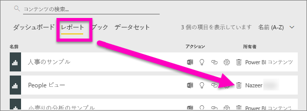
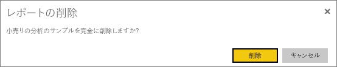
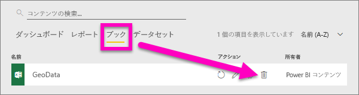
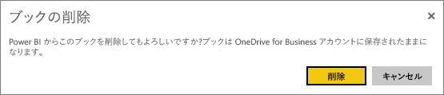
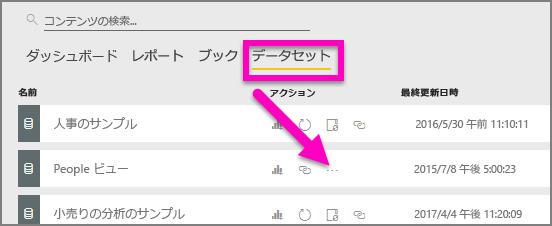
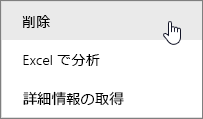
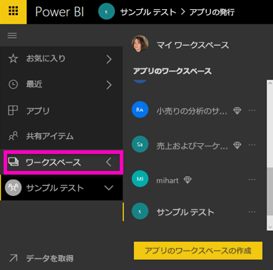
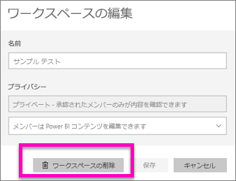
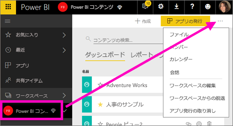
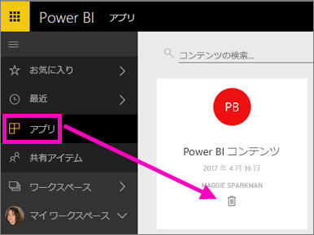

# Power BI サービスのほとんどすべてのものを削除する
この記事では、Power BI サービスでダッシュボード、レポート、ブック、データセット、アプリ、視覚化、ワークスペースを削除する方法について説明します。

## ダッシュボードの削除
ダッシュボードを、除去することができます。 ダッシュボードを除去しても、基となっているデータセットや、ダッシュボードに関連付けられているレポートは削除されません。

* ダッシュボードの所有者であれば、ダッシュボードを除去できます。 同僚とダッシュボードを共有している場合、自分の Power BI ワークスペースからダッシュボードを除去すると、同僚の Power BI ワークスペースからそのダッシュボードが除去されます。
* 他の人のダッシュボードを共有しているものの、参照する必要がなくなった場合は、除去できます。  ダッシュボードを除去しても、他の人の Power BI ワークスペースからは除去されません。
* ダッシュボードが[組織のコンテンツ パック](service-organizational-content-pack-disconnect.md)の一部である場合、それを除去する唯一の方法は、関連付けられているデータセットを除去することです。

### ダッシュボードを削除するには
1. ワークスペースで、**[ダッシュボード]** タブを選択します。
2. 削除するダッシュボードを見つけて、削除アイコン .

    

## レポートの削除
レポートを削除しても、レポートの基になっているデータセットは削除されません。  レポートからピン留めしたすべての視覚化も削除されません。視覚化は、個別に削除しない限り、ダッシュボード上に保持されます。

### レポートを削除するには
1. ワークスペースで、**[レポート]** タブを選択します。
2. 削除するレポートを見つけて、削除アイコン   .   

    
3. 削除を確認します。

   

   > [!NOTE]
   > レポートが[コンテンツ パック](service-organizational-content-pack-introduction.md)の一部である場合は、この方法では削除できません。  「[組織のコンテンツ パックに対する接続を削除する](service-organizational-content-pack-disconnect.md)」を参照してください。
   >
   >

## ブックを削除する
ブックを除去することができます。 ただし、ブックを除去すると、そのブックのデータを含むダッシュボード タイルやレポートもすべて除去されます。

ブックが OneDrive for Business に格納されている場合は、Power BI から削除しても OneDrive からは削除されません。

### ブックを削除するには
1. ワークスペースで、**[ブック]** タブを選択します。
2. 削除するブックを見つけて、削除  アイコンを選択します。

    
3. 削除を確認します。

   

## データセットの削除
データセットは削除することができます。 ただし、データセットを削除すると、そのデータセットのデータを含むダッシュボード タイルとレポートもすべて削除されます。

データセットが 1 つ以上の[組織のコンテンツ パック](service-organizational-content-pack-disconnect.md)の一部である場合、削除する唯一の方法は、データセットが使用されているコンテンツ パックから除去し、処理されるまで待ち、もう一度削除を試みることです。

### データセットを削除するには
1. ワークスペースで、**[データセット]** タブを選択します。
2. 削除するデータセットを見つけて、省略記号 (...) を選択します。  

    
3. ドロップダウン リストで、**[削除]** を選択します。

   
4. 削除を確認します。

   

## アプリ ワークスペースを削除する
> [!WARNING]
> アプリ ワークスペースを作成するときは、Office 365 グループを作成します。 そして、アプリ ワークスペースを削除するときは、その Office 365 グループを削除します。 つまり、SharePoint や Microsoft Teams などの他の O365 製品からもグループが削除されます。
>
>

アプリ ワークスペースはその作成者が削除できます。 削除すると、すべてのグループ メンバーに関連するアプリも削除され、組織全体にアプリを発行した場合は、AppSource から除去されます。 アプリ ワークスペースを削除することは、アプリ ワークスペースから脱退することとは異なります。

### アプリ ワークスペースを削除するには (管理者の場合)
1. 左側のナビゲーションで、**[ワークスペース]** を選択します。

    
2. 削除するワークスペースの右にある省略記号 (...) を選択してから、**[ワークスペースの編集]** を選択します。

   ![省略記号メニュー > [ワークスペースの編集]](media/service-delete/power-bi-edit-workspace.png)
3. **[ワークスペースの編集]** ウィンドウで、**[ワークスペースの削除]** > **[削除]** の順に選択します。

    

### リストからアプリ ワークスペースを除去するには
アプリ ワークスペースのメンバーである必要がなくなった場合は、ワークスペースから***脱退***することができます。そうすると、ワークスペースはリストから除去されます。 ワークスペースから脱退しても、他のすべてのワークスペース メンバーはそのままです。  

> [!IMPORTANT]
> アプリ ワークスペースの管理者が 1 人しかいない場合、Power BI ではその管理者の脱退は許可されません。
>
>

1. 除去するアプリ ワークスペースから開始します。
2. 右上隅にある省略記号 (...) を選択し、**[Leave workspace (ワークスペースからの脱退)]** > **[脱退]** の順に選択します。

      

   > [!NOTE]
   > ドロップダウン リストに表示されるオプションは、そのアプリ ワークスペースの管理者であるか、メンバーであるかによって異なります。
   >
   >

## アプリを削除または除去する
アプリはアプリ リスト ページから簡単に除去できます。 ただし、アプリを完全に削除できるのはアプリ管理者のみです。

### アプリ リスト ページからアプリを除去する
アプリ リスト ページからアプリを削除しても、他のメンバーのアプリは削除されません。

1. 左側のナビゲーションで、**[アプリ]** を選択してアプリ リスト ページを開きます。
2. 削除するアプリにカーソルを合わせ、削除アイコン  を選択します。

   

   アプリを誤って除去した場合、いくつかの方法で戻すことができます。  たとえば、アプリ作成者に再送信を依頼するか、アプリへのリンクが示されている元のメールを見つけます。または、[通知センター](service-notification-center.md)でアプリの通知がまだリストされているかどうかを確認するか、組織の [AppSource](consumer/end-user-apps.md) を確認します。

## 考慮事項とトラブルシューティング
この記事では、Power BI サービスの主な構成要素を削除する方法について説明します。 しかし、Power BI で削除できるものは他にも多数あります。  

* [おすすめのダッシュボードを除去する](service-dashboard-featured.md)
* [ダッシュボードをお気に入りから外す](service-dashboard-favorite.md)
* [レポート ページを削除する](service-delete.md)
* [ダッシュボード タイルを削除する](service-dashboard-edit-tile.md)
* [レポートの視覚化を削除する](service-delete.md)

他にわからないことがある場合は、 [Power BI コミュニティを利用してください](http://community.powerbi.com/)。
