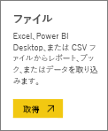

# Power BI Desktop ファイルからデータを取得する

**Power BI Desktop** には、ビジネス インテリジェンスやレポートを容易にする機能があります。 多くの異なるデータ ソースへの接続、データのクエリと変換、データのモデル化、強力で動的なレポートの作成など、どのようなビジネス インテリジェンス タスクであっても、**Power BI Desktop** を利用すれば直感的にすばやく実行できます。 **Power BI Desktop** にまだ慣れていないユーザーは、まず「[Power BI Desktop の概要](desktop-getting-started.md)」をお読みください。

データを **Power BI Desktop** に取り込み、レポートをいくつか作成した後は、保存されているファイルを **Power BI サービス**に取得します。

## ファイルの保存場所による違い
**ローカル** - コンピューターのローカル ドライブまたは組織内の別の場所にファイルを保存した場合、ファイルを Power BI に*インポート*できます。また、Power BI Desktop から*発行*して、データとレポートを Power BI に読み込むこともできます。 実際はファイルがローカル ドライブに残ったままになるため、本当にファイル全体が Power BI に移動されるわけではありません。 実際には、Power BI で新しいデータセットが作成され、Power BI Desktop ファイルから取得したデータとデータ モデルがそのデータセットに読み込まれるという処理が発生しています。 ファイルにレポートが含まれている場合、これらのレポートは Power BI サイトの [レポート] に表示されます。

**OneDrive - ビジネス用** - OneDrive for Business を利用していて、Power BI にサインインするときと同じアカウントを使ってサインインした場合、Power BI Desktop 内の作業内容と Power BI のデータセット、レポート、およびダッシュボードとを最も効果的に同期できます。Power BI と OneDrive はどちらもクラウドにあるため、Power BI は約 1 時間ごとに OneDrive 上のファイルに*接続*します。 なんらかの変更が見つかった場合には、データセット、レポート、およびダッシュボードが Power BI で自動的に更新されます。

**OneDrive - 個人用** – OneDrive アカウントにファイルを保存すると、OneDrive for Business の場合と同じメリットが多数得られます。 最も大きな違いは、([データの取得]、[ファイル]、[OneDrive - 個人用] の順に選択して) ファイルに初めて接続するときに、Microsoft アカウントを使って OneDrive にサインインする必要があるという点です (このアカウントは通常、Power BI へのサインインに使うものとは異なります)。 Microsoft アカウントを使って OneDrive にサインインするときは、[サインインしたままにする] オプションを必ず選択してください。 これにより、Power BI は、約 1 時間ごとにファイルに接続して、Power BI のデータセットの同期を保つことができます。

**SharePoint チーム サイト** – Power BI Desktop のファイルを SharePoint – チーム サイトに保存することは、OneDrive for Business に保存することとほぼ同じです。 最も大きな違いは、Power BI からファイルに接続する方法にあります。 URL を指定したり、ルート フォルダーに接続したりできます。

## Power BI Desktop ファイルのインポートまたは Power BI からの接続
>[!IMPORTANT]
>Power BI にインポートできるファイルの最大サイズは 1 GB です。

1. Power BI の [ナビゲーター] ウィンドウで、**[データの取得]** をクリックします。
   
   
2. **[ファイル]**、**[取得]** の順にクリックします。
   
   
3. 目的のファイルを見つけます。 Power BI Desktop ファイルには、.PBIX という拡張子が付いています。
   
   

## Power BI Desktop から Power BI サイトへのファイルの発行
Power BI Desktop の発行機能を使用することは、Power BI でデータの取得機能を使用してローカル ドライブからファイルをインポートしたり、OneDrive 上のファイルに接続したりすることと事実上同じです。  以下では、その手順を簡単に紹介します。詳しくは、「[Power BI Desktop からの発行](desktop-upload-desktop-files.md)」をご覧ください。

1. Power BI Desktop で **[ファイル]** > **[発行]** > **[Power BI へ発行]** を選択するか、リボンの **[発行]** をクリックします。
   
   
2. Power BI にサインインします。 この操作は、最初に 1 回だけ行う必要があります。
   
   完了すると、Power BI サイトでレポートを開くためのリンクが表示されます。
   
   

## 次の手順
**データの探索** - ファイルのデータとレポートを Power BI に取得したら、次は探索です。 ファイルに既にレポートがある場合は、[ナビゲーター] ウィンドウの **[レポート]** に表示されます。 ファイルにデータのみが含まれる場合は、新しいレポートを作成できます。そのためには、新しいデータセットを右クリックし、**[探索]** をクリックします。

**外部データ ソースの更新** - Power BI Desktop ファイルが外部データ ソースに接続する場合は、データセットが常に最新の状態に保たれるように、更新スケジュールを設定できます。 ほとんどの場合、更新スケジュールを設定するのは非常に簡単ですが、詳細な手順についてはこの記事の範囲外です。 詳しくは、「[Power BI でのデータの更新](refresh-data.md)」をご覧ください。

