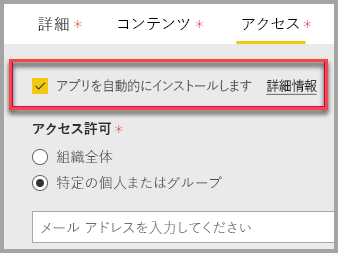

# SharePoint Online にレポート Web パーツを埋め込む

Power BI の新しい SharePoint Online 用レポート Web パーツでは、対話型の Power BI レポートを SharePoint Online のページに簡単に埋め込むことができます。

新しいを使用する場合**SharePoint Online に埋め込む**オプション、埋め込みのレポートは完全にセキュリティで保護された、セキュリティで保護された内部ポータルを簡単に作成できるようにします。

## 要件

**SharePoint Online に埋め込む**するのには、レポート、次が必要です。

* Power BI Pro ライセンスまたは[Power BI Premium 容量 (EM または P SKU)](service-premium-what-is.md) Power BI ライセンスを持つ。
* SharePoint Online の Power BI Web パーツには、[最新式のページ](https://support.office.com/article/Allow-or-prevent-creation-of-modern-site-pages-by-end-users-c41d9cc8-c5c0-46b4-8b87-ea66abc6e63b)が必要です。

## レポートを埋め込む
SharePoint Online にレポートを埋め込むには、レポートの URL を取得し、SharePoint Online の新しい Power BI の web パーツで使用する必要があります。

### レポートの URL を取得します。

1. Power BI 内でレポートを表示します。

2. 選択、**ファイル**ドロップダウン メニューで、選択し、 **SharePoint Online に埋め込む**します。

    ![[ファイル] メニュー](media/service-embed-report-spo/powerbi-file-menu.png)

3. ダイアログ ボックスから、レポートの URL をコピーします。

    

### Power BI レポートを SharePoint Online のページに追加する

1. SharePoint Online でターゲット ページを開き、選択**編集**します。

    

    Sharepoint Online で、次のように選択します。 または、 **+ 新規**新しい最新式のサイト ページを作成します。

    

2. 選択、 **+** ドロップダウンを選び、 **Power BI**します。

    

3. **[レポートの追加]** を選びます。

      

4. コピーしたレポートの URL を貼り付け、 **Power BI のレポート リンク**ウィンドウ。 レポートは自動的に読み込まれます。

    

5. SharePoint Online のユーザーに変更が表示されるようにするには、 **[発行]** を選びます。

    

## レポートへのアクセスを許可する

SharePoint Online にレポートを埋め込むことが自動的にユーザー権限を与えるレポートを表示する - Power BI のアクセス許可の表示を設定する必要があります。

> [!IMPORTANT]
> Power BI サービスでレポートを表示できるユーザーを確認し、一覧に含まれないユーザーにアクセスを許可します。

Power BI でレポートへのアクセスを提供する 2 つの方法はあります。 SharePoint Online チーム サイトを構築する Office 365 グループを使用している場合、最初の方法は、のメンバーとしてユーザーを一覧表示する、 **Power BI サービス内でアプリ ワークスペース**と**SharePoint ページ**します。 詳しくは、[アプリ ワークスペースを管理する](service-manage-app-workspace-in-power-bi-and-office-365.md)方法に関する記事をご覧ください。

2 番目の方法では、アプリ内でレポートを埋め込むし、ユーザーと直接共有します。  

1. 作成者 (Pro ユーザーにする必要があります) では、アプリ ワークスペースにレポートを作成します。 共有する**Power BI 無料ユーザー**、として設定する必要があるアプリ ワークスペースを**Premium ワークスペース**します。

2. 作成者は、アプリを発行し、それをインストールします。 作成者は、SharePoint Online に埋め込むために使用するレポートの URL にアクセスするアプリをインストールすることを確認する必要があります。

3. すべてのエンド ユーザーも、アプリをインストールする必要があります。 使用することも、**アプリを自動的にインストール**で有効にするには、機能、 [Power BI 管理ポータル](service-admin-portal.md)、アプリをエンドユーザーの事前インストールします。

   

4. 作成者は、アプリを開いて、レポートに移動します。

5. 作成者は、レポート、アプリがインストールされてから、埋め込みレポートの URL をコピーします。 **アプリ ワークスペースから、元のレポートの URL を使用しないでください。**

6. SharePoint Online で新しいチーム サイトを作成します。

7. Power BI web パーツにレポートのコピーの以前の URL を追加します。

8. SharePoint Online ページや作成した Power BI アプリでデータを使用するすべてのエンド ユーザーおよびグループを追加します。

    > [!NOTE]
    > **ユーザーまたはグループは、SharePoint ページ上のレポートを見るには、SharePoint Online ページと、Power BI アプリ内のレポートの両方に、アクセスできる必要があります。**

これで、エンド ユーザーは、SharePoint Online でチーム サイトに移動し、ページのレポートを見ることができるようになります。

## 多要素認証

Power BI 環境で多要素認証を使ったサインインが必要な場合は、ID 確認のためにセキュリティ デバイスでのサインインを求められることがあります。 これは、多要素認証を使用して SharePoint Online にサインインしていないことが、Power BI 環境には、アカウントを検証するセキュリティ デバイスが必要な場合に発生します。

> [!NOTE]
> Azure Active Directory 2.0 が多要素認証をサポートしていません - ユーザー エラー メッセージが表示されます。 ユーザーがセキュリティ デバイスを使って SharePoint Online に再度サインインした場合、レポートを表示できることがあります。

## Web パーツの設定

SharePoint Online の Power BI web パーツの調整できる設定を以下に示します。

| プロパティ | 説明 |
| --- | --- |
| ページ名 |Web パーツの既定のページを設定します。 ドロップダウンから値を選びます。 ドロップダウンにページが表示されない場合は、レポートが 1 ページであるか、または貼り付けた URL にページ名が含まれています。 特定のページを選ぶには、URL からレポート セクションを削除します。 |
| 表示 |レポートが SharePoint Online のページ内に収める方法を調整します。 |
| ナビゲーション ウィンドウの表示 |ページ ナビゲーション ウィンドウの表示と非表示を切り替えます。 |
| Show Filter Pane (フィルター ウィンドウの表示) |フィルター ウィンドウの表示と非表示を切り替えます。 |

## 読み込まれないレポート

Power BI web パーツにレポートが読み込まれない場合は、次のメッセージを参照してください可能性があります。

このメッセージには 2 つの一般的な理由があります。

1. レポートへのアクセスはありません。
2. レポートが削除されました。

この問題を解決するために SharePoint Online のページの所有者にお問い合わせください。

## ライセンス

ユーザーが SharePoint 内でレポートを閲覧するには、**Power BI Pro ライセンス**を所有しているか、またはレポートのコンテンツが **[ Power BI Premium 容量 (EM または P SKU)](service-admin-premium-purchase.md)** 内のワークスペースに置かれている必要があります。

## 既知の問題と制限事項

* エラー:"エラーが発生しました。ログアウトしてから再度ログインして、このページに再びアクセスしてください。 関連付け ID: 未定義、http の応答の状態: 400、サーバー エラー コード 10001、メッセージ: 更新トークンが見つかりません"
  
  このエラーが返された場合は、以下のトラブルシューティング手順のいずれかをお試しください。
  
  1. SharePoint からサインアウトし、再度サインインします。 再度サインインする前に、必ずすべてのブラウザー ウィンドウを閉じてください。

  2. ユーザー アカウントには、多要素認証 (MFA) が必要とする場合、SharePoint へのサインイン MFA デバイス (電話アプリ、スマート カードなど) を使用します。
  
  3. Azure B2B ゲスト ユーザー アカウントはサポートされていません。 ユーザーにはパーツを読み込み中であることを示す Power BI のロゴが表示されますが、レポートは表示されません。

* Power BI は、SharePoint Online と同じローカライズされた言語をサポートしていません。 そのため、埋め込みのレポートが適切にローカライズされていない可能性があります。

* この問題は Internet Explorer 10 を使用する場合に発生する可能性があります。 [Power BI](consumer/end-user-browsers.md) および [Office 365](https://products.office.com/office-system-requirements#Browsers-section) でサポートされているブラウザーをご確認ください。

* Power BI Web パーツは、[国内クラウド](https://powerbi.microsoft.com/clouds/)では利用できません。

* 従来の SharePoint はこの Web パーツではサポートされていません。

* [URL フィルター](service-url-filters.md)は SPO Web パーツではサポートされていません。

## 次の手順

* [エンドユーザーによる最新式のサイト ページの作成を許可または禁止する](https://support.office.com/article/Allow-or-prevent-creation-of-modern-site-pages-by-end-users-c41d9cc8-c5c0-46b4-8b87-ea66abc6e63b)  
* [Power BI でのアプリの作成および配布](service-create-distribute-apps.md)  
* [同僚や他のユーザーとダッシュボードやレポートを共有する](service-share-dashboards.md)  
* [Power BI Premium とは何ですか?](service-premium-what-is.md)
* [セキュリティで保護されたポータルまたは Web サイトにレポートを埋め込む](service-embed-secure.md)

他にわからないことがある場合は、 [Power BI コミュニティで質問してみてください](http://community.powerbi.com/)。