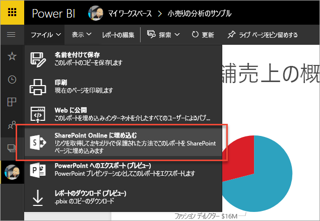
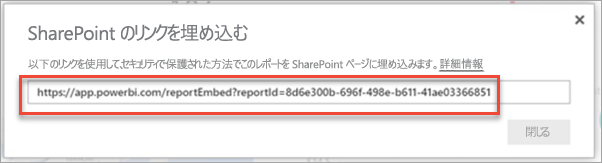
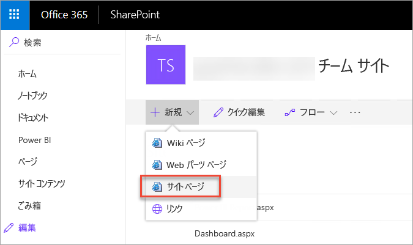
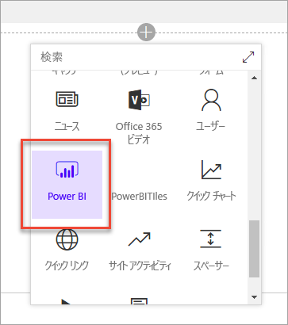
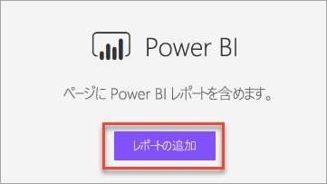
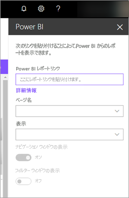
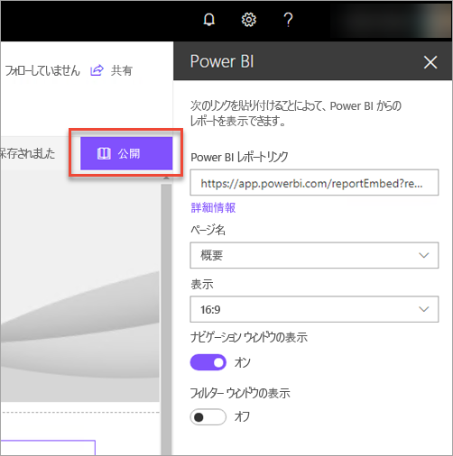
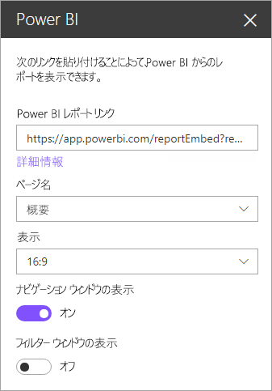
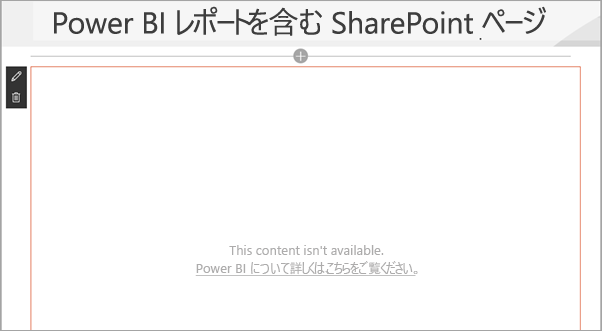

# SharePoint Online にレポート Web パーツを埋め込む

Power BI の新しい SharePoint Online 用レポート Web パーツでは、対話型の Power BI レポートを SharePoint Online のページに簡単に埋め込むことができます。

新しい **[SharePoint Online に埋め込む]** オプションを使うと、埋め込まれたレポートは完全に安全なので、簡単にセキュリティで保護された内部ポータルを作成できます。

## 要件

**[SharePoint Online に埋め込む]** レポートが機能するためには、いくつかの要件があります。

* SharePoint Online の Power BI Web パーツには、[最新式のページ](https://support.office.com/article/Allow-or-prevent-creation-of-modern-site-pages-by-end-users-c41d9cc8-c5c0-46b4-8b87-ea66abc6e63b)が必要です。

## レポートを埋め込む

SharePoint Online にレポートを埋め込むには、最初にレポートの URL を取得し、SharePoint Online 内の新しい Power BI Web パーツでその URL を使う必要があります。

### レポートの URL を取得する

1. Power BI サービスでレポートを表示します。

2. **[ファイル]** メニュー項目を選びます。

3. **[SharePoint Online に埋め込む]** を選びます。
   
    

4. ダイアログ ボックスから URL をコピーします。

    

   > [!NOTE]
   > また、レポートを表示したときに Web ブラウザーのアドレス バーに表示される URL を使うこともできます。 その URL には、現在表示しているレポート ページが含まれます。 別のページを使いたい場合は、URL からレポート セクションを削除する必要があります。

### Power BI レポートを SharePoint Online のページに追加する

1. SharePoint Online で目的のページを開き、**[編集]** を選びます。

    

    または、SharePoint Online で **[+ 新規]** を選んで、最新式のサイト ページを新しく作成します。

    

2. **[+]** を選び、**[Power BI]** Web パーツを選びます。

    

3. **[レポートの追加]** を選びます。

    

4. レポートの URL をプロパティ ウィンドウに貼り付けます。 これは、前の手順でコピーした URL です。 レポートが自動的に読み込まれます。

    

5. SharePoint Online のユーザーに変更が表示されるようにするには、**[発行]** を選びます。

    

## レポートへのアクセスを許可する

SharePoint Online にレポートを埋め込んだだけで、レポートを表示するアクセス許可が自動的にユーザーに与えられることはありません。 レポートを表示するアクセス許可は、Power BI サービスで設定します。

> [!IMPORTANT]
> Power BI サービスでレポートを表示できるユーザーを確認し、一覧に含まれないユーザーにアクセスを許可します。

Power BI サービスでレポートへのアクセスを許可するには 2 つの方法があります。 Office 365 グループを使用して SharePoint Online のチーム サイトを構築している場合は、Power BI サービス内でアプリ ワークスペースのメンバーとしてユーザーをリストします。 このようにすると、ユーザーはそのグループのコンテンツを表示できるようになります。 詳細については、「[Power BI でのアプリの作成および配布](service-create-distribute-apps.md)」を参照してください。

または、次のようにしてレポートへのアクセスをユーザーに許可することもできます。

1. レポートからダッシュボードにタイルを追加します。

2. レポートへのアクセスを必要とするユーザーとダッシュボードを共有します。 詳しくは、「[同僚や他のユーザーとダッシュボードやレポートを共有する](service-share-dashboards.md)」をご覧ください。

## Web パーツの設定

以下では、SharePoint Online 用の Power BI Web パーツに対して調整できる設定について説明します。

| プロパティ | 説明 |
| --- | --- |
| ページ名 |Web パーツによって表示される既定のページを設定します。 ドロップダウンから値を選びます。 ドロップダウンにページが表示されない場合は、レポートが 1 ページであるか、または貼り付けた URL にページ名が含まれています。 特定のページを選ぶには、URL からレポート セクションを削除します。 |
| 表示 |レポートを SharePoint Online のページ内に適合させる方法を調整するオプションです。 |
| ナビゲーション ウィンドウの表示 |ページ ナビゲーション ウィンドウの表示と非表示を切り替えます。 |
| Show Filter Pane (フィルター ウィンドウの表示) |フィルター ウィンドウの表示と非表示を切り替えます。 |

## 多要素認証

Power BI 環境で多要素認証を使ったサインインが必要な場合は、ID 確認のためにセキュリティ デバイスでのサインインを求められることがあります。 これは、ユーザーが多要素認証を使わずに SharePoint Online にサインインしているのに、Power BI 環境がセキュリティ デバイスによって検証されたアカウントを要求する場合に発生します。

> [!NOTE]
> Azure Active Directory 2.0 では、多要素認証はまだサポートされていません。 ユーザーは、*エラー*を示すメッセージを受け取ります。 ユーザーがセキュリティ デバイスを使って SharePoint Online に再度サインインした場合、レポートを表示できることがあります。

## 読み込まれないレポート

レポートが Power BI Web パーツに読み込まれず、次のメッセージが表示されることがあります。

*このコンテンツは使用できません。*

このメッセージには 2 つの一般的な理由があります。

1. レポートへのアクセス許可がありません。
2. レポートが削除されました。

問題を解決するには、SharePoint Online のページの所有者に連絡する必要があります。

## 既知の問題と制限事項

* **エラー: "エラーが発生しました。ログアウトしてから再度ログインして、このページに再びアクセスしてください。関連付け ID: 未定義、http の応答の状態: 400、サーバー エラー コード 10001、メッセージ: 更新トークンが見つかりません"**
  
  このエラーが返された場合は、次のいずれかを試してください。
  
  1. SharePoint をサインアウトしてから再度サインインします。 再度サインインする前に、必ずすべてのブラウザー ウィンドウを閉じてください。

  2. ユーザー アカウントが Multi-Factor Authentication (MFA) を必要としている場合は、必ず Multi-Factor Authentication デバイス (電話アプリやスマート カードなど) を使用して SharePoint にサインインします。
  
  3. Azure B2B ゲスト ユーザー アカウントはサポートされていません。 ユーザーにはパーツを読み込み中であることを示す Power BI のロゴが表示されますが、レポートは表示されません。

* Power BI は、SharePoint Online と同じローカライズされた言語をサポートしていません。 そのため、埋め込みのレポートが適切にローカライズされていない可能性があります。

* この問題は Internet Explorer 10 を使用する場合に発生する可能性があります。 [Power BI](service-browser-support.md) および [Office 365](https://products.office.com/office-system-requirements#Browsers-section) でサポートされているブラウザーをご確認ください。

* Power BI Web パーツは、[国内クラウド](https://powerbi.microsoft.com/en-us/clouds/)では利用できません。 

## 次の手順

[エンドユーザーによる最新式のサイト ページの作成を許可または禁止する](https://support.office.com/article/Allow-or-prevent-creation-of-modern-site-pages-by-end-users-c41d9cc8-c5c0-46b4-8b87-ea66abc6e63b)  
[Power BI でのアプリの作成および配布](service-create-distribute-apps.md)  
[同僚や他のユーザーとダッシュボードやレポートを共有する](service-share-dashboards.md)  
[Power BI Premium とは](service-premium.md)  

他にわからないことがある場合は、 [Power BI コミュニティで質問してみてください](http://community.powerbi.com/)。 

