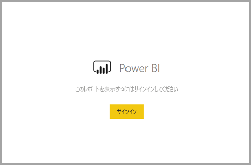
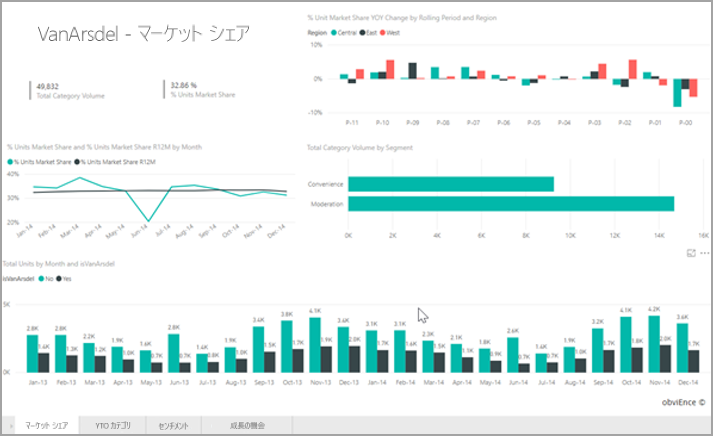

# <a name="embed-a-report-in-a-secure-portal-or-website"></a>セキュリティで保護されたポータルまたは Web サイトにレポートを埋め込む

Power BI の新しい安全な **[埋め込み]** レポート用オプションを使うと、ユーザーは、SharePoint 2019 などの内部 Web ポータル (**クラウドベース**でも**オンプレミスでホストされている**場合でも) に、簡単かつ安全にレポートを埋め込むことができるようになります。 この方法で埋め込まれたレポートでは、行レベルのセキュリティ (RLS) を使ってすべての項目のアクセス許可とデータのセキュリティが守られます。 この機能は、URL または iFrame の埋め込みを受け入れている任意のポータルに対して、ノーコードの埋め込みを可能にするために設計されています。

**[埋め込み]** オプションでは [URL フィルター](service-url-filters.md)と URL 設定もサポートされています。 **[埋め込み]** オプションを使うと、HTML と JavaScript の基本的な知識を必要とするローコードの方法を使ってポータルと統合できます。

## <a name="how-to-embed-power-bi-reports-into-portals"></a>Power BI レポートをポータルに **[埋め込む]** 方法

1. 新しい **[埋め込む]** オプションは、Power BI サービスのレポートの **[ファイル]** メニューで使用できます。

    ![安全な [埋め込む] オプションのドロップダウン オプション](media/service-embed-secure/secure-embed-drop-down-menu.png)

2. [埋め込む] オプションを選択すると、レポートを安全に埋め込むために使うリンクと iFrame が表示されたダイアログが開きます。

    ![[埋め込む] オプションのダイアログ ボックス](media/service-embed-secure/secure-embed-code-dialog.png)

3. URL をご自分の Web ポータルに埋め込んだ後、または URL を直接開いた場合、ユーザーはレポートへのアクセス権を付与される前に認証されます。 以下では、ユーザーはブラウザー セッションで Power BI にサインインしていません。 **[サインイン]** を押すと、新しいブラウザー ウィンドウまたはタブを開くことが必要となる場合があります。 サインインするよう求められない場合は、ポップアップ ブロックを確認してください。

    

4. ユーザーがサインインするとレポートが開かれ、データが表示されます。ユーザーはページ間を移動したり、フィルターを設定したりできます。 レポートが表示されるのは、Power BI でレポートを閲覧するアクセス許可を持つユーザーに対してのみです。 行レベルのセキュリティ (RLS) 規則もすべて適用されます。 最後に、ユーザーに正しいライセンスが与えられている必要があります – Power BI Pro ライセンスが必要であるか、またはレポートが Power BI Premium 容量内にあるワークスペースに置かれている必要があります。 ユーザーは新しいブラウザー ウィンドウを開くたびにサインインする必要がありますが、一度サインインした後は他のレポートは自動的に読み込まれます。

    

5. iFrame のオプションを使う場合は、表示される HTML を編集して望ましい高さと幅を指定し、ポータルの Web ページに収まるようにすることをお勧めします。

    

## <a name="granting-access-to-reports"></a>レポートへのアクセスを許可する

[埋め込む] オプションによって、ユーザーによるレポートの表示が自動的に許可されるわけではありません。 レポートを表示するアクセス許可は、Power BI サービスで設定します。

Power BI サービス内でレポートへのアクセスを許可するには、埋め込まれたレポートへのアクセスを要求しているユーザーとレポートを共有します。 Office 365 グループを使っている場合は、Power BI サービス内でアプリ ワークスペースのメンバーとしてユーザーをリストします。 詳しくは、[アプリ ワークスペースを管理する](service-manage-app-workspace-in-power-bi-and-office-365.md)方法に関する記事をご覧ください。

## <a name="licensing"></a>ライセンス

ユーザーが埋め込まれたレポートを閲覧するには、Power BI Pro ライセンスを所有しているか、またはコンテンツが [Power BI Premium 容量 (EM または P SKU)](service-admin-premium-purchase.md) 内のワークスペースに置かれている必要があります。

## <a name="customize-your-embed-experience-using-url-settings"></a>URL 設定を使って埋め込みエクスペリエンスをカスタマイズする

埋め込み URL では、ユーザー エクスペリエンスのカスタマイズに役立ついくつかの入力設定がサポートされています。 提供された iFrame を使う場合は、iFrame の src 設定にある URL を更新します。

| プロパティ  | 説明  |  |  |  |
|--------------|-----------------------------------------------------------------------------------------------------------------------------------------------------------------------------------------------------------------------|---|---|---|
| pageName  | クエリ文字列パラメーター **pageName** を使って、レポートのどのページが開くのか設定できます。 **pageName** の値は、以下に示すように、Power BI サービスでレポートを表示したときのレポートの URL の末尾と一致します。 |  |  |  |
| URL フィルター  | Power BI の UI から受け取った埋め込み URL 内の [URL フィルター](service-url-filters.md)を使って、埋め込みのコンテンツをフィルター処理できます。 この方法では、基本的な HTML および JavaScript エクスペリエンスのみとのローコードの統合を構築できます。  |  |  |  |

## <a name="set-which-page-opens-when-the-report-is-embedded"></a>レポートが埋め込まれるときにどのページが開くか設定する

*pageName* 設定に与えられる値は、Power BI サービスでレポートを表示したときのレポートの URL の末尾と一致します。

1. Web ブラウザーで Power BI サービスからレポートを開き、アドレス バーから URL をコピーします。

    

2. *pageName* 設定を URL に追加します。

    

## <a name="filter-report-content-using-url-filters"></a>URL フィルターを使ってレポートの内容をフィルター処理する

いくつかの高度な機能として、[URL フィルター](service-url-filters.md)を使ってレポートを使ったさらなるエクスペリエンスを構築できます。 たとえば、以下の URL では、レポートをフィルター処理してエネルギー業界のデータを表示します。

**pageName** と [URL フィルター](service-url-filters.md)を組み合わせて使うと強力です。 基本的な HTML と JavaScript を使ってエクスペリエンスを構築できます。

たとえば、HTML ページにボタンを追加する方法を次に示します。

```html
<button class="textLarge" onclick='show("ReportSection", "Energy");' style="display: inline-block;">Show Energy</button>
```

ボタンを押すと、エネルギー業界用のフィルターを含む更新された URL を使って iFrame を更新する関数が呼び出されます。

```javascript
function show(pageName, filterValue)

{

var newUrl = baseUrl + "&pageName=" + pageName;

if(null != filterValue && "" != filterValue)

{

newUrl += "&$filter=Industries/Industry eq '" + filterValue + "'";

}

//Assumes there’s an iFrame on the page with id=”iFrame”

var report = document.getElementById("iFrame")

report.src = newUrl;

}
```


ボタンを好きなだけ追加して、ローコードのカスタム エクスペリエンスを作成できます。 

## <a name="considerations-and-limitations"></a>考慮事項と制限事項

* Azure の企業間 (B2B) 機能を使った外部ゲスト ユーザーはサポートされません。

* セキュリティで保護された埋め込みは Power BI サービスに公開されたレポートに対して機能します。

* ユーザーは、新しいブラウザー ウィンドウを開くたびにサインインしてレポートを表示する必要があります。

* 一部のブラウザーでは、サインイン後にページを更新する必要があります (特に InPrivate または Incognito モードを使っている場合)。

* シングル サインオン エクスペリエンスを実現するには、SharePoint Online のオプションで [埋め込む] を使うか、[ユーザー所有データ](developer/embed-sample-for-your-organization.md)の方法を使ってカスタム統合を構築します。 詳細については、[ユーザー所有データ](developer/embed-sample-for-your-organization.md)に関するページをご覧ください。

* **[埋め込む]** オプションを使って提供される自動認証機能は、Power BI JavaScript API では動作しません。 Power BI JavaScript API の場合は、[ユーザー所有データ](developer/embed-sample-for-your-organization.md)の方法を使って埋め込みを行います。 詳細については、[ユーザー所有データ](developer/embed-sample-for-your-organization.md)に関するページをご覧ください。

## <a name="next-steps"></a>次の手順

* [作業を共有する方法](service-how-to-collaborate-distribute-dashboards-reports.md)

* [URL フィルター](service-url-filters.md)

* [SharePoint Online レポート Web パーツ](service-embed-report-spo.md)

* [Web に公開](service-publish-to-web.md)