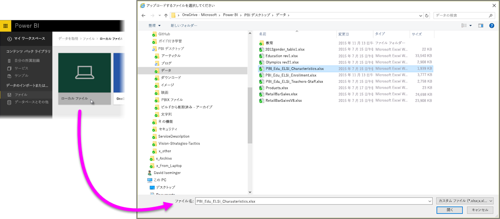
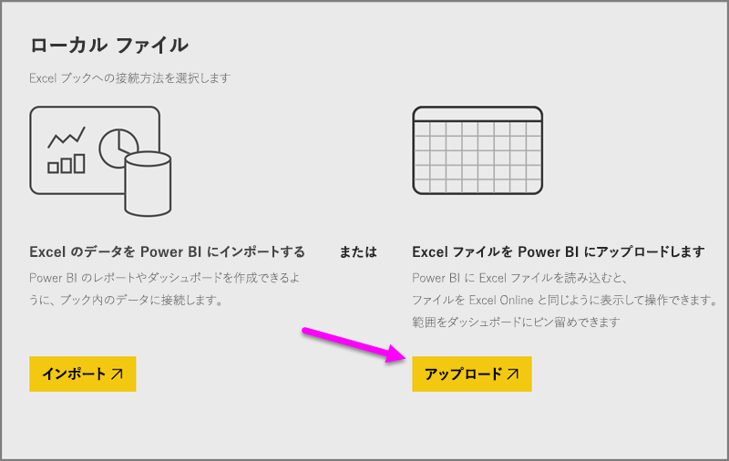
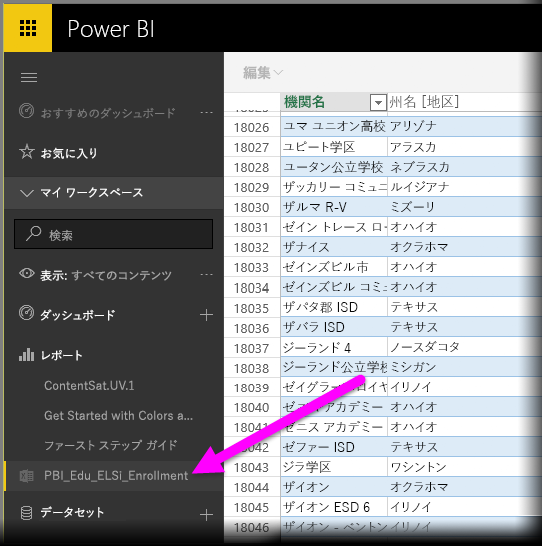

# Excel ブック ファイルからデータを取得する

Microsoft Excel は、世界中で最も広く使用されているビジネス アプリケーションの 1 つです。 Excel は、データを Power BI に取り込むための最も一般的な手段の 1 つでもあります。

## Power BI でサポートされているブックの種類
Power BI では、Excel 2007 以降で作成したブックのインポートまたは接続がサポートされています。 ブックは、1 GB 未満の .xlsx ファイルか .xlsm ファイルで保存しておく必要があります。 この記事で説明する機能の一部は、新しいバージョンの Excel でのみ利用できます。

### データの範囲またはテーブルが含まれたブック
データ範囲が含まれているシンプルなワークシートがブックに存在する場合、Power BI でデータを最大限活用できるように、これらの範囲をテーブル形式に変更してください。 そうすることで、Power BI でレポートを作成する際に、[フィールド] ウィンドウで名前付きのテーブルと列が表示され、データをより簡単に視覚化できるようになります。

### データ モデルが含まれたブック
ブックにはデータ モデルを含めることができます。リンク テーブル、Power Query (Excel 2016 の [取得と変換])、または Power Pivot を使用することによって、データの 1 つ以上のテーブルをデータ モデルに読み込みます。 Power BI では、リレーションシップ、メジャー、階層、KPI など、あらゆるデータ モデル プロパティがサポートされています。

> [!NOTE]
> データ モデルを含むブックは、Power BI テナント全体での共有ができません。 たとえば、*contoso.com* アカウントを使用して Power BI にログインするユーザーは、*woodgrovebank.com* から Power BI ログイン アカウントを使用してログインするユーザーと Excel ブックを共有できません。
> 
> 

### 外部データ ソースへの接続が含まれたブック
Excel を使って外部データ ソースに接続する場合、ブックを Power BI にインポートした後、その接続先のデータ ソースから取得したデータに基づいてレポートとダッシュボードを作成できます。 また、スケジュールされた更新を設定すると、データ ソースに接続して更新を取得する処理を自動で行うことができます。 このため、Excel の [データ] リボンから手動で更新する必要がなくなります。 ダッシュボード内のタイルとレポートにそのデータ ソースから取得したデータに基づいて作成した視覚化が存在する場合には、すべて自動的に更新されます。 詳しくは、「[Power BI でのデータの更新](refresh-data.md)」をご覧ください。

### Power View シート、ピボットテーブル、グラフが含まれたブック
Power View シート、ピボットテーブル、グラフが Power BI でどのように表示される (または表示されない) かは、ブック ファイルの保存場所と Power BI への取り込み方法によって異なります。 これについては、以下で詳しく説明します。

## データ型
Power BI では、次のデータ型がサポートされています:整数、10 進数、通貨、日付、True/False、テキスト。 Excel でデータを特定のデータ型としてマークすることで、Power BI エクスペリエンスが向上します。

## Power BI のためのブックの準備
Power BI のために Excel ブックを準備する方法を学習するには、こちらの役に立つビデオをご覧ください。

<iframe width="500" height="281" src="https://www.youtube.com/embed/l2wy4XgQIu0" frameborder="0" allowfullscreen></iframe>

## ブック ファイルの保存場所による違い
**ローカル** - コンピューターのローカル ドライブまたは組織内の別の場所にブック ファイルを保存した場合、ファイルを Power BI に読み込むことができます。 実際はファイルがローカル ドライブに残ったままになるため、本当にファイル全体が Power BI にインポートされるわけではありません。 実際には、Power BI に新しいデータセットが作成され、ブックから取得したデータと (もしあれば) データ モデルがそのデータセットに読み込まれるという処理が発生しています。 ブックに Power View シートが含まれている場合、これらのシートは Power BI サイトの [レポート] の下に表示されます。 また、Excel 2016 には **[発行]** 機能があります (**[ファイル]** メニューの下)。 **[発行]** を使用することは、Power BI で **[データの取得]、[ファイル]、[ローカル ファイル]** を順にクリックするのと事実上同じことです。しかし、ブックに定期的に変更を加えるのであれば、多くの場合 [発行] を使った方が Power BI のデータセットを簡単に更新できます。

**OneDrive - ビジネス用** – OneDrive for Business を利用していて、Power BI にサインインするときと同じアカウントを使ってサインインした場合、Excel 内の作業内容と Power BI のデータセット、レポート、およびダッシュボードとを最も効果的に同期できます。Power BI と OneDrive はどちらもクラウドにあるため、Power BI は約 1 時間ごとに OneDrive 上のブック ファイルに*接続*します。 なんらかの変更が見つかった場合には、データセット、レポート、およびダッシュボードが Power BI で自動的に更新されます。 ローカル ドライブにブックを保存した場合と同様に、[発行] を使って Power BI のデータセットとレポートを直ちに更新することもできます。[発行] を実行しなかった場合には、Power BI で (通常 1 時間以内に) 自動的に同期が行われます。

**OneDrive - 個人用** – 自身の OneDrive アカウントにブック ファイルを保存すると、OneDrive for Business の場合と同じメリットが多数得られます。 最も大きな違いは、([データの取得]、[ファイル]、[OneDrive - 個人用] の順に選択して) ファイルに初めて接続するときに、Microsoft アカウントを使って OneDrive にサインインする必要があるという点です (このアカウントは通常、Power BI へのサインインに使うものとは異なります)。 Microsoft アカウントを使って OneDrive にサインインするときは、[サインインしたままにする] オプションを必ず選択してください。 これにより、Power BI は、約 1 時間ごとにブック ファイルに接続して、Power BI のデータセットとレポートの同期を保つことができます。

**SharePoint チーム サイト** – Power BI Desktop のファイルを SharePoint – チーム サイトに保存することは、OneDrive for Business に保存することとほぼ同じです。 最も大きな違いは、Power BI からファイルに接続する方法にあります。 URL を指定したり、ルート フォルダーに接続したりできます。

## 1 つの Excel ブック – 2 つの使用方法
ブック ファイルを **OneDrive** に保存した場合、Power BI でデータを探索する方法は 2 つあります。

### Power BI への Excel データのインポート
**[インポート]** を選択すると、テーブルやデータ モデル内のサポートされているデータがすべて、Power BI の新しいデータセットにインポートされます。 Power View シートがある場合、これらは Power BI でレポートとして再作成されます。

ブックは引き続き編集できます。 変更を保存すると、通常約 1 時間以内に Power BI のデータセットと同期されます。 直ちに同期する必要がある場合は、さらに [発行] をクリックします。これだけで、その場ですぐに変更をエクスポートできます。 レポートとダッシュボードに視覚エフェクトがあれば、それらも更新されます。

このオプションは、データの取得と変換機能または Power Pivot を使用してデータをデータ モデルに読み込んでいる場合や、Power BI で表示したい視覚エフェクトが含まれる Power View シートがブックにある場合に選択します。

Excel 2016 では、[発行] を選択して [エクスポート] することもできます。 これはほぼ同じ機能です。 詳しくは、「[Excel 2016 から Power BI へ発行する](service-publish-from-excel.md)」をご覧ください。

### Power BI での Excel の接続、管理、表示
**[接続]** を選択すると、ブックは、Excel Online を使用しているときと同じように Power BI に表示されます。 ただし、Excel Online とは異なり、ワークシートの要素をダッシュボードにピン留めするのに役立ついくつかの優れた機能を利用できます。

Power BI ではブックを編集できません。 しかし、変更を加える必要がある場合は、[編集] をクリックして、Excel Online でブックを編集するかまたは自分のコンピューターの Excel で開くかを選択できます。 ブックに加えたすべての変更は、OneDrive 上のブックに保存されます。

この方法を選択した場合、Power BI では接続されたブック用に対応するデータセットが作成されます。 必要に応じて、このデータセットを使用して Power BI レポートを作成できます。 ブックは、Power BI ワークスペース ナビゲーション ウィンドウの [レポート] の下にも表示されます。 接続されたブックには特殊な Excel アイコンが付いています。

このオプションは、データがワークシートにのみ存在する場合や、ダッシュボードにピン留めしたい範囲、ピボットテーブル、グラフがある場合に選択します。

Excel 2016 では、[発行] を選択して [アップロード] することもできます。 これはほぼ同じ機能です。 詳しくは、「[Excel 2016 から Power BI へ発行する](service-publish-from-excel.md)」をご覧ください。

## Power BI から Excel ブックへのインポートまたは接続
1. Power BI のナビゲーション ウィンドウで、**[データの取得]** をクリックします。
   
   
2. [ファイル]、**[取得]** の順にクリックします。
   
   
3. 目的のファイルを見つけます。
   
   
4. 目的のブック ファイルが OneDrive 上または SharePoint - チーム サイト上にある場合、**[インポート]** または **[接続]** を選択します。

## ローカルな Excel ブック
ローカルな Excel ファイルを使用し、それを Power BI にアップロードすることもできます。 前のメニューから **[ローカル ファイル]** を選択した後、Excel ブックが保存されている場所に移動します。

ファイルを選択したら、[アップロード] を選択して Power BI にアップロードします。

ブックがアップロードされると、ブックの準備ができたことを示す通知を受け取ります。

ブックの準備ができると、Power BI の **[レポート]** セクションに表示されます。

## Excel 2016 から Power BI サイトへの発行
Excel 2016 で **Power BI へ発行する機能**を使うことは、ファイルのインポートと接続に Power BI で **[データの取得]** を使用するのと事実上同じことです。 ここでは詳しく説明しません。詳しくは「[Excel 2016 から Power BI へ発行する](service-publish-from-excel.md)」をご覧ください。

## トラブルシューティング
ブック ファイルが大きすぎると考えられる場合は、 「[Power BI で表示する Excel ブックのサイズを減らす](reduce-the-size-of-an-excel-workbook.md)」をご覧ください。

現時点では、[インポート] を選択すると、Power BI は名前付きのテーブルまたはデータ モデルの一部となっているデータのみをインポートします。 その結果、ブックに名前のないテーブル、Power View シート、または Excel データ モデルがあると、次のようなエラーが表示されることがあります:**"Excel ブックにデータが見つかりませんでした"**。 [この記事](service-admin-troubleshoot-excel-workbook-data.md)では、ブックを修正し、再インポートする方法について説明します。

## 次の手順
**データの探索** - ファイルのデータとレポートを Power BI に取得したら、次は探索です。 新しいデータセットを右クリックして [探索] をクリックします。 手順 4. で OneDrive 上のブック ファイルへの接続を選択した場合、ブックは [レポート] に表示されます。 それをクリックすると、Excel Online を使用した場合と同じように Power BI で開かれます。

**更新のスケジュール設定** - Excel ブック ファイルが外部データ ソースに接続されている場合や、ローカル ドライブからインポートを行った場合は、更新スケジュールを設定することによって、データセットまたはレポートを常に最新の状態に保つことができます。 ほとんどの場合、更新スケジュールを設定するのは非常に簡単ですが、詳細な手順についてはこの記事の範囲外です。 詳しくは、「[Power BI でのデータの更新](refresh-data.md)」をご覧ください。

[Excel 2016 から Power BI へ発行する](service-publish-from-excel.md)

[Power BI Publisher for Excel](publisher-for-excel.md)

[Power BI でのデータの更新](refresh-data.md)

