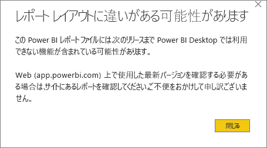
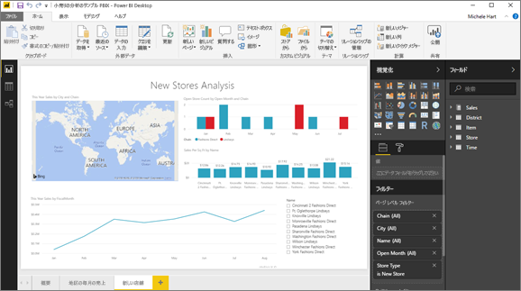

# Power BI サービスからデスクトップにレポートをエクスポートする (プレビュー)
Power BI Desktop では、レポートを保存して **[発行]** を選ぶことにより、レポートを Power BI サービスにエクスポートできます (*ダウンロード* ともいいます)。 反対の方向にもエクスポートでき、Power BI サービスから Desktop にレポートをダウンロードできます。 どちらの方向でも、エクスポートされたファイルの拡張子は *.pbix* です。

この記事の後半では、注意する必要のあるいくつかの制限事項と考慮事項について説明します。

![[ファイル] ドロップダウン](media/service-export-to-pbix/power-bi-file-export.png)

## レポートを .pbix としてダウンロードする
.pbix ファイルをダウンロードするには、次の手順に従います。

1. **Power BI サービス**で、ダウンロードするレポートを[編集ビュー](service-reading-view-and-editing-view.md)で開きます。
2. メニュー バーから、**[ファイル]、[レポートのダウンロード]** の順に選択します。
   
   > [!NOTE]
   > レポートをダウンロードするには、レポートが 2016 年 11 月 23 日以降に [Power BI Desktop で作成されていて](guided-learning/publishingandsharing.yml#step-2)、かつそれ以降に更新されている必要があります。 これに該当しない場合、Power BI サービスの *[レポートのダウンロード (プレビュー)]* メニュー オプションは淡色表示されます。
   > 
   > 
3. .pbix ファイルが作成されている間、進行状況が状態バナーに表示されます。 .pbix ファイルの準備ができると、開くか保存するように求められます。 ファイルの名前はレポートのタイトルと同じです。
   
    ![[開く]、[保存]、[キャンセル]](media/service-export-to-pbix/power-bi-save-pbix.png)
   
    Power BI サービス (app.powerbi.com) または Power BI Desktop で .pbix ファイルを開くオプションが表示されるようになります。     
4. レポートを Desktop ですぐ開くには、**[開く]** を選びます。 特定の場所にファイルを保存するには、**[保存] > [名前を付けて保存]** の順に選択します。 まだ行っていない場合は、[Power BI Desktop をインストール](desktop-get-the-desktop.md)します。
   
    レポートを Desktop で開くとき、Power BI サービスのレポートで使用できる一部の機能が Desktop では使用できないという警告メッセージが表示されることがあります。
   
    

5. Power BI Desktop のレポート エディターと Power BI サービスのレポート エディターは、よく似ています。  
   
    

## 考慮事項とトラブルシューティング
Power BI サービスからの *.pbix* ファイルのダウンロード (エクスポート) に関しては、重要な考慮事項と制限事項がいくつかあります。

* ファイルをダウンロードするには、レポートの編集アクセス権限が必要です。
* レポートが **Power BI Desktop** を使って作成され、**Power BI サービス**に*発行*されているか、.pbix ファイルがサービスに*アップロード*されている必要があります。
* レポートは、2016 年 11 月 23 日以降に更新または発行されている必要があります。 この日より前に発行されたレポートはダウンロードできません。
* この機能は、**Power BI サービス** (コンテンツ パックを含みます) でもともと作成されたレポートには使用できません。
* ダウンロードしたファイルを開くときは常に、最新バージョンの **Power BI Desktop** を使用する必要があります。 最新バージョンではない **Power BI Desktop** では、ダウンロードした *.pbix* ファイルを開くことができない場合があります。
* データをエクスポートする機能を管理者が無効にしている場合、この機能は **Power BI サービス**に表示されません。

## 次の手順
この機能に関しては、**Guy in a Cube** の簡単なビデオをご覧ください。

<iframe width="560" height="315" src="https://www.youtube.com/embed/ymWqU5jiUl0" frameborder="0" allowfullscreen></iframe>

また、**Power BI サービス**の使い方を知るのに役立つ記事を以下に示します。

* [Power BI のレポート](service-reports.md)
* [Power BI - 基本的な概念](service-basic-concepts.md)

以下のガイドは、**Power BI Desktop** をインストールした後で、すばやく作業を開始するのに役立ちます。

* [Power BI Desktop の概要](desktop-getting-started.md)

他にわからないことがある場合は、 [Power BI コミュニティを利用してください](http://community.powerbi.com/)。   

