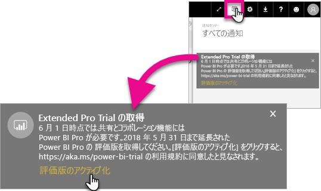
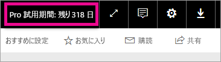

# Extended Pro Trial のアクティブ化
2017 年 6 月 1 日より、すべての対象ユーザーは Power BI サービスの Extended Pro Trial を選択できます。

<iframe width="640" height="360" src="https://www.youtube.com/embed/tPsNoPyY9aA?showinfo=0" frameborder="0" allowfullscreen></iframe>

[2017 年 5 月 3 日の Power BI Premium 告知](https://powerbi.microsoft.com/blog/microsoft-accelerates-modern-bi-adoption-with-power-bi-premium/)の一環として、Microsoft は無料 Power BI サービスに変更があり、それが 2017 年 6 月 1 日より有効になることをお伝えしました。 変更内容には、アクセスが拡張され、すべてのデータ ソースにアクセスできること、ワークスペースのストレージ上限が増えたこと、無料サービスのリフレッシュ レートとストリーム レートが上がったことが含まれます。Power BI Pro に匹敵する機能性になりました。

また、共有機能と共同作業機能が Power BI Pro ユーザーに独占的に提供されることが発表されました。ピアツーピアのダッシュボード共有、グループ ワークスペース、PowerPoint へのエクスポート、Power BI アプリを利用して Excel で解析することなどの機能が含まれます。 CSV/Excel と PowerPoint にエクスポートする機能は 5 月 3 日の告知で Power BI Pro 限定として発表されていましたが、さまざまなユーザー コミュニティからフィードバックをいただいた結果、方針が変わり、無料サービスのユーザーもお使いいただけるようになりました。

2017 年 6 月 1 日より、この 1 年以内に (2017 年 5 月 2 日以前に) 無料サービスの利用を始めた既存ユーザーには、Power BI Pro の 12 か月無料試用の資格が与えられます。 このキャンペーンでユーザーは次の 1 年間、Power BI Pro の全機能をご利用いただけます。これはコミュニティへの感謝の印であり、また、変更に対応する時間をユーザーに与えるための措置です。

2017 年 6 月 1 日は、同サービスにサインインすると、ユーザーのもとに通知が届きます。この中で、変更が有効になったことが伝えられ、期間延長 Power BI Pro 試用版に登録するように促されます。 ユーザーの IT 管理者は製品内通知を管理しません。ユーザーの代わりに期間延長 Power BI Pro 試用版を登録する権限も与えられていません。 対象ユーザーがそれぞれ、個人でこのプロセスを完了する必要があります。

12 か月の期間中、ユーザーはいつでもこのキャンペーンに登録できます。ただし、登録した日付に関係なく、2018 年 5 月 31 日をもってすべてのユーザーの期間延長試用版が終了します。 終了時、Power BI Pro の購入を選択しなかった場合、Power BI Pro を購入するか、共有機能と共同作業機能のない無料版の Power BI に戻るかという選択肢がユーザーに与えられます。

Power BI Pro は変更されていません。 Power BI Pro ユーザーには影響がなく、2017 年 6 月 1 日以降、サービスにサインインしても通知は届きません。 期間延長 Power BI Pro 試用版を拒否したユーザー、あるいはこのキャンペーンの対象ではないユーザーは、共有機能と共同作業機能のない無料版の Power BI を引き続きご利用いただけます。 Power BI [Web サイト](https://powerbi.microsoft.com/get-started/)にアクセスすれば、標準の 60 日間 Power BI Pro 試用版にいつでも登録できます。

## Extended Pro Trial の資格
Extended Pro Trial の資格を得るには、ご利用のアカウントが次の要件を満たしている必要があります。

* 2016 年 5 月 3 日から 2017 年 5 月 2 日の間にアクティブだった Power BI 無料試用版のユーザーに Extended Pro Trial の資格が与えられます。
* *60 日間の製品内 Pro 試用版*を以前に利用していたユーザー、または現在利用中のユーザーにも Extended Pro Trial の資格が与えられます。

> [!NOTE]
> Office 365 内で Power BI Pro または Power BI Pro 試用版サブスクリプションからライセンスを割り当てられたユーザーはこのキャンペーンの対象外です。
> 
> 

## ライセンス認証方法
Extended Pro Trial は 2 通りの方法でライセンス認証できます。 1 つ目は Power BI にサインインするときです。 サインイン時にライセンス認証しなかった場合でも、通知領域内にオプションが表示されます。

> [!NOTE]
> 製品内通知は管理者の管理範囲外であり、対象ユーザーのもとに届きます。
> 
> 

### サインイン時の操作
Power BI サービスにサインインすると、キャンペーン対象であれば、ポップアップ通知が表示されます。 **[評価版のアクティブ化]** を選択すると、Extended Pro Trial が開始します。 これ以上の操作は必要ありません。

これで、試用期間中、あらゆる既存の共有ダッシュボードまたはレポートにアクセスできます。

**[後で]** を選択した場合、Extended Pro Trial は 2018 年 5 月 31 日の期間終了日までいつでも有効にできます。

### 後でライセンス認証する
**[後で]** を選択し、ポップアップを閉じた場合、Extended Pro Trial は 2018 年 5 月 31 日の期間終了日までいつでも有効にできます。 有効化は**通知センター**で実行できます。

通知センター内で、Extended Pro Trial に関する通知が表示されます。 通知はユーザーが取り消すまで表示されます。

通知内で、**[評価版のアクティブ化]** を選択し、試用版を開始できます。 これ以上の操作は必要ありません。

これで、試用期間中、あらゆる既存の共有ダッシュボードまたはレポートにアクセスできます。

## ライセンス認証後
アクティブ化を行うと、試用版の有効期限までの残りの日数が右上に表示されます。

[Extended Pro Trial キャンペーンの利用規約](https://aka.ms/power-bi-trial)内に条件の記載があります。 すべてのユーザーを対象に、Extended Pro Trial は 2018 年 5 月 31 日をもって終了します。

## よく寄せられる質問
**2017 月 5 月 3 日の後にサインアップした新規ユーザーはどうなりますか。**

無料 Power BI に 2017 年 5 月 3 日以降にサインアップしたユーザーは、Extended Pro Trial の対象ではありません。 ただし、標準の 60 日間 Pro 試用版の対象にはなります。

**組織内で Extended Pro Trial の対象者を見つけるには、どうすればよいですか。**

対象者を見つける直接的な方法はありませんが、Power BI 用の Azure Active Directory 統合アプリケーション レポートで、過去 30 日間を対象に、組織内のアクティブ ユーザーを確認できます。 そこから対象者が判明する可能性があります。 詳しくは、「[サインインした Power BI ユーザーを見つける](service-admin-access-usage.md)」をご覧ください。

対象期間内で無料ライセンスの対象となるアクティブ ユーザーにはポップアップ通知が表示されます。 

> [!NOTE]
> Azure AD レポートには、Power BI 内でユーザーが無料ユーザーなのか、Pro ユーザーなのかは示されません。 このレポートには、Power BI にサインインしたユーザーとログイン時間が示されるだけです。 このレポートに示されているユーザーが、必ずしも Extended Pro Trial の対象者であるとは限りません。
> 
> 

**管理者は Extended Pro Trial のアクティベートをユーザーに禁止することはできますか。**

いいえ。 管理者は Extended Pro Trial やサービス内 Power BI Pro 60 日間試用版のアクティベートをユーザーに禁止することはできません。

## 次の手順
[Extended Pro Trial キャンペーンの利用規約](https://aka.ms/power-bi-trial)  
[個々のユーザーに対する Power BI サービス契約](https://powerbi.microsoft.com/terms-of-service/)  
[Power BI Premium に関するお知らせ](https://aka.ms/pbipremium-announcement)  
[サインインした Power BI ユーザーを見つける](service-admin-access-usage.md)

他にわからないことがある場合は、 [Power BI コミュニティで質問してみてください](https://community.powerbi.com/)。

