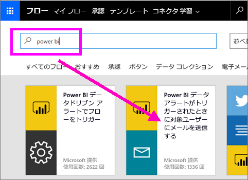
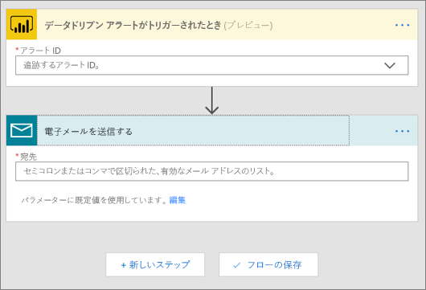
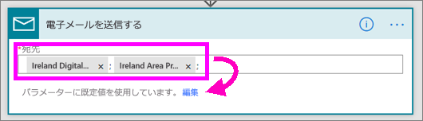
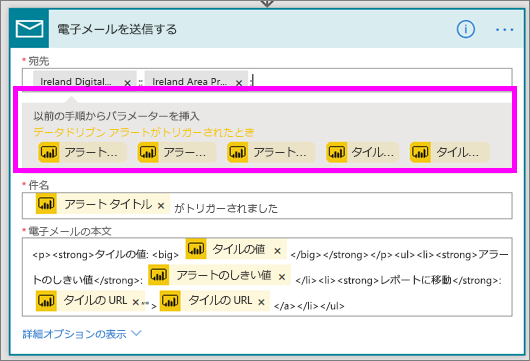
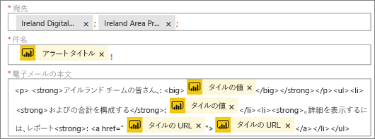
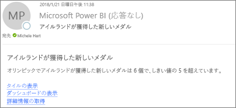
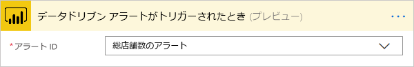

# Microsoft Flow と Power BI

[Microsoft Flow](https://flow.microsoft.com/en-us/documentation/getting-started) は、ビジネス ユーザーが使用するアプリケーションや SaaS サービスが増える中で、全体のワークフローを自動化する機能を提供する SaaS です。 Flow を使用すると、お気に入りのアプリとサービス (Power BI を含む) を統合して、通知の受信、ファイルの同期、データの収集などのタスクを自動化できます。 ワークフローを自動化すると、反復的なタスクが容易になります。

[今すぐ Flow を使い始めましょう。](https://flow.microsoft.com/documentation/getting-started)

Power BI のアラートがトリガーされたときに詳細なメールを同僚に送信するフローを Sirui が作成するところをご覧ください。 その後、ビデオで説明されている手順に従って、ご自分でやってみてください。

<iframe width="560" height="315" src="https://www.youtube.com/embed/YhmNstC39Mw" frameborder="0" allowfullscreen></iframe>

## Power BI データ アラートでトリガーされるフローを作成する

### 前提条件
このチュートリアルでは、フローをテンプレートから作成する方法とゼロから作成する方法について説明します。 この手順を実行するには、[Power BI でデータ アラートを作成し](service-set-data-alerts.md)、無料の Slack アカウントを作成してから [Microsoft Flow にサインアップしてください](https://flow.microsoft.com/en-us/#home-signup) (サインアップは無料です)。

## Power BI を使用するフローをテンプレートから作成する
このタスクでは、テンプレートを使用して、Power BI データ アラート (通知) でトリガーされる単純なフローを作成します。

1. Microsoft Flow (flow.microsoft.com) にサインインします。
2. **[自分のフロー]** を選択します。
   
   
3. **[テンプレートから作成]** を選択します。
   
    
4. [検索] ボックスを使用して Power BI テンプレートを検索し、**[Power BI データ アラートがトリガーされたときに対象ユーザーにメールを送信する] > [続行]** の順に選択します。
   
    

### フローを構築する
このテンプレートには、1 つのトリガー (アイルランドが新しいオリンピック メダルを獲得するとトリガーされる Power BI データ アラート) と、1 つのアクション (メールを送信する) が含まれています。 Flow でフィールドを選択すると、含めることができる動的なコンテンツが表示されます。  この例では、メッセージの本文にタイル値とタイル URL を含めています。

1. トリガーのドロップダウンから Power BI データ アラートを選択します。 **[アイルランドが新しいメダルを獲得]** を選びます。 アラートの作成方法については、「[Data alerts in Power BI](service-set-data-alerts.md)」(Power BI のデータ アラート) を参照してください。
   
   
2. 1 つまたは複数の有効なメール アドレスを入力し、**[編集]** (下図参照) または **[動的なコンテンツの追加]** を選択します。 
   
   

3. Flow では保持や変更が可能なタイトルとメッセージを作成します。 Power BI でアラートを作成するときに設定したすべての値を使用できます。やり方は、グレーの強調表示されている領域にカーソルを合わせ、選択するだけです。 

   

1.  たとえば、Power BI で**さらにメダルを獲得**というタイトルのアラートを作成した場合、**[アラートのタイトル]** を選択すると、そのテキストをメールの件名フィールドに追加できます。

    

    また、既定のメールの本文をそのまま使うことも、独自に作成することもできます。 上記の例には、メッセージにいくつかの変更が含まれています。

1. 終わったら、**[フローの作成]** または **[フローの保存]** を選びます。  フローが作成され、評価されます。  Flow でエラーが検出されると、通知されます。
2. エラーが検出された場合、**[フローの編集]** を選択して修正するか、**[完了]** を選択して新しいフローを実行します。
   
   
5. データ アラートがトリガーされると、指定したアドレスにメールが送信されます。  
   
   

## Power BI を使用するフローを最初 (ゼロ) から作成する
このタスクでは、Power BI データ アラート (通知) でトリガーされる単純なフローをゼロから作成します。

1. Microsoft Flow にサインインします。
2. **[マイ フロー]** > **[一から作成]** の順に選びます。
   
   
3. [検索] ボックスを使用して Power BI トリガーを検索し、**[Power BI - When a data driven alert is triggered]\(Power BI - データ ドリブン アラートがトリガーされた場合\)** を選択します。

### フローを構築する
1. ドロップダウンからアラート名を選択します。  アラートの作成方法については、「[Data alerts in Power BI](service-set-data-alerts.md)」(Power BI のデータ アラート) を参照してください。
   
    
2. **[新しいステップ]** > **[アクションの追加]** を選択します。
   
   
3. 「**Outlook**」を検索し、**[Create event]** (イベントの作成) を選択します。
   
   
4. イベント フィールドに入力します。 Flow でフィールドを選択すると、含めることができる動的なコンテンツが表示されます。
   
   
5. 完了したら、**[フローの作成]** を選択します。  フローが保存され、評価されます。 エラーがない場合、**[完了]** を選択してこのフローを実行します。  新しいフローが **[自分のフロー]** ページに追加されます。
   
   
6. Power BI データ アラートでフローがトリガーされると、次のような Outlook イベント通知を受け取ります。
   
    

## 次の手順
* [Microsoft Flow の概要](https://flow.microsoft.com/en-us/documentation/getting-started/)
* [Power BI サービスでのデータ アラートの設定](service-set-data-alerts.md)
* [iPhone でデータ アラートを設定する](mobile-set-data-alerts-in-the-mobile-apps.md)
* [Windows 10 用の Power BI モバイル アプリでデータ アラートを設定する](mobile-set-data-alerts-in-the-mobile-apps.md)
* 他にわからないことがある場合は、 [Power BI コミュニティを利用してください](http://community.powerbi.com/)。

