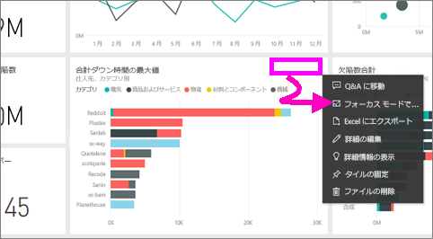
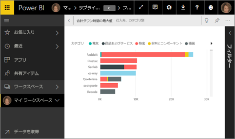
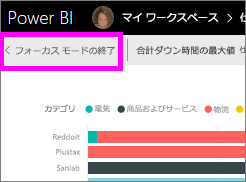
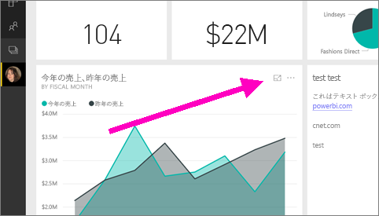
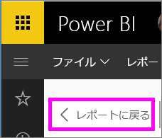

# フォーカス モードでダッシュボード タイルまたはレポート ビジュアルを表示する

<iframe width="560" height="315" src="https://www.youtube.com/embed/dtdLul6otYE" frameborder="0" allowfullscreen></iframe>

## フォーカス モードとは何ですか。

***フォーカス*** モードでは、コンテンツを拡大 (ポップアウト) して詳細を確認することができます。  フォーカス モードでは、このビジュアルを作成したときに適用したフィルターを表示し、変更できます。  Power BI サービスでは、ダッシュボード タイルまたはレポートのビジュアルでフォーカス モードを使用でき、Power BI Desktop では、[レポートのビジュアル](desktop-report-view.md)でフォーカス モードを使用できます。

> [!NOTE]
> フォーカスは[全画面表示モード](service-fullscreen-mode.md)とは異なります。
> 

## ダッシュボード タイルのフォーカス モード

1. タイルのビジュアルをポイントし、省略記号 (...) を選び、**[フォーカス モードで開く]** を選びます。 

    .

2. タイルが開き、レポート キャンバス全体に拡張されます。 

   

3. [フィルター] ウィンドウを展開すると、このビジュアルに適用されているすべてのフィルターが表示されます。
   
   ![[フィルター] ウィンドウのフォーカス モード](media/service-focus-mode/power-bi-focus-filters.png)

4. さらに探索するにはフィルターを変更し、もし興味深いものを発見したなら、ダッシュボードにビジュアルをピン留めします。

5. フォーカス モードを閉じ、ダッシュボードに戻るには、**[フォーカス モードの終了]** (ビジュアルの左上隅) を選択します。
   
        

## レポートの視覚化のフォーカス モード

1. レポートの視覚化をポイントし、**フォーカス モード** アイコン  を選びます。  
   
   
2. 視覚化が開き、キャンバス全体に拡張されます。 

   
3. [フィルター] ウィンドウを展開すると、このビジュアルに適用されているすべてのフィルターが表示されます。
   
   ![[フィルター] 画面のフォーカス モード](media/service-focus-mode/power-bi-display-focus-filters.png)
4. さらに探索するにはフィルターを変更し、もし興味深いものを発見したなら、ダッシュボードにビジュアルをピン留めします。   
5. フォーカス モードを閉じ、レポートに戻るには、**[レポートに戻る]** (ビジュアルの左上隅) を選択します。 
   
      

## フォーカス モードから全画面表示モードへ移動する
いったんフォーカス モードにすると、タイルまたはビジュアルは[全画面表示 (テレビ モード) で表示する](service-fullscreen-mode.md)ことができます。全画面表示モードは、メニューおよびナビゲーション ボタンなしで表示されます。

## 考慮事項とトラブルシューティング
* レポートのビジュアルでフォーカス モードを使用する場合は、すべてのフィルター (ビジュアル レベル、ページ レベル、ドリルスルー、レポート レベル) を表示して、変更できます。    
* ダッシュボードの視覚化でフォーカス モードを使用する場合は、ビジュアル レベルのフィルターのみを表示して、変更することができます。

他にわからないことがある場合は、 [Power BI コミュニティを利用してください](http://community.powerbi.com/)。

