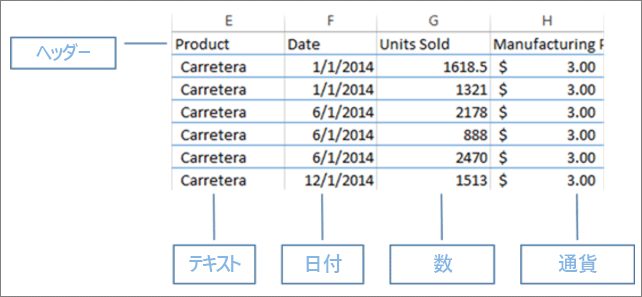
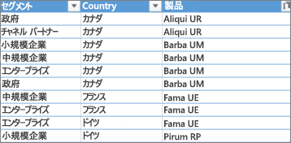
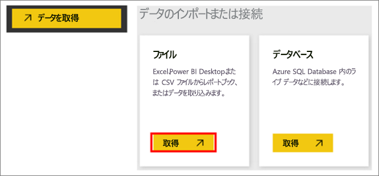
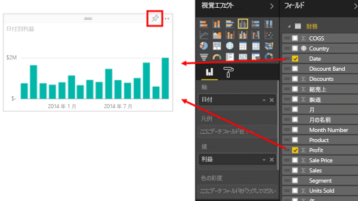
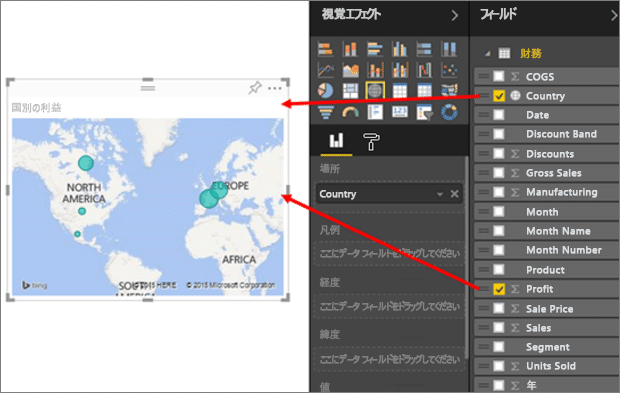
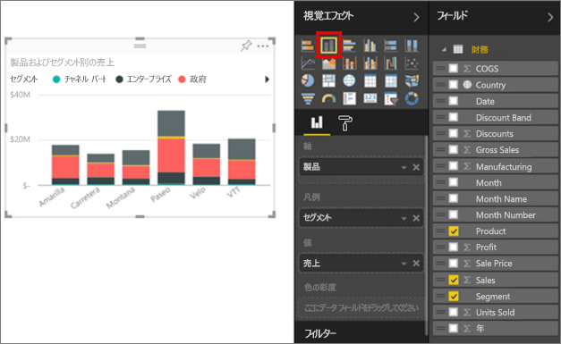
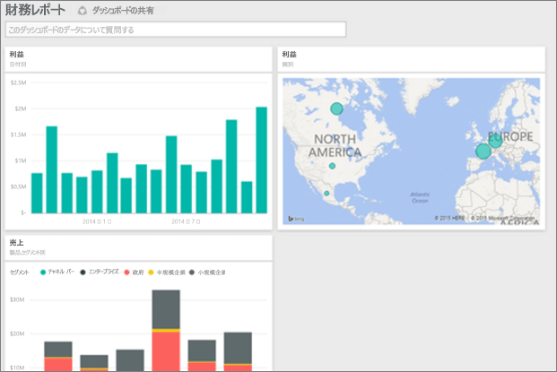

# Excel ブックから魅力的なレポートを即座に作成する
最新の売上データを直前のキャンペーンの感触と組み合わせて、上司にレポートを今日中に提出しなければなりません。 しかし、最新のデータはさまざまなサード パーティ システムと、自分のノート PC 内のファイルに散在しています。 以前に、ビジュアルとレポート書式を作成するのに何時間もかかった経験があります。 次第に不安が募ります。

ご心配なく。 Power BI では、すぐに魅力的なレポートを作成できます。

この例では、ローカル システムから Excel ファイルをアップロードし、レポートを新規に作成して同僚と共有します。このすべてを Power BI 内から実行できます。

## データの準備
例として、単純な Excel ファイルを見てみましょう。 Power BI に Excel ファイルを読み込む前に、データをフラット テーブルに整理する必要があります。 つまり、各列に同じデータ型 (テキスト、日付、数値、通貨など) が含まれるようにします。 ヘッダー行を含める必要がありますが、列や行の合計を示す列は含めないでください。

次に、データをテーブルとして書式設定します。 Excel で [ホーム] タブの [スタイル] グループから **[テーブルとして書式設定]** を選びます。 ワークシートに適用するテーブルのスタイルを選んでください。 これで、Excel ワークシートを Power BI に読み込む準備ができました。

## Excel ファイルを Power BI にアップロードする
Power BI は、多くのデータ ソースに接続できます。自分のコンピューターで使用中の Excel ファイルもそれに含まれます。 作業を始めるには、まず Power BI サービスにサインインします。 まだサインアップしていない場合は、[無料で登録できます](https://powerbi.com)。

ここでは、ダッシュボードを新しく作成することにします。 **[マイ ワークスペース]** を開き、**[+ 作成]** アイコンを選択します。

![[作成] アイコン](media/service-from-excel-to-stunning-report/power-bi-new-dash.png)

**[ダッシュボード]** を選択し、名前を入力し、**[作成]** を選択します。 データのない新しいダッシュボードが表示されます。

![[作成] ドロップダウン](media/service-from-excel-to-stunning-report/power-bi-create-dash.png)

左側のナビゲーション ウィンドウの下部にある **[データの取得]** を選択します。 [データを取得] ページの [データのインポートまたは接続] の [ファイル] ボックス内にある **[取得]** を選びます

[ファイル] ページで、 **[ローカル ファイル]** を選びます。 ご使用のコンピューター上の Excel ブック ファイルに移動し、それを選んで Power BI に読み込みます。 **[インポート]** を選択します。

> **注**:このチュートリアルの残りの部分の作業を進めるには、[財務サンプル ブック](sample-financial-download.md)を使用してください。
> 
> 

![[データの取得] > [ファイル] ウィンドウ](media/service-from-excel-to-stunning-report/pbi_local_file.png)

## レポートの構築
Power BI に Excel ファイルがインポートされたら、レポートの作成を開始できます。 "**データセットの準備ができました**" というメッセージが表示されたら、**[データセットの表示]** を選択します。  Power BI が編集ビューで開き、レポート キャンバスが表示されます。 右側には、[視覚化]、[フィルター]、[フィールド] の各ウィンドウがあります。

[フィールド] ウィンドウに Excel ブックのテーブル データが表示されていることにご注目ください。 テーブルの名前の下には、Power BI によって、列見出しが個別のフィールドとして一覧表示されます。

![[フィールド] ウィンドウでの Excel データの表示](media/service-from-excel-to-stunning-report/pbi_report_fields.png)

これで、視覚化の作成を開始できるようになりました。 上司が確認したいのは、時間の経過に伴う利益の推移です。 [フィールド] ウィンドウから **[Profit]** をレポート キャンバスまでドラッグします。 Power BI により、既定の棒グラフが表示されます。 次に、 **[Date]** をレポート キャンバスまでドラッグします。 Power BI により、日付ごとに利益を表示する棒グラフに更新されます。

> **ヒント**:グラフが予測したようにならない場合は、集計を確認してください。 たとえば、 **[値]** で、追加したフィールドを右クリックし、データの集計方法が希望どおりであることを確認します。  この例では、**[合計]** を使用しています。
> 
> 

また、上司は、利益が大きいのはどの国かについて知りたいと考えています。 上司に気に入ってもらうため、地図による視覚化を使うことにします。 キャンバスの空白領域を選択し、[フィールド] ウィンドウから **[国]**、**[収益]** フィールドの順にドラッグします。 Power BI によって、各場所の相対的な利益を表すバブルの表示された地図ビジュアルが作成されます。

製品ごとに市場セグメントごとの売上を示したビジュアルを表示するにはどうしたらよいでしょうか? 簡単です。 [フィールド] ウィンドウで、[Sales]、[Product]、および [Segment] の各フィールドの横にあるチェック ボックスをオンにします。 Power BI によってすぐに棒グラフが作成されます。 [視覚化] メニューで、アイコンのいずれかを選ぶと、グラフの種類を変更できます。 たとえば、積み上げ横棒グラフに変更します。  グラフを並べ替えるには、省略記号 [...]、**[並べ替え]** の順に選びます。

すべてのビジュアルをダッシュボードにピン留めします。 これで、仕事仲間とダッシュボードを共有する準備ができました。

## ダッシュボードを共有する
作成したダッシュボードを上司の Paula と共有することにします。 ダッシュボードと基になるレポートは、Power BI アカウントを持つ仕事仲間と共有できます。 仕事仲間はレポートを操作できますが、変更は変更できません。

レポートを共有するには、ダッシュボードの上部にある **[共有]** を選択します。

![[共有] アイコン](media/service-from-excel-to-stunning-report/power-bi-share.png)

Power BI に、[ダッシュボードの共有] ページが表示されます。 上部の領域で、受信者のメール アドレスを入力します。 その下のフィールドにメッセージを追加します。 受信者がこのダッシュボードを他のユーザーと共有できるようにするため、 **[受信者がダッシュボードを共有できるようにする]** を選びます。 **[共有]** を選択します。

![[ダッシュボードの共有] ウィンドウ](media/service-from-excel-to-stunning-report/power-bi-share-dash-new.png)

次の手順

* [Power BI サービスの概要](service-get-started.md)
* [Power BI Desktop の概要](desktop-getting-started.md)
* [Power BI - 基本的な概念](consumer/end-user-basic-concepts.md)
* 他にわからないことがある場合は、 [Power BI コミュニティを利用してください](http://community.powerbi.com/)。

