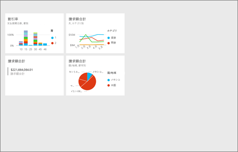
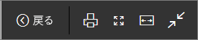
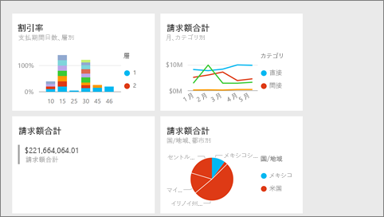

# Power BI サービスの全画面表示モード
## 全画面表示モードの概要

メニューやナビゲーション バーを表示せずに、Power BI コンテンツ (ダッシュボード、レポート ページ、タイル、視覚エフェクト) を表示します。  いつでもひと目でコンテンツの全体図のみを把握できます。 このモードはテレビ モードとも呼ばれます。 全画面表示モードで利用できる機能はコンテンツにより異なります。 

Power BI Mobile を使用している場合、[全画面は Windows 10 Mobile アプリで使用できます](consumer/mobile/mobile-windows-10-app-presentation-mode.md)。 Power BI Desktop にはレポートや視覚エフェクトの全画面表示モードはありませんが、[リレーションシップ ビューとレポート ビュー](desktop-report-view.md)には [ページに合わせる] があり、[レポート ビジュアルにはフォーカス モード](service-focus-mode.md)があります。

 

全画面表示モードの使用例:

* ミーティングや会議でダッシュボード、タイル、ビジュアル、またはレポートをプレゼンテーションする
* オフィスの専用の大型画面やプロジェクターに表示する
* 小さな画面に表示する
* ロック モードで再表示する -- 元のレポートやダッシュボードを開かずに、画面をタッチしたり、タイルにマウスでポイントしたりできます。

> **注**: 全画面表示モードは、[フォーカス設定 (ポップアウト) モード](service-focus-mode.md)とは異なります。
> 
> 

全画面表示モードでダッシュボードを開いてダッシュボード内を移動し、URL パラメーターを適用して既定の表示を制御する方法についてのビデオをご覧ください。 その後、ビデオで説明されている手順に従って、ご自分でやってみてください。

<iframe width="560" height="315" src="https://www.youtube.com/embed/c31gZkyvC54" frameborder="0" allowfullscreen></iframe>

## 全画面表示モードのダッシュボードとレポート ページ
1. ダッシュボードやレポートの上部にある Power BI メニュー バーから **[全画面表示]** アイコン  を選択します。 ダッシュボード キャンバスまたはレポート ページが全画面に表示されます。 下はダッシュボードの例です。
   
      
2. 全画面表示モードには、メニュー オプションがいくつかあります。  マウスまたはカーソルを動かすと、メニューが表示されます。 
   
     ダッシュボードのメニュー    
         
   
     レポート ページのメニュー    
        
   
    ![[戻る] アイコン](media/service-fullscreen-mode/power-bi-back-icon.png)    
    前のページに移動するには、ブラウザーの **[戻る]** ボタンをクリックします。 前のページが Power BI ページの場合、それも全画面表示モードで表示されます。  全画面表示モードは閉じるまで保持されます。
   
    ![[印刷] アイコン](media/service-fullscreen-mode/power-bi-print-icon.png)    
    全画面表示モードでダッシュボードまたはレポート ページを印刷するには、このボタンを使用します。 
   
    ![[画面に合わせる] アイコン](media/service-fullscreen-mode/power-bi-fit-to-width.png)    
    スクロールバーを利用せずにダッシュボードを最大サイズで表示するには、**[画面に合わせる]** ボタンを使用します。     
   
    
   
    ![[幅に合わせる] アイコン](media/service-fullscreen-mode/power-bi-fit-width.png)       
    スクロール バーは気にならないが、ダッシュボードを使用できる領域の幅いっぱいに表示したいことがあります。 **[幅に合わせる]** ボタンを選択します。    
   
    ![[画面に合わせる] アイコン](media/service-fullscreen-mode/power-bi-fit-to-width-new.png)
   
           
    全画面表示レポートでは、矢印を利用してレポートのページ間を移動します。    
3. 全画面表示モードを終了するには、**[全画面表示を閉じる]** アイコンを選択します。
   
      

## 全画面表示モードの視覚エフェクトとダッシュボード タイル
1. ダッシュボード タイルとレポートの視覚エフェクトを全画面表示モードで表示するには、そのタイルまたは視覚エフェクトが[フォーカス モード](service-focus-mode.md)になっている状態で始める必要があります。 
   
    
2. 次に、そのタイルまたはビジュアルの全画面表示アイコン   を選択します。 タイルまたはビジュアルが、メニューまたはナビゲーション バーなしで、全画面表示されます。
   
    

## 次の手順
[Power BI のダッシュボード](service-dashboards.md)  
[フォーカス モード](service-focus-mode.md)    

他にわからないことがある場合は、 [Power BI コミュニティを利用してください](http://community.powerbi.com/)。

