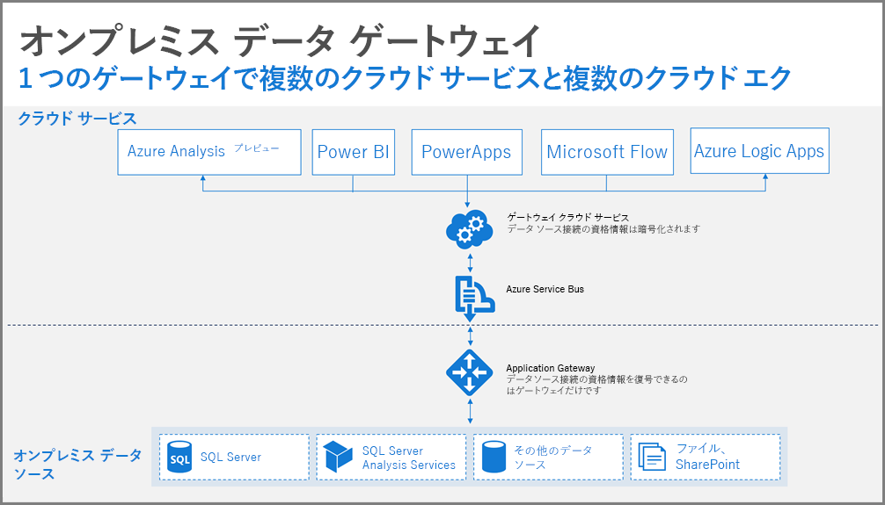
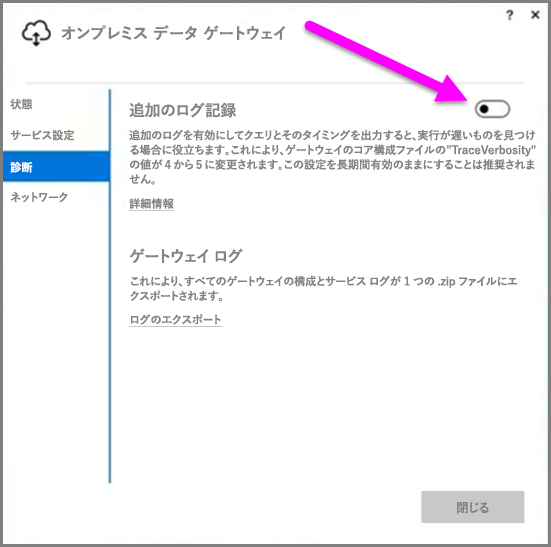
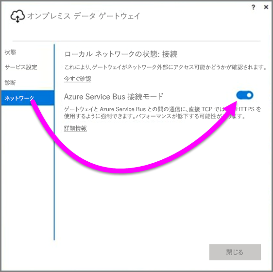

# Power BI のデータ ゲートウェイを展開するためのガイダンス
この記事では、ネットワーク環境にデータ ゲートウェイを展開するためのガイダンスと考慮事項について説明します。 **ゲートウェイ**は、Power PI のようなクラウド サービスで後で利用するためにプライベートのオンプレミス ネットワークに置いたデータに簡単にアクセスするためのソフトウェアです。 この記事では、展開の手順を説明し、**オンプレミス データ ゲートウェイ**のセットアップに関するガイダンスを提供します。

**オンプレミス データ ゲートウェイ**の詳細、およびインストールするためのリンクについては、[ブログの投稿](https://powerbi.microsoft.com/blog/power-bi-gateways-march-update/)を参照してください。

## オンプレミス データ ゲートウェイのインストールに関する注意点
インストールと展開の詳しい説明に入る前に、注意すべき考慮事項がいくつかあります。 次のセクションでは、重要な注意点について説明します。

### ユーザー数
ゲートウェイを使用しているレポートを使用するユーザーの数は、ゲートウェイをインストールする場所を決定するときに重要なメトリックです。 考慮すべきいくつかの質問を次に示します。

* これらのレポートを使用しているユーザーの数は、1 日のうちの時間帯によって異なりますか。
* そのような種類の接続 (DirectQuery またはインポート) を使用していますか。
* すべてのユーザーが同じレポートを使用しますか。

すべてのユーザーが毎日同じ時刻に特定のレポートにアクセスする場合、それらのすべての要求を処理できるマシンにゲートウェイをインストールする必要があります (これを決定するために役立つパフォーマンス カウンターと最小要件については次のセクションを参照してください)。

**Power BI** には*レポート*あたり *1 つ*のゲートウェイのみが許可されるという制約があり、そのためレポートが複数のデータソースを基にしている場合でも、そのすべてのデータソースが 1 つのゲートウェイを通過する必要があります。 ただし、ダッシュ ボードが*複数*のレポートを基にしている場合、関係しているレポートごとに専用のゲートウェイを使用して、それによってその単一のダッシュ ボードに関係している複数のレポート間でゲートウェイの負荷を分散することができます。

### 接続の種類
**Power BI** は、**DirectQuery** と**インポート**という 2 つの接続の種類を提供します。 すべてのデータソースが両方の接続の種類をサポートするわけではありません。セキュリティ条件、パフォーマンス、データの制限、データ モデルのサイズといった多くの理由でどちらかの種類が選択されます。 接続の種類およびサポートされているデータ ソースの詳細については、[オンプレミス データ ゲートウェイの記事](service-gateway-onprem.md)の*使用可能なデータ ソースの種類の一覧*のセクションを参照してください。

使用する接続の種類に応じて使用して、ゲートウェイの使用量が異なる場合があります。 たとえば、可能な場合は常に、**DirectQuery** データ ソースを**スケジュールされた更新**データ ソースから分離する必要があります (それらが異なるレポートにあり、分離可能であると仮定します)。 このようにすることで、朝にスケジュールされている会社のメイン ダッシュボードで使用される大きなサイズのデータ モデルの更新と同時に、ゲートウェイで数千の DirectQuery 要求がキューに入れられるのを防ぎます。 それぞれの考慮事項を次に示します。

* **スケジュールされた更新**: クエリのサイズと、1 日あたりに発生する更新の数に応じて、推奨される最小ハードウェア要件の間で維持するか、より高いパフォーマンスのマシンにアップグレードするかを選択できます。 特定のクエリが折りたたまれない場合、変換がゲートウェイ マシンで発生し、その場合、ゲートウェイ マシンで使用可能な RAM を増やすとメリットがあります。
* **DirectQuery** の場合: いずれかのユーザーがレポートを開くかデータを参照するたびにクエリが送信されます。 したがって 1,000 を超えるユーザーが同時にデータにアクセスすることを予測している場合、コンピューターが堅牢性と対応可能なハードウェア コンポーネントを確認する必要があります。 CPU コアを増やすと、**DirectQuery** 接続のスループットが向上します。

**オンプレミス データ ゲートウェイ**をインストールするコンピューターの要件を次に示します。

**最小:**

* .NET 4.5 Framework
* 64 ビット版の Windows 7 または Windows Server 2008 R2 (またはそれ以降)

**推奨:**

* 8 コア CPU
* 8 GB メモリ
* 64 ビット版の Windows 2012 R2 (またはそれ以降)

### 場所
ゲートウェイのインストールの場所は、クエリのパフォーマンスに大きな影響を与えるため、ネットワークの待機時間を最小限に抑えるために、ゲートウェイ、データ ソースの場所、および Power BI テナントが、互いにできるだけ近い場所にあることを確認します。 Power BI テナントの場所を確認するには、Power BI サービスで、右上にある **[?]**  アイコンをクリックし、**[Power BI について]** を選択します。

### ゲートウェイの監視
インストールされているゲートウェイの使用量とパフォーマンスを監視するために使用できるいくつかのツールがあります。

#### パフォーマンス カウンター
ゲートウェイで発生しているアクティビティを評価するために使用できる多数のパフォーマンス カウンターがあります。 カウンターは、特定の種類ごとに多数のアクティビティがあるかどうかを理解するために役立ち、それは新しいゲートウェイを展開するように促している場合があります。

> [!NOTE]
> これらのカウンターは、特定タスクの期間はキャプチャしません。
> 
> 

マシンのカウンターに加えて、*ゲートウェイ カウンター*が、マシンが処理している負荷の量を示し、サーバー リソースの容量が拡大または超過しているかどうかを示します。

これらのカウンターは、**Windows パフォーマンス モニター**からアクセス可能であり、この目的で使用する任意のレポート作成ツールで利用できます。 Power BI でゲートウェイ パフォーマンス モニターを使用する方法の詳細については、次のコミュニティで作成されたブログの投稿を参照してください。

* [オンプレミス データ ゲートウェイの監視](https://insightsquest.com/2016/08/08/monitor-on-premises-data-gateways/)

#### ログ
構成ログとサービス ログは、ゲートウェイで何が起こっているかについての別の次元の情報を提供します。 Power BI サービスにすべてのエラー メッセージが表示されるわけではないので、接続が正常に機能していない場合は、ゲートウェイ ログを常に確認してください。

ローカル コンピューター上のすべてのログ ファイルを表示する簡単な方法として、最初のインストールが完了した後で、ゲートウェイを再び開くときに、**オンプレミス データ ゲートウェイ**上で *[ログのエクスポート]* ボタンを使用します (**[診断]、[ログのエクスポート]** を選択します)。

#### 追加のログ記録
既定では、ゲートウェイは基本的なログ記録を実行します。 ゲートウェイの問題を調査していて、クエリ接続の詳細に関する詳細情報が必要な場合は、一時的に*詳細ログ*を有効にして追加のログ情報を収集できます。 これを行うには、インストールされているゲートウェイで **[診断] > [追加ログ]** を選択します。

この設定を有効にすると、ゲートウェイの使用状況に応じてログサイズが大幅に増加します。 ログの確認が完了したら、**[追加ログ]** を無効にすることをお勧めします。 通常のゲートウェイの使用中にこの設定を有効のままにすることは推奨されません。

#### ネットワークの構成
ゲートウェイは、**Azure Service Bus** への送信接続を作成します。 ゲートウェイ通信は、次の送信ポートで行われます。

* TCP 443 (既定)
* 5671
* 5672
* 9350 ～ 9354。

ゲートウェイには、受信ポートは必要*ありません*。 必要なすべてのポートは、上記の一覧に示されています。

ファイアウォールでデータ領域の IP アドレスをホワイトリストに登録することをお勧めします。 [Microsoft Azure Datacenter IP list](https://www.microsoft.com/download/details.aspx?id=41653)(Microsoft Azure データセンター IP 一覧) から IP アドレスの一覧をダウンロードすることができます。 このリストは毎週更新されます。 ゲートウェイは、指定された IP アドレスと完全修飾ドメイン名 (FQDN) を使って **Azure Service Bus** と通信します。 HTTPS を使用して通信するようにゲートウェイを強制している場合、ゲートウェイは必ず FQDN のみを使用し、IP アドレスを使用した通信は行われません。

#### Azure Service Bus との強制的な HTTPS 通信
ゲートウェイと **Azure Service Bus** との間の通信に、直接 TCP ではなく HTTPS を使用するように強制できます。 ただし、これによりパフォーマンスがわずかに低下する可能性があります。 ゲートウェイのユーザー インターフェイス (2017 年 3 月のリリース以降のゲートウェイ) を使用して、**Azure Service Bus** との通信に HTTPS を使用するようにゲートウェイに強制することもできます。

このためには、ゲートウェイで、**[ネットワーク]** を選択し、**[Azure Service Bus connectivity mode]** (Azure Service Bus 接続モード) を **[オン]** に切り替えます。

### 追加のガイダンス
このセクションでは、ゲートウェイを展開および管理するための追加のガイダンスを提供します。

* 単一障害点を回避します。 可能であれば、複数のゲートウェイの間でオンプレミスのデータ ソースを配分します。この場合、1 つのマシンが使用できなくなった場合でも、データの一部を更新できるので、その機能を完全に失うことはありません。
* ドメイン コントローラーにゲートウェイをインストールすることはできないので、そのように計画したり試行したりしないでください。
* ゲートウェイは、コンピューターがオフ状態、スリープ状態、またはインターネットに接続されていない状態では実行できないので、そのような状況になる可能性があるコンピューター (ラップトップ コンピューターなど) には、ゲートウェイをインストールしないでください。
* ワイヤレス ネットワーク上ではパフォーマンスが低下する場合があるので、ワイヤレス ネットワークにゲートウェイをインストールしないようにします。

#### ゲートウェイの回復
既存のゲートウェイを回復することも、**回復キー**を使用して新しいマシンに移動することもできます。 回復キーはゲートウェイをインストールするユーザーに提供され、後で変更することは*できません*。 回復キーは、データの暗号化とゲートウェイの回復の両方に使用されます。

ゲートウェイを回復するには、ゲートウェイの管理者であること、ゲートウェイ名を知っていること、正しい回復キーを持っていること、同様のパフォーマンス特性で使用可能な新しいマシンがあることを確認してください。

サインインした後に、**[Migrate an existing gateway] \(既存のゲートの移行\)** オプションを選択します。 次に、回復または移行するゲートウェイを選択し、最後に回復キーを指定して、構成を実行する必要があります。 その手順を完了すると、古いゲートウェイは新しいゲートウェイに置き換えられ、新しいゲートウェイは以前に構成された名前とすべてのデータ ソースを継承します。 何も再発行しなくても、すべてのデータ ソースは新しいコンピューターを通過するようになります。 自動フェールオーバーはまだサポートされていませんが、これは、ゲートウェイ チームが積極的に検討している機能です。

#### 管理者
**Power BI サービス**でゲートウェイの管理者の一覧を検索することができます。 **Power BI** サービスにサインインしたら、**[設定]** (歯車アイコン)、**[ゲートウェイの管理]、[ゲートウェイ UI]** の順に選択します。  

そこから、ゲートウェイを選択し、ゲートウェイの管理者の一覧を表示できます。 表示されている管理者は、ゲートウェイにアクセスし、回復および削除することができます。 管理者は、ゲートウェイのデータ ソースを追加および削除することもできます。 組織内のすべての管理者がそのグループのすべてのゲートウェイにアクセスできるようにするには、次を推奨します。

* **AAD** セキュリティ グループを作成し、他のユーザーをそこに追加した後、このセキュリティ グループをそれぞれのゲートウェイ管理者の一覧に追加します。 これにより、障害発生時、あるいはゲートウェイの回復または移行が必要なときに、常に複数の管理者がゲートウェイにアクセスすることができます。 また、他の管理者もグループでどのゲートウェイが使用されているか、および各ゲートウェイにどのデータ ソースが存在するかを把握できるようになります。

## 次の手順
[プロキシ設定の構成](service-gateway-proxy.md)  
[オンプレミス データ ゲートウェイのトラブルシューティング](service-gateway-onprem-tshoot.md)  
[オンプレミス データ ゲートウェイに関するよく寄せられる質問 (FAQ)](service-gateway-onprem-faq.md)  

他にわからないことがある場合は、 [Power BI コミュニティを利用してください](http://community.powerbi.com/)。

